# AI Triage & Remediation


This feature is now generally available. Please contact your Checkmarx sales representative for a free trial.


## Overview

AI Triage & Remediation is an agentic AI capability that dramatically streamlines triage and remediation workflows. This feature comprises two distinct tools:

* The **AI Triage** agent evaluates new vulnerabilities identified in your project and provides insights into the **Reachability** and **Exploitability** of each vulnerability. It incorporates risk context to determine whether the exploitable method is reachable by your application and checks if masking and sanitization measures are in place to prevent exploitation. This allows teams to distinguish between findings that are theoretically vulnerable and those that present a concrete risk in the running application.
* The **AI Remediation** agent complements this analysis by generating suggested code fixes for supported vulnerabilities. For GitHub Code Repository Integration projects, remediation creates a pull request containing the proposed fix. For other supported project types, remediation guidance is provided within Checkmarx One.

Together, these capabilities dramatically reduce manual analysis effort and accelerate remediation without disrupting existing development workflows.

### Methods for Running AI Triage & Remediation

There are three ways to run AI Triage & Remediation on risks identified by Checkmarx One:

* **Manual Activation** - You can launch the AI Triage & Remediation activities for specific risks identified in a Checkmarx One scan. This is done via the Risk Orchestration screen by selecting a project, drilling down to a specific risk and clicking on the button to launch the desired action.
*   **Automated Workflow** - You can create an automated workflow on the global or project level in which you define criterion for which AI triage runs automatically upon scan creation.

    

The automated workflow is not currently supported for AI Remediation.

* **Pull Request Workflow** - For GitHub Code Repository integration projects, you can configure the project to run AI triage based on pre-defined criterion. You can also interact with Checkmarx One from the PR created by a Checkmarx scan.

#### Automatic State Change

When AI Triage determines that a change in triage state is justified, the State is adjusted automatically, based on the following logic:

* When a vulnerability is determined to be Reachable and Exploitable, the state is set as **Confirmed**.
*   When a vulnerability is determined to be **not** Reachable **or not** Exploitable, the state is set as **Proposed Not Exploitable**.

    

When the state has been set by AI, the AI icon  is shown next to the state.

    

AI Triage state changes are applied to all results considered identical, following the same behavior as manual triage changes. For SAST, identical results are determined by a shared Similarity ID or Attack Vector ID, depending on your account settings. For SCA, results are considered identical when they have the same package version and package manager. Triage changes are applied to identical results in subsequent scans. For SAST, they are also applied retroactively to identical results in previous scans. For SCA, changes are not applied to results from previous scans.

### Requirements

* Your account must have sufficient available **Checkmarx Credits**, see [Monitoring Credit Usage](ai-triage-remediation.md#checkmarx-credits).

### Current Limitations

* Currently supported for the **SAST** and **SCA** scanners only
  * Manual Activation of AI Triage & Remediation via Risk Orchestration is supported only for SAST risks
* Creating a pull request with remediated code is only available for GitHub Code Repository integration projects
* AI Remediation must be launched manually via Risk Orchestration or via PR workflow, not by Automated Workflow
* The maximum number of risks automatically triaged for a PR is 10
* The maximum number of remediations run by a single comment is 5

## Running AI Triage & Remediation



The following sections explain how to run AI Triage & Remediation using the various available methods.

### Running Manual AI Triage & Remediation

You can initiate AI triage and/or remediation for an individual vulnerability directly from **Risk Orchestration**.


This method is currently supported only for SAST risks.


1. In the Checkmarx One web application, navigate to **ASPM > Risk Orchestration**.
2. Open the project containing the vulnerability you want to review.
3.  Select the vulnerability in the results table.

    The selected vulnerability opens in the side panel, where you can choose to run 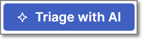 or 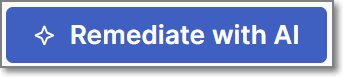 on the selected risk.

    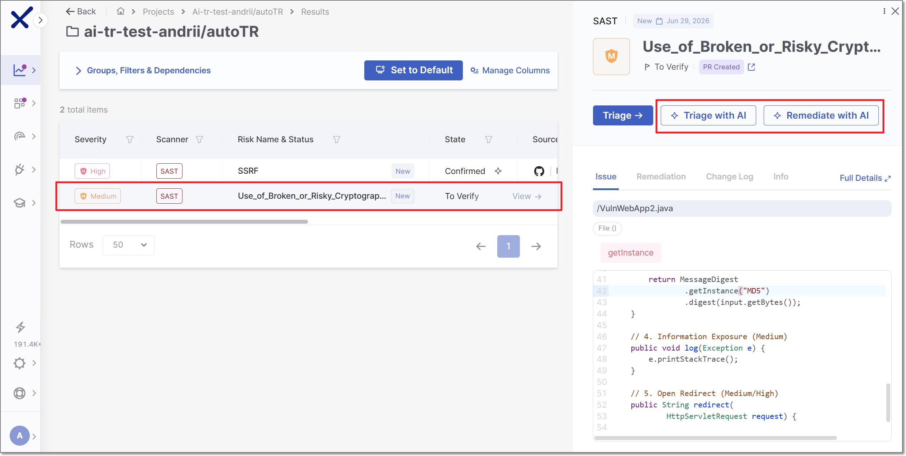

### Running Automated AI Triage

AI Triage can be configured to run automatically upon scan completion. Automatic execution rules can be defined at the global account level and optionally overridden for individual projects.


AI Remediation cannot currently be triggered by this automated process.


#### Configuring AI Triage in Global Account Settings

In the global account settings you can define the default rules that determine when AI Triage is automatically run across your organization.

**To configure the global account settings:**

1. In the Checkmarx One web application, navigate to **Settings > AI Assist**.
2.  Activate the **Auto-triage** toggle.

    The Auto-triage configuration options are shown:

    
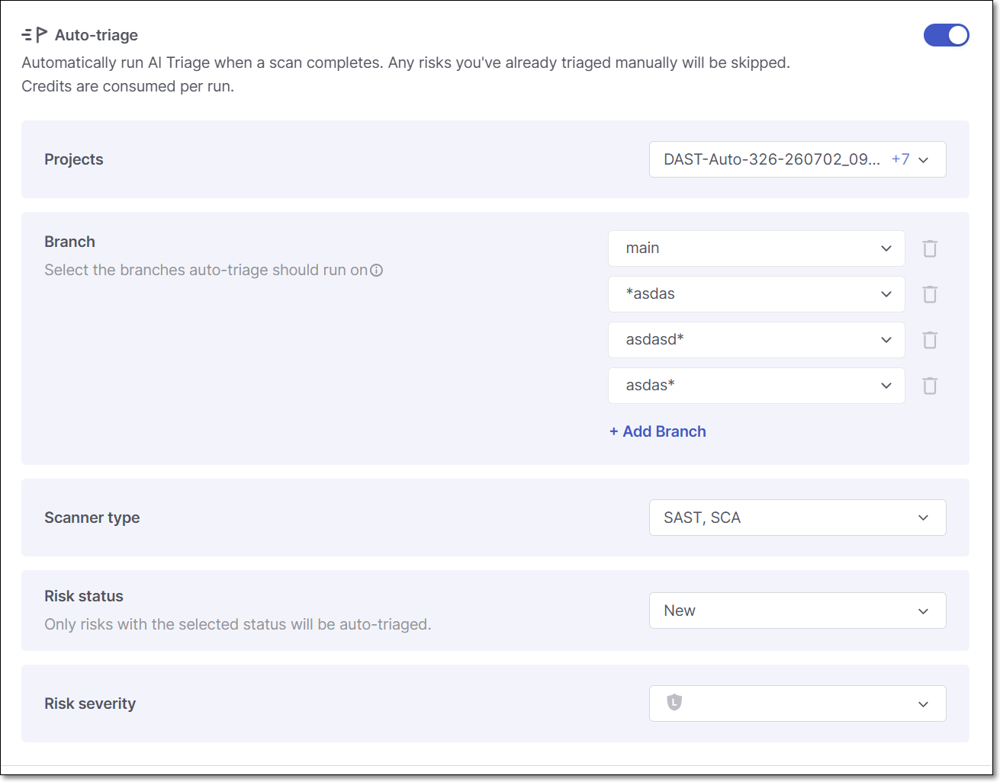

3. Specify values for the following parameters:
   * **Projects** – The projects to which the following rules for running AI Triage apply.
   * **Branches** – The branches which trigger automatic AI Triage.
   * **Scanners** – The scanners whose results trigger AI Triage.
   * **Risk Status** – The vulnerability status values that trigger AI Triage.
   * **Risk Severity** – The vulnerability severity levels to include.
4. For each parameter, select the **Allow Override** checkbox to permit individual projects to customize their own Auto-triage settings.
5. Click **Save**.

#### Configuring AI Triage in Project Settings

Automatic AI Triage can also be configured for individual projects. Project settings can be used when AI Triage has not been configured at the account level, or to customize the settings for a specific project when **Allow Override** is enabled.

1.  Navigate to the desired project's **Project Settings** > **AI Assist** tab.

    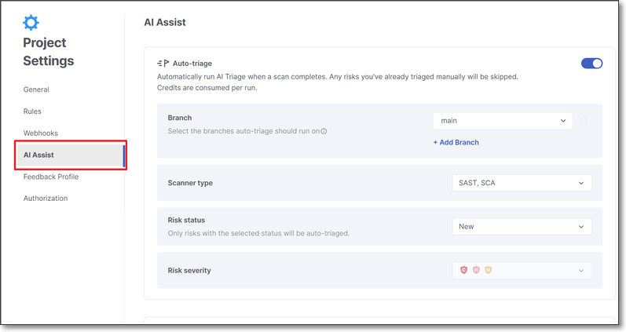
2. Configure the Auto-triage settings as explained above.
3. Click **Save**.

The available configuration options are the same as the organization-wide settings, except that the project is already selected.

### Running AI Triage & Remediation via GitHub PR Workflow

For **GitHub Code Repository Integration** projects, AI Triage & Remediation integrates directly into the pull request workflow. When a pull request triggers a Checkmarx scan, AI Triage runs automatically on "Net New" risks (i.e., new vulnerabilities being introduced into the protected branch by a pull request) according to the pre-configured criterion set for that project. The triage results are displayed in the pull request decoration. Developers can then request AI Remediation directly from the pull request. When remediation is generated, Checkmarx creates a separate pull request containing the suggested code changes for review.



#### Enable AI Triage & Remediation for a Code Repository Integration Project

AI Triage & Remediation is configured at the project level in the Checkmarx One web application (UI). It can be enabled during project creation, or at a later time by updating the project settings. Users control which projects have AI Triage & Remediation enabled and which severity vulnerabilities are included in the triage analysis and remediation workflow.

**To enable this capability on an existing project:**

1. In the **Workspace > Projects** screen, hover over the desired code repository integration project's row, click on **More Options** > **Project Settings**.
2. In the **Project Settings**, navigate to the **Code Repository** tab.
3.  In the permissions section, activate the toggle for **AI Triage & Remediation**.

    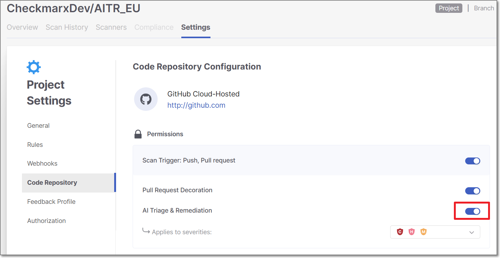

    A confirmation dialogue is displayed.
4. Click **Activate** to enable the feature.
5. For the **Applies to severities** threshold, select the severity levels that this feature will apply to.
6. Click **Save**.

#### AI Triage & Remediation Workflow

1.  **Create a pull request**

    In GitHub, open a pull request from a feature branch into a branch that is associated with a Checkmarx project where PR scanning and AI Triage & Remediation are enabled (as configured in the Checkmarx One web application).
2.  **Checkmarx One scan runs and triggers triage**

    A Checkmarx scan runs on the pull request. The results are added as a comment through PR decoration, including a table of **New Issues** (vulnerabilities introduced in this PR) and **Fixed Issues** (vulnerabilities that were resolved in this PR).

    The **AI Triage** agent automatically analyzes each of the **New Issues** that meet the designated severity threshold and the PR decoration shows the results of the Triage analysis.

    

The maximum number of risks automatically triaged for a PR is 10 (selected in order listed in New Issues report).

    
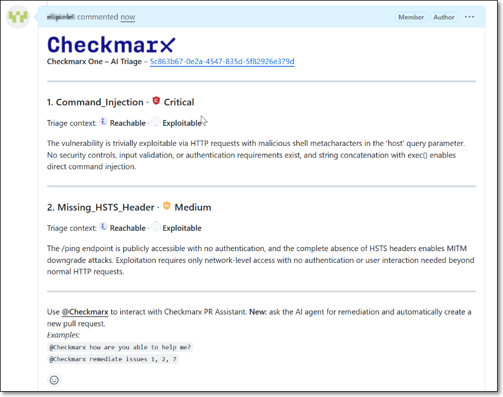

3.  **Trigger remediation for a vulnerability**

    Request a fix for one or more vulnerabilities by submitting a comment with `@checkmarx` followed by a natural language request for remediation, e.g., `@checkmarx remediate issue 1` or `@checkmarx fix all issues`.

    

The maximum number of remediations that can be triggered by a single comment is 5.

4.  **Review remediation output**

    The Remediation agent responds with a comment indicating that a remediation pull request has been created. A link is provided to view the generated pull request.

    Open the remediation pull request, and review the suggested code change.

    

The remediation PR title uses the following format: <code>Checkmarx AI Remediation - &#x3C;risk_identifier></code>. For SCA, <code>&#x3C;risk_identifier></code> is the CVE (for example, CVE-2026-39830). For SAST, it is the query name (for example, Plain_Text_Transport_Layer_in_Server).

5.  **Merge the remediation changes**

    If you approve the changes, merge the fixed branch into the source branch of your original pull request.
6.  **Complete the original pull request**

    Once the required fixes are applied, proceed with merging the original pull request according to your standard workflow.

## Viewing AI Triage & Remediation Results

Results from AI Triage & Remediation are shown in the Risk Orchestration screen, when the relevant project is opened and the relevant risk is selected.

### AI Triage Results

When AI Triage causes an automatic state change, the AI icon  is shown in the risks table in the State column. Hover over the icon to show a link to additional details.

In the side panel that opens the AI Triage results are shown in the **Info** tab. The results include a summary of the risk assessment as well as an Analysis section with AI's determination of whether or not the vulnerability is Reachable and/or Exploitable.

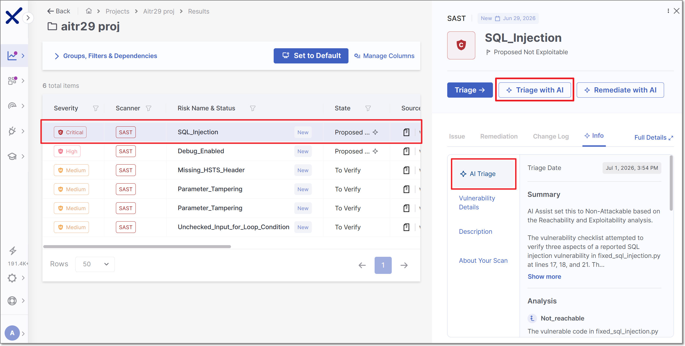

AI triage changes are also recorded in the **Change Log**.

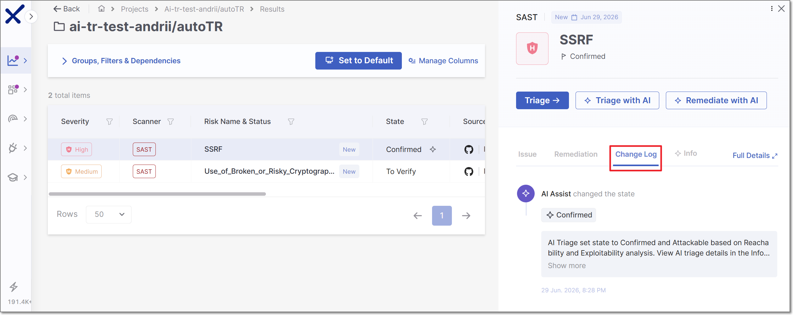

### Viewing AI Remediation

In the side panel that opens when a risk is selected, AI Remediation results are shown under **Remediation > AI Remediation**. The remediation includes a summary of the recommended fix, an explanation of the issue, why it should be addressed, and the actual code changes that will remediate it.


For **GitHub Code Repository** Integration projects, a pull request is also created in GitHub containing the suggested fix. For other SCM integrations and manual projects, the remediation is available within Checkmarx One but no pull request is created.


## Monitoring AI Triage & Remediation Usage

To view **AI Triage & Remediation** analytics:

1. In the Checkmarx One web application, navigate to **ASPM** > **Analytics & Dashboard**.
2. Select the **AI Assist Usage** tab.
3. Select **AI Triage & Remediation**.

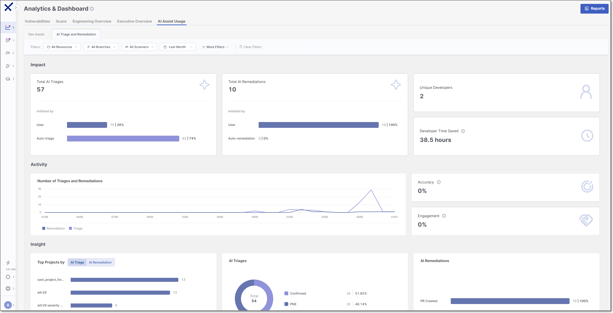

The **AI Triage & Remediation** dashboard provides an overview of how AI Triage & Remediation is being used across your organization. It includes high-level metrics such as the number of AI triages and remediations performed, unique developers using the feature, and estimated developer time saved. The dashboard also displays **activity** trends over time and provides **insights** into adoption patterns, triage outcomes, remediation results, and project usage. Use the filters at the top of the page to view analytics for specific resources, branches, scanners, time periods, or other criteria.

## Checkmarx Credits

AI Triage and AI Remediation consume **Checkmarx Credits**. Credits are used each time that a Triage or Remediation action is run. If triage has already run on a risk and it is triggered again for an identical instance, it will not run again and no credits will be used.


However, when the Group Similar Results setting for SAST is changed, previously run AI Triage is no longer applicable. Therefore, if you subsequently run AI Triage on the same result, AI Triage will run again and consume additional credits.


Checkmarx One provides both a high-level summary of your available credits and detailed reporting on credit consumption.


Credit consumption data is only visible to admin users.


### Monitoring Credit Usage

The **Account Settings** > **License** tab provides an overview of your organization's current credit usage and projected consumption.

**To access the Credit Usage summary:**

1. In the Checkmarx One web application, click the **Credits** indicator in the left navigation pane.
2.  In the pop-up, click **Details**.

    
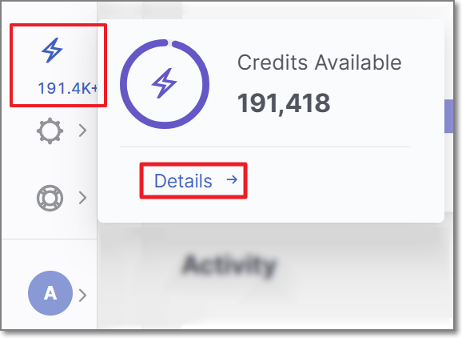

    The **License** page opens and displays the **Credit Usage** section, which provides a high-level overview of your organization's AI credit consumption.

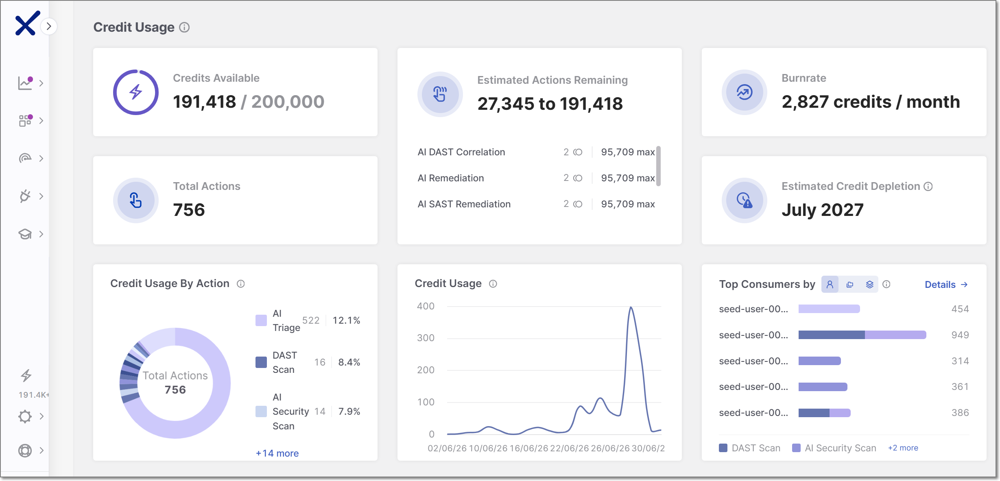

The Credit Usage section displays the following widgets:

* **Credits Available** – The number of remaining credits available under your license.
* **Estimated Actions Remaining** – The estimated number of additional AI actions that can be performed with the remaining credits.
* **Burn Rate** – The average rate at which credits are being consumed.
* **Estimated Credit Depletion** – The projected date on which the available credits will be exhausted based on the current burn rate.
* **Total Actions** – The total number of AI actions performed.

### Viewing Credit Usage Details

You can view additional details about credit usage by clicking on the **Credit Usage** tab.

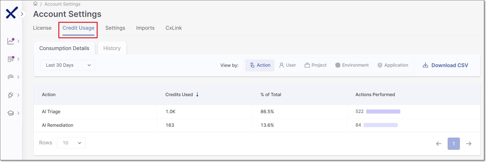

The **Credit Usage** tab contains two sub-tabs, **Consumption Details** and **History**.

Both tabs enable the following actions:

* Filter the displayed data by time period.
* Export the displayed data as a CSV file.

#### Consumption Details Tab (default)

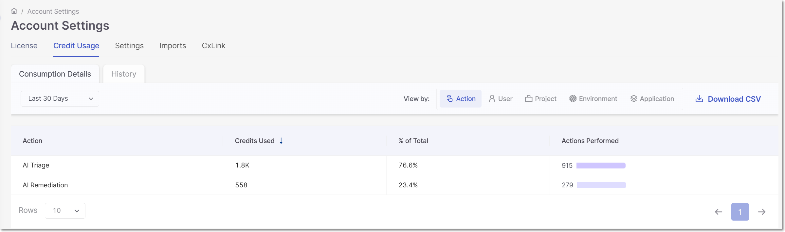

The Consumption Details tab lets you view credit consumption broken down by **Action, User, Project, Environment,** or **Application**.

For each item displayed, the table shows the number of credits used, the percentage of total credits used by that entity and the number of actions performed.

#### History Tab

The History tab shows a list of actions taken that consumed AI Credits. For each action details are given about the action taken, the number of credits used and the user who initiated the action.

### Ordering Additional Credits

It is possible to order additional Checkmarx Credits to enable additional usage of AI Triage & Remediation.

1. Go to **Account Settings > License** tab, and in the **Solution Overview** section, click on **Checkmarx Credits**.
2. The **Request License Upgrade** panel opens with the **Upgrade Type** set as **Solutions** and **Checkmarx Credits** specified in the **Solutions** field.
3. You can edit the info in the form as needed and optionally add **Notes**.
4.  Click **Submit**.

    A Checkmarx representative will contact you.

.
