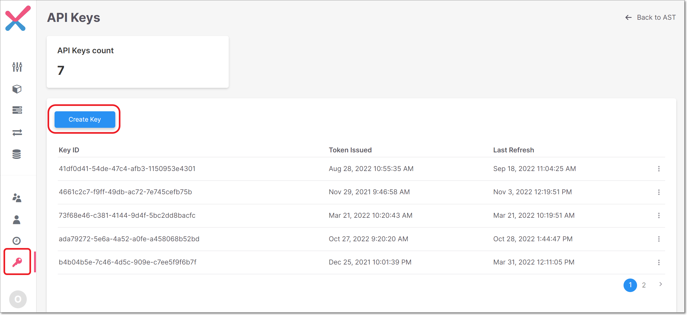
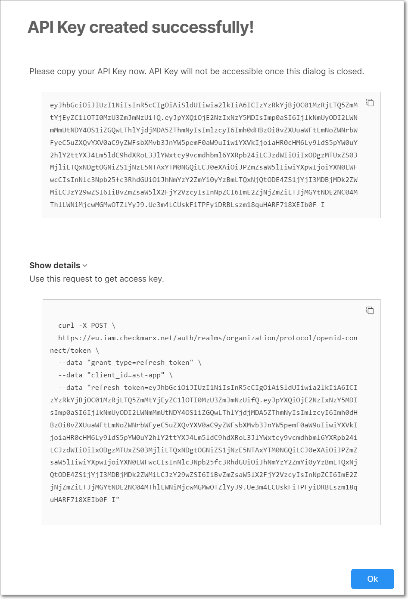

# Generating a Refresh Token (API Key)

If you have user credentials for Checkmarx One, you can obtain a refresh token (API Key) from the [Authentication API](README.md) using your account’s username and password. Alternatively, you can log in to Checkmarx One and generate a refresh key (API Key).

The roles (permissions) assigned to the API Key are inherited from the user account that generates the key. Therefore, ensure you are logged into an account with the appropriate roles. See Managing Roles


Whenever you update your Checkmarx One license (e.g., adding a new scanner) all existing API Keys become invalid. You will need to generate new API Keys to replace those used in your integrations and plugins.




**To generate a refresh token via Checkmarx One:**

1. Log in to the Checkmarx One web portal and select **User Management** in the main navigation.

   The IAM portal opens.
2. Click **API Keys** in the main navigation.
3. Click **Create Key**.

   <figure><figcaption></figcaption></figure>

   A new key is created with the permissions of the current user assigned to it, and a dialog opens showing the API Key.
4. If you would like to get the curl request for generating an **Access Key** (i.e., a bearer token to be submitted with the API calls), click on **Show details** to expand the display.

   <figure><figcaption></figcaption></figure>
5. Copy the API Key and/or the curl and save them in a place where you will be able to retrieve them for future use. Then, click **OK** to close the dialog.
