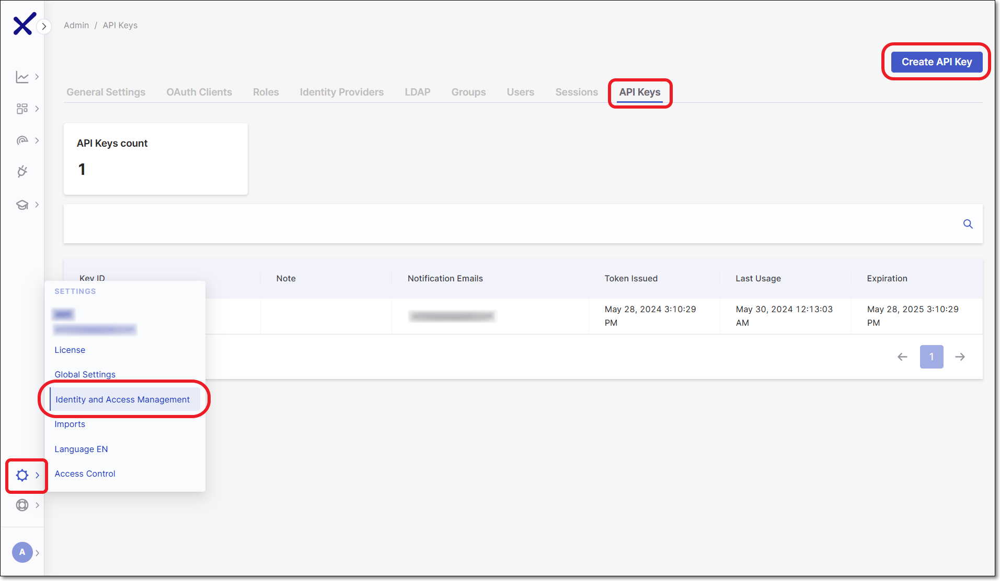
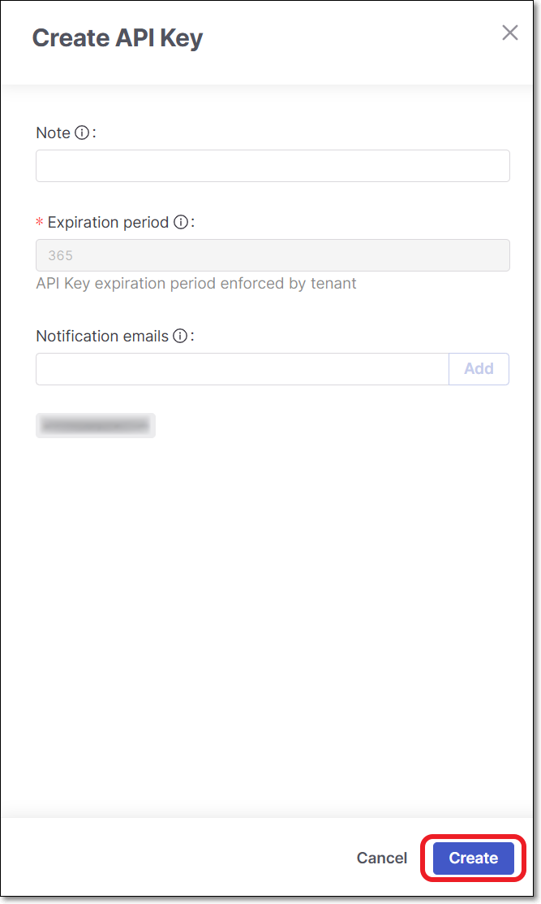
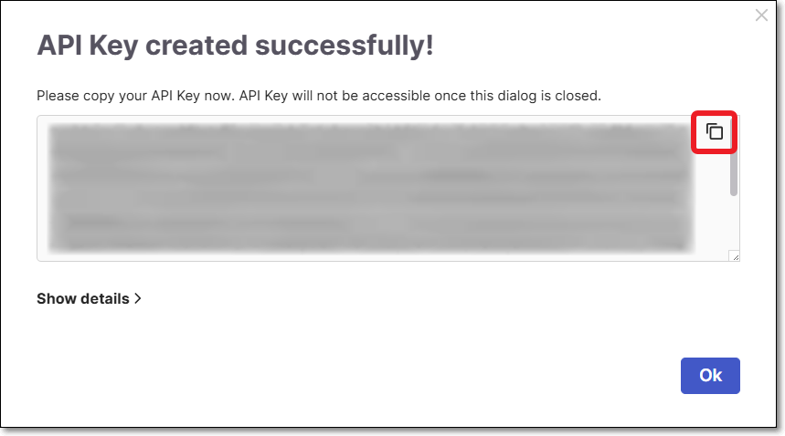

# Checkmarx One CLI Quick Start Guide

## Overview

The Checkmarx One CLI is a **Command Line Interface** that acts as a wrapper and enables the performance of **all** tasks normally done via the REST APIs.

There are specific executables for the main use cases to perform the following:

- create/delete/get/set projects
- create/delete/get/set scans for all of our engines
- get results

The latest CLI is also in a container, in case the user wants to deploy and use it in that way: checkmarx/ast-cli

## Getting Started

### Download and Installation

To download the CLI tool, perform the following:

1. Go to the following link: [**CLI Releases**](https://github.com/Checkmarx/ast-cli/releases)
2. Download the relevant tool that is compatible with your Operating System.
3. Place the tool in any location on the client that you are using.


The CLI tool can be installed on any Linux/Windows/MAC distribution.


### Initial Setup

This quick-start tutorial describes how to authenticate using an API Key. For alternative authentication methods, see [Configuring the Checkmarx One CLI](configuring-the-checkmarx-one-cli/README.md).

1. Generate a Checkmarx One API Key for authentication.

   **Generating an API Key**

   You can generate an API Key by logging in to Checkmarx One and generating a new API Key, as described below. Alternatively, an API Key can be generated using the Authentication API.

   The roles (permissions) assigned to an API Key are inherited from the user who is logged in when the API key is generated. Therefore, make sure that you are logged in to an account with the appropriate permissions.

   
   The minimum required roles for running an end-to-end flow of scanning a project and viewing results via the CLI or plugins are Checkmarx One `plugin-scanner` role and IAM `default-roles<tenant>` role.

   The permissions included in `plugin-scanner` are shown here. If you would like to create a custom role with more granular permissions, you should refer to this list of permissions in order to determine which permissions you will need to assign.
   

   
   Whenever you update your Checkmarx One license (e.g., adding a new scanner) all existing API Keys become invalid. You will need to generate new API Keys to replace those that are used in your integrations and plugins.
   

   **To Log in to Checkmarx One:**

   1. Open the URL for your environment.

      **Checkmarx One Server Base URLs**

      - US Environment - https://ast.checkmarx.net
      - US2 Environment - https://us.ast.checkmarx.net
      - EU Environment - https://eu.ast.checkmarx.net
      - EU2 Environment - https://eu-2.ast.checkmarx.net
      - DEU Environment - https://deu.ast.checkmarx.net
      - Australia & New Zealand – https://anz.ast.checkmarx.net
      - India - https://ind.ast.checkmarx.net
      - India 2 - https://ind-2.ast.checkmarx.net/
      - Singapore - https://sng.ast.checkmarx.net
      - UAE - https://mea.ast.checkmarx.net
      - Israel - https://gov-il.ast.checkmarx.net
   2. Log in to your Checkmarx One account by entering your *Tenant Account*, *Username* and *Password*.

   
   The roles (permissions) assigned to the API Key are inherited from the user account that generates the key. Therefore, make sure that you are logged in to an account with the appropriate roles.
   

   

   **To generate an API Key:**

   1. Log in to the Checkmarx One web portal and select **Settings > Identity and Access Management** in the main navigation.

      The IAM portal opens.
   2. In the main navigation, click **API Keys**, then click on the **Create Key** button.

      <figure><figcaption></figcaption></figure>

      The API Key configuration window opens.

      <figure><figcaption></figcaption></figure>
   3. You can optionally adjust the configuration as follows:

      - **Note** - Add a descriptive note to the API Key.
      - **Expiration period** - Adjust the period of time until the key expires. The value can be from 30 to 365 days.

        
        If an administrator set the default expiration period to be "enforced", then this field will be locked.
        
      - **Notification emails** - Enter emails of each recipient who you would like to receive notifications regarding expiration of the key. After entering each email, click **Add**. By default the email of the current user is included.
   4. Click **Create**.

      The API Key is created and a window opens showing the key.

      <figure><figcaption></figcaption></figure>
   5. Copy the key and save it in a place where you will be able to retrieve it for future use.

   
   Once you close the window, you will no longer be able to access this API Key.
   

   
   You can obtain a curl for submitting the request for an access token, by clicking on **Show details** and copying the content.
   
2. Open the CLI on your machine and navigate to the CLI tool file location.
3. Run the `cx configure` command.

   The CLI will prompt you to enter your credentials.
4. Skip the prompt for **AST Tenant** by hitting **Enter**.
5. When you are prompted, **Do you want to use API Key authentication?**, enter "**y**".
6. When you are prompted for **AST API Key**, enter your API Key.
7. You can skip the rest of the prompts by hitting **Enter**.

#### Creating a Project

To create a new Project, use the `project create` command and enter a name for the project using the `--project-name` flag. See [project create](checkmarx-one-cli-commands/project/project-create.md)

```
./cx project create --project-name <Project name>
```

#### Running a Scan

To run a scan, use the `scan create` command and specify the project name, branch and file location or repository URL using the `--project-name`, `--branch` and `-s` flags. See [scan create](checkmarx-one-cli-commands/scan/scan-create.md)

```
./cx scan create --project-name <Project name> --branch <branch name> -s <Repository URL>
```

#### Viewing the Results

To view the scan results, use the `results show` command and provide the Scan ID you received after running the scan using the `--scan-id` flag. See [results show](checkmarx-one-cli-commands/results/results-show.md)

```
./cx results show --scan-id <Scan ID>
```
