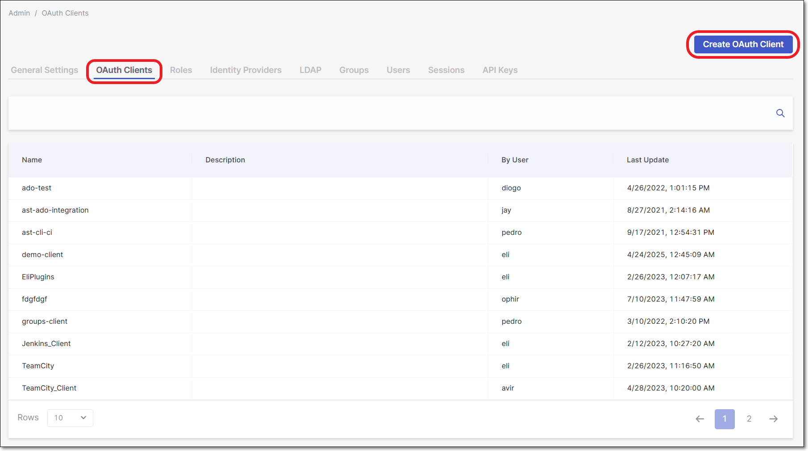
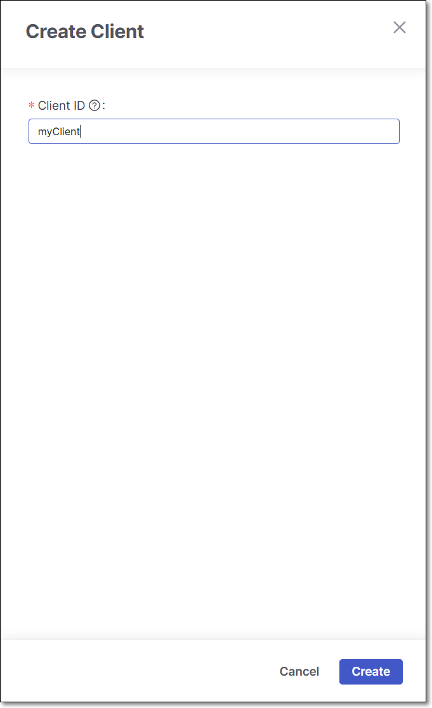
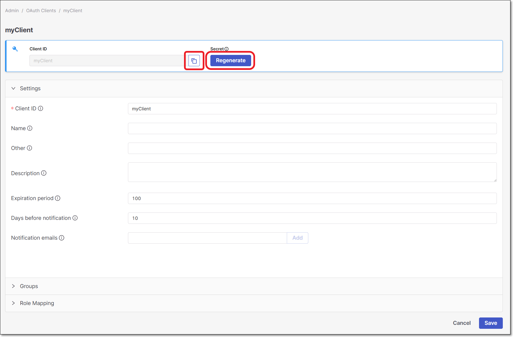
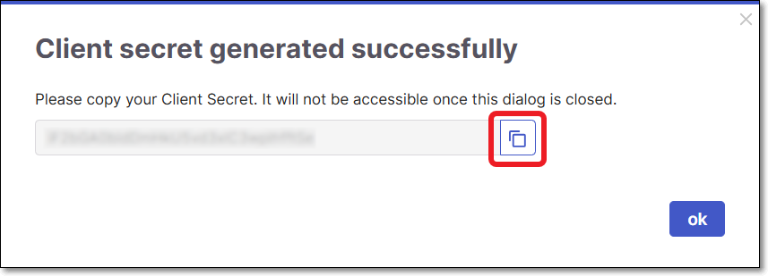

# Configuring the Checkmarx One CLI

## Prerequisites

Before configuring the CLI, download and install the Checkmarx One CLI. For platform-specific installation instructions, click [here](https://docs.checkmarx.com/en/34965-68622-checkmarx-one-cli-installation.html).

## Configuration Methods

CLI configuration parameters can be submitted using three different methods, as follows:

- **CLI parameters** - when submitting any CLI command you can add the configuration parameters.
- **Configuration file** - a configuration file can be created by running the CLI `configure` command. See [configure](../checkmarx-one-cli-commands/configure/README.md)

  
  By default, the configuration file is stored in the user's home directory under a subdirectory named ($HOME/.checkmarx). It is possible to store the file in a different location and use the environment variable `CX_CONFIG_FILE_PATH` to reference the file location.
  
- **Environment variables** - the environment variables of your system.

## Variables Hierarchy

The following precedence applies when the same value is provided by more than one method - higher numbers override lower numbers:

1. Environment variables (lowest precedence)
2. Configuration file
3. CLI parameters (highest precedence)


Interactive Login stores a refresh token as `cx_apikey` in the configuration file. If `cx_apikey` is also set as an environment variable or passed as a CLI parameter, the CLI parameter takes precedence.


## Authentication

To submit CLI commands, you must be authenticated with your Checkmarx One account.

The Checkmarx One CLI supports the following authentication methods:

- **Interactive login** – Enables you to authenticate using your standard Checkmarx One sign-in flow without first generating an API Key or configuring an OAuth Client. Run `cx auth login` to sign in through your browser, including multi-factor authentication (MFA). This method only requires your Tenant and Base Auth URI, which can be stored in the CLI configuration or provided as as options in the login command. After you sign in, the CLI obtains a refresh token and stores it as the `cx_apikey` value used to authenticate subsequent CLI commands. By default, the value is stored in the CLI configuration file. For additional storage options and usage details, see [auth login](../checkmarx-one-cli-commands/auth/auth-login.md).
- **API Key** – Enables you to authenticate using an API Key generated for your Checkmarx One account. The API Key contains the information required by the CLI to identify your Checkmarx One environment, so no additional authentication parameters are generally required.
- **OAuth Client** – Enables you to authenticate using OAuth client credentials. This method requires you to provide the OAuth Client ID and Client Secret, together with the Tenant, Base URL, and Base Auth URI.

For API Key and OAuth Client authentication, you can provide the required authentication parameters individually with each CLI command. To avoid providing them repeatedly, you can configure them for reuse across commands using CLI Config or Environment variables. See [Checkmarx One CLI Config and Environment Variables](checkmarx-one-cli-config-and-environment-variables.md) for details.

### Required Parameters

The following parameters are required for authentication, depending on the authentication method used.

- cx_base_auth_uri
- cx_tenant

These values can be stored in the CLI configuration or provided using the `--base-auth-uri` and `--tenant` options when running `cx auth login`.

- cx_apikey

  To generate an API Key use the following procedure:

  **Creating an API Key for Checkmarx One Integrations**

  You can generate an API Key by logging in to Checkmarx One and generating a new API Key, as described below. Alternatively, an API Key can be generated using the Authentication API.

  The roles (permissions) assigned to an API Key are inherited from the user who is logged in when the API key is generated. Therefore, make sure that you are logged in to an account with the appropriate permissions.

  
  The minimum required roles for running an end-to-end flow of scanning a project and viewing results via the CLI or plugins are Checkmarx One `plugin-scanner` role and IAM `default-roles<tenant>` role.

  The permissions included in `plugin-scanner` are shown here. If you would like to create a custom role with more granular permissions, you should refer to this list of permissions in order to determine which permissions you will need to assign.
  

  
  Whenever you update your Checkmarx One license (e.g., adding a new scanner) all existing API Keys become invalid. You will need to generate new API Keys to replace those that are used in your integrations and plugins.
  

  **To log in to Checkmarx One:**

  1. Open the URL for your environment.

     **Checkmarx One Server Base URLs**

     - US Environment - https://ast.checkmarx.net
     - US2 Environment - https://us.ast.checkmarx.net
     - EU Environment - https://eu.ast.checkmarx.net
     - EU2 Environment - https://eu-2.ast.checkmarx.net
     - DEU Environment - https://deu.ast.checkmarx.net
     - Australia & New Zealand – https://anz.ast.checkmarx.net
     - India - https://ind.ast.checkmarx.net
     - India 2 - https://ind-2.ast.checkmarx.net/
     - Singapore - https://sng.ast.checkmarx.net
     - UAE - https://mea.ast.checkmarx.net
     - Israel - https://gov-il.ast.checkmarx.net
  2. Log in to your Checkmarx One account by entering your *Tenant Account*, *Username* and *Password*.

  **Generating an API Key**

  

  **To generate an API Key:**

  1. Log in to the Checkmarx One web portal and select **Settings > Identity and Access Management** in the main navigation.

     The IAM portal opens.
  2. In the main navigation, click **API Keys**, then click on the **Create Key** button.

     <figure><figcaption></figcaption></figure>

     The API Key configuration window opens.

     <figure><figcaption></figcaption></figure>
  3. You can optionally adjust the configuration as follows:

     - **Note** - Add a descriptive note to the API Key.
     - **Expiration period** - Adjust the period of time until the key expires. The value can be from 30 to 365 days.

       
       If an administrator set the default expiration period to be "enforced", then this field will be locked.
       
     - **Notification emails** - Enter emails of each recipient who you would like to receive notifications regarding expiration of the key. After entering each email, click **Add**. By default the email of the current user is included.
  4. Click **Create**.

     The API Key is created and a window opens showing the key.

     <figure><figcaption></figcaption></figure>
  5. Copy the key and save it in a place where you will be able to retrieve it for future use.

  
  Once you close the window, you will no longer be able to access this API Key.
  

  
  You can obtain a curl for submitting the request for an access token, by clicking on **Show details** and copying the content.
  


The CLI automatically extracts all relevant account info (Base URL, Auth URL, Tenant name) from the API Key. You can use arguments to submit these values explicitly, overriding the extracted values. However, this is generally not recommended.


- cx_base_uri
- cx_base_auth_uri
- cx_tenant
- cx_client_id
- cx_client_secret

  To create an OAuth client, use the following procedure:

  **Creating an OAuth Client for Checkmarx One Integrations**

  You can create an OAuth Client by logging in to Checkmarx One and creating a new client.

  
  If the new access management is enabled, the OAuth client must be granted resource-level authorization (at the tenant, application, or project level) to function properly.
  

  **Logging in to Checkmarx One**

  **To log in to Checkmarx One:**

  1. Open the URL for your environment (see the full list above).
  2. Log in to your Checkmarx One account by entering your *Tenant Account*, *Username* and *Password*.

     
     To create an OAuth Client, you need to be signed in as an admin user.
     

  **Creating an OAuth Client**

  To create an OAuth Client, you must have the following permissions:

  - `assign-project-all-groups`: Allows assigning any existing group when creating or updating a project
  - `view-access`: – Allows viewing endpoints.

  

  **To create an OAuth Client:**

  1. Log in to Checkmarx One and click on **Settings > Identity and Access Management** in the Menu panel.

     <figure><figcaption></figcaption></figure>
  2. In the **Identity and Access Management** console, click **OAuth Clients** and then click **Create Client**.

     <figure><figcaption></figcaption></figure>
  3. In the **Client ID** field, enter a descriptive name for Client, and then click **Create**.

     
     The **Client ID** field accepts only letters, numbers, spaces, and these symbols: `. ( ) [ ] { } - _`.
     

     

     The Client Settings screen is shown.

     <figure><figcaption></figcaption></figure>
  4. Copy the **Client ID** for use in the plugin configuration.
  5. Click on the **Regenerate** button to generate the Secret.
  6. In the dialog that opens, copy the **Secret** for use in the plugin configuration, and then click **Ok** to close the dialog

     <figure><figcaption></figcaption></figure>
  7. You can optionally adjust the **Settings** as follows:

     - **Name** - Specify the name that will be displayed for this Client.
     - **Other** - Enter additional information about this Client.
     - **Description** - Enter a description of this Client.
     - **Expiration period** - Specify the period of time until the key expires. The value can be from 30 to 365 days.

       
       If an administrator set the default expiration period to be "enforced", then this field will be locked.
       
     - **Days before notification** - Specify the number of days before the Client will expire that notifications will start being sent. Notifications will be sent on a daily basis from the day on.
     - **Notification emails** - Enter emails of each recipient who you would like to receive notifications regarding expiration of the key. After entering each email, click **Add**. By default the email of the current user is included.
  8. Under **Groups**, you can optionally assign groups to the Client.

     For more information, refer to Groups.
  9. Under **Role Mapping** select the relevant roles, and click on **Add selected**.

     
     The minimum required role for running an end-to-end flow of scanning a project and viewing results via the CLI or CI/CD plugins is `plugin-scanner`.

     Alternatively, you can use the combination of the following roles: CxOne composite role `ast-scanner`, CxOne role `view-policy-management` (not required for IDE plugins) and IAM role `default-roles`.
     
  10. Click **Save Client**.

## In this section

- [Checkmarx One CLI Config and Environment Variables](checkmarx-one-cli-config-and-environment-variables.md)
