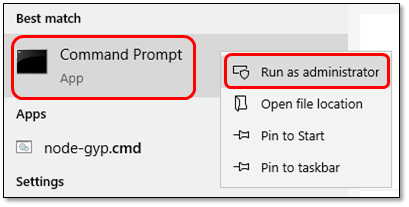
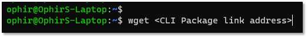

# Downloading and Installing the Checkmarx One CLI


This article explains how to install the CLI binary locally. Alternatively, you can use the containerized image of the CLI which is available on Docker Hub [here](https://hub.docker.com/r/checkmarx/ast-cli/tags). An example of how the image can be used to run a Checkmarx One scan in the context of a GitLab CI/CD integration can be seen [here](https://github.com/Checkmarx/ci-cd-integrations/blob/main/GitlabCICD/v1/CheckmarxCLI.gitlab-ci.yml).

Issues to consider when using the container image:

- Docker Hub pull quotas will apply
- The image does not automatically install SCA Resolver


To download the CLI tool, perform the following:

1. Go to the following link: [**CLI Releases**](https://github.com/Checkmarx/ast-cli/releases/latest)
2. Download the relevant tool that is compatible with your Operating System.

   | Operating System | File Name | Architecture / Variant | Download Link |
   |---|---|---|---|
   | macOS (Darwin) | ast-cli_darwin_x64.tar.gz | Intel (x86_64) + Apple Silicon (arm64) (Universal Binary | [Download](https://github.com/Checkmarx/ast-cli/releases/latest/download/ast-cli_darwin_x64.tar.gz) |
   | Linux | ast-cli_linux_arm64.tar.gz | ARM64 | [Download](https://github.com/Checkmarx/ast-cli/releases/latest/download/ast-cli_linux_arm64.tar.gz) |
   | Linux | ast-cli_linux_armv6.tar.gz | ARMv6 | [Download](https://github.com/Checkmarx/ast-cli/releases/latest/download/ast-cli_linux_armv6.tar.gz) |
   | Linux | ast-cli_linux_x64.tar.gz | x64 (AMD64) | [Download](https://github.com/Checkmarx/ast-cli/releases/latest/download/ast-cli_linux_x64.tar.gz) |
   | Windows | ast-cli_windows_x64.zip | x64 | [Download](https://github.com/Checkmarx/ast-cli/releases/latest/download/ast-cli_windows_x64.zip) |
3. Place the tool in any location on the client that you are using.


The CLI tool can be installed on any Linux/Windows/MAC distribution.


## Windows Installation

To install the tool on a **Windows** client, perform the following:

1. Go to **Start** menu **→ CMD**
2. Right click on**CMD → Run as Administrator**

   
3. Go to the path where the **ast-cli_\<Version>_windows_x64.zip** file is located in.
4. Unzip the file.
5. The **cx.exe** tool is ready to be used from the path that it is located in.
6. Type **cx → Enter** button and the CLI command prompt will begin.

   ```
   user@Laptop:/AST$ cx.exe
   The Checkmarx One CLI is a fully functional Command Line Interface (CLI) that interacts with the Checkmarx One server.
   Quick start guide:
   https://checkmarx.atlassian.net/wiki/x/mIKctw

   Usage:
     cx [command]

   Examples:
   $ cx configure
   $ cx scan create -s . --project-name my_project_name
   $ cx scan list


   Available Commands:
     configure Manage scan configurations
     cx Validate authentication and create OAuth2 credentials
     help Help about any command
     project Manage projects
     result Retrieve results
     scan Manage scans
     utils Checkmarx One Utility functions
     version Prints the version number

   Flags:
         --agent string Scan origin name (default "ASTCLI")
         --apikey string The API Key to login to Checkmarx One
         --base-auth-uri string The base system IAM URI
         --base-uri string The base system URI
         --client-id string The OAuth2 client ID
         --client-secret string The OAuth2 client secret
     -h, --help help for cx
         --insecure Ignore TLS certificate validations
         --profile string The default configuration profile (default "default")
         --proxy string Proxy server to send communication through
         --proxy-auth-type string Proxy authentication type, (basic or ntlm)
         --proxy-ntlm-domain string Window domain when using NTLM proxy
         --tenant string Checkmarx tenant
     -v, --verbose Verbose mode

   Use "cx [command] --help" for more information about a command.
   ```

## Linux/MAC Installation


We released version [2.3.51](https://github.com/Checkmarx/ast-cli/releases) of the Checkmarx One CLI, which has a re-signed certificate of the ast-cli binary for macOS. The certificate for previous versions of macOS CLI binaries have been revoked. MacOS users should update to CLI version 2.3.51.


To install the tool on a **Linux** client, perform the following:


For MAC it is recommended to use option 2.


### Option 1

1. Open the terminal:

   - For **macOS**: Open the Terminal app (Applications → Utilities → Terminal).
   - For **Linux**: Open your preferred terminal (e.g., GNOME Terminal, Konsole, xterm).
2. Use the **wget** command in order to download the CLI package:
3. <figure><figcaption></figcaption></figure>

   **Un-tar** the file:

   ```
   tar -xzvf ast-cli_<Version>_<OS>_<Arch>.tar.gz
   ```

### Option 2

1. Open the terminal:

   - For **macOS**: Open the Terminal app (Applications → Utilities → Terminal).
   - For **Linux**: Open your preferred terminal (e.g., GNOME Terminal, Konsole, xterm).
2. In case that the installation file is **downloaded to the client**, go to the file location path.
3. **Un-tar** the file:

   ```
   tar -xzvf ast-cli_<Version>_<OS>_<Arch>.tar.gz
   ```
4. Type the below command and the CLI command prompt will begin.

   ```
   user@Laptop:/AST$ ./cx
   The Checkmarx One CLI is a fully functional Command Line Interface (CLI) that interacts with the Checkmarx One server.
   Quick start guide:
   https://checkmarx.atlassian.net/wiki/x/mIKctw

   Usage:
     cx [command]

   Examples:
   $ cx configure
   $ cx scan create -s . --project-name my_project_name
   $ cx scan list


   Available Commands:
     configure Manage scan configurations
     cx Validate authentication and create OAuth2 credentials
     help Help about any command
     project Manage projects
     result Retrieve results
     scan Manage scans
     utils Checkmarx One Utility functions
     version Prints the version number

   Flags:
         --agent string Scan origin name (default "ASTCLI")
         --apikey string The API Key to login to Checkmarx One
         --base-auth-uri string The base system IAM URI
         --base-uri string The base system URI
         --client-id string The OAuth2 client ID
         --client-secret string The OAuth2 client secret
     -h, --help help for cx
         --insecure Ignore TLS certificate validations
         --profile string The default configuration profile (default "default")
         --proxy string Proxy server to send communication through
         --proxy-auth-type string Proxy authentication type, (basic or ntlm)
         --proxy-ntlm-domain string Window domain when using NTLM proxy
         --tenant string Checkmarx tenant
     -v, --verbose Verbose mode

   Use "cx [command] --help" for more information about a command.
   ```
