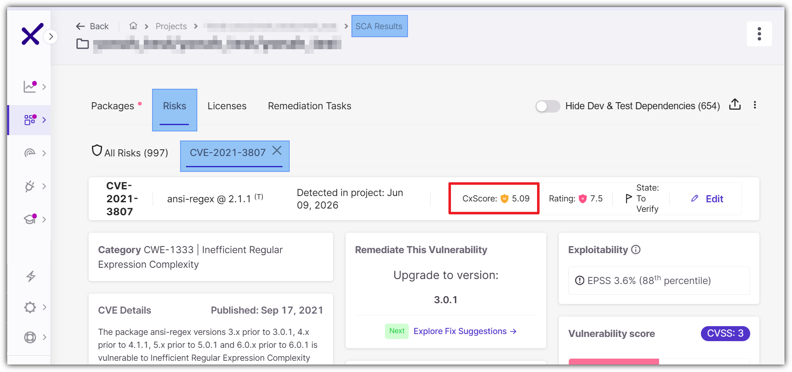

# CxScore: Risk Prioritization for SCA Vulnerabilities

## Overview

CxScore is Checkmarx's risk prioritization indicator for Software Composition Analysis (SCA) vulnerabilities. It produces a single, normalized score on a scale from **1 to 10** designed to help security and development teams focus on what matters most and take action quickly.

Security teams routinely face hundreds or thousands of vulnerabilities across their software supply chain. Not all of them represent equal risk: a vulnerability that is theoretically severe but has no available fix, no known exploitation, and no reachable path in the application is far less urgent than one that is actively exploited in the wild and can be resolved by a simple dependency update. CxScore surfaces that distinction clearly and consistently.

It does this by combining the intrinsic severity of a vulnerability with real-world signals about its exploitability, the feasibility of remediation, and application-level context. The result is an actionable priority ranking rather than a raw severity classification.

CxScore is available across SCA views in Checkmarx One. The following example shows how CxScore appears in the interface:



## How CxScore is Calculated

CxScore is computed through a two-tier formula:

1. **Base Severity**: A custom severity score derived from CVSS parameters, weighted to reflect Checkmarx's risk model.
2. **Base Risk Score**: The final CxScore, produced by combining the Base Severity with additional context-aware risk factors.

Each tier applies normalization so the output always falls on a 1–10 scale.

```
CxScore = Normalize( Sum( Base Group Parameters × Weight ) )

Where:
  Base Group = Base Severity + Additional Risk Factors
  Base Severity = Normalize( Sum( CVSS Parameters × Weight ) )
```

Higher values always represent higher risk.

### Tier 1: Base Severity

Base Severity is computed from the individual CVSS parameters for the vulnerability. Rather than consuming the CVSS aggregate score directly, Checkmarx applies its own weights to each parameter to produce a more granular severity value.

Checkmarx uses **CVSSv3.1** as the primary standard. When only CVSSv2 or CVSSv4 data is available, those parameters are mapped to their CVSSv3.1 equivalents before scoring.

#### CVSS Parameters

| Parameter | What it measures | Relative importance |
|---|---|---|
| **Attack Complexity** | Whether exploitation requires conditions beyond the attacker's control (e.g., race conditions, specific configurations) | High |
| **Attack Vector** | The access context required for exploitation: Network, Adjacent, Local, or Physical | Medium |
| **Privileges Required** | The level of authenticated access the attacker needs: None, Low, or High | Medium |
| **Confidentiality Impact** | The degree to which exploitation exposes sensitive data | Medium |
| **Integrity Impact** | The degree to which exploitation allows data to be modified | Medium |
| **Availability Impact** | The degree to which exploitation disrupts access to the system | Medium |
| **User Interaction** | Whether a victim must actively participate for exploitation to succeed | Low |
| **Scope** | Whether exploitation can affect resources outside the vulnerable component's security scope | Very Low |

#### CIA Triad Joint Impact

In addition to the individual CIA weights above, CxScore applies an extra joint-impact factor using the **highest** of the three CIA values (Confidentiality, Integrity, Availability). This amplifies the score when a vulnerability causes significant harm across at least one impact dimension.

The CIA Triad Joint Impact carries the **highest relative weight** of any single input in the Base Severity calculation, ensuring that high-impact vulnerabilities are appropriately elevated.

### Tier 2: Additional Risk Factors

The Base Severity feeds into the final formula together with a set of additional parameters that reflect real-world exploitation signals, remediation context, and application-level factors.

#### Exploitation Evidence and LikelihoodParameterWhat it measuresRelative importanceKEV (Known Exploited Vulnerability)Whether this vulnerability appears in CISA's Known Exploited Vulnerabilities catalog, confirming active exploitation in the wildVery HighEPSS ScoreThe probability (per FIRST's Exploit Prediction Scoring System) that the vulnerability will be exploited in the next 30 daysHighEPSS PercentileHow the vulnerability's EPSS score ranks relative to all other scored vulnerabilities; used to differentiate vulnerabilities with similar EPSS valuesHighProof of Concept (PoC)Whether a publicly available exploit or demonstration of the attack technique existsMedium

Because KEV represents confirmed active exploitation rather than a probability estimate, it carries more weight than EPSS. When KEV is present, EPSS functions as a complementary signal rather than a primary driver. PoC has a greater impact when KEV is not present.

#### Remediation Feasibility

| Parameter | What it measures | Relative importance |
|---|---|---|
| **Fix Available** | Whether a patched version of the affected package exists, allowing SCA to provide a direct remediation path | Very High |
| **Dependency Type** | Whether the vulnerable package is a direct or transitive dependency (direct dependencies are easier to remediate and are therefore prioritized) | Medium–High |

The Dependency Type parameter only applies when a fix is available. When no fix exists, dependency type does not influence the score.

#### Vulnerability Context

| Parameter | What it measures | Relative importance |
|---|---|---|
| **Base Severity** | The normalized Base Severity from Tier 1, included as a weighted input | Very High |
| **CVE Identifier** | Whether the vulnerability is registered as a CVE; CVE-registered vulnerabilities are better documented and more widely tracked | Medium–High |
| **Published Since** | The number of days since the vulnerability was first published; recently published vulnerabilities (within 30 days) are prioritized because they are more likely to be actively targeted | Medium |
| **Exploitable Path** | Whether an exploitable code path to the vulnerability is confirmed as reachable in the application (requires the Exploitable Path feature to be enabled on the project) | Medium–High |
| **Vulnerable Package Occurrences** | The number of times the vulnerable package appears within the project; a higher occurrence count compounds risk | Low–Medium |

Note on Exploitable Path: a confirmed path increases the score, but the absence of a confirmed path does not proportionally reduce it, since path analysis coverage may be incomplete.

#### Triage State (User-Defined)

The **Triage State** assigned by your security team (Not Exploitable, Proposed Not Exploitable, To Verify, Confirmed, or Urgent) influences the final CxScore. Unlike the other parameters, Triage State is not included directly in the risk score calculation. Instead, after the risk score is calculated, the Triage State is applied as a modifier to adjust the resulting score.
