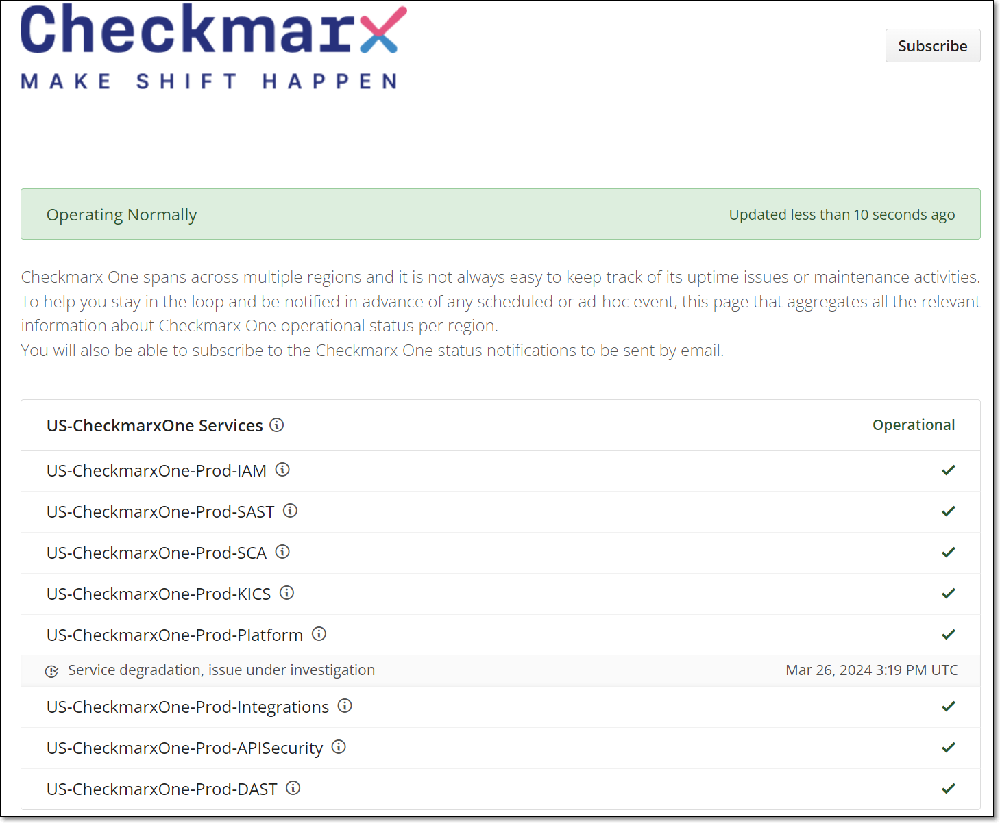
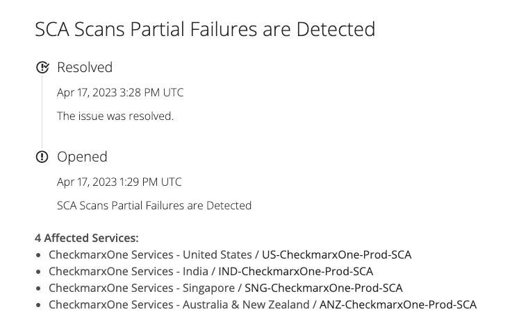
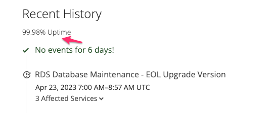
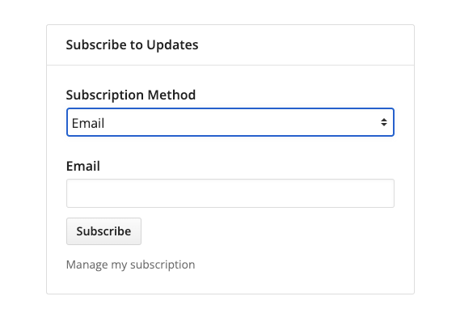

# Checkmarx One Services Status Page

## Introduction

Checkmarx One status pages provide a status and reporting service that allows Checkmarx One users and customers to track and get reports about Checkmarx One services, including any degradations or outages. With Checkmarx One Status Pages, users can monitor multiple services in globally distributed Checkmarx One services from a single place, receive real-time alerts, and access detailed incident reports to better understand the cause of any disruptions.

These pages aggregate all the relevant information about Checkmarx One operational status per region. Checkmarx One users and customers will also be able to subscribe to the Checkmarx One status notifications to be sent by email.

## Status Pages

- US - [https://us-status.ast.checkmarx.net/](https://us-status.ast.checkmarx.net/)
- US2 - [https://us2-status.ast.checkmarx.net/](https://us2-status.ast.checkmarx.net/)
- EU - [https://eu-status.ast.checkmarx.net/](https://eu-status.ast.checkmarx.net/)
- EU2 - [https://eu2-status.ast.checkmarx.net/](https://eu2-status.ast.checkmarx.net/)
- GOV-IL - [https://gov-il-status.ast.checkmarx.net/](https://gov-il-status.ast.checkmarx.net/)
- India - [https://ind-status.ast.checkmarx.net/](https://ind-status.ast.checkmarx.net/)
- Singapore - [https://sng-status.ast.checkmarx.net/](https://sng-status.ast.checkmarx.net/)
- Australia & New Zealand - [https://anz-status.ast.checkmarx.net/](https://anz-status.ast.checkmarx.net/)
- UAE - [https://uae-status.ast.checkmarx.net/](https://uae-status.ast.checkmarx.net/)

  - Disaster Recovery: India-2 - [https://ind2-status.ast.checkmarx.net/](https://ind2-status.ast.checkmarx.net/)

## Monitored Services per Region

### Regions

1. United States
2. Europe
3. India
4. Singapore
5. Australia & New Zealand

### Monitored Services

1. CxIAM - Identity and Management service, responsible for users and services A&A
2. SAST - SAST engine scans
3. SCA - SCA scans
4. KICS - IaC engine scans
5. Platform - Core platform functionality
6. Combined Engines - multi-engine scans and their related functionality
7. APISecurity - API Security engine
8. DAST - Dynamic Application Security Testing

## Reporting Checkmarx One Services Degradations and Outages

Reporting of Checkmarx One services degradations and outages is done manually by Checkmarx One operations, support and R&D teams.

There are two basic types of such reports:

1. Unplanned maintenance and Checkmarx One incidents, including services degradations and outages
2. Planned maintenance windows, used for ongoing maintenance activities, such as planned upgrades, infrastructure improvements and other activities

## Checkmarx One Monitoring

Checkmarx One is actively monitored in real-time for production issues, both functional and performance-related.

Once issue is identified, it’s automatically reported to Checkmarx One support and R&D teams for further analysis and diagnosis of the root cause.

Once confirmed and depend on the issue severity and its impact, Checkmarx One support and R&D teams may decide to report it within Checkmarx One Status page to let Checkmarx One users know about the issue.

Checkmarx One R&D gives highest priority to Checkmarx One operational issues and conduct root-cause-analysis for each issue, once resolved.

## Checkmarx One Services Degradations vs. Outages

Checkmarx One services degradations and outages are both types of service disruptions, but they have different implications and consequences for CxOne users and customers.

**Service degradation** refers to a situation where a Checkmarx One service is still functioning, but its performance has decreased in some way. For example, SCA scans are still functioning, but their execution times may have slowed down significantly. This can have a negative impact on user experience and may lead to frustration or dissatisfaction, but the service is still technically operational.

On the other hand, a **Checkmarx One service outage** occurs when a service is completely unavailable and inaccessible to users.

This could be caused by a variety of factors, such as a service failure, a network outage, or a software bug. Outages can have more severe consequences than degradations, as they prevent users from accessing a service altogether and reported as such.

## Checkmarx One Uptime Calculation

Checkmarx One status page calculates uptime based on these uptime and downtime events.

It calculates the service's uptime percentage by dividing the total uptime duration by the total monitoring duration, and multiplying by 100. For example, if a service has been monitored for a total of 30 days and experienced 1 hour of **downtime/outage** during that period, its uptime percentage would be calculated as follows:

**Total monitoring duration** = 30 days x 24 hours/day = 720 hours

**Total uptime duration** = 720 hours - 1 hour = 719 hours

**Uptime percentage** = (719 / 720) x 100 = 99.86%

This uptime percentage provides a measure of the service's reliability and can be used to identify trends or patterns in service availability over time.

## Subscribing to Checkmarx One Status Page Notifications

Checkmarx One customers and users can subscribe to notifications and events for monitored services on the status page.

Checkmarx One Status Page offers a variety of notification channels, including email, RSS feeds and web-hooks:

The notifications are automatically sent upon each incident report or maintenance activity.

## In this section

- [Creating a New Status Page in Hund.io](creating-a-new-status-page-in-hundio.md)
