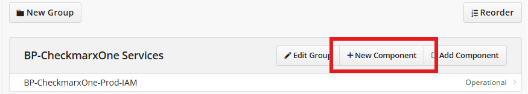
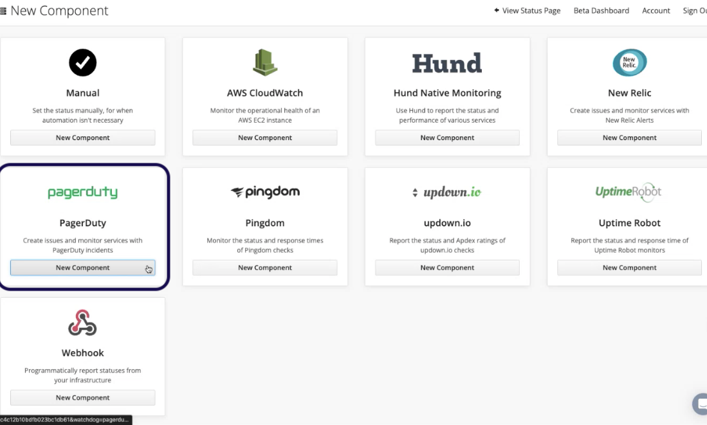
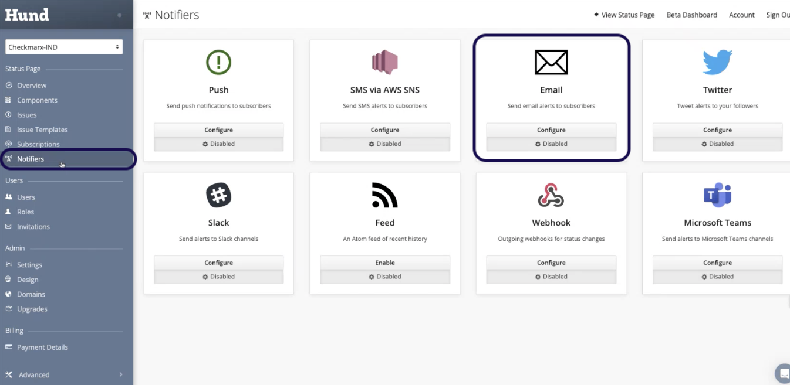
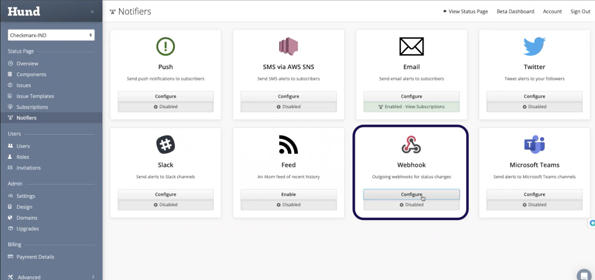
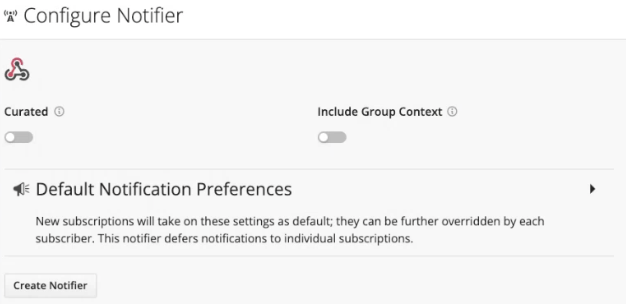
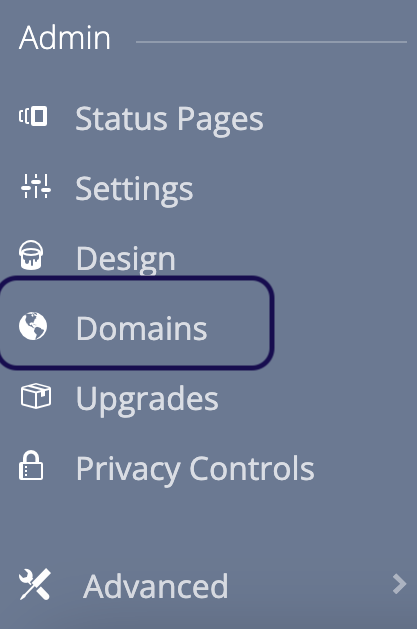

# Creating a New Status Page in Hund.io

To create a new status page in Hund.io, proceed as follows:

1. Click [here](https://cxone-dashboard.hund.io/dashboard/index) to open Hund.
2. In the Global Dashboard drop-down list, select **New Status Page**.
3. Enter a Status Page Name, Status Page Address, and Subdomain.
4. Under **Components**, add a new Group.
5. Add new components into the new group

   <figure><figcaption></figcaption></figure>
6. Choose the **PagerDuty** option.

   <figure><figcaption></figcaption></figure>
7. Enter the PagerDuty API key and click on **Connect PagerDuty Account**.
8. Enter the component name and description according to the client’s license on the BO. You can copy the required information from the MT status page (Services > `emptyservice_statuspage`”.
9. Click **Create component** and create as many components as needed.
10. Navigate to **Notifiers** and select **Email**.

    <figure><figcaption></figcaption></figure>
11. Enter the following parameters: : [email-smtp.us-east-1.amazonaws.com](http://email-smtp.us-east-1.amazonaws.com)

    - SMTP hostname
    - SMTP User
    - SMTP Password
    - SMTP Authentication Method
    - Sender address
12. Click **Create Notifier** and select Webhook.

    <figure><figcaption></figcaption></figure>
13. Click **Create Notifier**.

    <figure><figcaption></figcaption></figure>
14. The status page is ready, but you still need to create a URL to access it. To do it, connect to the AWS account **CxAST-Production** and create a new record in Route53 > Hosted zones > [ast.checkmarx.net](http://ast.checkmarx.net).
15. Go back to status page and select **Domains**.

    <figure><figcaption></figcaption></figure>
16. Enter the **Subdomain** and **Custom Domain** you just created in AWS Route53.
17. Click **Update Domain**.
