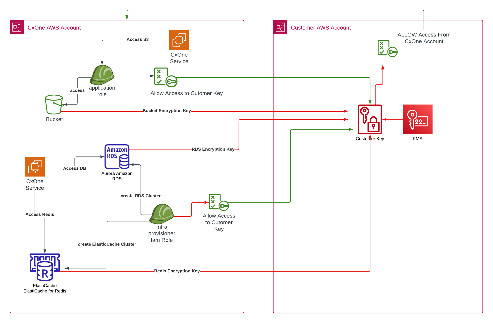

# Set Up a Single-Tenant Environment with Your KMS Key

This guide explains how to set up a single-tenant environment using a customer-managed KMS (**K**ey **M**anagement **S**ervice) key to encrypt S3 buckets, RDS, and Redis clusters.

## Architecture overview

Checkmarx One services interact with your customer AWS environment as follows:

- **Checkmarx One Service** accesses encrypted resources (S3 bucket, RDS, Redis) using the customer-provided KMS key.
- **Customer KMS Key** controls encryption for S3, RDS, and Redis, shared with Checkmarx One AWS account to enable access.
- **Customer AWS Account** houses the KMS key and ensures proper permissions are granted to the Checkmarx One AWS account.

For details, see the diagram below:



## Prerequisites

Before setting up a single-tenant environment with your KMS key, complete the following steps in your AWS account.

### Create the KMS Key

The KMS key should be created in the same region as the single-tenant environment. Ensure the key has the following properties:

- **Type**: Symmetric
- **Usage**: Encrypt/Decrypt
- **Key Material Origin**: KMS
- **Regionality**: Single-Region Key


Automatic key rotation won't affect ElastiCache access, though manual key rotation isn't supported for encrypted Amazon ElastiCache caches.


### Share the KMS Key

After creating the KMS key, share it with the Checkmarx AWS account ID 754581900792 (verify this with the AST DEVOPS CD ST team).

This allows Checkmarx One services to access the encrypted resources, such as S3, RDS, and Redis, as shown in the diagram above.

#### AWS KMS Key Policy Example

Here is an example policy granting access to both the Checkmarx One and your AWS accounts:

```
{
    "Id": "key-consolepolicy-3",
    "Version": "2012-10-17",
    "Statement": [
        {
            "Sid": "Enable IAM User Permissions",
            "Effect": "Allow",
            "Principal": {
                "AWS": "arn:aws:iam::222222222222:root"
            },
            "Action": "kms:*",
            "Resource": "*"
        },
        {
            "Sid": "Allow access for Key Administrators",
            "Effect": "Allow",
            "Principal": {
                "AWS": [
                    "arn:aws:iam::222222222222:user/Administrator"
                ]
            },
            "Action": [
                "kms:Create*",
                "kms:Describe*",
                "kms:Enable*",
                "kms:List*",
                "kms:Put*",
                "kms:Update*",
                "kms:Revoke*",
                "kms:Disable*",
                "kms:Get*",
                "kms:Delete*",
                "kms:TagResource",
                "kms:UntagResource",
                "kms:ScheduleKeyDeletion",
                "kms:CancelKeyDeletion"
            ],
            "Resource": "*"
        },
        {
            "Sid": "Allow use of the key",
            "Effect": "Allow",
            "Principal": {
                "AWS": [
                    "arn:aws:iam::222222222222:user/Administrator",
                    "arn:aws:iam::754581900792:root"
                ]
            },
            "Action": [
                "kms:Encrypt",
                "kms:Decrypt",
                "kms:ReEncrypt*",
                "kms:GenerateDataKey*",
                "kms:DescribeKey"
            ],
            "Resource": "*"
        },
        {
            "Sid": "Allow attachment of persistent resources",
            "Effect": "Allow",
            "Principal": {
                "AWS": [
                    "arn:aws:iam::222222222222:user/Administrator",
                    "arn:aws:iam::754581900792:root"
                ]
            },
            "Action": [
                "kms:CreateGrant",
                "kms:ListGrants",
                "kms:RevokeGrant"
            ],
            "Resource": "*",
            "Condition": {
                "Bool": {
                    "kms:GrantIsForAWSResource": "true"
                }
            }
        }
    ]
}[ -t | --timeout int]
```

### Share the AWS KMS Key ARN

After completing the setup, share the AWS KMS Key ARN with your Checkmarx representative. An example of the ARN format:

`arn:aws:kms:eu-west-1:222222222222:key/ad1514bc-d7bb-4b51-b979-71ffb43841c7`

Only after receiving this ARN can the infrastructure setup begin.

## Key Management Scenarios

- **Stopped Sharing Key**: If you stop sharing the KMS key with Checkmarx One, scans will fail as the platform won't be able to write to encrypted S3 buckets. To restore operation, re-share the key with Checkmarx One.
- **Key Disabled**: Disabling the KMS key will cause a 503 Service Unavailable error within 1–2 hours, making the platform and scans unavailable. Amazon RDS instances will enter the *inaccessible-encryption-credentials-recoverable* state, where they will remain for 7 days. If the database isn’t restored within this time, it will enter a permanent *inaccessible-encryption-credentials* state where it can no longer be recovered, even if the KMS key is not deleted.
- **Key Deleted**: Deleting the KMS key will render RDS instances permanently unusable after 7 days if not recovered.
