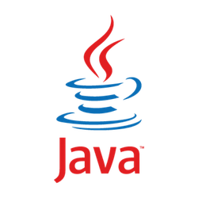
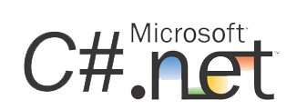
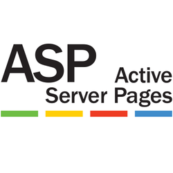
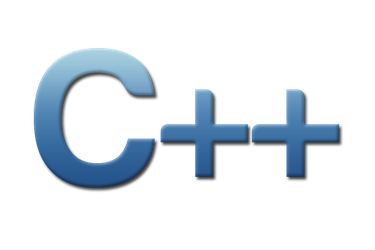
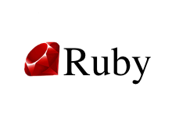
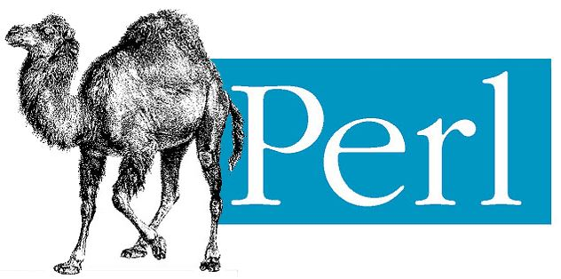
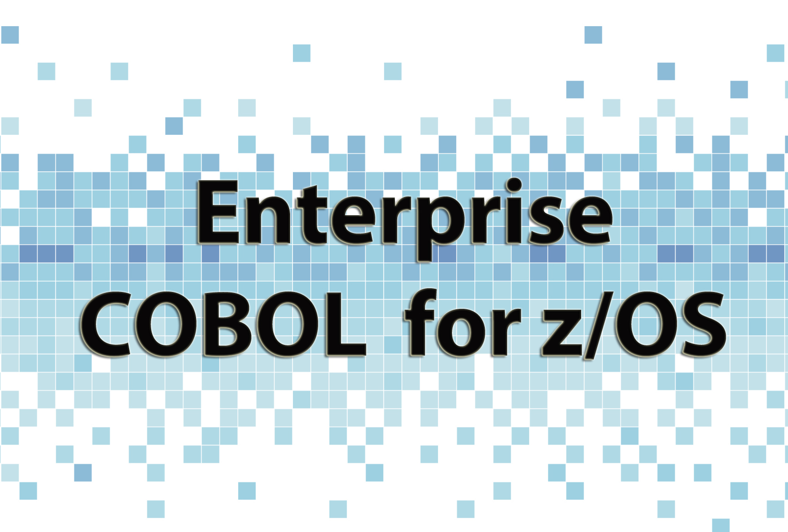

# SAST Scanner - Supported Languages and Frameworks

The Checkmarx SAST scanner currently supports the following languages and frameworks:


Checkmarx One currently uses the Engine Pack Version 9.7.7 version of SAST.


| **Environment and Primary Languages** | **Secondary Languages** | **Framework** | **File extensions** | **Additional Information** |
|---|---|---|---|---|
|  • Java • J2SE • J2EE | • JSP • JavaScript • VBScript • PL\\SQL • HTML5 | • ATG DSP Taglib • GWT • Hibernate • Google Guice • Java Server Faces (JSF) • JSP • JSTL FMT Taglib • OWASP ESAPI • MyBatis • PrimeFaces • Spring Boot • Spring MVC • Spring • Struts • Velocity | • .java • .jsp • .jspf • .jsf • .tag • .tld • .mf • .xhtml • .vm • .gradle • .properties • .jspdsbld • .wod • .xml • .yml • .yaml | Java can be configured as a unified language with Scala. |
|  The SAST engine supports JSP files. However, JSP custom tag libraries (taglibs) are not currently supported.  | | | | |
|  • C# • [VB.NET](http://VB.NET) | • ASP.NET • JavaScript • VBScript • PL\\SQL • HTML5 | • ASP.NET Core • ASP.Net Core Razor • ASP.Net MVC framework • Enterprise Libraries • ComponentArt • Entity framework • Hibernate.Net • Infragistics • iBatis • Telerik • Dapper • .Net Core • .Net Framework • .NET | • .cs • .cshtml • .xaml • .vb • .config • .aspx • .ascx • .asax • .tag • .master • .xml | |
|  • ASP | • JavaScript \[\*\*\] • VBScript • PL\\SQL • HTML5 | • ASP.Net MVC framework | • .asp • .inc | |
|  • VB6 | | | • .bas • .vbp • .frm • .cls • .dsr • .ctl | |
|  • C • C++ | | • C MISRA • C++ MISRA • Informix ESQL/C • MySQL • Boost library • stdlib library | • .cpp • .c • .cc • .c++ • .cxx • .hpp • .hh • .h++ • .hxx • .h • .ec • .cmake • .pc • .pro • .ac • .am • .txt (related to CmakeLists) • .ph | |
|  • PHP | JavaScript | • bWapp • CakePHP • OWASP ESAPI • Kohana • Symfony • Smarty • Zend | • .php • .php3 • .php4 • .php5 • .phtm • .phtml • .tpl • .ctp • .twig • .inc • .cgi • .env • .ini | |
|  • Apex | | • VisualForce • Lightning (Aura) • Lightning Web Components | • .apex • .apexp • .apxc • .page • .component • .cls • .trigger • .tgr • .object • .report • .workflow • -meta.xml • .xml | This is for Salesforce APEX only. |
|  • Ruby | | • Ruby on Rails | • .rb • .rhtml • .rxml • .rjs • .erb • .cgi • .lock | |
|  • JavaScript • Typescript | | • Ajax • Angular • AngularJS • Backbone • Cordova / PhoneGap • Handlebars • Hapi.JS • JQuery • Knockout • Kony Visualizer • Node.js - Buffer - CryptoJS - ExpressJS - File System - Hapi - Mongodb - OracleDB - Sequelize • Pug (Jade) • React Native • ReactJS • SAPUI5 • VueJS • XS (SAP) • RequireJS | • .js • .jsx • .htm • .html • .json • .ts • .tsx • .aspx • .ascx • .xsjs • .xsjslib • .xsaccess • .xsapp • .app • .evt • .cmp • .hbs • .handlebars • .jade • .pug • .vue • .xml • .apexp • .page • .component • .cshtml • .jsf • .xhtml • .jsp • .jspf • .asp • .master • .php | |
|  • VBScript | | | • .vbs • .aspx • .ascx • .asp • .cshtml • .html • .htm • .master | |
|  • Perl | | | • .pl • .pm • .plx • .psgi • .cgi | |
|  • Android (Java) | | • Volley | • .java • .kt | |
|  • Objective-C • Swift | | | • .m • .h • .swift • .xib • .plist | |
|  • HTML 5 | | | • .html • .htm | |
|  • PL/SQL | | | • .pls • .sql • .pkh • .pks • .pkb • .pck | |
| SQL | | | • .sql • .tsql | |
|  • Python | • JavaScript • VB script • PL\\SQL | • Django • Flask • Jinja and DTL • Pandas library • Marshmallow | • .py • .gtl • .csv • .latex • .tex • .html • .xml • .txt | |
|  • Groovy | • JavaScript • VB script • PL\\SQL | | • .groovy • .gsh • .gvy • .gy • .gsp • .gradle | |
|  • Scala | | • Akka • Finagle • Finatra | • .scala • .conf | Scala can be configured as a unified language with Java. |
|  • GO Language | | • Protobuf • gin-gonic/gin • gorilla-mux | • .go • .mod | |
|  • Kotlin | | • Ktor (Server Side) • Vert.x (Server Side) • Spring | • .kt • .kts • .mustache • .ftl • .xml | |
|  • Cobol | | | • .cbl • .cob • .eco • .pco • .sqb • .cpy | |
|  • RPG | | | • .rpg • .rpg38 • .sqlrpg • .rpgle • .sqlrpgle • .dspf | |
|  • Dart | | • Flutter | • .dart • .yaml | |
|  • Lua | | • OpenResty | • .lua • .conf | |
|  • Rust | | | • .rs • .toml | |
