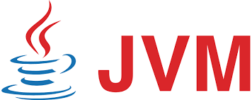
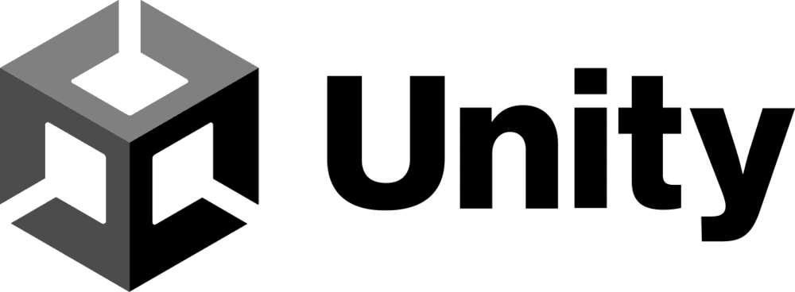

# SCA Scanner - Supported Languages and Package Managers

All languages and package managers that are supported for the SCA standalone platform are also supported when running the SCA scanner in Checkmarx One.


To understand how supported languages and package managers effect the scan process, see [SCA Scanner](../../scanners/sca-scanner/README.md).



If you are using Checkmarx SCA Resolver, then you need to install the relevant package managers locally. For installation info, see Installing Supported Package Managers for Resolver.


### Supported Languages and Package Managers

Java

| | | | |
|---|---|---|---|
|  | **JVM Languages:** Java, Kotlin, Android, Groovy, Scala **Additional Frameworks:** Struts, Spring **Repository:** Maven Central, Sonatype, Apache **File Types:** .jar **Supported Languages for Exploitable Path:** Java | | |
| **Package Managers** | **Vulnerability Support** | **Malicious Package Support** | **Manifest Files** |
| Maven |  |  | `pom.xml` |
| Gradle |  |  | `build.gradle` , `build.gradle.kts` |
| Ivy |  |  | `ivy.xml`, `build.xml` |
| SBT |  |  | `build.sbt` |

JavaScript/TypeScript

| | | | |
|---|---|---|---|
|  | **Languages/Frameworks:** JavaScript, TypeScript, NodeJS, React, Angular, Apex  Apex is only supported when running the scan using Checkmarx SCA Resolver with the `--extract-archives resource` argument, see Checkmarx SCA Resolver Configuration Arguments.  **Repository:** NPM **File Types:** .js **Supported Languages for Exploitable Path:** JavaScript | | |
| **Package Manager** | **Vulnerability Support** | **Malicious Package Support** | **Manifest Files** (Packages marked with  are required) |
| NPM |  |  | `package.json` , `package-lock.json`1\] |
| Yarn (and Yarn 2) |  |  | `package.json` , `yarn.lock`1\] |
| Bower |  |  | `bower.json` |
| Pnpm |  |  | `pnpm-lock.yaml` |

1\] When a `lock` file is present in the project, SCA may use it to resolve dependencies. Therefore, it is important to keep the lock file up-to-date with any changes that you make in the manifest file.

.NET

| | | | |
|---|---|---|---|
|  | **Languages/Frameworks:** C#, F#, .NET, .NET Core, WCF, WPF, ASP.NET **Repository:** NuGet **File Types:** .dll **Supported Languages for Exploitable Path:** C# | | |
| **Package Manager** | **Vulnerability Support** | **Malicious Package Support** | **Manifest Files** |
| NuGet |  |  | `*.csproj` , `packages.config`, `project.assets.json`, `packages.lock.json` |

Python

| | | | |
|---|---|---|---|
|  | **Languages/Frameworks:** Python, Django, Flask **Repository:** PyPi **File Types:** .egg, .whl **Supported Languages for Exploitable Path:** Python | | |
| **Package Manager** | **Vulnerability Support** | **Malicious Package Support** | **Manifest Files** (Packages marked with  are required) |
| PIP |  |  | `requirements.txt`, `requirements-*.txt`, `requirement.txt`, `requirement-*.txt` |
| Poetry |  |  | `pyproject.toml`, `poetry.lock` |
| Setuptools 1\] |  |  | `Setup.cfg`, `Setup.py` |
| UV |  |  | `uv.lock`, `requirements.txt`, `pyproject.toml` |

1\] Setuptools is supported only when running scans using SCA Resolver.

PHP

| | | | |
|---|---|---|---|
|  | **Languages/Frameworks:** PHP, Drupal **Repository:** Packagist **File Types:** none **Exploitable Path:** Not supported | | |
| **Package Manager** | **Vulnerability Support** | **Malicious Package Support** | **Manifest Files** (Packages marked with  are required) |
| Composer |  |  | `composer.json` , `composer.lock` |

iOS

| | | | |
|---|---|---|---|
|  | **Languages/Frameworks:** Swift, Objective c **Repository:** GitHub **File Types:** none **Exploitable Path:** Not supported | | |
| **Package Manager** | **Vulnerability Support** | **Malicious Package Support** | **Manifest Files** (Packages marked with  are required) |
| SwiftPm |  |  | `Package.swift`, `Package.resolved` |
| CocoaPods |  |  | `Podfile`, `Podfile.lock` |
| Carthage |  |  | `Cartfile`, `Cartfile.private`, `Cartfile.resolved`  At least one `.private` or `.resolved` file must be included.  |

Go

| | | | |
|---|---|---|---|
|  | **Languages/Frameworks:** Go **Repository:** Golang **File Types:** none **Exploitable Path:** Not supported | | |
| **Supported Package Manager** | **Vulnerability Support** | **Malicious Package Support** | **Manifest Files** (Packages marked with  are required) |
| GoModules |  |  | `go.mod`, `go.sum` |

Ruby

| | | | |
|---|---|---|---|
|  | **Languages/Frameworks:** Ruby **Repository:** RubyGems **File Types:** none **Exploitable Path:** Not supported | | |
| **Supported Package Manager** | **Vulnerability Support** | **Malicious Package Support** | **Manifest Files** (Packages marked with  are required) |
| RubyGems |  |  | `Gemfile`, `Gemfile.lock` |
| Bundler |  |  | |

C++

| | | | |
|---|---|---|---|
|  | **Languages/Frameworks:** C, C++ **Repository:** Conan **File Types:** .cpp, .c, .h, .hpp, .a, .o, .so **Exploitable Path:** Not supported  C++ is supported only for File Analysis (fingerprints), not for package resolution.  | | |
| **Supported Package Manager** | **Vulnerability Support** | **Malicious Package Support** | **Manifest Files** |
| none |  |  | none |

Unity

| | | | |
|---|---|---|---|
|  | **Languages/Frameworks:** Unity **Repository:**[Unity Technologies](https://github.com/orgs/Unity-Technologies/repositories), [Needle-mirror](https://github.com/orgs/needle-mirror/repositories), [Open UPM](https://openupm.com/packages/) **File Types:** none **Exploitable Path:** Not supported | | |
| **Supported Package Manager** | **Vulnerability Support** | **Malicious Package Support** | **Manifest Files** (Packages marked with  are required) |
| none |  |  | `manifest.json`, `packages.json` |

Perl

| | | | |
|---|---|---|---|
|  | **Languages/Frameworks:** Perl **Repository:** [Cpan](https://www.cpan.org/) **File Types:** .pl, .pm **Exploitable Path:** Not supported | | |
| **Supported Package Manager** | **Vulnerability Support** | **Malicious Package Support** | **Manifest Files** |
| Cpan |  |  | `cpanfile`, `spcanfile.snapshot` |

Dart

| | | | |
|---|---|---|---|
|  | **Languages/Frameworks:** Dart, Flutter **Repository:** N/A **File Types:** none **Exploitable Path:** Not supported | | |
| **Supported Package Manager** | **Vulnerability Support** | **Malicious Package Support** | **Manifest Files** |
| Pub | 1\] |  | `pubspec.lock` |

1\] Support of Pub is only for identifying malicious packages. Non-malicious packages are not shown at all in the Packages or Risks tabs.

