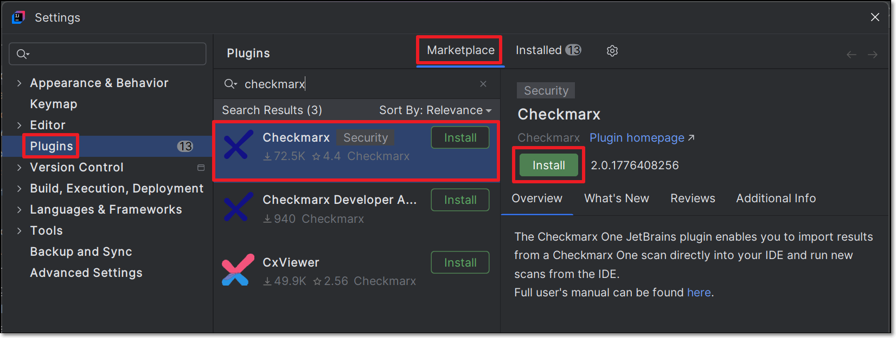
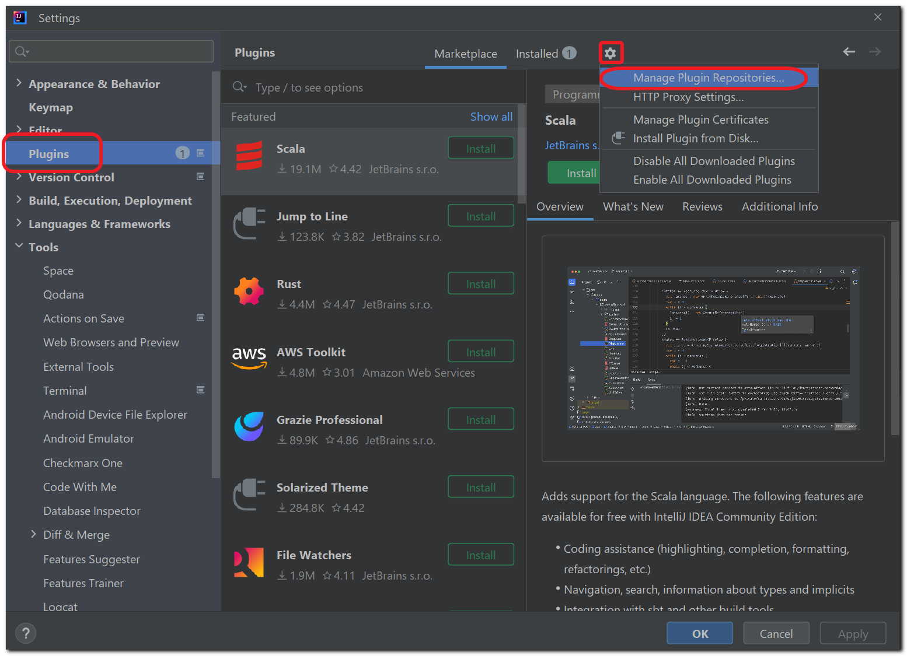
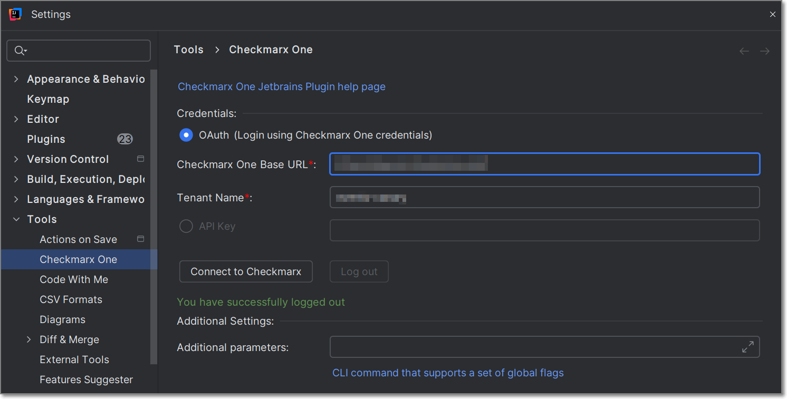
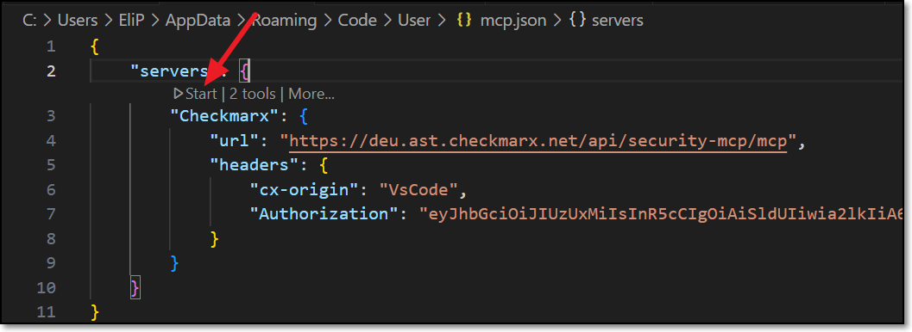

# Installing and Setting up the Checkmarx JetBrains Plugin

## Installing the Plugin

The Checkmarx JetBrains Plugin is available on the JetBrains marketplace, and can be installed directly from your JetBrains IDE console.



**To install the plugin from the marketplace:**

1. Open your JetBrains IDE console (e.g., IntelliJ IDEA).
2. Go to **Settings** > **Plugins** and click on the **Marketplace** tab.
3. Search for the **Checkmarx** plugin, then click **Install** for that plugin.

   <figure><figcaption></figcaption></figure>
4. Follow the prompts to run the installation.

   The plugin is installed.

### Automatic Updates - Release Versions and Pre-Release Versions

Once you have installed the Checkmarx plugin, it is automatically updated to the latest version whenever we create a new release.

Whenever new code is merged in between full releases, we create nightly pre-release versions. You can choose to install a pre-release version. Once you have installed a pre-release version, you will continue to get automatic updates whenever a new pre-release (or release) is created.


Pre-release versions haven't been tested and approved for distribution. Therefore, there is some degree of risk involved in using pre-release versions.


**To start getting pre-release versions:**

1. Select **Plugins** in the left-hand navigation,and click on the icon in the header bar.
2. Select **Manage Plugin Repositories**.

   
3. In the **Custom Plugin Repositories** dialog click "**+**" and enter `https://plugins.jetbrains.com/plugins/nightly/17672/`, then click **OK**.
4. Search for the **Checkmarx** plugin.

   The latest pre-release version is shown.
5. Click **Update** and then click **OK**.

   
   You can revert at any time to only getting release versions by opening the **Custom Plugin Repositories** dialog and deleting the **nightly** channel.
   

## Setting up the Plugin

After installing the plugin, in order to use the Checkmarx One tool you need to configure access to your Checkmarx One account, as described below.


If you would like to use a proxy server, you can set up a proxy variable in one of two ways. See [below](#setting-up-a-proxy-variable-optional).


1. In the JetBrains console, click on the icon at the bottom left of the screen, then navigate to **Tools** > **Checkmarx One**.

   The Checkmarx One Settings window is shown.

   <figure><figcaption></figcaption></figure>
2. In the Credentials section, connect to Checkmarx One either using an API Key or your login credentials.

   
   In order to use this integration for running an end-to-end flow of scanning a project and viewing results with the minimum required permissions, the API Key or user account should have the Checkmarx One `plugin-scanner` role and the IAM `default-roles<tenant>` role.

   The permissions included in `plugin-scanner` are shown here. If you would like to create a custom role with more granular permissions, you should refer to this list of permissions in order to determine which permissions you will need to assign.
   

   - Login Credentials

     1. Select the **OAuth** radio button.
     2. Enter the Base URL of your Checkmarx One environment and the name of your tenant account, then click **Connect to Checkmarx**.

        
        Once you have submitted a base URL and tenant name, it is saved in cache and can be selected for future use (saves up to 10 accounts).
        
     3. If you are logged in to your account, the system connects automatically. If you are not logged in, your account's login page opens in your browser. Enter your Username and Password and then your One-Time Password (2FA) to log in.
   - API Key (see Generating an API Key)

     1. Select the **API key** checkbox.
     2. In the API key textbox, enter your Checkmarx One **API Key**, and then click on **Connect to Checkmarx**.
3. A Checkmarx welcome page is displayed immediately after a successful login. This page provides a selection box to enable Checkmarx One Assist. If you would like to enable this feature, mark the selection box. Either way, close the window and proceed to the next step.
4. In the Settings tab, you can submit additional CLI params in the **Additional parameters** box. This can be used to manually submit the base url and tenant name if there is a problem extracting them from the API Key. It can also be used to add global params such as `--debug` or `--proxy`. To learn more about CLI global params, see [Global Flags](../../cli-tool/checkmarx-one-cli-commands/global-flags.md).
5. Click on **Connect to Checkmarx**, to test that the connection works.

   
   If the connection fails, you can view detailed error logs by entering `--debug` in the **Additional parameters** section and retrying the connection.
   
6. Click **OK** at the bottom of the screen.

### Configuring Checkmarx Developer Assist

1. Navigate to JetBrains settings, drill down to **tools** > **Checkmarx One** > **Checkmarx One Assist**. Alternatively: If a project is open, click on the Checkmarx icon in the left-hand navigation bar and click on the settings icon. In the window that opens, click on **Go to Checkmarx One Assist** toward the bottom of the window.

   The **Checkmarx One Assist** settings window is displayed.
2. Make sure that the desired Checkmarx One Assist checkboxes are selected.

   If MCP is activated on the tenant level, then these should be selected by default. You can deselect any scanners that you don't want to run.
3. For the IaC Realtime scanner, select the **Containers Management Tool** used in your environment. Options are **docker** or **podman**.

   - For **Windows**: Verify that the Container Management Tool selected is installed on your system.
   - For **macOS** and **Linux**: Verify that docker or podman is installed in `/usr/local/bin`.

     If docker or podman are installed in a different location, you must create a symbolic link using the following procedure:

     **For docker:**

     1. Check the installation path by running the following command (in terminal, *not* in InteliJ): `which docker`.
     2. Create a symbolic link: run the following command: `sudo ln -s <PASTE_THE_PATH_HERE> /usr/local/bin/docker`, replacing the placeholder with the full link returned in the previous step. *For example:* If `which docker` returned `/opt/homebrew/bin/docker`, run `sudo ln -s /opt/homebrew/bin/docker /usr/local/bin/docker`.
     3. Pull the required kics images using the following command: `docker pull checkmarx/kics:v2.1.29`.

        
        The change will not register until you close and restart the IDE.
        

     **For podman:**

     1. Check the installation path by running the following command(in terminal, *not* in IntelliJ): `which podman`.
     2. Create a symbolic link: run the following command: `sudo ln -s <PASTE_THE_PATH_HERE> /usr/local/bin/podman`, replacing the placeholder with the full link returned in the previous step. *For example:* If `which podman` returned `/opt/homebrew/bin/podman`, run `sudo ln -s /opt/homebrew/bin/podman /usr/local/bin/podman`.
     3. Pull the required kics images using the following command: `podman pull checkmarx/kics:v2.1.29`.

        
        The change will not register until you close and restart the IDE.
        
4. Click on **Install MCP**.

   The Checkmarx MCP is added to your mcp.json file.

   
   In some cases the MCP is installed automatically when you authenticate with Checkmarx. However, best practice is to click on **Install MCP** so that the MCP file opens and you can ensure that it starts running, as shown in the following step.
   
5. If the process doesn't start automatically, you may need to open the file and click **Start**.

   <figure><figcaption></figcaption></figure>

   
   If there is a problem with the automatic installation, check Developer Assist for Checkmarx One.
   
6. Click **OK** at the bottom of the window.

### Setting up a Proxy Variable (Optional)

There are two ways to set up a proxy variable in JetBrains: using additional parameters in JetBrains or using your system’s environment variables.

#### Setting up a Proxy Variable using your OS System Environment Variables

1. In your operating system (e.g., Windows, iOS, Linux, etc.), set up a system environment variable with the following configuration:

   - In the **Name** field, enter **HTTP_PROXY**.
   - In the **Value** field, enter the value of your proxy address using the following format:`http://<proxy_ip>:<port_number>` If authentication is required, then the format should be: `http://<username>:<password>@<proxy_ip>:<port_number>`.

     
     Make sure to include the `http://` prefix.

     It is not recommended to pass the username and password in clear text.
     

#### Setting up a Proxy using Additional Parameters

1. In the main navigation, click **Customize** > **All settings**.

   The **Settings** window is shown.
2. In the **Settings** window, click **Tools** > **Checkmarx One** (or search for Checkmarx One in the search box).

   The Checkmarx JetBrains plugin configuration settings are shown.
3. In the **Additional parameters** section, configure your proxy using the following format `http://<proxy_ip>:<port_number>`. If authentication is required, then the format should be `http://<username>:<password>@<proxy_ip>:<port_number>`.

   
   Make sure to include the `http://` prefix.

   It is not recommended to pass the username and password in clear text.
   
4. Click **OK** at the bottom of the screen.
