# Using the Checkmarx JetBrains Plugin

Once you have run a Checkmarx One scan on the source code of your JetBrains project, you can import the scan results into your JetBrains IDE. The results are integrated within the IDE in a manner that makes it easy to identify the vulnerable code, triage the results and take the required remediation actions.

First you need to import the results from the latest scan of your JetBrains project. Then you can view the results in your JetBrains IDE.


Alternatively, you can run a new scan on an existing Checkmarx One project from your IDE and load the results.


## Importing your Checkmarx One Scan Results

**To import results from a scan:**

1. In your JetBrains project, click on the **Checkmarx** icon in the left-hand navigation to open the Checkmarx panel.

   <figure>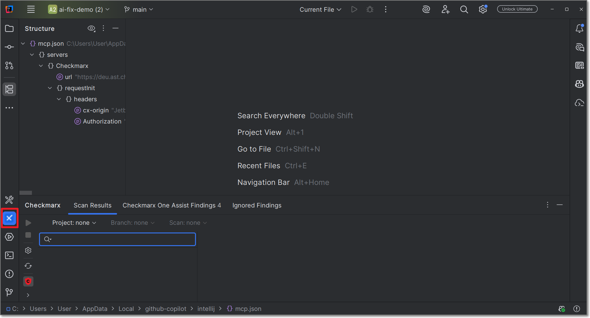<figcaption></figcaption></figure>

   The Checkmarx panel opens on the bottom of the screen.

   The plugin will try to automatically show results for the relevant scan by matching your project and VCS branch to an existing Checkmarx One scan.
2. If the desired scan is not displayed, you can select the scan manually by entering the Scan ID of the desired scan in the **Scan** field.

   Use one of the following methods to submit the relevant Scan ID.

Determine the Scan ID by specifying the Project and branch

1. In the **Checkmarx** panel, click on the **Project** dropdown.

   <figure>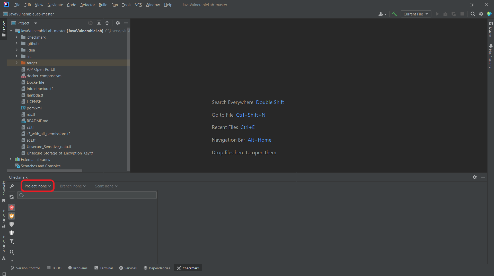<figcaption></figcaption></figure>

   A dropdown list of your Checkmarx One Projects is shown.
2. Select the Checkmarx One Project that corresponds to the JetBrains project that you are working on.

   
   You can filter the list by typing the name of the desired Project.
   

   <figure>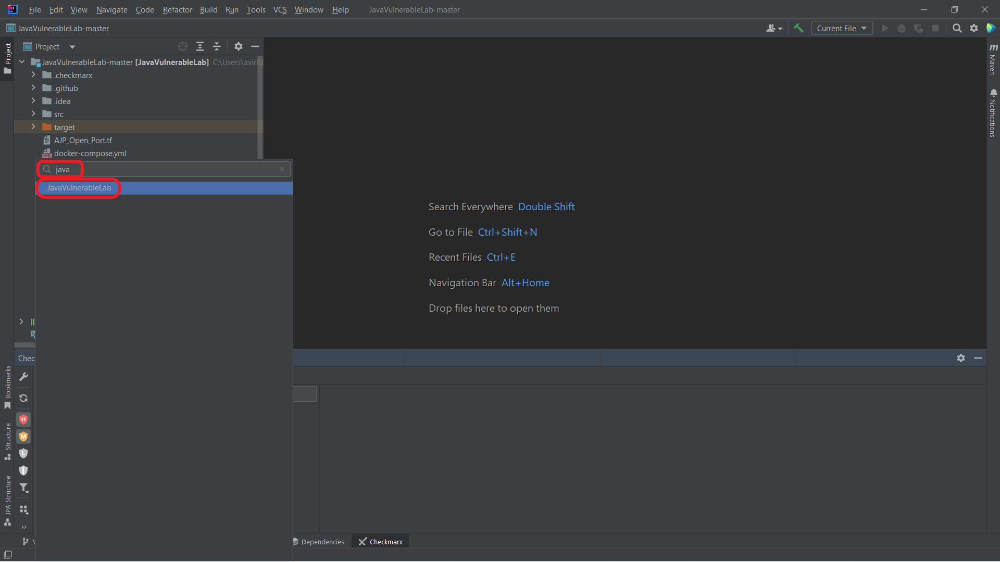<figcaption></figcaption></figure>

   The **Branch** field automatically refreshes, and retrieves available branches for this Project.
3. Click on the **Branch** dropdown.

   A dropdown list of the branches for the selected Project is shown.
4. Select the desired branch.

   
   You can filter the list by typing the name of the desired branch.
   

   The **Scan** field automatically refreshes, and retrieves available scans of this branch of the Project.
5. Click on the **Scan** dropdown.

   All of the scans for this branch are shown, with the most recent on top.
6. Select the desired scan.

   The scan results are imported into JetBrains and the selected scan ID is shown below the search box in the Checkmarx panel.

   
   Only scans that completed successfully are shown in the IDE. Scans with only partial results aren't shown.
   

Get the Scan ID from the Checkmarx One web application

1. Log in to the Checkmarx One web application.
2. Navigate to the desired Project page.
3. On the **Scan History** tab, copy the Scan ID of the desired scan.

   <figure>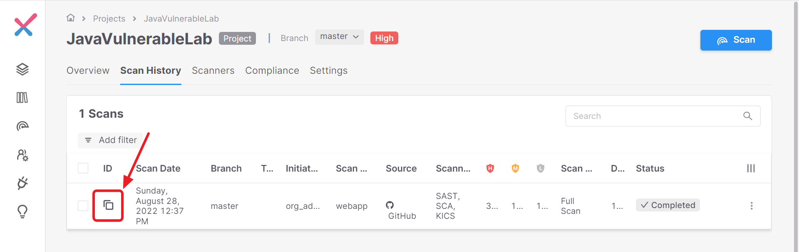<figcaption></figcaption></figure>
4. In the JetBrains console > Checkmarx tab, in the search box, paste the Scan ID and press **Enter**.

   <figure>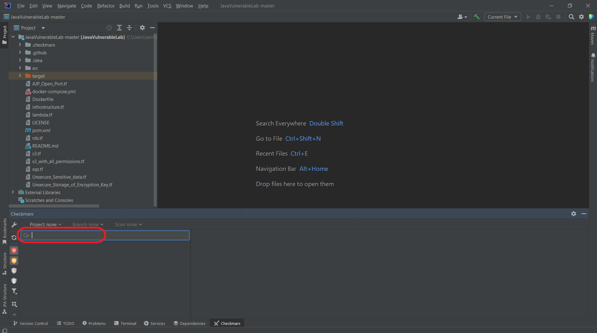<figcaption></figcaption></figure>

   The scan results are imported into JetBrains and the selected scan ID is shown below the search box in the Checkmarx panel.

## Running Scans from JetBrains

You can run a new Checkmarx One scan on the project that is open in your JetBrains workspace.

You must first create a Checkmarx project via the web portal (UI), API, CLI etc. Then, you are able to run scans on that project from the JetBrains console. You can choose either to rescan the same branch of the Checkmarx One project, or to create a new branch in Checkmarx One for the scan of the local branch in your workspace.

The IDE initiated scan applies the scan configuration that was used for the previous scan of this project branch. For example, if the last time you scanned this branch of the project you excluded certain files, those files will be excluded also from the current scan.


When a scan is initiated via the IDE, the SAST scanner runs an "Incremental" scan. Learn more about incremental scans here.



This feature needs to be enabled for your organization's account by a Checkmarx admin user under **Settings** > **Global Settings** > **Plugins** in the Checkmarx One web portal. Before enabling this feature, you should consider the ramifications; since there is a limitation to the number of concurrent scans that you can run based on your license, enabling IDE scans may cause scans triggered by CI/CD pipelines and SCM integrations to be added to the scan queue (run on a "first in first out" basis), causing major delays for those scans.




**To rescan an existing branch:**

1. In the Checkmarx panel in your IDE, open the existing Checkmarx project under which your current workspace has already been scanned.
2. Click on the "Run scan" button that is shown next to the project name.

   <figure>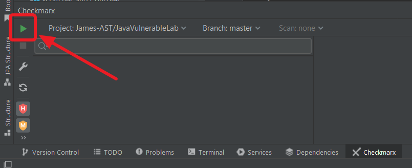<figcaption></figcaption></figure>

   
   Checkmarx runs a sanity check to verify that your current workspace matches the files that were previously scanned under this Checkmarx project. If a mismatch is detected, a warning is shown. You are given the option to run the scan despite the mismatch.
   
3. When the scan is completed, a dialog appears, asking if you would like to load the results from the new scan. Click **Load scan results** to show the new scan results in the Checkmarx panel.

**To run a scan, creating a new Checkmarx One branch:**

1. In the Checkmarx panel in your IDE, select the existing Checkmarx project under which your current workspace has already been scanned.
2. Click on the **Branch** field, and select **scan my local branch**.

   <figure>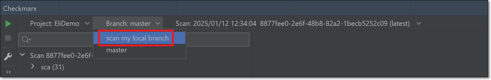<figcaption></figcaption></figure>
3. Click on the "Run scan" button that is shown next to the project name.

   <figure>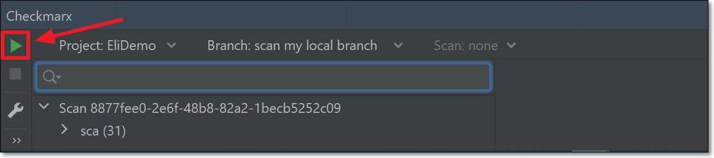<figcaption></figcaption></figure>

   
   Checkmarx runs a sanity check to verify that your current workspace matches the files that were previously scanned under this Checkmarx project. If a mismatch is detected, a warning is shown. You are given the option to run the scan despite the mismatch.
   
4. When the scan is completed, a dialog appears, asking if you would like to load the results from the new scan. Click **Load scan results** to show the new scan results in the Checkmarx panel.

## Viewing Checkmarx One Scan Results

There are two methods for viewing Checkmarx One scan results in JetBrains:

- [Checkmarx Panel](#viewing-checkmarx-one-scan-results-in-the-checkmarx-panel)
- [JetBrains Code Analyzer](#viewing-checkmarx-one-results-using-the-code-analyzer)

### Viewing Checkmarx One Scan Results in the Checkmarx Panel

You can open the Checkmarx panel below your project and navigate the tree display to view details about a specific vulnerability.


In order to show the source code for a specified attack vector, you need to have the relevant project open in your JetBrains console.


**To view the Checkmarx One results in the Checkmarx panel:**


The following procedure describes viewing a SAST result. Functionality for other scanners is similar, but not all of the tabs are available. Viewing and Remediating SCA results is described in a separate procedure.


1. After you import the scan results, and the results are shown in the Checkmarx panel, click on an arrow or double-click a node to expand that node in the tree.
2. You can use the Checkmarx Toolbar (on the left) to adjust the display, see [below](#checkmarx-toolbar).
3. Click on a SAST vulnerability.

   The details panel is shown on the right. It opens showing the **Description** tab, which includes a summary of the vulnerability info.

   <figure>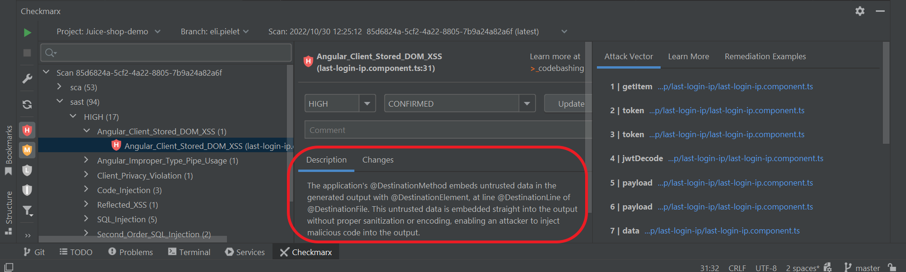<figcaption></figcaption></figure>
4. You can click on the **Changes** tab to view all changes that have been made to the result predicate of the vulnerability (severity, status and notes), see Triaging Results.
5. You can click on the **Learn More** tab to view additional details about the vulnerability, including recommended remediation actions.
6. You can click on the **Remediation Examples** tab to view a sample of code that is subject to this vulnerability, followed by a remediated version of that code.
7. Click on a node in the **Attack Vector** tab.

   An editor opens containing the source code in the respective file and location for the selected node.

   <figure>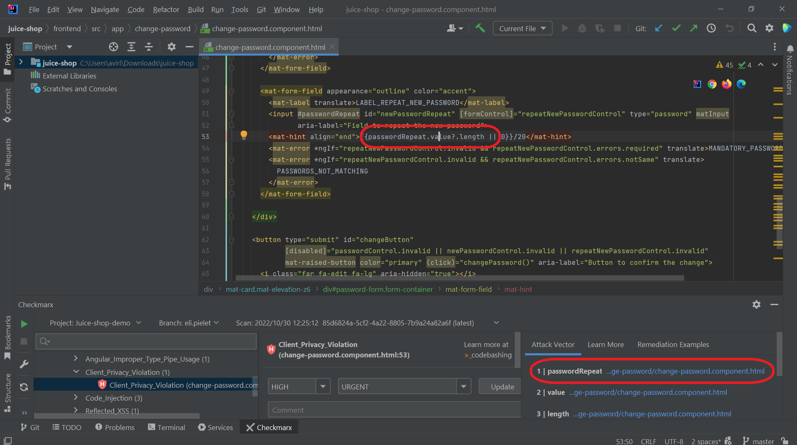<figcaption></figcaption></figure>
8. Hovering over an error or warning in the code shows a tooltip showing info about the vulnerability.

   <figure>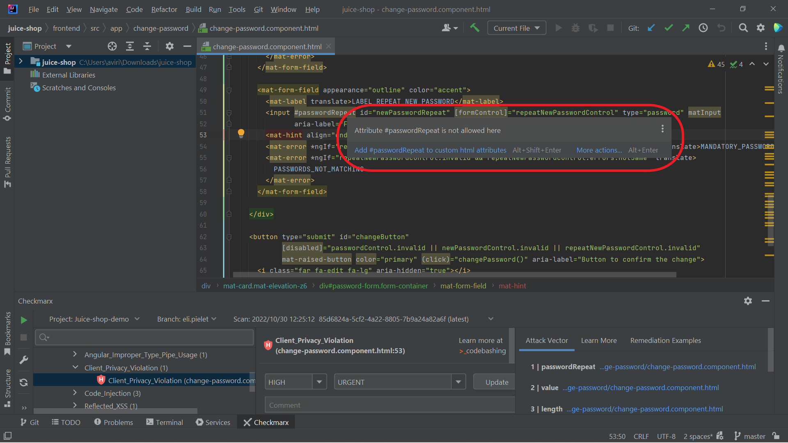<figcaption></figcaption></figure>

#### Viewing and Remediating SCA Results



1. Click on an SCA vulnerability in the results tree.

   Detailed info about the vulnerability is shown in the results window. This includes a description of the vulnerability, info about the package where it was identified and a detailed breakdown of the metrics contributing to the CVSS score.

   <figure>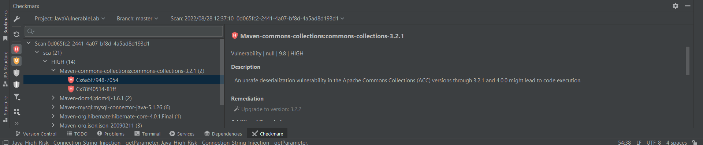<figcaption></figcaption></figure>
2. Checkmarx offers remediation recommendations. When the **Remediation** recommendation is highlighted, this indicates that you can automatically upgrade to the recommended version by clicking on the link.

   
   This feature is currently supported only for direct npm dependencies.
   

#### Checkmarx Toolbar

On the sidebar, on the left side of the Checkmarx panel, a toolbar with the following actions is available:

| **Icon** | **Item** | **Description** |
|---|---|---|
|  | Settings | Opens the Checkmarx JetBrains plugin configuration settings |
| 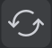 | Refresh | Clear Project, Branch and Scan selection and refresh the Project selection list |
|  | Filter Critical | Show/hide criticle severity vulnerabilities |
|  | Filter High | Show/hide high severity vulnerabilities |
|  | Filter Medium | Show/hide medium severity vulnerabilities |
|  | Filter Low | Show/hide low severity vulnerabilities |
|  | Filter Info | Show/hide info severity vulnerabilities |
|  | Filter by state | Filter results by state (multi-select, by default all are selected except for Not Exploitable and Proposed Not Exploitable) You can also select "SCA Dev & Test Dependencies" to hide vulnerabilities identified by the SCA scanner in "Dev" and "Test" dependencies. Learn more here |
| 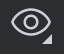 | Group By | Select one or more criteria for grouping the results. Options are: Severity, State, Vulnerability Type, Direct Dependency. |
|  | Expand All | Fully expand the results tree |
| 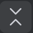 | Collapse All | Fully collapse the results tree |

### Managing (Triaging) Results

Checkmarx One tracks specific vulnerability instances throughout your SDLC. Each vulnerability instance has a ‘Predicate’ associated with it, which is comprised of the following attributes: ‘state’, ‘severity’ and ‘notes’. After reviewing the results of a scan, you have the ability to triage the results and modify these predicates accordingly. For more info about triaging results in Checkmarx One, see Managing (Triaging) Vulnerabilities.

You can triage the results directly in the JetBrains console. This is currently supported for SAST and IaC Security results.


Only users with the Checkmarx One role **update-result** (e.g., a risk-manager) are authorized to make changes to the predicate. Only users with the role **update-result-not-exploitable** (e.g., an admin) are authorized to mark a vulnerability as ‘Not Exploitable’.




**To edit the result predicate:**

1. Navigate to the vulnerability that you would like to edit.
2. To adjust the severity, click on the **Severity** field, and select from the dropdown list the severity that you would like to assign. Options are: High, Medium, Low or Info.

   <figure>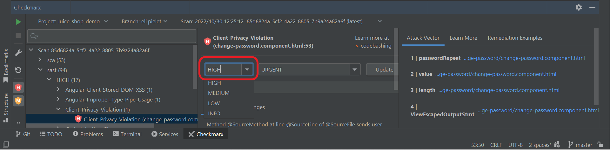<figcaption></figcaption></figure>
3. To adjust the state, click on the **State** field, and select from the dropdown list the state that you would like to assign. Options are: To Verify, Not Exploitable, Proposed Not Exploitable, Confirmed or Urgent.
4. To add a note, enter your note in the field **Note**.
5. In order to apply your changes, click **Update**.

   The new predicate is applied to the vulnerability instance in this scan as well as to recurring instances of the vulnerability in subsequent scans of the Project. The changes made to the predicate are shown in the **Changes** tab.

### Codebashing Links

Codebashing is an interactive AppSec training platform built by developers for developers. Codebashing sharpens the skills that developers need to avoid security issues, fix vulnerabilities, and write secure code in the first place. See Codebashing documentation here.

When you select a SAST vulnerability for which a Codebashing lesson exists, a link to the relevant lesson is shown. Click on the link to open the lesson in a new browser.


In order to access these links, you need to have a Codebashing account that has been linked to your Checkmarx One account. Please contact your Checkmarx support representative for assistance. For users that don't have a linked Codebashing account, a dialog opens with a link to begin a free trial.


<figure>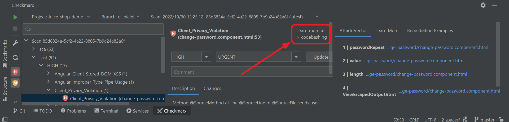<figcaption></figcaption></figure>

### Viewing Checkmarx One Results Using the Code Analyzer

You can leverage the JetBrains code analyzer to display the results, see [https://www.jetbrains.com/help/idea/code-inspection.html](https://www.jetbrains.com/help/idea/code-inspection.html). You can analyze the whole project or set a custom scope. The results of the Checkmarx One scan are shown together with other problems identified by JetBrains in the **Problems** tab.

**To use the Code Analyzer:**

1. After you retrieve the scan results, and the scan ID is shown in the Checkmarx panel, click **Code** > **Analyze Code** > **Run Inspection by Name**.

   <figure>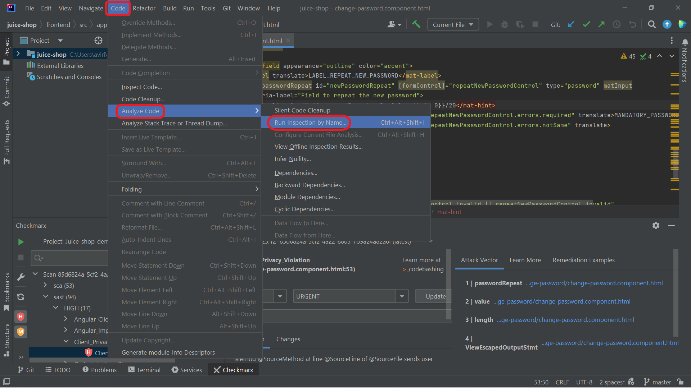<figcaption></figcaption></figure>

   The **Enter inspection name** window is shown.
2. In the search field, type **Checkmarx** to locate **Checkmarx AST**, and press **Enter**.

   <figure>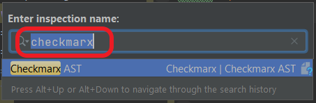<figcaption></figcaption></figure>

   The **Run 'Checkmarx AST'** window is shown.
3. For **Inspections Scope**, leave the **Whole project** radio button selected (default) to inspect the entire project or select **Custom scope** and specify the places that you want to inspect, then click **OK**.

   <figure>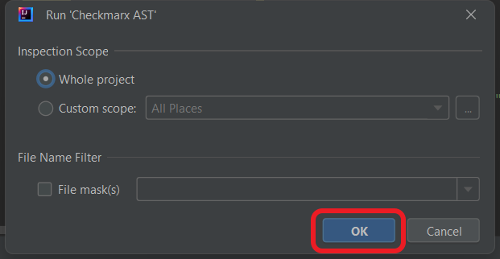<figcaption></figcaption></figure>
4. Click on **Problems** (at the bottom of the screen) to open the Problems tool window.

   <figure>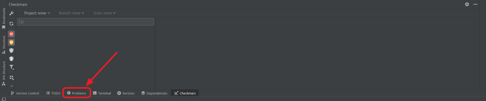<figcaption></figcaption></figure>

   The **Problems** tool window is shown with any problems that were found, including the Checkmarx One vulnerabilities.

   <figure>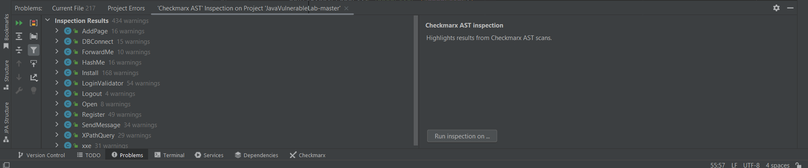<figcaption></figcaption></figure>
