# Installing and Setting up the Checkmarx One Eclipse Plugin

The plugin can be installed from the Eclipse marketplace. There is an alternative method for installing the plugin from a zip archive.



## Installing the Plugin from Marketplace

**To install the plugin from marketplace:**

1. In the **Eclipse** console, click on **Help** > **Eclipse Marketplace…**
2. In the **Find** box, enter “checkmarx one” and click **Go.**

   <figure>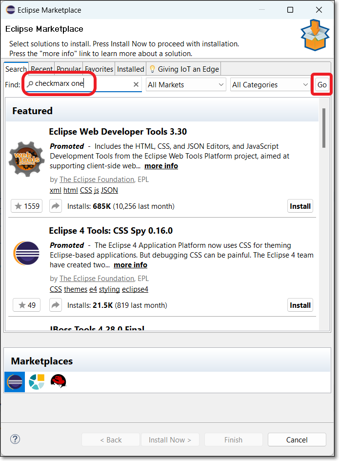<figcaption></figcaption></figure>
3. Click **Install** for the **Checkmarx One Plugin**.

   <figure>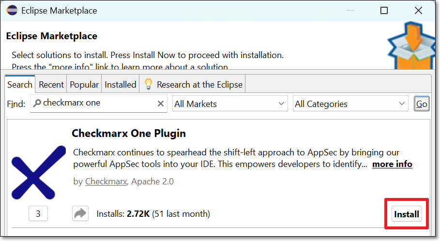<figcaption></figcaption></figure>
4. In the **Review Licenses** window, after reviewing the license information, select the **I accept...** radio button and click **Finish**.

   <figure>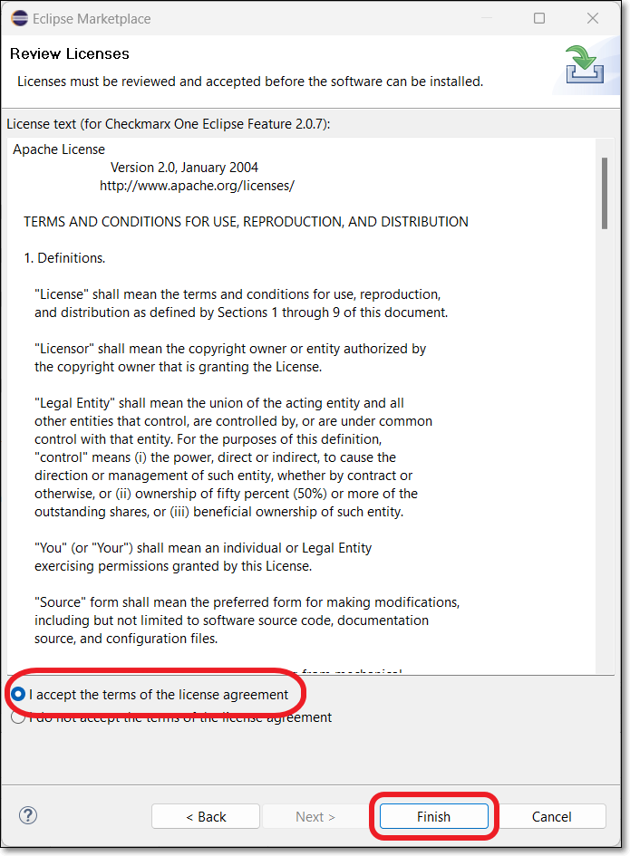<figcaption></figcaption></figure>
5. In the **Trust Authorities** and **Trust Artifacts** windows, select the trusted content and click **Trust Selected**.

   <figure>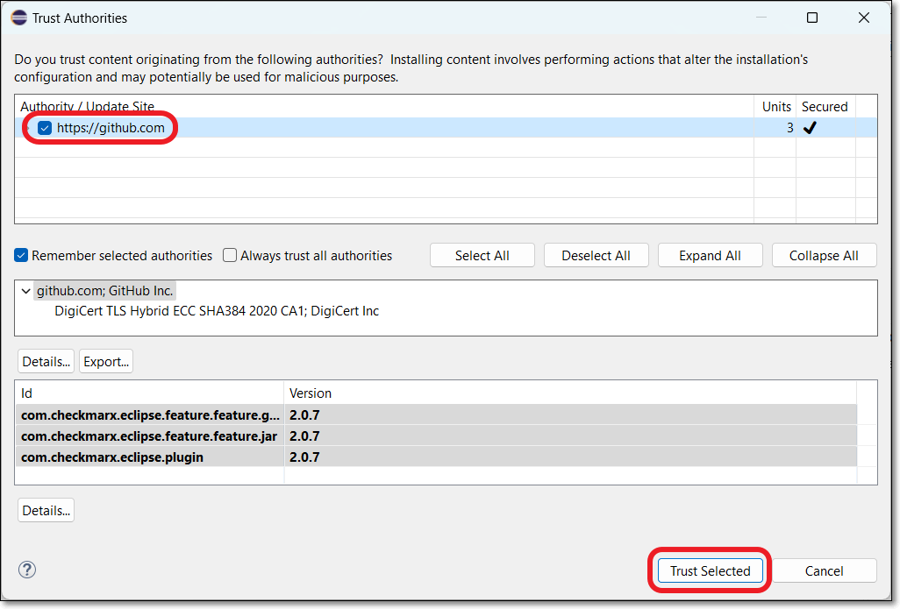<figcaption></figcaption></figure>

   <figure>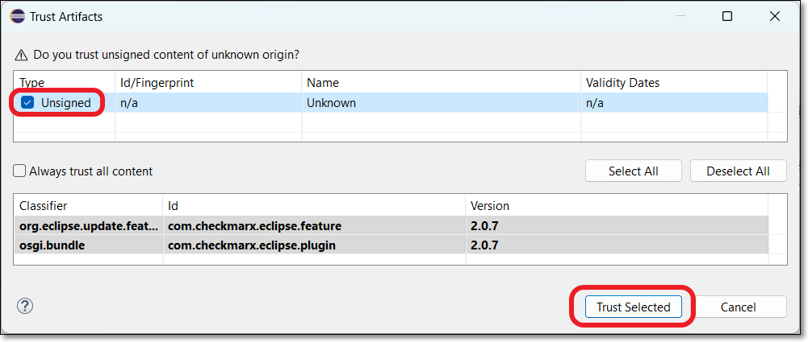<figcaption></figcaption></figure>
6. If a security warning is shown, click **Install anyway** to complete the plugin installation.

   When the installation is finished, you will be prompted to restart the Eclipse IDE to apply the plugin update.

<details>

<summary>Installing the Plugin from a Zip Archive</summary>

**To install the plugin manually from a zip archive:**

1. Download the “com.checkmarx…” zip file [here](https://github.com/CheckmarxDev/checkmarx-ast-eclipse-plugin/releases).
2. In the **Eclipse** console, click on **Help** > **Install New Software** > **Add** > **Archive**.

   <figure>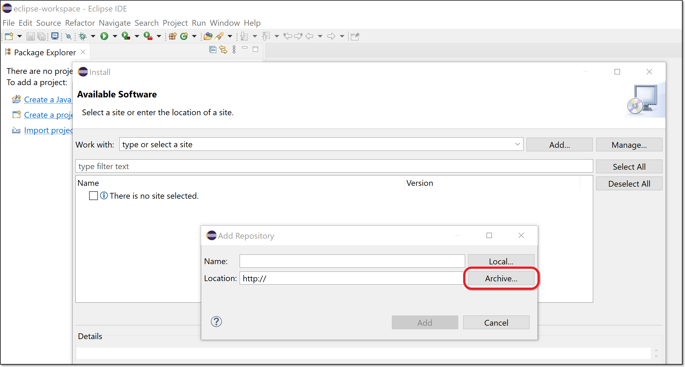<figcaption></figcaption></figure>
3. In the window that opens, navigate to the downloaded zip file and click **Open**.
4. In the **Add Repository** window, optionally enter a **Name** for the plugin (e.g., Checkmarx One Plugin) then click **Add**.
5. In the **Available Software** window, select the **Checkmarx One Eclipse Plugin** checkbox, and click **Next**.

   <figure>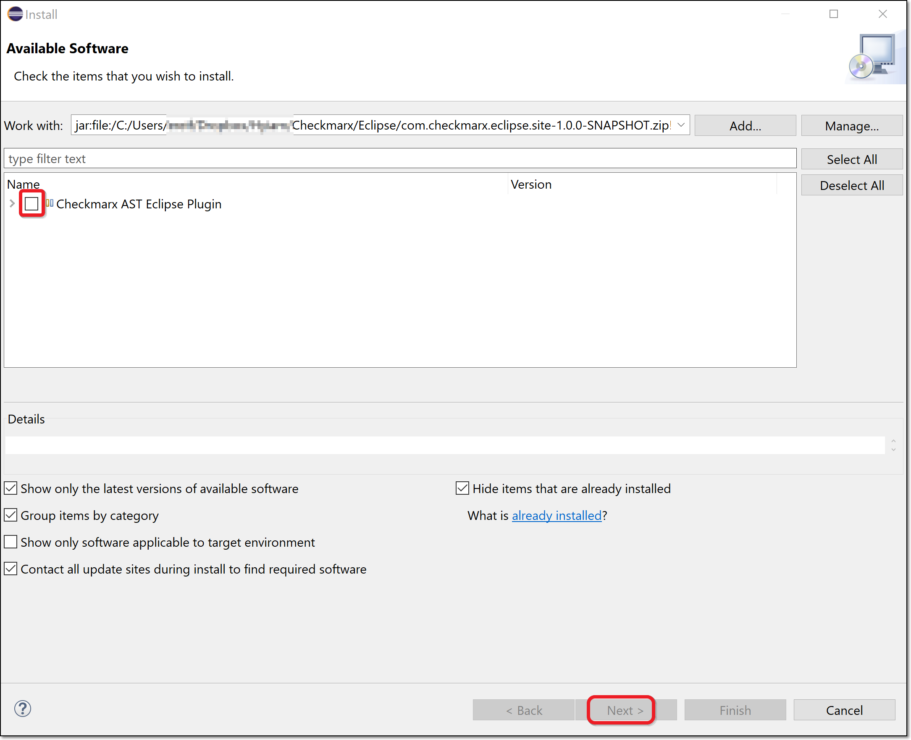<figcaption></figcaption></figure>
6. Review the information in the **Install Details** window, and click **Next**.
7. In the **Review Licenses** window, after reviewing the license information, select the **I accept…** radio button and click **Finish**.

   <figure>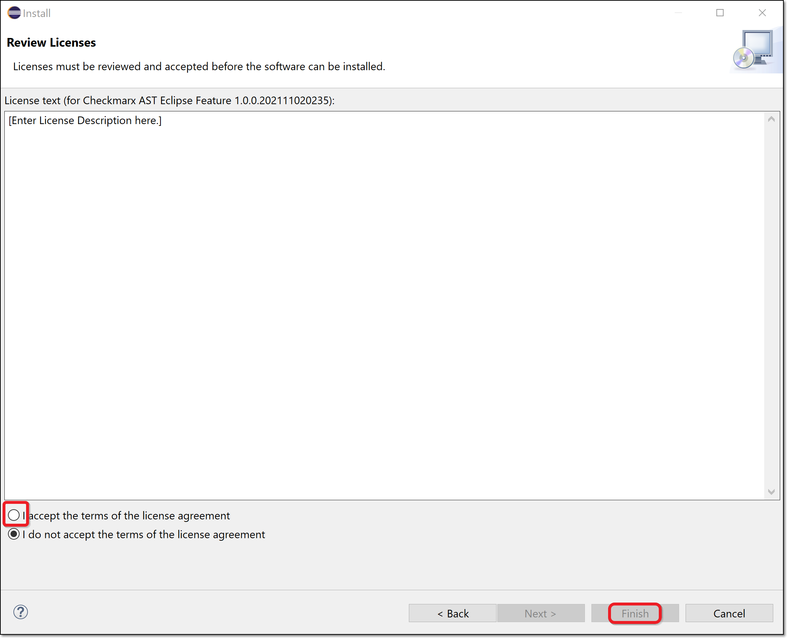<figcaption></figcaption></figure>
8. If a security warning is shown, click **Install anyway** to complete the plugin installation.

   When the installation is finished, you will be prompted to restart the Eclipse IDE to apply the plugin update.

</details>

## Setting up the Plugin

After installing the plugin, you need to configure access to the Checkmarx One server before you can start importing results in your Eclipse IDE.

**To set up the plugin:**

1. In the top menu, click **Window** > **Preferences**. (For Mac OS, click **Eclipse** > **Preferences**.)

   <figure>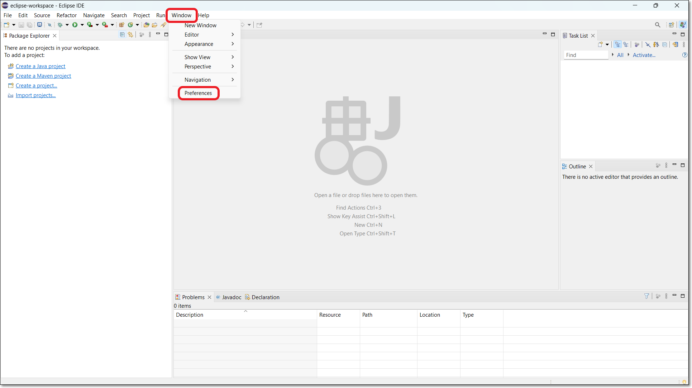<figcaption></figcaption></figure>

   The **Preferences** configuration window is shown.
2. In the **Preferences** window, click **Checkmarx One** (or search for Checkmarx One in the search box).

   The Checkmarx One Eclipse plugin configuration settings are shown.

   <figure>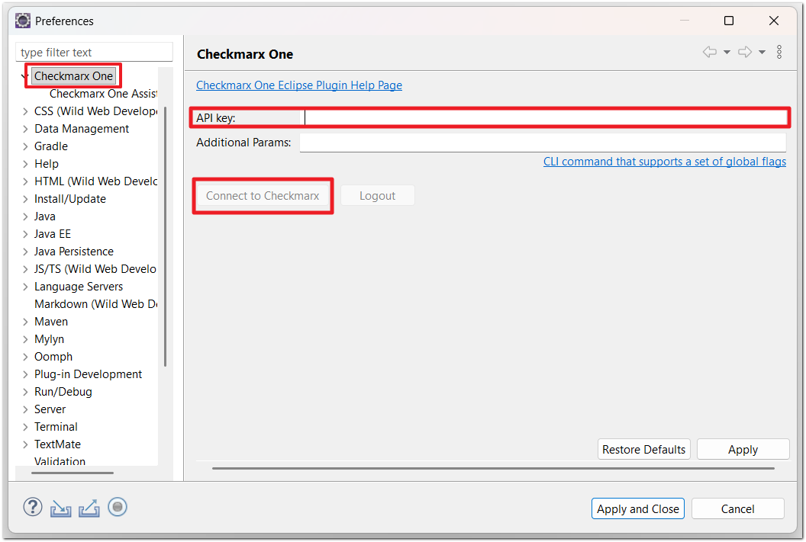<figcaption></figcaption></figure>
3. In the **API Key** field, enter your Checkmarx One **API key**.

   
   To create an API key, see Generating an API Key

   The roles (permissions) assigned to the API Key are inherited from the user account that generates the key. Therefore, make sure that you are logged in to an account with the appropriate roles.

   The minimum required roles for running an end-to-end flow of scanning a project and viewing results via the CLI or plugins are Checkmarx One `plugin-scanner` role and IAM `default-roles<tenant>` role.

   The permissions included in `plugin-scanner` are shown here. If you would like to create a custom role with more granular permissions, you should refer to this list of permissions in order to determine which permissions you will need to assign.
   
4. In the **Additional Params** field, you can submit additional CLI params. This can be used to manually submit the base url and tenant name if there is a problem extracting them from the API Key. It can also be used to add global params such as `--debug` or `--proxy`. To learn more about CLI global params, see [Global Flags](../../cli-tool/checkmarx-one-cli-commands/global-flags.md).
5. Click on **Connect to Checkmarx**.

   
   If the connection fails, you can view detailed error logs by entering `--debug` in the **Additional Options** section and retrying the connection.
   

   The **Welcome to Checkmarx** window opens.

### Configuring Checkmarx Developer Assist

For accounts with Checkmarx Dev Assist, the welcome screen shows the "Code smarter with Checkmarx One Assist" section.

1. Select **Code Smarter with Checkmarx One Assist** checkbox, and click **Close**.

   <figure>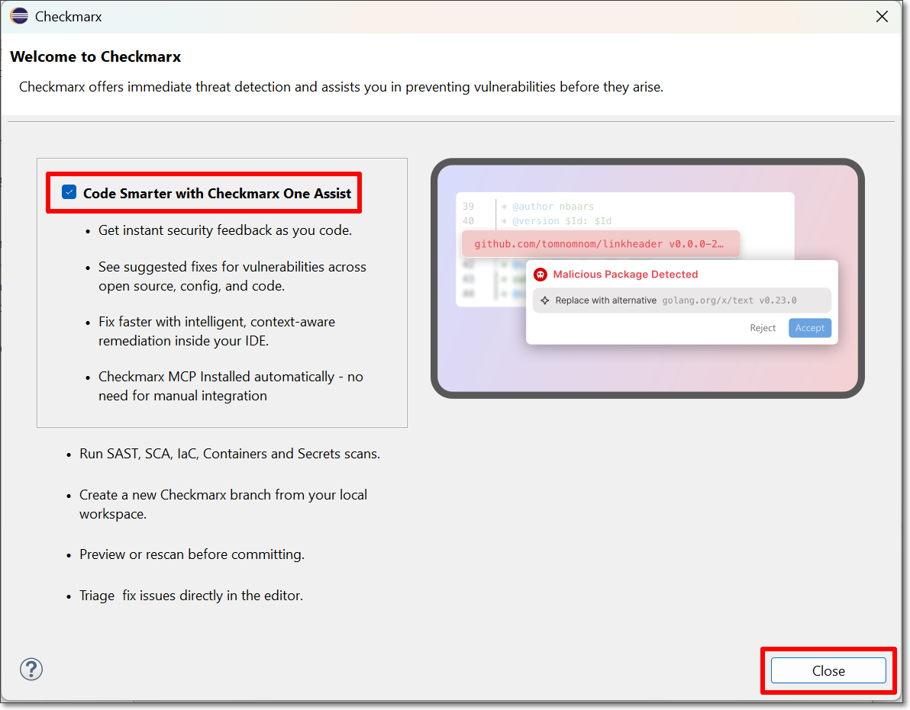<figcaption></figcaption></figure>

   The Checkmarx MCP is installed and starts running automatically.
2. Go to **Preferences** > **GitHub Copilot** > **Model Context Protocol**, and verify that the Checkmarx tools are shown and the checkboxes are selected.

   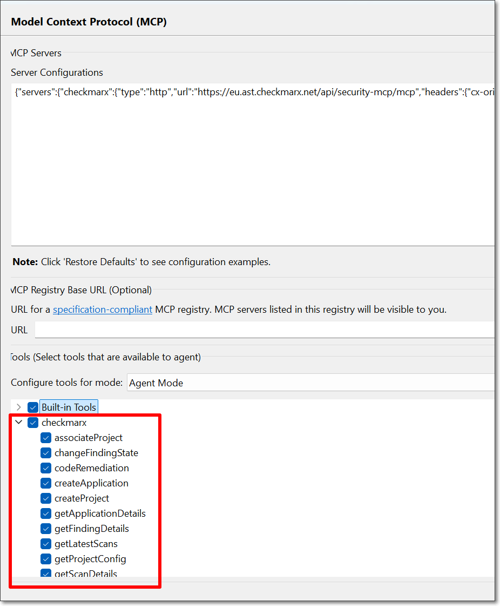
3. To optionally adjust the Developer Assist settings, in the Preferences window, go to **Checkmarx** > **Checkmarx One Assist**. You can adjust the settings as follows:

   1. Make sure that the desired Checkmarx One Assist checkboxes are selected. You can deselect any realtime scanners that you don't want to run.

      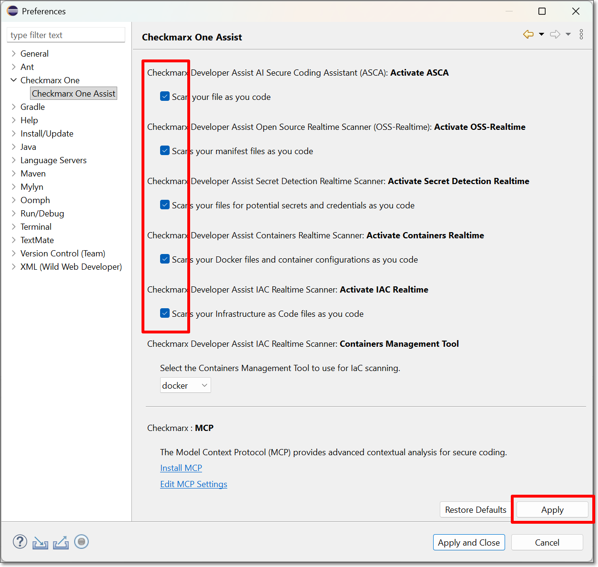
   2. For the IaC Realtime scanner, select the **Containers Management Tool** used in your environment. Options are **docker** or **podman**.

#### Troubleshooting - Configuring the Checkmarx MCP Server

The extension normally installs the Checkmarx MCP automatically. If you encounter a problem, you can install it manually.

1. Go to **Preferences** > **GitHub Copilot** > **Model Context Protocol**.
2. Paste the following snippet into the **Server Configurations** window, replacing the placeholders as follows:

   - **Checkmarx_one_base_url** - The base URL of your Checkmarx One environment.
   - **Checkmarx_one_API_key** - An API Key for your Checkmarx One account.

     ```
     {
        "servers":{
           "Checkmarx":{
              "url":"<Checkmarx_one_base_url>/api/security-mcp/mcp",
              "requestInit":{
                 "headers":{
                    "cx-origin":"eclipse-plugin",
                    "Authorization":"<Checkmarx_one_API_key>"
                 }
              }
           }
        }
     }
     ```
3. Click **Apply and Close**.
