# Using the Checkmarx One Eclipse Plugin

Once you have run a Checkmarx One scan on the source code of your Eclipse project, you can import the scan results into your Eclipse IDE. The results are integrated within the IDE in a manner that makes it easy to identify the vulnerable code, triage the results, and take the required remediation actions.

First you need to import the results from the latest scan of your Eclipse project. Then you can view the results in your Eclipse IDE.


Alternatively, you can run a new scan on an existing Checkmarx One project from your IDE and load the results.


## Loading your Checkmarx One Results



**To load results from a scan:**

1. In your Eclipse project, click on **Window > Show View > Other**.

   <figure>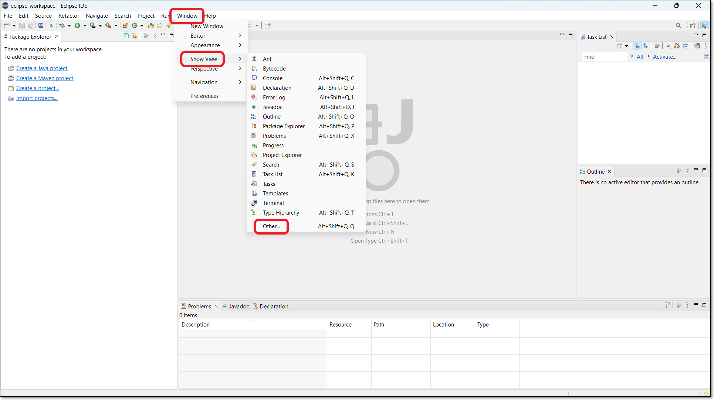<figcaption></figcaption></figure>

   The **Show View** window opens.
2. Select **Checkmarx** > **Checkmarx One Scan** from the list to open the Checkmarx View (or search for Checkmarx One Scan in the search box) and click **Open**.

   <figure>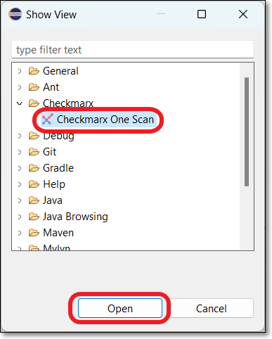<figcaption></figcaption></figure>

   The Checkmarx panel opens at the bottom of the screen.

   <figure>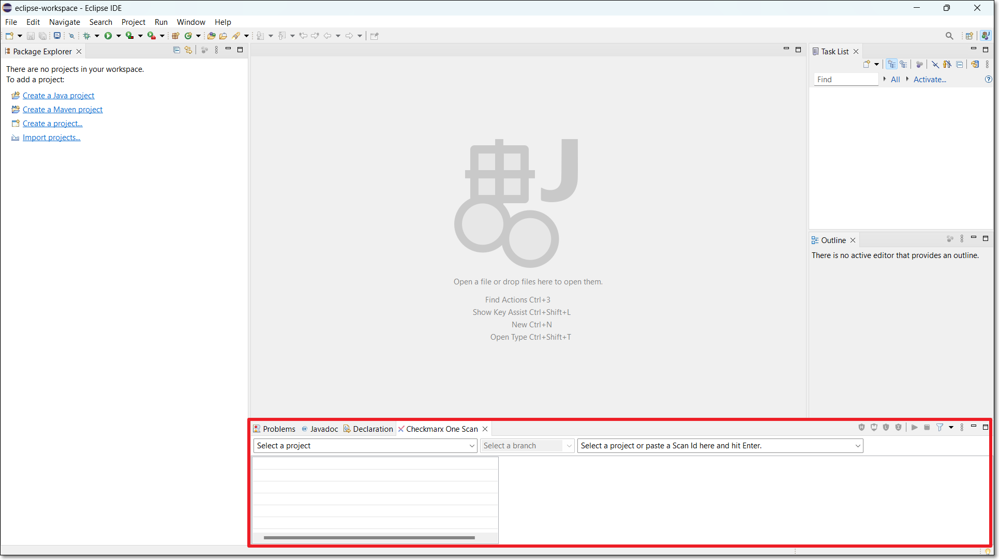<figcaption></figcaption></figure>

   
   If you haven’t done the initial setup, the Open Settings button is shown in the Checkmarx panel. Click on the button and then configure the integration as described in [Installing and Setting up the Checkmarx One Eclipse Plugin](installing-and-setting-up-the-checkmarx-one-eclipse-plugin.md).
   
3. Enter the Scan ID of the scan for which you want to show results (i.e., the most recent scan of your Eclipse project). Use one of the following methods to enter the Scan ID:

   
   Only scans that completed successfully are shown in the IDE. Scans with only partial results aren't shown.
   

Determine the Scan ID by specifying the Project and branch

1. In the **Checkmarx** panel, click on the **Select a project** dropdown and select the Checkmarx Project that corresponds to the Eclipse project that you are working on.

   <figure>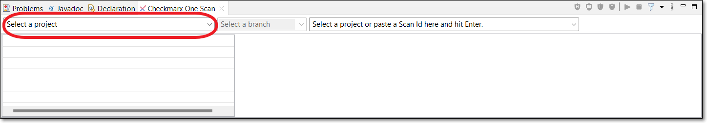<figcaption></figcaption></figure>

   The **Select a branch** field automatically refreshes, and retrieves available branches for this Project.
2. Click on the **Branch** dropdown.

   A dropdown list of the branches for the selected Project is shown.
3. Select the desired branch.

   The **Scan** field automatically refreshes, and retrieves available scans of this branch of the Project.
4. Click on the **Scan** dropdown.

   All of the scans for this branch are shown, with the most recent on top.
5. Select the desired scan.

   The scan results are imported into Eclipse and the selected scan ID is shown below the search box in the Checkmarx panel.

   <figure>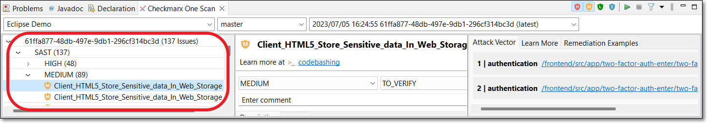<figcaption></figcaption></figure>

Get the Scan ID from the Checkmarx One web application

1. Log in to the Checkmarx One web application.
2. Navigate to the the desired Project page.
3. On the **Scan History** tab, copy the Scan ID of the desired scan.

   <figure>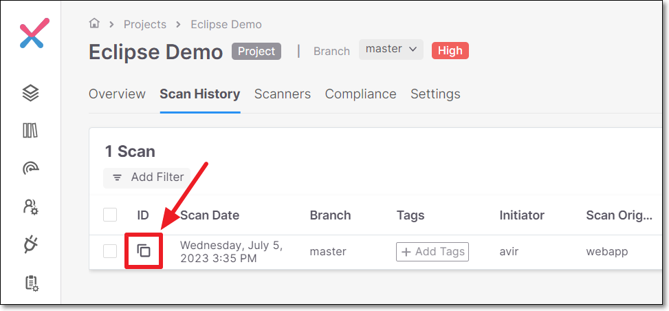<figcaption></figcaption></figure>
4. In the **Eclipse** console > **Checkmarx** panel, paste the copied Scan ID in the **Scan ID** field and press **Enter**.

   <figure>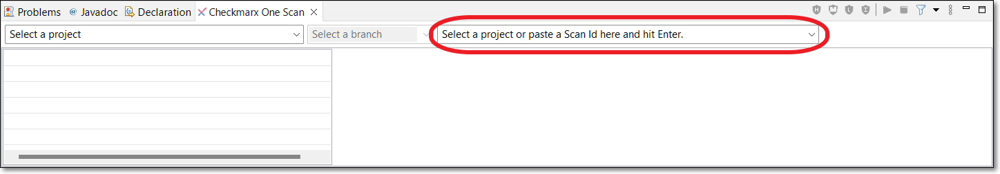<figcaption></figcaption></figure>

   The scan results are imported into Eclipse and the selected scan ID is shown below the search box in the Checkmarx panel.

   <figure><figcaption></figcaption></figure>

## Running Scans from Eclipse

You can run a new Checkmarx One scan on the project that is open in your Eclipse workspace.

You must first create a Checkmarx project and run the initial scan of your local branch using some other method, e.g., web portal, API, CLI etc. and load the scan results in the Eclipse console. Then, you are able to run subsequent scans on that project from Eclipse. The scan applies the scan configuration that was used for the previous scan of this project. For example, if the last time you scanned this project you excluded certain files, those files will be excluded also from the current scan.


When a scan is initiated via the IDE, the SAST scanner runs an "Incremental" scan. Learn more about incremental scans here.



This feature needs to be enabled for your organization's account by a Checkmarx admin user under **Settings** > **Global Settings** > **Plugins** in the Checkmarx One web portal. Before enabling this feature, you should consider the ramifications; since there is a limitation to the number of concurrent scans that you can run based on your license, enabling IDE scans may cause scans triggered by CI/CD pipelines and SCM integrations to be added to the scan queue (run on a "first in first out" basis), causing major delays for those scans.


**To run a scan:**

1. In the Checkmarx panel in your IDE, open the existing Checkmarx project under which your current workspace has already been scanned.
2. In the header bar of the Checkmarx panel, click on the "play" button.

   <figure>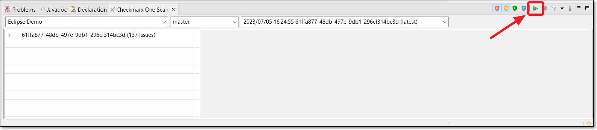<figcaption></figcaption></figure>

   
   Checkmarx runs a sanity check to verify that your current workspace matches the files that were previously scanned under this Checkmarx project. If a mismatch is detected, a warning is shown. You are given the option to run the scan despite the mismatch.
   
3. When the scan is completed, a dialog appears, asking if you would like to load the results from the new scan. Click **Yes** to show the new scan results in the Checkmarx panel.

## Viewing Checkmarx One Scan Results in the Checkmarx View

You can open the Checkmarx panel below your project and navigate the tree display to view details about a specific vulnerability.


In order to show the source code for a specified attack vector, you need to have the relevant project open in your Eclipse console.


**To view the Checkmarx One results in the Checkmarx panel:**

1. After you import the scan results, and the results are shown in the Checkmarx panel, click on an arrow to expand that node in the tree.
2. You can use the Checkmarx Toolbar (on the right) to adjust the display, see actions [below](#checkmarx-toolbar).
3. Click on a vulnerability.

   The details panel on the right shows additional info about the vulnerability, devided into the following tabs: Attack Vector (for SAST vulnerabilities), Learn More and Remediation Examples.

   <figure>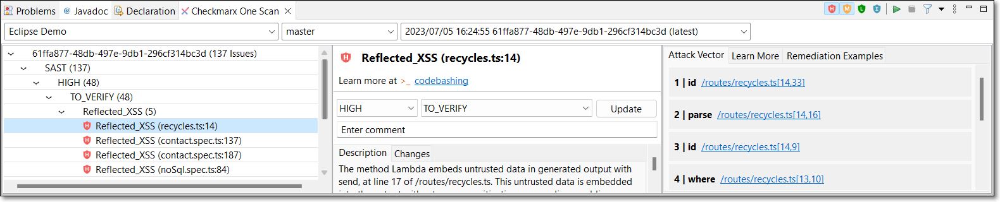<figcaption></figcaption></figure>
4. Click on a node in the **Attack Vector**.

   An editor opens containing the source code in the respective file and location for the selected node.

   <figure>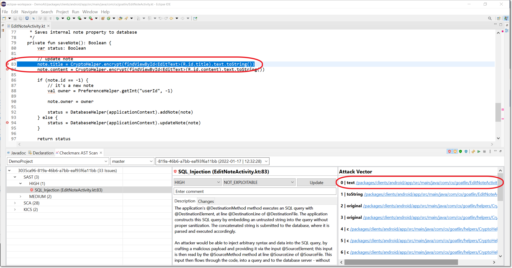<figcaption></figcaption></figure>

### Checkmarx Toolbar

| **Icon** | **Item** | **Description** |
|---|---|---|
|  | Filter Critical | Show/hide critical severity vulnerabilities. |
|  | Filter High | Show/hide high severity vulnerabilities. |
|  | Filter Medium | Show/hide medium severity vulnerabilities. |
|  | Filter Low | Show/hide low severity vulnerabilities. |
|  | Filter Info | Show/hide info severity vulnerabilities. |
|  | Run scan | Runs a new scan on the project that is open in your workspace |
| 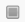 | Cancel scan | Cancels the scan that is running. |
|  | Filter by state | Filter results by state (multi-select, by default all are selected except for Not Exploitable and Proposed Not Exploitable) |
| 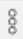 | More options | • **Group by** - Select/deselect grouping categories. Options are: Severity, Query Name and State. You can group by multiple parameters. The groups will be nested according to the order in which they are selected (i.e., the first selection will be the top level grouping and the next selection will be the nested grouping below that etc.) • **Clear result selection** - Clear the Project, branch and scan selection and refresh the Project selection list. • **Preferences** - Configure the Checkmarx One plugin preferences (settings). |

### Managing (Triaging) Results

Checkmarx One tracks specific vulnerability instances throughout your SDLC. Each vulnerability instance has a ‘Predicate’ associated with it, which is comprised of the following attributes: ‘state’, ‘severity’ and ‘comments’. After reviewing the results of a scan, you have the ability to triage the results and modify these predicates accordingly. For more info about triaging results in Checkmarx One, see Managing (Triaging) Vulnerabilities.

You can triage the results directly in the Eclipse console. This is currently supported for SAST and IaC Security results.


Only users with the Checkmarx One role **update-result** (e.g., a risk-manager) are authorized to make changes to the predicate. Only users with the role **update-result-not-exploitable** (e.g., an admin) are authorized to mark a vulnerability as ‘Not Exploitable’.


**To edit the result predicate:**

1. Navigate to the vulnerability that you would like to edit.
2. To adjust the severity, click on the **Severity** field, and select from the dropdown list the severity that you would like to assign. Options are: High, Medium, Low or Info.

   <figure>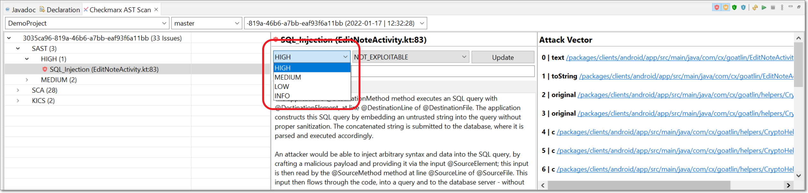<figcaption></figcaption></figure>
3. To adjust the state, click on the **State** field, and select from the dropdown list the state that you would like to assign. Options are: To Verify, Not Exploitable, Proposed Not Exploitable, Confirmed or Urgent.
4. To add a note, click on the **Enter note** field and enter your note.
5. In order to apply your changes, click **Update**.

   The new predicate is applied to the vulnerability instance in this scan as well as to recurring instances of the vulnerability in subsequent scans of the Project. The changes made to the predicate are shown in the **Changes** tab.

### Codebashing Links

Codebashing is an interactive AppSec training platform built by developers for developers. Codebashing sharpens the skills that developers need to avoid security issues, fix vulnerabilities, and write secure code in the first place. See Codebashing documentation here.

When you select a SAST vulnerability for which a Codebashing lesson exists, a link to the relevant lesson is shown. Click on the link to open the lesson in a new browser.


In order to access these links, you need to have a Codebashing account that has been linked to your Checkmarx One account. Please contact your Checkmarx support representative for assistance. For users that don't have a linked Codebashing account, a dialog opens with a link to begin a free trial.


<figure>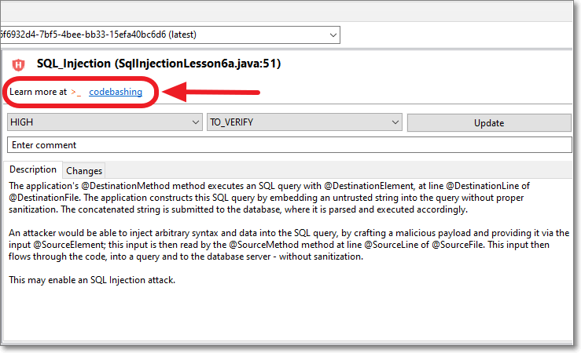<figcaption></figcaption></figure>
