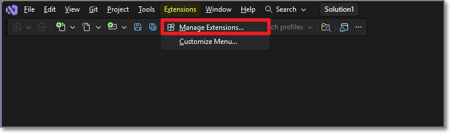
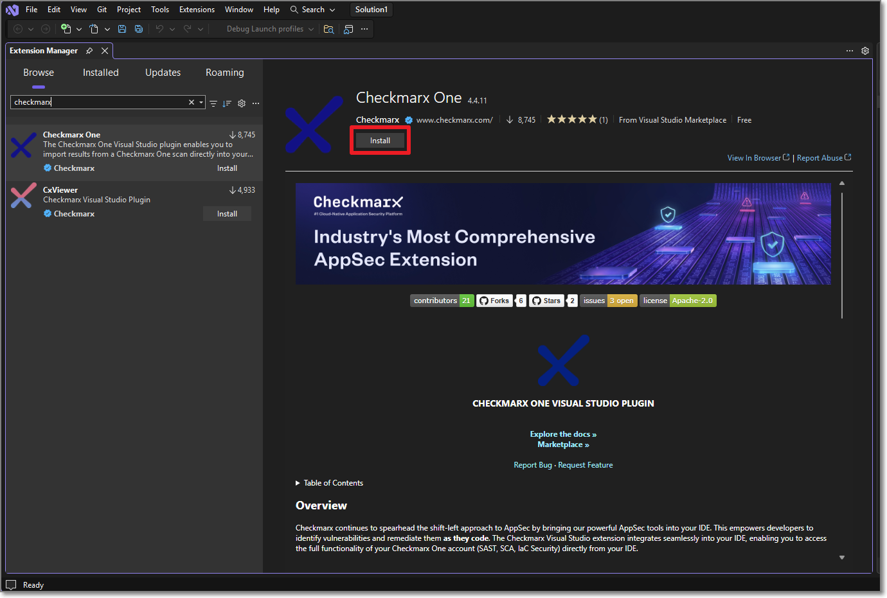
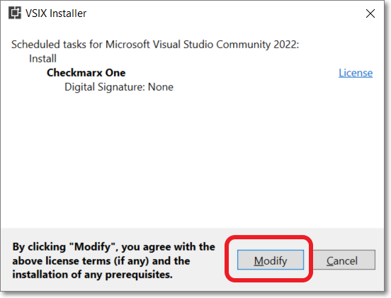
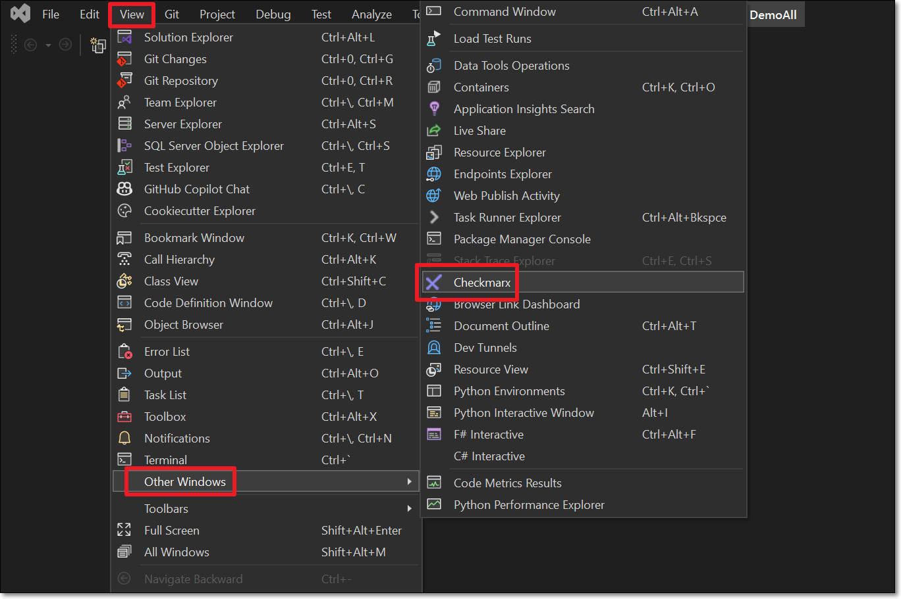
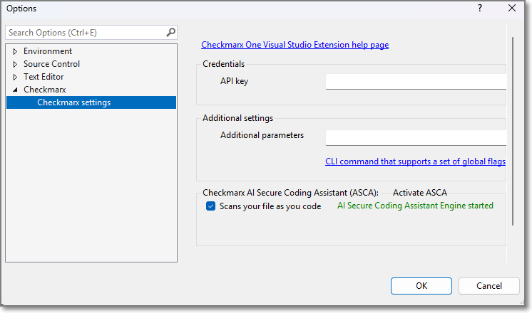

# Installing and Setting Up the Checkmarx One Visual Studio Extension

The Checkmarx One extension for Visual Studio is available on Visual Studio marketplace and can be installed directly from your Visual Studio console.



**To install and set up the extension:**

1. In the Visual Studio console header bar, click on **Extensions** > **Manage Extensions**.

   <figure><figcaption></figcaption></figure>

   The Manage Extensions window opens with the Online tab selected by default.
2. In the search box, start entering 'Checkmarx One'.
3. When the **Checkmarx One** extension is shown, click **Install** for that extension.

   <figure><figcaption></figcaption></figure>

   A notification at the bottom of the window prompts you to restart Visual Studio.
4. Click **Close** and then **Exit** the program.

   The VSIX Installer dialog opens.

   <figure><figcaption></figcaption></figure>
5. Click **Modify**.
6. Open Visual Studio and in the header bar, click **View** > **Other Windows > Checkmarx**.

   <figure><figcaption></figcaption></figure>

   A new **Checkmarx** pane opens.
7. Click on **Open Settings**.

   The **Options** window opens showing the **Checkmarx settings**.

   <figure><figcaption></figcaption></figure>
8. In the **API key** field, enter your Checkmarx One **API key**.

   
   To create an API key, see Generating an API Key

   The roles (permissions) assigned to the API Key are inherited from the user account that generates the key. Therefore, make sure that you are logged in to an account with the appropriate roles.

   The minimum required roles for running an end-to-end flow of scanning a project and viewing results via the CLI or plugins are Checkmarx One `plugin-scanner` role and IAM `default-roles<tenant>` role.

   The permissions included in `plugin-scanner` are shown here. If you would like to create a custom role with more granular permissions, you should refer to this list of permissions in order to determine which permissions you will need to assign.
   
9. In the **Additional parameters** section you can specify any CLI arguments that you would like to apply as global flags (e.g., proxy servers). See documentation here.
10. Click **OK** at the bottom of the screen.

## Configuring Checkmarx Developer Assist

1. Go to the **Checkmarx** settings and navigate to the **Checkmarx One Assist** tab.
2. Make sure that the desired Checkmarx One Assist checkboxes are selected.

   If MCP is activated on the tenant level, then these should be selected by default. You can deselect any scanners that you don't want to run.

   <figure><figcaption></figcaption></figure>
3. For the IaC Realtime scanner, select the **Containers Management Tool** used in your environment. Options are **docker** or **podman**.
4. Click on **Install MCP**.

   The Checkmarx MCP is added to your mcp.json file.

   
   In some cases the MCP is installed automatically when you authenticate with Checkmarx. However, best practice is to click on**Edit in mcp.json** so that the MCP file opens and you can ensure that it starts running, as shown in the following step.
   
5. If the process doesn't start automatically, you may need to open the file and click **Start**.

   
   If there is a problem with the automatic installation, check Developer Assist for Checkmarx One.
   
6. Click **OK** at the bottom of the window.
7. Open **GitHub Copilot Chat** by navigating to **View** > **GitHub Copilot Chat**.
8. Open the **Tool Picker** (wrench/tool icon).
9. Confirm that a **Checkmarx** MCP server appears in the list of available tools.
10. Expand the server and verify that Checkmarx tools are listed and enabled.

    Checkmarx Developer Assist is now ready for use.
