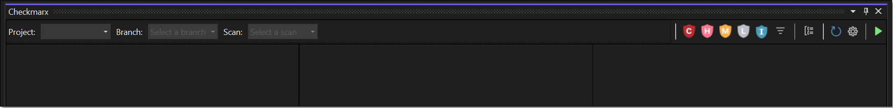
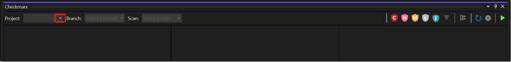
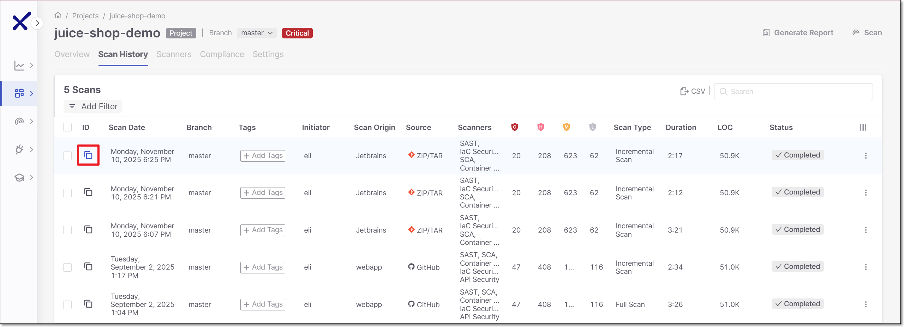
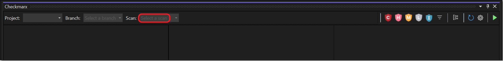
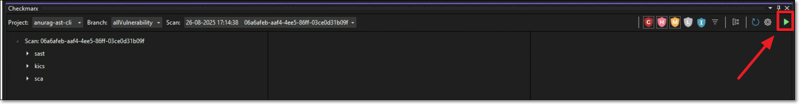
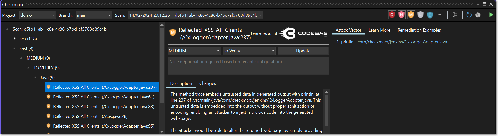
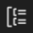
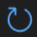
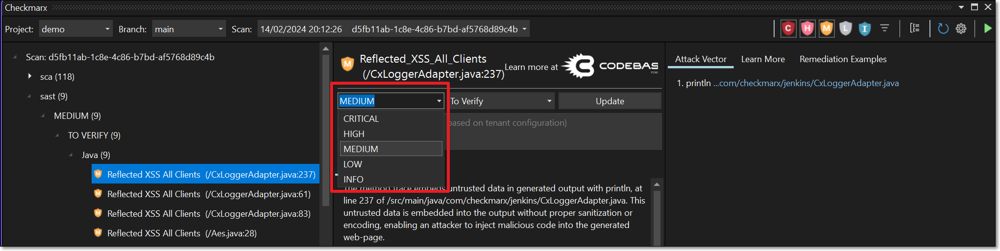
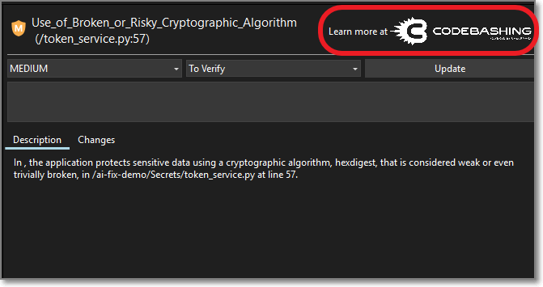

# Using the Checkmarx One Visual Studio Extension

Once you have run a Checkmarx One scan on the source code of your Visual Studio project, you can import the scan results into your Visual Studio IDE. The results are integrated within the IDE in a manner that makes it easy to identify the vulnerable code triage the results and take the required remediation actions.

First you need to import the results from the latest scan of your Visual Studio project. Then you can view the results in your Visual Studio IDE.


Alternatively, you can run a new scan on an existing Checkmarx One project from your IDE and load the results.




## Importing your Checkmarx One Scan Results

**To import results from a scan:**

1. In the main navigation, click **View** > **Other Windows > Checkmarx**.

   <figure><figcaption></figcaption></figure>

   The **Checkmarx** panel opens.

   <figure><figcaption></figcaption></figure>
2. The plugin will try to automatically show results for the relevant scan by matching your project and branch to an existing Checkmarx One scan.
3. If the desired scan is not displayed, you can manually select the scan to display using one of the following methods.

   
   Only scans that completed successfully are shown in the IDE. Scans with only partial results aren't shown.
   

Select the Project, Branch and Scan

1. In the **Checkmarx** panel, click on the **Project** dropdown.

   <figure><figcaption></figcaption></figure>

   A dropdown list of your Checkmarx One Projects is shown.
2. Select the Checkmarx One Project that corresponds to the Visual Studio project that you are working on.

   The **Branch** field automatically refreshes, and retrieves available branches for this Project.
3. Click on the **Branch** dropdown.

   A dropdown list of the branches for the selected Project is shown.
4. Select the desired branch.

   The **Scan** field automatically refreshes, and retrieves available scans of this branch of the Project.
5. Click on the **Scan** dropdown.

   All of the scans for this branch are shown, with the most recent on top.
6. Select the desired scan.

   The scan results are imported into Visual studio and the selected scan ID is shown below the search box in the Checkmarx panel.

   
   Only scans that completed successfully are shown in the IDE. Scans with only partial results aren't shown.
   

Get the Scan ID from the Checkmarx One web application

1. Log in to the Checkmarx One web application.
2. Navigate to the the desired Project page.
3. On the **Scan History** tab, copy the Scan ID of the desired scan.

   <figure><figcaption></figcaption></figure>
4. In the Visual Studio console > **Checkmarx** panel, in the Scan search box, paste the Scan ID and press **Enter**.

   <figure><figcaption></figcaption></figure>

   The scan results are imported into Visual Studio and the selected scan ID is shown below the search box in the Checkmarx panel.

## Running Scans from Visual Studio

You can run a new Checkmarx One scan on the project that is open in your Visual Studio workspace.

You must first create a Checkmarx project and run the initial scan using some other method, e.g., web portal, API, CLI etc. and load the scan results in the Visual Studio console. Then, you are able to run subsequent scans on that project from Visual Studio.


**Limitation:** You can only run a scan in Visual Studio on a an entire project (.sln extension), not on an individual file or folder.


The scan applies the scan configuration that was used for the previous scan of this project. For example, if the last time you scanned this project you excluded certain files, those files will be excluded also from the current scan.


When a scan is initiated via the IDE, the SAST scanner runs an "Incremental" scan. Learn more about incremental scans here.



This feature needs to be enabled for your organization's account by a Checkmarx admin user under **Settings** > **Global Settings** > **Plugins** in the Checkmarx One web portal. Before enabling this feature, you should consider the ramifications; since there is a limitation to the number of concurrent scans that you can run based on your license, enabling IDE scans may cause scans triggered by CI/CD pipelines and SCM integrations to be added to the scan queue (run on a "first in first out" basis), causing major delays for those scans.




**To run a scan:**

1. In the Checkmarx panel in your IDE, open the existing Checkmarx project under which your current workspace has already been scanned.
2. In the header bar of the Checkmarx panel, click on the "play" button.

   

   
   Checkmarx runs a sanity check to verify that your current workspace matches the files that were previously scanned under this Checkmarx project. If a mismatch is detected, a warning is shown. You are given the option to run the scan despite the mismatch.
   
3. When the scan is completed, a dialog appears, asking if you would like to load the results from the new scan. Click **Yes** to show the new scan results in the Checkmarx panel.

## Viewing Checkmarx One Scan Results

You can open the Checkmarx panel below your project and navigate the tree display to view details about a specific vulnerability.


In order to show the source code for a node in an attack vector, you need to have the relevant project open in your Visual Studio console.


**To view the Checkmarx One results in the Checkmarx panel:**

1. After you import the scan results, in the Checkmarx panel click on an arrow or double-click a node to expand that node in the tree.
2. You can use the Checkmarx Toolbar in the header bar to adjust the display, see [below](#checkmarx-toolbar).
3. Click on a vulnerability.

   The details panel is shown on the right, including a summary of the vulnerability info, a brief description and the Attack Vector (for SAST vulnerabilities).

   <figure><figcaption></figcaption></figure>
4. Click on a node in the **Attack Vector**.

   An editor opens containing the source code in the respective file and location for the selected node.

### Checkmarx Toolbar

On the sidebar, on the left side of the Checkmarx panel, a toolbar with the following actions is available:

| **Icon** | **Item** | **Description** |
|---|---|---|
|  | Filter Critical | Show/hide critical severity vulnerabilities |
|  | Filter High | Show/hide high severity vulnerabilities |
|  | Filter Medium | Show/hide medium severity vulnerabilities |
|  | Filter Low | Show/hide low severity vulnerabilities |
|  | Filter Info | Show/hide info severity vulnerabilities |
|  | Filter results | Filter results by state (multi-select, by default all states are selected except for Not Exploitable and Proposed Not Exploitable) You can also select "SCA Dev & Test Dependencies" to hide vulnerabilities identified by the SCA scanner in "Dev" and "Test" dependencies. Learn more here |
|  | Group By | Select one or more criteria for grouping the results. Options are: Severity, Vulnerability Type, State, Status, Language, File, Direct Dependency. |
|  | Refresh | Clear Project, Branch and Scan selection and refresh the Project selection list |
|  | Settings | Opens the Checkmarx One Visual Studio plugin configuration settings |
|  | Start a scan | Runs a new scan on the project that is open in your workspace |

### Managing (Triaging) Results

Checkmarx One tracks specific vulnerability instances throughout your SDLC. Each vulnerability instance has a ‘Predicate’ associated with it, which is comprised of the following attributes: ‘state’, ‘severity’ and ‘comments’. After reviewing the results of a scan, you have the ability to triage the results and modify these predicates accordingly. For more info about triaging results in Checkmarx One, see Managing (Triaging) Vulnerabilities.

You can triage the results directly in the Visual Studio console. This is currently supported for SAST and IaC Security results.


Only users with the Checkmarx One role **update-result** (e.g., a risk-manager) are authorized to make changes to the predicate. Only users with the role **update-result-not-exploitable** (e.g., an admin) are authorized to mark a vulnerability as ‘Not Exploitable’.


**To edit the result predicate:**

1. Navigate to the vulnerability that you would like to edit.
2. To adjust the severity, click on the **Severity** field, and select from the dropdown list the severity that you would like to assign. Options are: Critical, High, Medium, Low or Info.

   <figure><figcaption></figcaption></figure>
3. To adjust the state, click on the **State** field, and select from the dropdown list the state that you would like to assign. Options are: To Verify, Not Exploitable, Proposed Not Exploitable, Confirmed or Urgent.
4. To add a comment, enter your comment in the field **Comment**.
5. In order to apply your changes, click **Update**.

   The new predicate is applied to the vulnerability instance in this scan as well as to recurring instances of the vulnerability in subsequent scans of the Project. The changes made to the predicate are shown in the **Changes** tab.

### Codebashing Links

Codebashing is an interactive AppSec training platform built by developers for developers. Codebashing sharpens the skills that developers need to avoid security issues, fix vulnerabilities, and write secure code in the first place. See Codebashing documentation here.

When you select a SAST vulnerability for which a Codebashing lesson exists, a link to the relevant lesson is shown. Click on the link to open the lesson in a new browser.


In order to access these links, you need to have a Codebashing account that has been linked to your Checkmarx One account. Please contact your Checkmarx support representative for assistance. For users that don't have a linked Codebashing account, a dialog opens with a link to begin a free trial.


<figure><figcaption></figcaption></figure>
