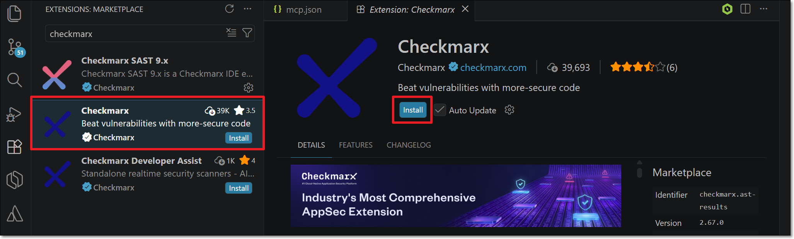
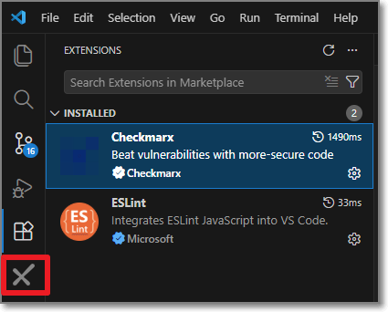
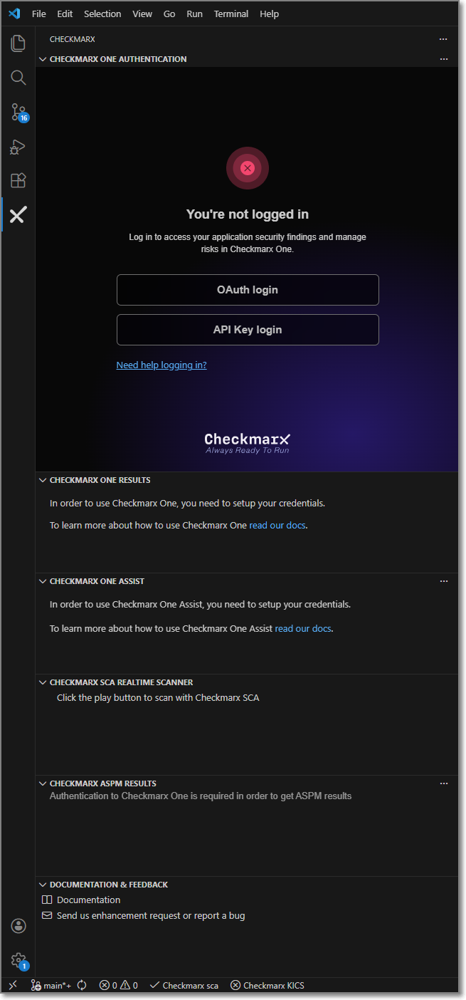
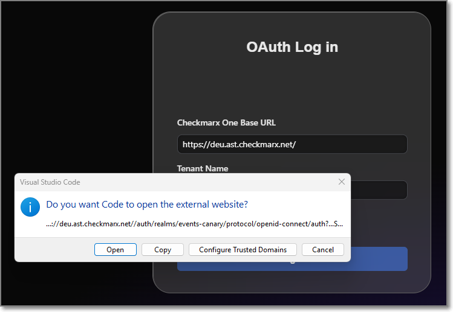
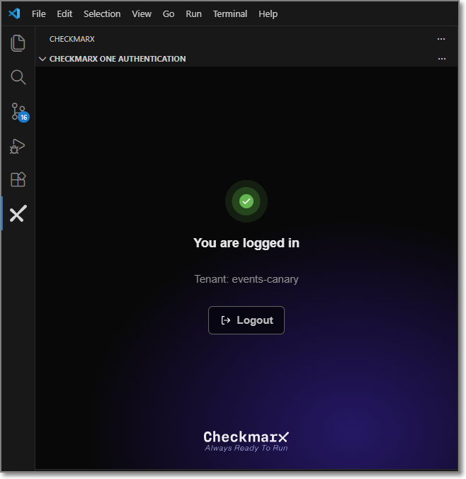
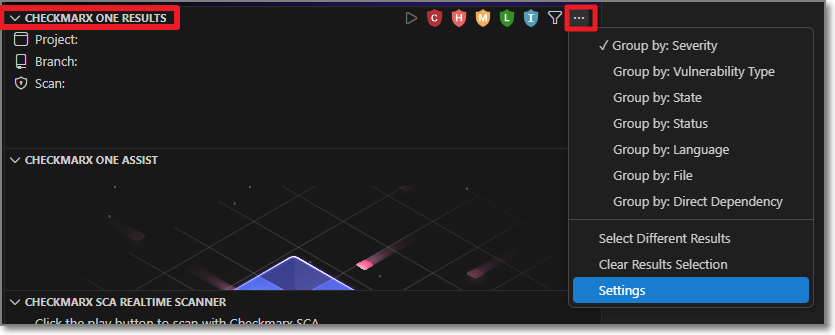
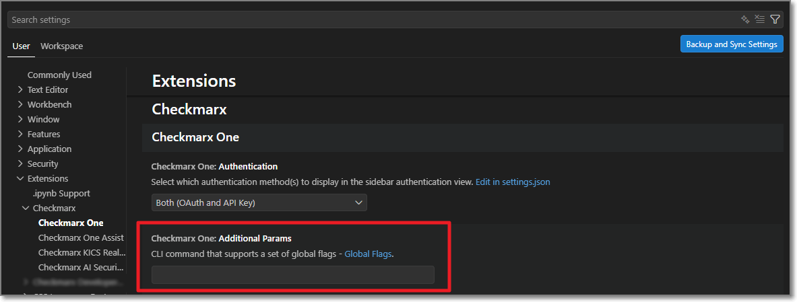
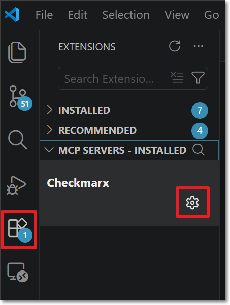
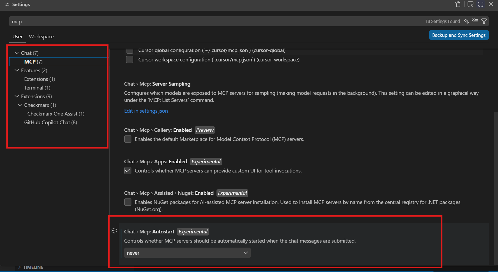
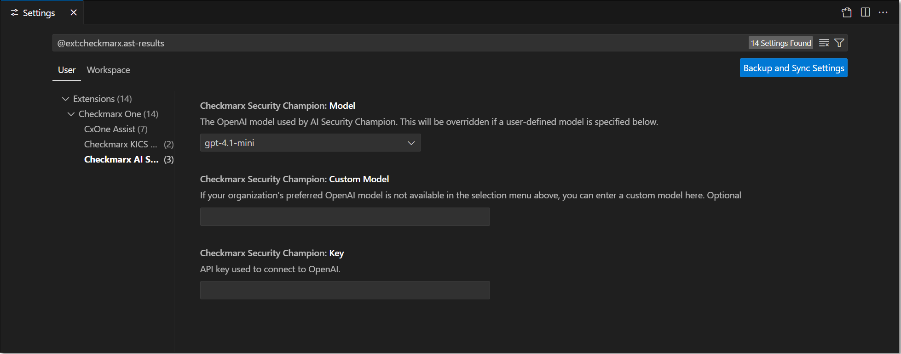

# Installing and Setting up the Checkmarx VS Code Extension

## Installing the Extension


The **Checkmarx** VS Code extension includes the Checkmarx One Assist feature as part of the Checkmarx One platform experience and should be used by Checkmarx One customers with a Checkmarx One Assist license. The **Checkmarx** and **Checkmarx Developer Assist** VS Code extensions are mutually exclusive. To use the Checkmarx extension, ensure that the Checkmarx Developer Assist extension is uninstalled before installation. If you are not a Checkmarx One customer and are trying to install the **Checkmarx Developer Assist** VS Code extension, see Initial Setup and Configuration.


The Visual Studio Code Extension is available on the [Visual Studio Code marketplace](https://marketplace.visualstudio.com/items?itemName=checkmarx.ast-results). You can initiate the installation directly from the Visual Studio Code console.



**To install the extension:**

1. Open Visual Studio Code.
2. In the main menu, click on the **Extensions** icon.
3. Search for the **Checkmarx** extension, then click **Install** for that extension.

   

   
   **Auto Update** is enabled by default, so the latest version is installed automatically when available. To prevent automatic updates, clear the **Auto Update** checkbox. When auto update is disabled, the currently installed version remains unchanged until updates are re-enabled.
   

   The Checkmarx extension is installed and the Checkmarx icon appears in the left-side navigation panel.

   <figure><figcaption></figcaption></figure>

## Setting up the Extension

After installing the plugin, in order to use the Checkmarx One tool you need to configure access to your Checkmarx One account, as described below.


If you are only using the free KICS Auto Scanning tool and/or the SCA Realtime Scanning tool, then this setup procedure is not relevant. However, for SCA Realtime Scanning tool, if your environment doesn't have access to the internet, then you will need to configure a proxy server in the Settings, under **Checkmarx One: Additional Params**.


1. In the VS Code console, click on the **Checkmarx** extension icon.

   The **Checkmarx One Authentication** sidebar opens:

   <figure><figcaption></figcaption></figure>
2. In the **Checkmarx One Authentication** sidebar, connect to Checkmarx One either using an **API Key** or **login credentials**.

   - Login Credentials

     1. Select the **OAuth login** button.

        The OAuth Log in window opens.

        <figure><figcaption></figcaption></figure>
     2. Enter the Base URL of your Checkmarx One environment and the name of your tenant account, then click **Log in**.

        
        Once you have submitted a base URL and tenant name, it is saved in cache and can be selected for future use (saves up to 10 accounts).
        

        A confirmation dialog asks for permission to open an external website.

        <figure><figcaption></figcaption></figure>
     3. Click on **Open** to proceed.

        
        If you would like to prevent this dialog from opening in the future, click on **Configure Trusted Domains** and then in the Command Pallete click on **Trust...**.
        
     4. If you are logged in to your account, the system connects automatically. If you are not logged in, your account's login page opens in your browser. Enter your Username and Password and then your One-Time Password (2FA) to log in.
   - API Key (see Generating an API Key)

     1. Select the **API Key login** button.

        The API Key Log in window opens.

        <figure><figcaption></figcaption></figure>
     2. Enter your Checkmarx One **API Key** and click **Log in**.
3. The **Checkmarx One Authentication** sidebar will now show that you are logged in.

   <figure><figcaption></figcaption></figure>
4. After you sign in, the **Welcome to Checkmarx** window opens.
5. In the **Checkmarx One Results** sidebar, click on the more options icon in the top right and select **Settings**.

   <figure><figcaption></figcaption></figure>
6. In the **Additional Params** field, you can submit additional CLI params. This can be used to manually submit the base url and tenant name if there is a problem extracting them from the API Key. It can also be used to add global params such as `--debug`, `--proxy` or `--optional-flags`. To learn more about CLI global params, see [Global Flags](../../cli-tool/checkmarx-one-cli-commands/global-flags.md).

   <figure><figcaption></figcaption></figure>

### Configuring Checkmarx Developer Assist

1. Start the Checkmars MCP server using the following procedure:

   1. In the main menu, click on the **Extensions** icon.
   2. Expand the **MCP SERVERS - INSTALLED** tab.

      <figure><figcaption></figcaption></figure>
   3. In the Checkmarx item, click on the settings icon and select **Start Server**.

      
      In Vs Code versions prior to v1.116, a dialog may open saying that Dynamic Client Registration isn't supported. In this case, click on the **Copy URIs & Proceed** button, insert the following client id: `cx-mcp-client`, and press ENTER.
      
   4. If prompted, allow VS Code to open the Checkmarx web application and complete the authentication process.
2. To optionally adjust the Developer Assist settings, go to the **Checkmarx** settings and select **Checkmarx One Assist** settings. You can adjust the settings as follows.

   1. Make sure that the desired Checkmarx One Assist checkboxes are selected.

      If MCP is activated on the tenant level, then these should be selected by default. You can deselect any scanners that you don't want to run.

      <figure><figcaption></figcaption></figure>
   2. For the IaC Realtime scanner, select the **Containers Management Tool** used in your environment. Options are **docker** or **podman**.
   3. Select the **AI Assistant** to use for remediation. Options are **Copilot** (default), **Claude** or **Codex**.

      
      The **Prefer Native AI Assistant** setting is not applicable for VS Code.
      
   4. **MCP Authentication** – Select the authentication method used by the Checkmarx MCP server.

      
      After changing the authentication method, click **Install MCP** to update the `mcp.json` configuration.
      

      - **OAuth** (default) when the MCP server starts, a browser-based login session is initiated to authenticate with your Checkmarx One account.
      - **Token Based** uses the API key associated with your current Checkmarx One login and avoids browser authentication when starting the MCP server.

        
        When this method is used, the API key is stored in the `mcp.json` file.
        

#### Troubleshooting

<details>

<summary>Issue: Checkmarx MCP not installed</summary>

The extension normally creates and configures the `mcp.json` file automatically. Manual configuration is only required if automatic configuration fails or if you prefer to create the MCP configuration yourself.

1. If it does not already exist, create an `mcp.json` file at the following location: `${homeDir}\AppData\Roaming\Code\User\mcp.json`
2. Configure the `mcp.json` file for the authentication method that you want to use:

   - **OAuth** (default) - Authenticates through your Checkmarx One account when the MCP server starts.

     ```
     {
       "servers": {
         "Checkmarx": {
           "type": "http",
           "url": "<Checkmarx_one_base_url>/api/security-mcp/mcp/<tenant-name>",
           "oauth": {
             "clientId": "cx-mcp-client"
           }
         }
       }
     }
     ```
   - **Token Based** - Authenticates using a Checkmarx One API key stored in the mcp.json file. Browser authentication is not required when starting the MCP server.

     ```
     {
        "servers":{
           "checkmarx":{
              "url":"<Checkmarx_one_base_url>/api/security-mcp/mcp",
              "headers":{
                 "cx-origin":"VSCode",
                 "Authorization":"<Checkmarx_one_API_key>"
              }
           }
        }
     }
     ```
3. Save the file.
4. For the **OAuth** method, you may need to manually start the MCP server.

   1. In the main menu, click on the **Extensions** icon.
   2. Expand the **MCP SERVERS - INSTALLED** tab.

      <figure><figcaption></figcaption></figure>
   3. In the Checkmarx item, click on the settings icon and select **Start Server**.

      
      In Vs Code versions prior to v1.116, a dialog may open saying that Dynamic Client Registration isn't supported. In this case, click on the **Copy URIs & Proceed** button, insert the following client id: `cx-mcp-client`, and press ENTER.
      
   4. When prompted, allow VS Code to open the Checkmarx web application and complete the authentication process.

</details>

<details>

<summary>Issue: mcp.json file opens repeatedly in my workspace</summary>

When using Developer Assist in **VS Code** with **GitHub Copilot**, there is a known issue that each time that you call the Checkmarx MCP, the mcp.json file automatically opens in your workspace. The unnecessary clutter can be an annoyance.

**Solution:** The workaround for this issue is to go to the **MCP** settings in VS Code, and under **Autostart** select **never**.


Even after this workaround, whenever you start a new session in VS Code (i.e., when you open a new folder) the MCP will still open **once** to enable the user to start running the MCP.


<figure><figcaption></figcaption></figure>


Once this workaround is implemented, the Checkmarx MCP will no longer start automatically each time that you restart VS Code. Whenever you restart VS Code you will need to start the MCP manually, as follows:

1. Click **View** > **Command Pallete** and enter **MCP:List Servers**.
2. In the MCP servers list, select **Checkmarx**.
3. Click on **Start Server**.


</details>

### Configuring AI Security Champion

AI Security Champion can be used with the Checkmarx One tool as well as with the KICS Realtime Scanning tool. In order to use AI Security Champion you need to integrate the VS Code extension with your OpenAI account.


If the [Global Settings](../../user-guide/configuring-account-settings/global-account-settings/plugins-settings.md) for your account have been configured to use Azure AI instead of OpenAI, then the credentials are submitted on the account level and it is not possible to submit credentials in your IDE for an alternative AI model.


**To set up the integration with your OpenAI account:**

1. Go to the **Checkmarx** extension **Settings** and select **Checkmarx AI Security Champion**.

   <figure><figcaption></figcaption></figure>
2. In the **Model** field, select from the drop-down list the model of the GPT account that you are using.
3. If the model that you would like to use isn't available in the **Model** drop-down, you can use the **Custom Model** field to specify the desired model.

   
   If this is specified it will override the model specified in the **Model** field. This must be a model that is supported for the API Key that you enter in the following step.
   
4. In the **Key** field, enter the API key for your OpenAI account.

   
   Follow this [link](https://platform.openai.com/account/api-keys) to generate an API key.
   

   The configuration is saved automatically.

### Setting up a Proxy (Optional)

There are three ways to set up a proxy for Checkmarx in VS Code: using Checkmarx One additional parameters, Using VS Code proxy setttings (http.proxy), or using your system’s environment variables.

If multiple methods are used, the following order of precedence is applied (from highest precedence to lowest).

1. Checkmarx One Additional Parameters
2. VS Code proxy (http.proxy)
3. HTTPS_PROXY environment variable
4. HTTP_PROXY environment variable

#### Setting up a Proxy using Additional Parameters

1. In the main navigation, click **Customize** > **All settings**.

   The **Settings** window is shown.
2. In the **Settings** window, click **Tools** > **Checkmarx One** (or search for Checkmarx One in the search box).

   The Checkmarx VS Code extension configuration settings are shown.
3. In the **Additional parameters** section, enter `--proxy <proxy_url>`, with the proxy_url using the following format `http://<proxy_ip>:<port_number>`. If authentication is required, then the format should be `http://<username>:<password>@<proxy_ip>:<port_number>`.

   
   Make sure to include the `http://` prefix.

   It is not recommended to pass the username and password in clear text.
   
4. Click **OK** at the bottom of the screen.

#### Setting up a Proxy Using VS Code Proxy Settings (http.proxy)

1. In the VS Code console go to **File** > **Preferences** > **Settings**.
2. In the **Settings** window search for **Proxy**.
3. In the `http.proxy` field enter your proxy URL using the follwoing format `http://<proxy_ip>:<port_number>`. If authentication is required, then the format should be `http://<username>:<password>@<proxy_ip>:<port_number>`.

   
   Make sure to include the `http://` prefix.

   It is not recommended to pass the username and password in clear text.
   
4. Optionally, set `http.proxySupport` to `override` to ensure all VSCode traffic goes through the proxy.
5. Restart VS Code.

#### Setting up a Proxy Variable Using your OS System Environment Variables

In your operating system (e.g., Windows, iOS, Linux, etc.), set up system environment variables for HTTP and/or HTTPS.

- Create an environment variable for HTTP with the following configuration:

  - In the **Name** field, enter **HTTP_PROXY**.
  - In the **Value** field, enter the value of your proxy address using the following format:`http://<proxy_ip>:<port_number>`. If authentication is required, then the format should be: `http://<username>:<password>@<proxy_ip>:<port_number>`.

    
    Make sure to include the `http://` prefix.

    It is not recommended to pass the username and password in clear text.
    
- Create an environment variable for HTTPS with the following configuration:

  - In the **Name** field, enter **HTTPS_PROXY**.
  - In the **Value** field, enter the value of your proxy address using the following format:`https://<proxy_ip>:<port_number>`. If authentication is required, then the format should be: `https://<username>:<password>@<proxy_ip>:<port_number>`.

    
    Make sure to include the `https://` prefix.

    It is not recommended to pass the username and password in clear text.
    

## Configuring the KICS Realtime Scanning Tool (Optional)

This tool is activated automatically upon installation and no configuration is required.


It is **not** necessary to configure the Checkmarx One Authentication settings in order to use the KICS Realtime Scanning feature.


If you would like to customize the scan settings, you can use the following procedure:

1. In the VS Code console, go to **Settings** > **Extensions** > **Checkmarx** > **Checkmarx KICS Auto Scanning**.

   <figure><figcaption></figcaption></figure>
2. By default the extension is configured to run a KICS scan whenever an infrastructure file of a [supported type](https://docs.kics.io/latest/platforms/) is opened or saved. If you would like to disable automatic scanning, deselect the **Activate KICS Auto Scanning** checkbox.

   
   In this case, you will still be able to trigger scans manually from the command palette.
   
3. If you would like to customize the scan parameters, enter the desired flags in the **Additional Parameters** field. For a list of available options, see Scan Command Options.
