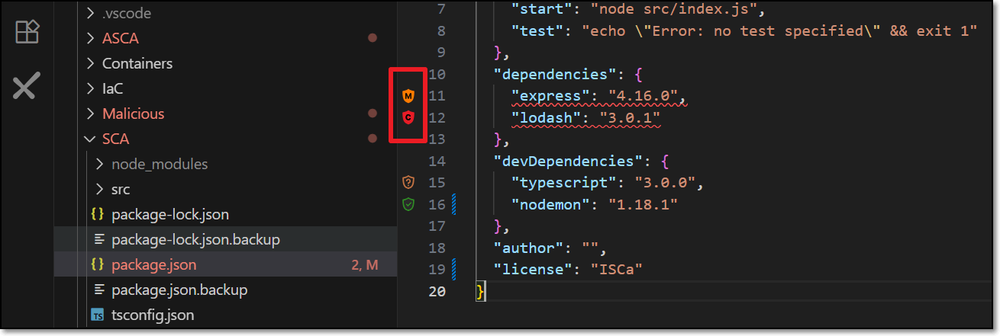
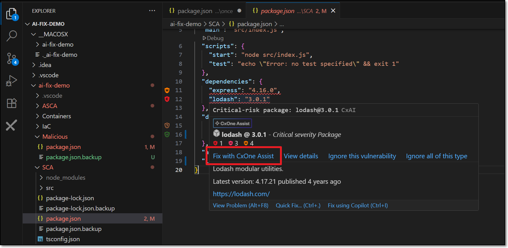
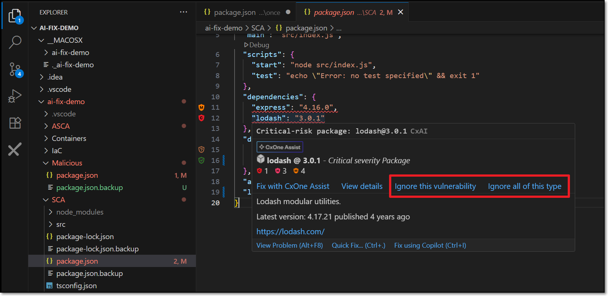
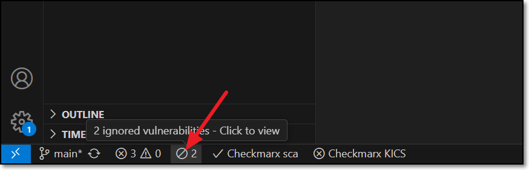
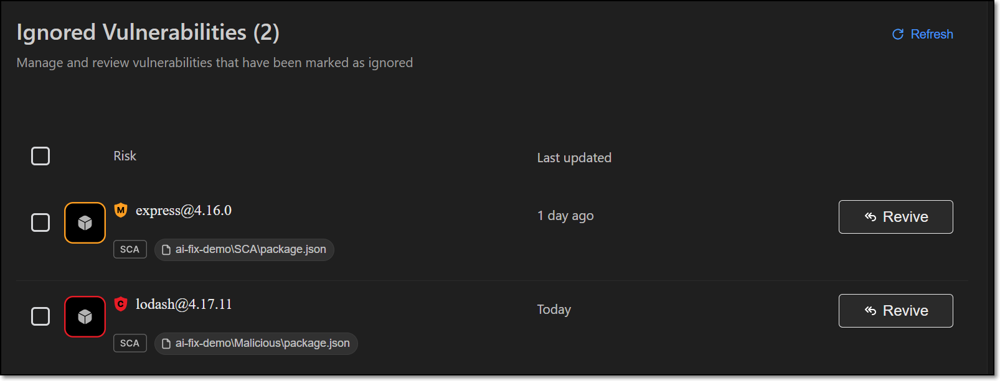

# Using Developer Assist in VS Code

This article shows how Developer Assist is used in VS Code.

## Realtime Scanning

Identify vulnerabilities in **realtime** during IDE development of both human-generated and AI-generated code. Our super-fast scanners run in the background whenever you edit a relevant file. Our scanners identify vulnerabilities and unmasked secrets in your code. We also identify vulnerable or malicious container images and open source packages used in your project. Results are marked as Problems which are highlighted in the code and annotated with identifying icons.

Learn more about Dev Assist realtime scanners here

## AI Remediation



### How to Remediate Risks Using AI

The following procedure explains how to remediate risks by clicking on the Fix button for a particular risk. Alternatively, you can request remediation via chat with your AI Agent, as decribed below.

1. When Checkmarx realtime scanners identify a risk, it is flagged as a **Problem**, which is marked in the code with a squiggly underline and annotated in the margin with an icon that indicates the type of risk.

   <figure><figcaption></figcaption></figure>
2. Hover over the vulnerable line of code.

   The Checkmarx dialog opens.

   <figure><figcaption></figcaption></figure>
3. Click on **Fix with CxOne Assist**.

   A Copilot session opens in the side panel and all relevant info is sent for analysis.

   
   Depending on your IDE configuration, you may need to click **Continue** several times in order to complete the process.
   
4. Copilot automatically makes the necessary changes in the code in order to remediate the risk.

   - If you approve the change, click **Accept**.

     The change is made and the code is rescanned to verify that the risk is no longer present.
   - If you want to improve on the suggestion, click **Undo**. You can then chat with Copilot to determine the best way of remediating the code.

#### Remediation via Chat

You can submit a request for CxOne Dev Assist remediation via natural language chat with your AI Agent. Just say that you want to fix a security risk and indicate which risk or risks you want to fix. Your AI will automatically route the request to the Checkmarx MCP and send all relevant data for analysis in order to generate the suggested remediation. The following are some examples of valid requests:

- "Fix the vulnerability in line 26"
- "Fix all critical vulnerabilities"
- "Fix all SQL Injection risks"
- "Remediate all vulnerable packages"
- "Correct all critical issues in my JavaFile.java"

##### Things to Know About Dev Assist Chat

- No need to mention "Checkmarx" explicitly; once Dev Assist is installed and running all remediation requests are handled via Checkmarx MCP
- Support for multi-language prompts
- Effective in single message context. Improved accuracy in context of an existing thread or finding.
- By default, requests are interpreted in the context of the current open file (e.g., line 26 of the open file). You can specify a different file in your workspace.

### Ignoring Risks

In order to help you to focus on actionable risks, Checkmarx Dev Assist enables marking risks as **Ignore**, so that the risks will no longer be shown in your IDE. You can **Revive** a risk at any time to resume showing that risk. This can be applied to a specific instance of a risk or it can be applied to all instances of that risk in your project. You can revive the risk at any time to resume showing risks for that package.


For risks identified in open source packages, a risk instance refers to the entire package that the vulnerability is associated with.


**To Ignore a risk**

1. When Checkmarx realtime scanners identify a risk, it is flagged as a **Problem**, which is marked in the code with a squiggly underline and annotated in the margin with an icon that indicates the type of risk.

   <figure><figcaption></figcaption></figure>
2. Hover over the vulnerable line of code.

   The Checkmarx dialog opens.

   <figure><figcaption></figcaption></figure>
3. To ignore the risk in this particular instance, click on **Ignore this vulnerability**.
4. To ignore all instances of the risk, click on **Ignore all of this type**.

**To revive a package:**

1. Click on the **Ignore** icon in the bottom bar.

   <figure><figcaption></figcaption></figure>
2. The **Ignored Vulnerabilities** tab opens.

   <figure><figcaption></figcaption></figure>
3. For the desired vulnerability click on the **Revive** button.

   
   This can also be done as a bulk action for all selected items.
   
