# Using the Checkmarx VS Code Extension - Checkmarx One Platform

## Loading Checkmarx One Results in Visual Studio Code

Once you have run a Checkmarx One scan on the source code of your VS Code project, you can import the scan results into VS Code. The results are integrated within VS Code in a manner that makes it easy to identify the vulnerable code, triage the results, and take the required remediation actions.

First you need to import the results from the latest scan of your VS Code project. Then you can view the results in your VS Code IDE.


Alternatively, you can run a new scan on an existing Checkmarx One project from your IDE and load the results.




### Importing your Checkmarx One Scan Results

**To import results from a scan:**

1. In the VS Code console, click on the **Checkmarx** icon (in the left-side navigation pane) to open the Checkmarx panel.

   <figure>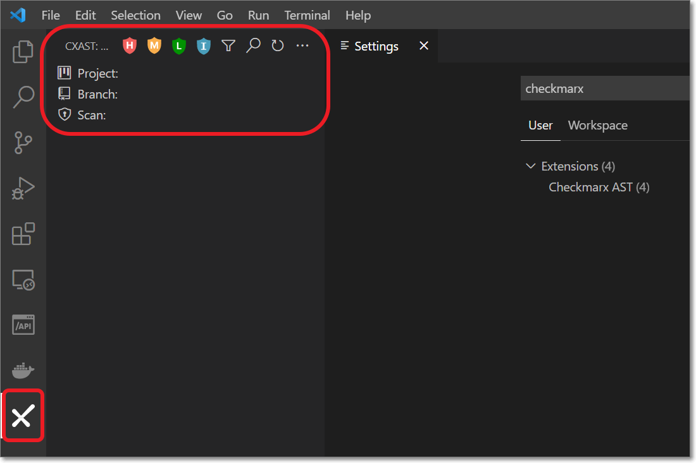<figcaption></figcaption></figure>
2. Enter the Scan ID of the scan that you would like to display, using one of the following methods.

   
   Only scans that completed successfully are shown in the IDE. Scans with only partial results aren't shown.
   

Select the Project, Branch and Scan ID

1. In the **Checkmarx** panel, hover over the **Project** field and click on the **edit** icon : .

   A list of available Checkmarx Projects is shown.

   
   You can filter the list by typing a search text.
   

   <figure>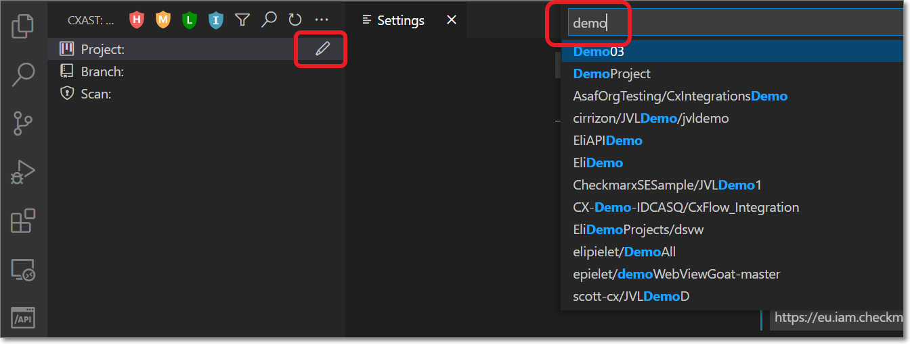<figcaption></figcaption></figure>
2. Select the desired Project.
3. Click on the icon next to **Branch**.

   A list of available branches of the specified Project is shown.

   
   You can filter the list by typing a search text.
   
4. Select the desired Branch.
5. Click on the icon next to **Scan**.

   A list of available scans of the specified branch is shown. Scans are identified by the date and time that the scan ran.
6. Select the desired scan.

   The scan results are imported into VS Code and the results summary as well as the Scan ID of the selected scan and the results tree are shown in the Checkmarx panel.

   <figure>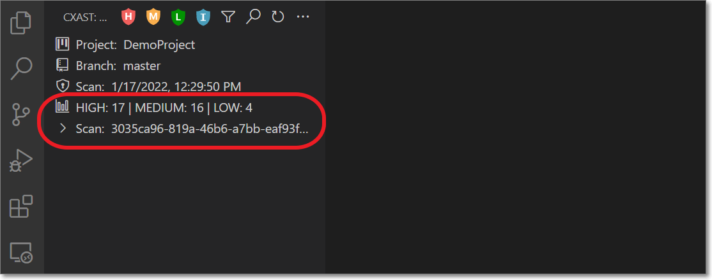<figcaption></figcaption></figure>

Get the Scan ID from the Checkmarx One web application

1. Log in to the Checkmarx One web application.
2. Navigate to the the desired Project page.
3. On the **Scan History** tab, copy the Scan ID of the desired scan.

   <figure>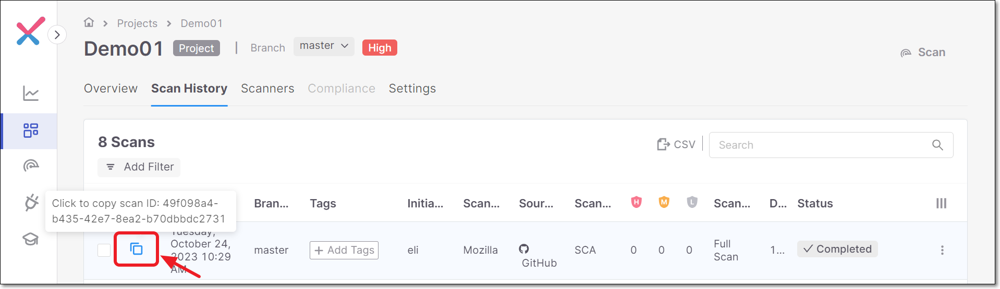<figcaption></figcaption></figure>
4. In the **VS Code** console > **Checkmarx** panel, hover over the **Scan** field and then click on the **search** icon .
5. In the field that opens, paste the scan ID and then press **Enter**.

   <figure>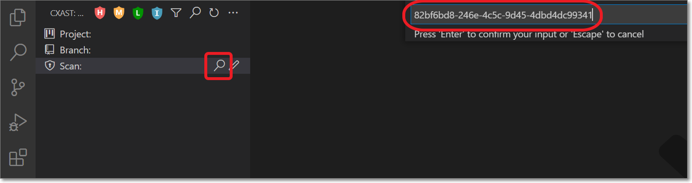<figcaption></figcaption></figure>

   The scan results are imported into VS Code and the Project, Branch and Scan fields are populated. Also, the results tree is shown below the selection section.

   <figure>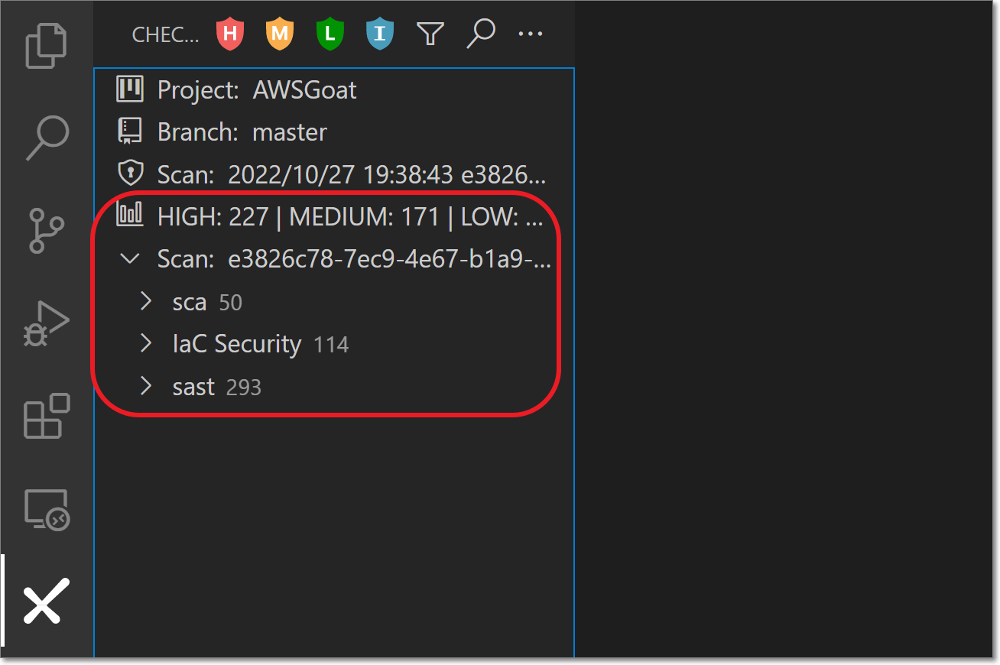<figcaption></figcaption></figure>

### Running Scans from VS Code

You can run a new Checkmarx One scan on the project that is open in your VS Code workspace.

You must first create a Checkmarx project and run the initial scan on the project using some other method, e.g., web portal, API, CLI etc. and load the scan results in the VS Code console. Then, you are able to run subsequent scans on that project from VS Code. You can choose either to rescan the same branch of the Checkmarx One project, or to create a new branch in Checkmarx One for the scan of the local branch in your workspace.

The IDE initiated scan applies the scan configuration that was used for the previous scan of this project branch. For example, if the last time you scanned this branch of the project you excluded certain files, those files will be excluded also from the current scan.


When a scan is initiated via the IDE, the SAST scanner runs an "Incremental" scan. Learn more about incremental scans here.



This feature needs to be enabled for your organization's account by a Checkmarx admin user under **Settings** > **Global Settings** > **Plugins** in the Checkmarx One web portal. Before enabling this feature, you should consider the ramifications; since there is a limitation to the number of concurrent scans that you can run based on your license, enabling IDE scans may cause scans triggered by CI/CD pipelines and SCM integrations to be added to the scan queue (run on a "first in first out" basis), causing major delays for those scans.




**To rescan an existing branch:**

1. In the Checkmarx panel in your IDE, select the existing Checkmarx project and branch under which your current workspace has already been scanned.
2. Hover over the header bar of the Checkmarx One Results panel and click on the "Run Scan" button that appears.

   <figure>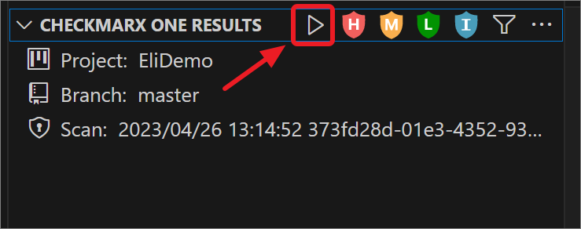<figcaption></figcaption></figure>

   
   Checkmarx runs a sanity check to verify that your current workspace matches the files that were previously scanned under this Checkmarx project. If a mismatch is detected, a warning is shown. You are given the option to run the scan despite the mismatch.
   
3. When the scan is completed, a dialog appears, asking if you would like to load the results from the new scan. Click **Yes** to show the new scan results in the Checkmarx panel.

**To run a scan, creating a new Checkmarx One branch:**

1. In the Checkmarx panel in your IDE, select the existing Checkmarx project under which your current workspace has already been scanned.
2. Hover over the **Branch** field and click on the pencil icon. Then, in the **Select Branch** field at the top of the screen, click on **scan my local branch**.

   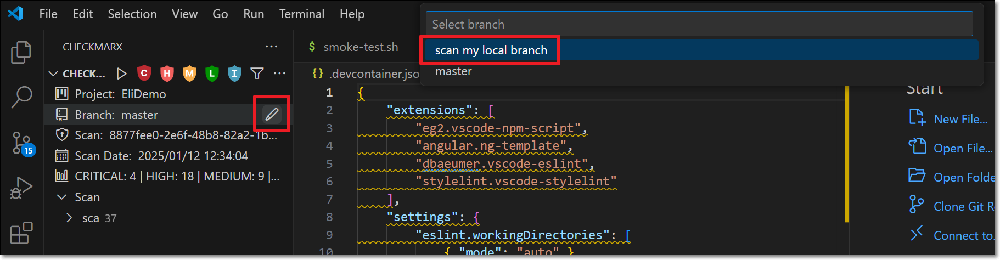
3. Hover over the header bar of the Checkmarx One Results panel and click on the "Run Scan" button that appears.

   <figure><figcaption></figcaption></figure>

   
   Checkmarx runs a sanity check to verify that your current workspace matches the files that were previously scanned under this Checkmarx project. If a mismatch is detected, a warning is shown. You are given the option to run the scan despite the mismatch.
   
4. When the scan is completed, a dialog appears, asking if you would like to load the results from the new scan. Click **Yes** to show the new scan results in the Checkmarx panel.

## Viewing Checkmarx One Scan Results

You can navigate the tree display to view details about a specific vulnerability.


In order to show the source code for a specified attack vector, you need to have the relevant project open in your VS Code console.


**To view the Checkmarx One results for SAST and IaC Security vulnerabilities:**


Some of the tabs described below are only relevant for SAST vulnerabilities. Viewing SCA vulnerabilities is described in the following section.


1. After you import the scan results, and the results are shown in the Checkmarx panel, click on an arrow to expand that item in the tree.

   
   The Checkmarx vulnerabilities are also shown in the **Problems** tab at the bottom of the screen.
   
2. You can use the Checkmarx Toolbar (on the top) to adjust the display, see [below](#checkmarx-toolbar).
3. Click on a **SAST** or **IaC Security** vulnerability.

   The Checkmarx results panel is shown on the right. It opens showing the **General** tab, which includes a summary of the vulnerability info, a brief description and the Attack Vector.

   <figure>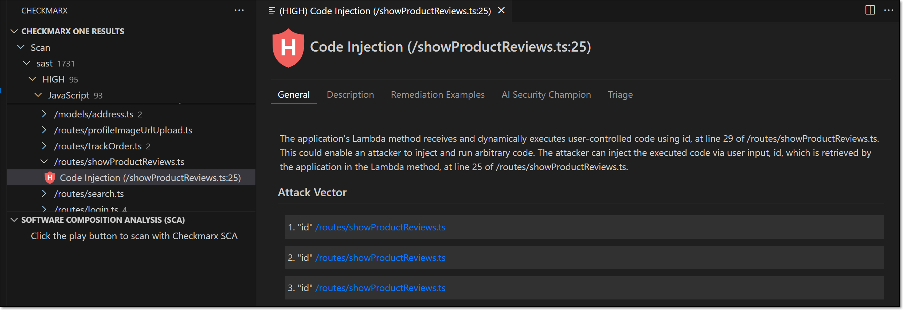<figcaption></figcaption></figure>
4. You can click on the **Triage** tab to view the severity, state and comments for this vulnerability. As part of the triaging process, you can change the severity, and state and add comments, see [Managing (Triaging) Results](#managing-triaging-results).
5. You can click on the **Description** tab to view additional details about the vulnerability, including recommended remediation actions.
6. You can click on the **Remediation Examples** tab to view a sample of code that is subject to this vulnerability, followed by a remediated version of that code.
7. Back In the **General** tab, scroll down to the **Attack Vector** section and click on a node in the **Attack Vector**.

   An editor opens containing the source code in the respective file and location for the selected node.

   <figure>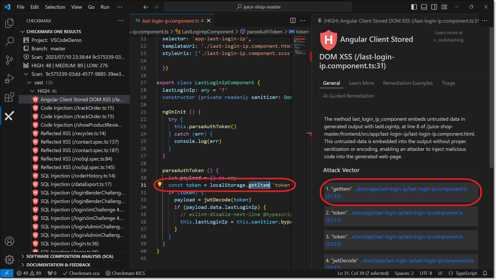<figcaption></figcaption></figure>

   You can hover over a vulnerability and click **View Problem** to show info about the problem.

   <figure>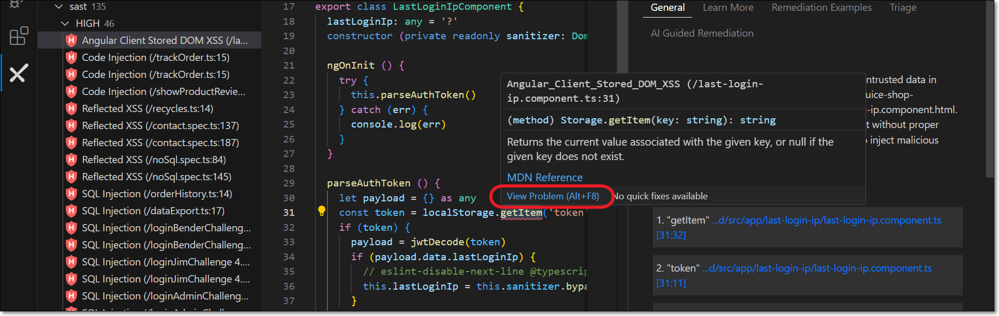<figcaption></figcaption></figure>

   <figure>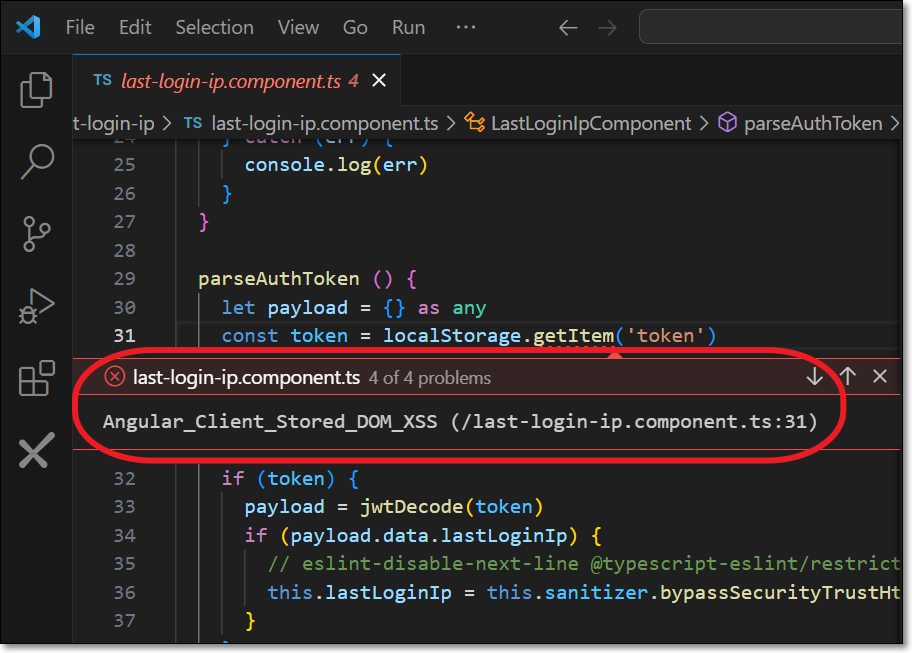<figcaption></figcaption></figure>

### Viewing and Remediating SCA Results



1. Click on an SCA vulnerability in the results tree.

   Detailed info about the vulnerability is shown in the results window. This includes a description of the vulnerability, info about the package where it was identified and a detailed breakdown of the metrics contributing to the CVSS score.

   <figure>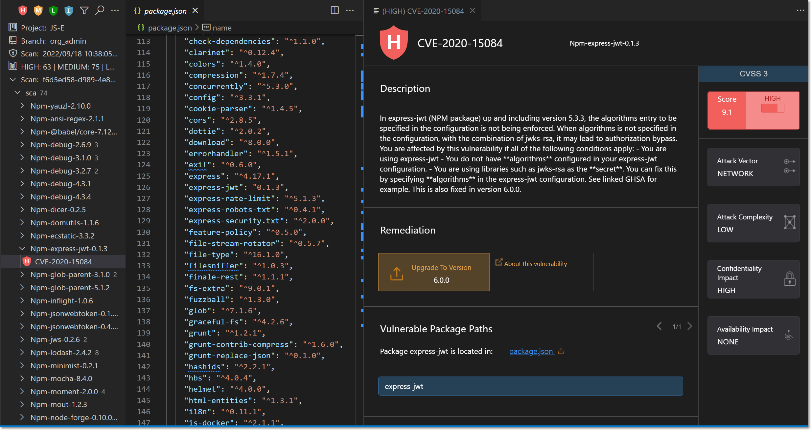<figcaption></figcaption></figure>
2. Checkmarx offers remediation recommendations. When the **Remediation** button is highlighted, this indicates that you can automatically upgrade to the recommended version by clicking on the button.

   
   This feature is currently supported only for direct npm dependencies.
   
3. You can click on the **Triage** tab to view the state and comments for this vulnerability. As part of the triaging process, you can change the state and add comments, see [Managing (Triaging) Results](#managing-triaging-results). (Severity triage is not supported for SCA results)

### Viewing Secret Detection Results


Learn more about the Secret Detection scanner here.


1. Click on a Secret Detection result in the results tree.

   Detailed info about the vulnerability is shown in the results window. The info is shown in three tabs: General, Description and Remediation Examples.

   <figure>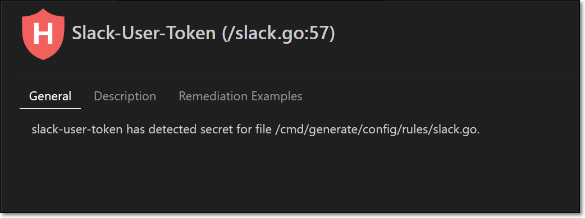<figcaption></figcaption></figure>

### AI Security Champion

AI Security Champion harnesses the power of AI to help you to understand the vulnerabilities in your code, and resolve them quickly and easily. When you initiate an AI chat, we automatically provide the context to OpenAI. The interaction differs slightly for SAST vulnerabilities and for IaC Security vulnerabilities, as described below.

#### Prerequisites

In order to use AI Security Champion, make sure that the following prerequisites are in place.

- This feature needs to be enabled for your organization's account by a Checkmarx admin user under **Account Settings** > **Settings** > **Plugins** in the Checkmarx One web portal. See Plugins Settings
- You need to provide your OpenAI API Key in the Extension Settings. See Plugins Settings
- The relevant project files need to be in your VS Code workspace.

#### SAST AI Security Champion

For SAST vulnerabilities when you click **Start Remediation** Checkmarx sends the Checkmarx scan results file to OpenAI together with code snippets around each node of the Attack Vector. We also submit a pre-configured series of instructions to OpenAI, which generates a response that includes the following:


When sending your files to OpenAI, we protect your sensitive data by anonymizing all passwords and secrets before the content is sent. The query used for identifying sensitive data can be seen [here](https://github.com/Checkmarx/kics/blob/master/assets/queries/common/passwords_and_secrets/regex_rules.json).


- **Confidence** - A score between 0 (low) and 100 (high) indicating the degree of confidence in the exploitability of this vulnerability in the context of your code.

  **Confidence level calculation**

  Confidence level is determined based on the following input.

  1. The confidence score of a vulnerability which can be done from the Internet is much higher than from the local console.
  2. The confidence score of a vulnerability which can be done by anonymous user is much higher than of an authenticated user.
  3. The confidence score of a vulnerability with a vector starting with a stored input (like from files/db etc) cannot be more than 50. This is also known as a second-order vulnerability
  4. Pay your special attention to the first and last code snippet - whether a specific vulnerability found by Checkmarx SAST can start/occur here, or it's a false positive.
  5. If you don't find enough evidence about a vulnerability, just lower the score.
  6. If you are not sure, just lower the confidence - we don't want to have false positive results with a high confidence score.
- **Explanation** - A brief description of the vulnerability.
- **Proposed Remediation** - An explanation of the changes needed in order to remediate the vulnerability, as well as a customized code snippet that can be used in your code.

You can then follow up by asking additional free text questions.

**To use AI Security Champion for SAST:**

1. In the Checkmarx One results pane, select a SAST vulnerability that you would like to remediate.
2. In the results panel, click on the **AI Security Champion** tab and then click on the **Start Remediation** button.

   <figure>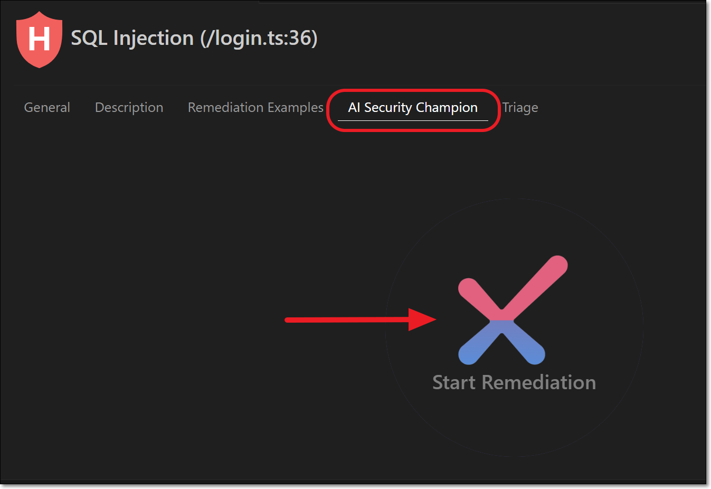<figcaption></figcaption></figure>
3. AI Security Champion provides remediation information divided into the following sections: Confidence, Explanation and Proposed Remediation.

   <figure>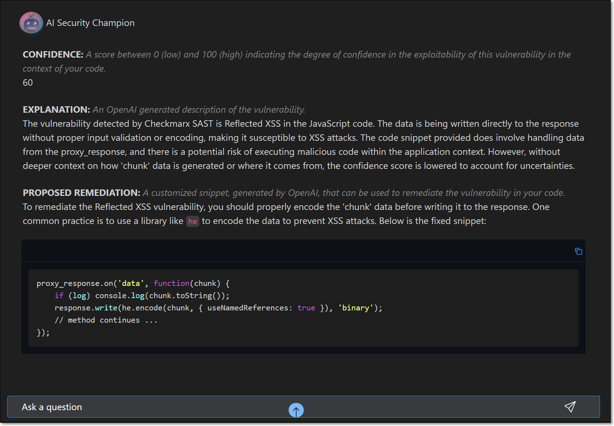<figcaption></figcaption></figure>
4. In the **Ask a question** box at the bottom you can ask a free text question to follow up on the discussion.
5. When you are satisfied with the suggestion that you received, you can take the code snippet and paste it directly into the relevant place in your code in order to remediate the vulnerability. You can then re-scan the project to verify that the remediation was effective.

#### IaC Security AI Security Champion

For IaC Security vulnerabilities we provide the context to OpenAI and suggest questions that you can ask in order to obtain the relevant remediation information.


When sending your IaC files to OpenAI, we protect your sensitive data by anonymizing all passwords and secrets before the content is sent. The query used for identifying sensitive data can be seen [here](https://github.com/Checkmarx/kics/blob/master/assets/queries/common/passwords_and_secrets/regex_rules.json).


**To use AI Security Champion for IaC Security:**

1. In the Checkmarx One results pane, select an IaC Security vulnerability that you would like to remediate.
2. In the results panel, click on the **AI Security Champion** tab.
3. Before starting the communication with OpenAI, if you would like to check which secrets will be masked, click on **Masked Secrets**.

   The Masked Secret section is expanded to show all items that will be masked.

   <figure>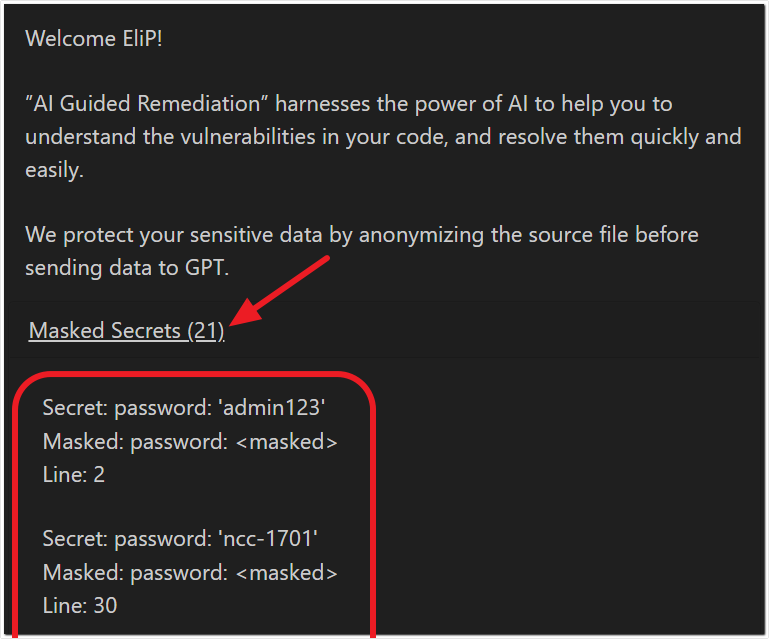<figcaption></figcaption></figure>
4. In the **AI Security Champion** panel, you can start the conversation by clicking on one of the suggested questions.

   <figure>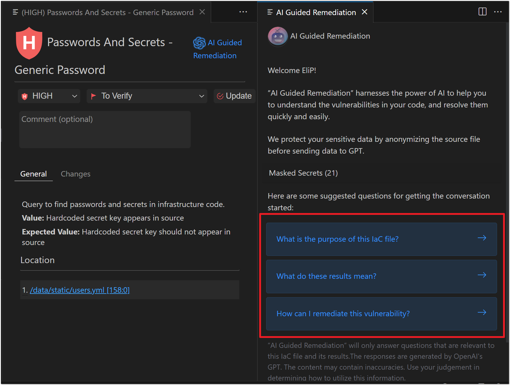<figcaption></figcaption></figure>
5. Continue the conversation with OpenAI until you gather the info that you need about remediating the vulnerability. You can also ask OpenAI to provide a code sample of the revised content.

### Checkmarx Toolbar

At the top of the Checkmarx panel, a toolbar with the following actions is available:

| **Icon** | **Item** | **Description** |
|---|---|---|
| 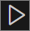 | Run Scan | Runs a new scan on the project that is open in your workspace |
|  | Filter Critical | Show/hide critical severity vulnerabilities |
|  | Filter High | Show/hide high severity vulnerabilities |
|  | Filter Medium | Show/hide medium severity vulnerabilities |
|  | Filter Low | Show/hide low severity vulnerabilities |
|  | Filter Info | Show/hide info severity vulnerabilities |
| 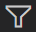 | Filter by state | Filter results by state (multi-select, by default all are selected except for **Not Exploitable**). There is a filter to show/hide **All Custom States**, i.e., all vulnerababilities that were assigned a custom state. |
| 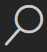 | New search | Search for a scan by selecting the Project and branch |
| 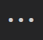 | More options | Select/deselect grouping categories. Options are: Severity, Vulnerability Type, State, Status, Language, File, and Direct Dependency (relevant for SCA). You can group by multiple parameters. The groups will be nested following the order that the grouping options are shown in the menu list. For example, if **Severity** and **Vulnerability type** are both selected, the primary grouping is by severity and the sub-grouping is by vulnerability type.  When a selected grouping is not relevant for a particular scanner (e.g., Direct Dependency is not relevant for SAST), the results for that scanner are shown as a flat list or grouped by the secondary grouping.  The **Select Different Results** option, restarts the selection wizard, enabling you to choose a new project, branch and scan. The **Clear Results Selection** option, clears the selected project, branch and scan. The **Settings** option, opens the plugin settings window. |

### Codebashing Links

Codebashing is an interactive AppSec training platform built by developers for developers. Codebashing sharpens the skills that developers need to avoid security issues, fix vulnerabilities, and write secure code in the first place. See Codebashing documentation here.

When you select a SAST vulnerability for which a Codebashing lesson exists, a link to the relevant lesson is shown in the **Description** tab. Click on the link to open the lesson in a new browser.


In order to access these links, you need to have a Codebashing account that has been linked to your Checkmarx One account. Please contact your Checkmarx support representative for assistance. For users that don't have a linked Codebashing account, a dialog opens with a link to begin a free trial.


<figure>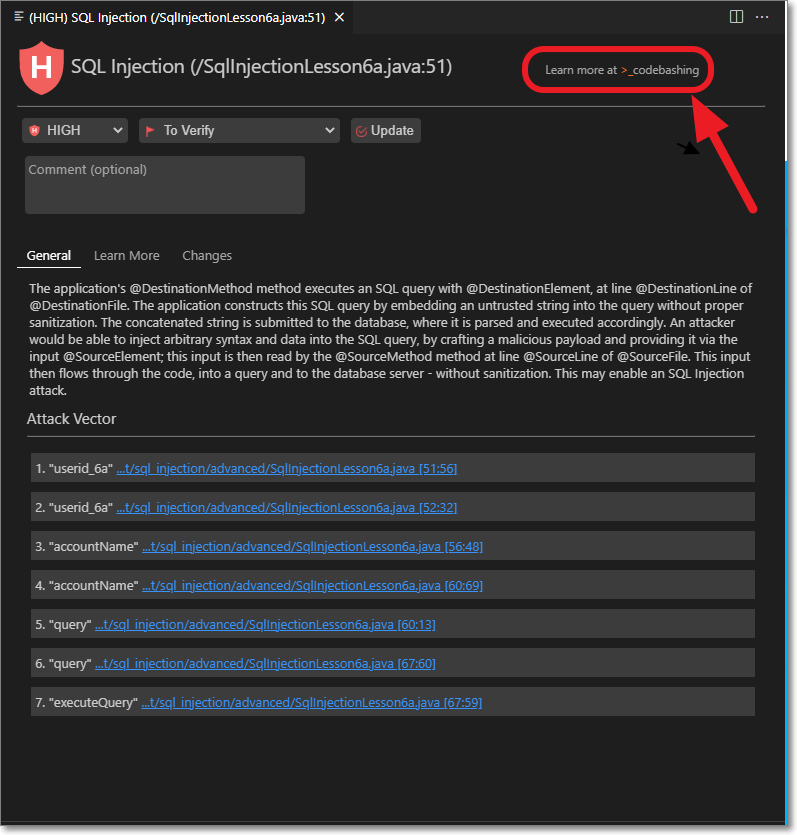<figcaption></figcaption></figure>

### Managing (Triaging) Results

Checkmarx One tracks specific vulnerability instances throughout your SDLC. Each vulnerability instance has a ‘Predicate’ associated with it, which is comprised of the following attributes: ‘state’, ‘severity’ and ‘comments’. After reviewing the results of a scan, you have the ability to triage the results and modify these predicates accordingly. For more info about triaging results in Checkmarx One, see Managing (Triaging) Vulnerabilities.

You can triage the results directly in the VS Code console. This is currently supported for SAST and IaC Security results.


Only users with the Checkmarx One role **update-result** (e.g., a risk-manager) are authorized to make changes to the predicate. Only users with the role **update-result-not-exploitable** (e.g., an admin) are authorized to mark a vulnerability as ‘Not Exploitable’.




**To edit the result predicate:**

1. Navigate to the vulnerability that you would like to edit.
2. To adjust the severity, click on the **Severity** field, and select from the dropdown list the severity that you would like to assign. Options are: Critical, High, Medium, Low or Info.

   <figure>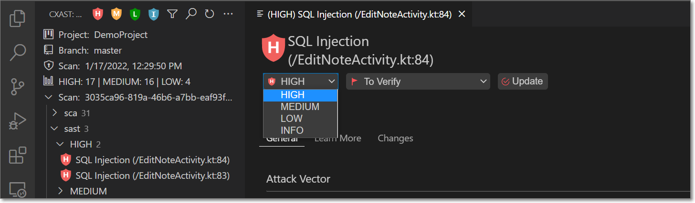<figcaption></figcaption></figure>
3. To adjust the state, click on the **State** field, and select from the dropdown list the state that you would like to assign. Options are: To Verify, Not Exploitable, Proposed Not Exploitable, Confirmed or Urgent.
4. To add a comment, click on the **Show comment** button and enter your comment in the field that opens.
5. In order to apply your changes, click **Update**.

   The new predicate is applied to the vulnerability instance in this scan as well as to recurring instances of the vulnerability in subsequent scans of the Project. The changes made to the predicate are shown in the **Changes** tab.

### Documentation & Feedback

The **Documentation & Feedback** section in the Checkmarx panel provides quick links to view our documentation and submit requests for improvements.

## ASPM Results in VS Code (BETA)

Checkmarx [Application Security Posture Management (ASPM)](../../user-guide/application-security-posture-management/README.md) is a comprehensive risk management tool that enables you to understand and prioritize the risks associated with your applications. This centralized tool consolidates results from multiple sources in order to present a holisitic view of your appsec security posture and to help you to prioritize remediation tasks.

There is a separate section in the Checkmarx extension that shows ASPM results in your IDE.

<figure>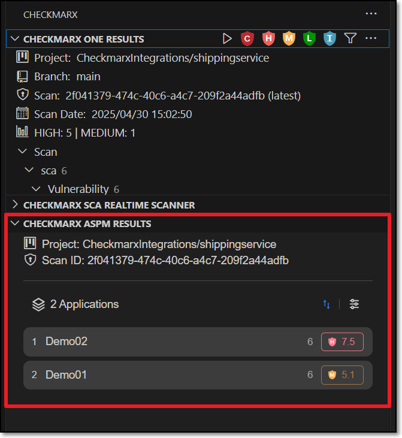<figcaption></figcaption></figure>

This section shows ASPM data for each application that is associated with the project that is currently open in the Checkmarx One Results section.


If the selected project is not associated with any applications, then no ASPM data is shown. Also, ASPM data is only shown when the most recent scan of the selected project is displayed.


Click on an application to show the most severe ASPM risks associated with the current project. Up to 50 risks are shown for each application.


The ASPM section in the IDE only shows risks associated with the current project. As opposed to the ASPM feature in the Checkmarx One portal which shows ASPM data for the entire application.


<figure>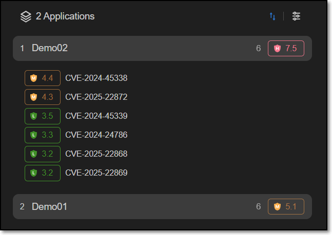<figcaption></figcaption></figure>

Click on a risk to show detailed information about that risk. This opens the same view that opens when you select a risk in the scan results section.

<figure>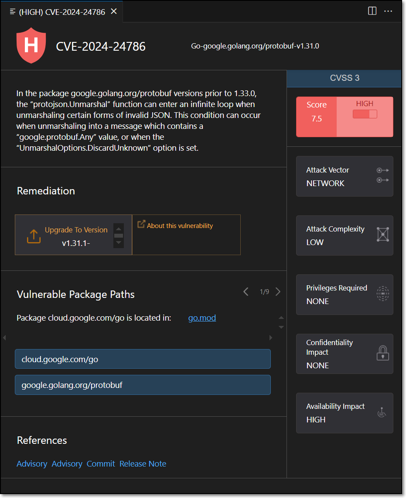<figcaption></figcaption></figure>

### Sorting and Filtering ASPM Data

Click on the sort icon 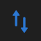 to specify the order in which the applications are listed. Options are: by Risk Score, by application name A->Z, or by application name Z->A.

Click on the filter icon  to specify which results are shown. This is a dynamic filter that shows all of the types of risks that were identified in the application. You can adjust the toggle to show/hide each type of result.


Results identified by the SAST scanner are categorized as "Code". SCA results are either "Direct Package", "Transitive Package" or "Mixed". IaC Security results are referred to as "Configuration", and BYOR are referred to as "Imported Results".


If there are risks that have additional risky traits, such as Suspected Malware or Exploitable Path, then toggles are shown to show/hide risks with each of these traits.

<figure>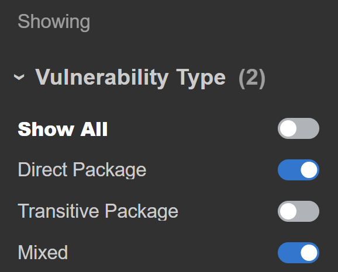<figcaption></figcaption></figure>
