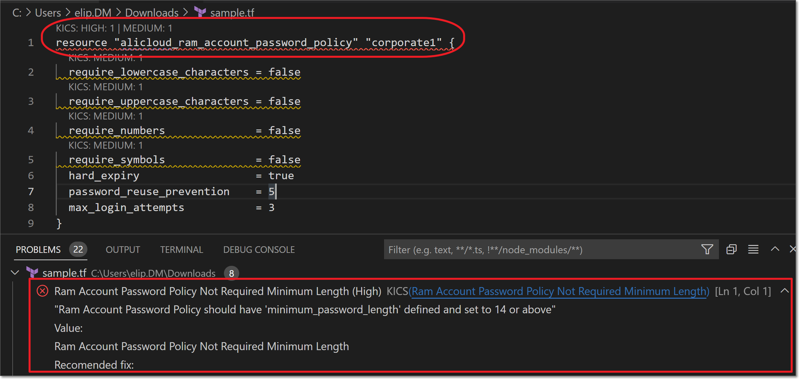
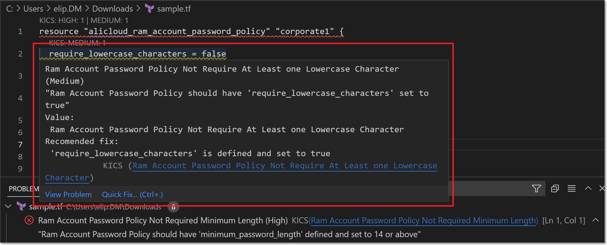
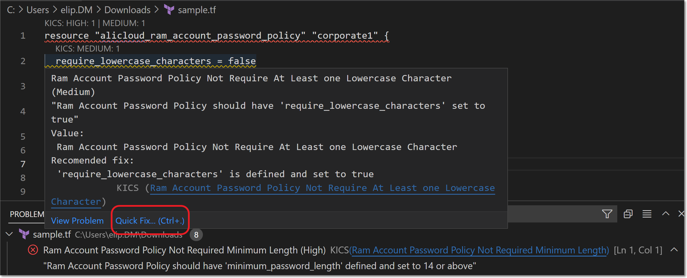
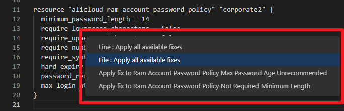
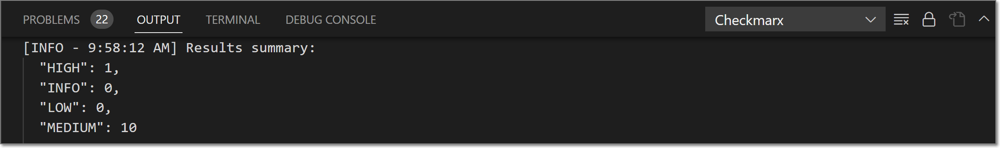
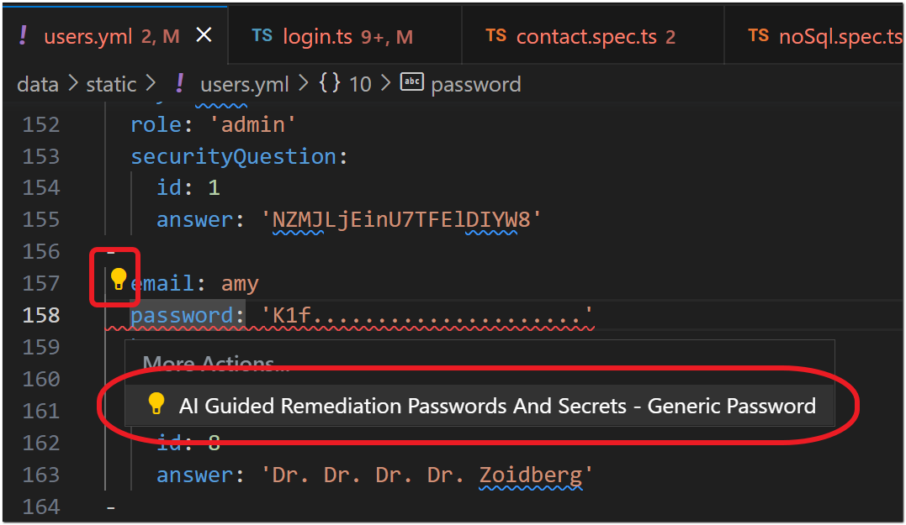
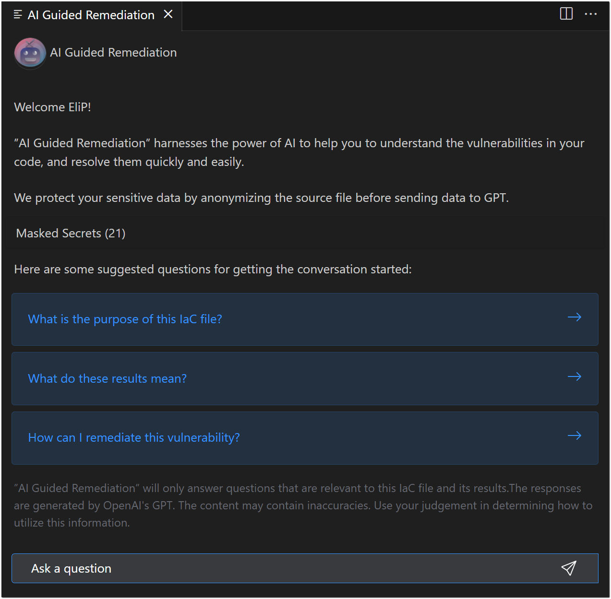

# Using the Checkmarx VS Code Extension - KICS Auto Scanning

## Scanning IaC Files

A scan runs automatically whenever an infrastructure file of a [supported type](https://docs.kics.io/latest/platforms/) is opened in VS Code. The file is rescanned each time that it is saved, either manually or by auto-save.

In addition, you can trigger a scan manually for the file that is open in your editor by opening the command palette and entering `Checkmarx-ast: Run kics realtime scan` ( you can enter search text and select the command).

## Viewing KICS Results

### Viewing KICS Vulnerabilities

Risks identified by KICS are shown in the file editor window with the KICS label and the severity level shown above the vulnerable code. The risks detected by KICS are also shown in the PROBLEMS section of the VS Code console.

<figure><figcaption></figcaption></figure>

Hover over the vulnerable code to show a tooltip with detailed info about the vulnerability.

### Auto Remediation for KICS

KICS automatically generates recommended actions for remediating each risk. You can easily implement these changes in your code, by selecting the **Quick Fix** link in the hover window.




This feature is currently supported only for Terraform projects.


The dialog that opens, enables you to remediate the selected risk. In addition, where relevant, the dialog offers the option to remediate all risks in the specified line or in the entire file.

<figure><figcaption></figcaption></figure>

### Viewing the Results Summary

When a scan is completed, a summary of the number of vulnerabilities identified, by severity level, is shown in the Checkmarx OUTPUT section of the VS Code console.

<figure><figcaption></figcaption></figure>

### AI Security Champion

AI Security Champion harnesses the power of AI to help you to understand the vulnerabilities in your code, and resolve them quickly and easily. When you initiate an AI chat, we automatically provide the context to GPT so that you can start a conversation about the precise vulnerability instance that you are assessing.


When sending your IaC files to GPT, we protect your sensitive data by anonymizing all passwords and secrets before the content is sent. The query used for identifying sensitive data can be seen [here](https://github.com/Checkmarx/kics/blob/master/assets/queries/common/passwords_and_secrets/regex_rules.json).


**To use AI Security Champion:**

1. Navigate to the code that contains a KICS vulnerability.
2. Click on the light bulb icon next to the relevantt cod to open the **More Actions** dialog showing **AI Security Champion**.

   <figure><figcaption></figcaption></figure>
3. Click on **AI Security Champion**.

   A new tab opens showing the Checkmarx **AI Security Champion** pane.

   <figure><figcaption></figcaption></figure>
4. In the AI Security Champion pane, you can start the conversation by clicking on one of the suggested questions.

   <figure><figcaption></figcaption></figure>
5. Continue the conversation with Chat GPT until you gather the info that you need about remediating the vulnerability. You can also ask GPT to provide a code sample of the revised content.
