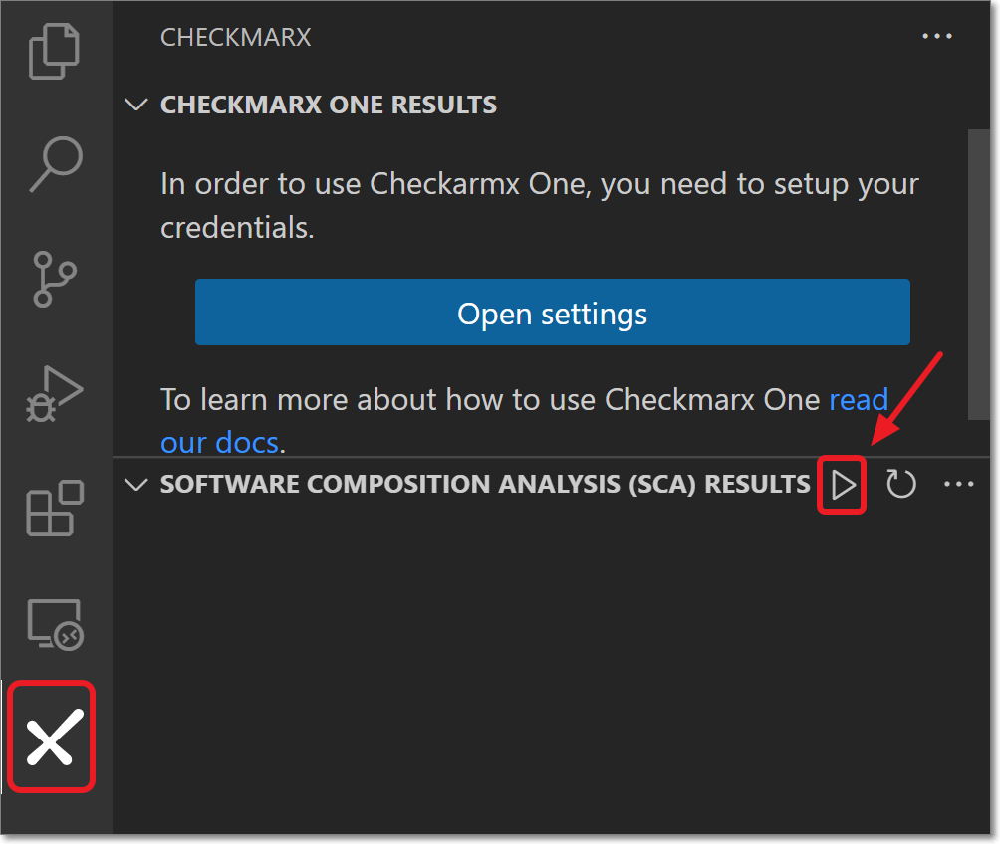
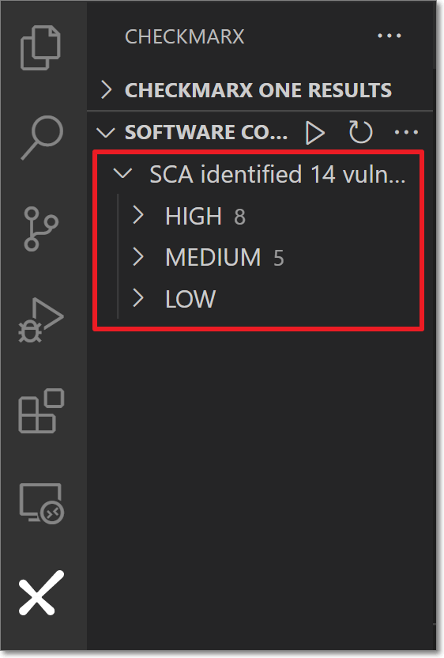
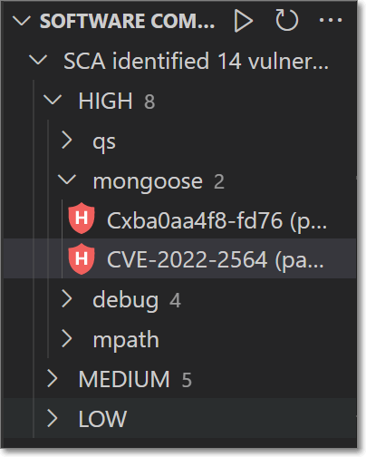
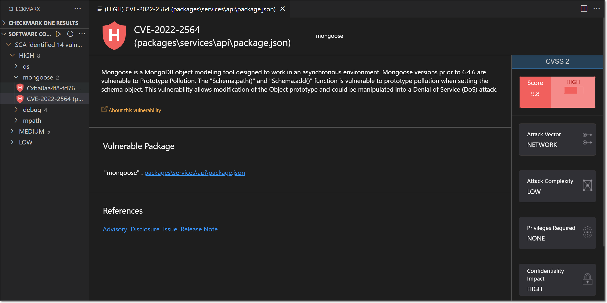

# Using the VS Code Checkmarx Extension - SCA Realtime Scanning


Scans run in the **Software Composition Analysis (SCA) Results** tab using the SCA Scanning tool are not synced with your Checkmarx One or Checkmarx SCA accounts. Also, the results shown in that tab are for the locally run scans, as opposed to Checkmarx One scan results which are shown in the Checkmarx One Results tab.



In order for this tool to be effective, you need to install all relevant package managers on your local environment, see Installing Supported Package Managers for Resolver.


## Running a Scan

**To run a scan on the project that is open in your workspace:**

1. Click on the icon in the **Activity Bar**.
2. In the **Software Composition Analysis (SCA) Results** section, click on the **play** button.

   <figure><figcaption></figcaption></figure>

   The scan results are shown in a tree structure, grouped by severity level, in the SCA Results section.

   <figure><figcaption></figcaption></figure>

## Viewing SCA Results

Once you have run an SCA scan on your project, the results are shown in the Checkmarx SCA panel in a tree structure. The results are grouped by severity level. You can drill down to see info about the vulnerabilities that affect your opensource packages.

**To view SCA scan results:**

1. The **SCA Results** panel shows results in a tree structure. Click on a severity level to show all packages with vulnerabilities of that severity.
2. Click on a package to show the vulnerabilities (of the specified severity) associated with that package.

   <figure><figcaption></figcaption></figure>
3. Click on a vulnerability to open a new panel showing detailed info about the vulnerability.

   

   The following section describes the info shown in the vulnerability details panel.

### Vulnerability Details

When a vulnerability is selected, a details panel opens, containing the following sections:

- **Header bar** - shows the vulnerability's ID (CVE or Cx), severity level, manifest file, and name of the vulnerable package.
- **Description** - gives a brief description of the vulnerability as well as a link to the Checkmarx Developers Hub where more info about the vulnerability can be seen.
- **Vulnerable Package** - gives a link to open the manifest file where the vulnerable package is specified.
- **References** - Gives links to relevant resources to learn more about the vulnerability and the fixes that are available. Links are given for topics such as: Advisory, Commit, Release Notes, Issue etc.
- **CVSS** - Shows the CVSS Version, Score, and Severity, as well as the components that make up the CVSS score including: Attack Vector, Confidentiality Impact, Attack Complexity, Integrity Impact, Authentication, and Availability Impact. For a full explanation of the metrics that make up the CVSS score, see section 2 of this [article](https://www.first.org/cvss/specification-document).
