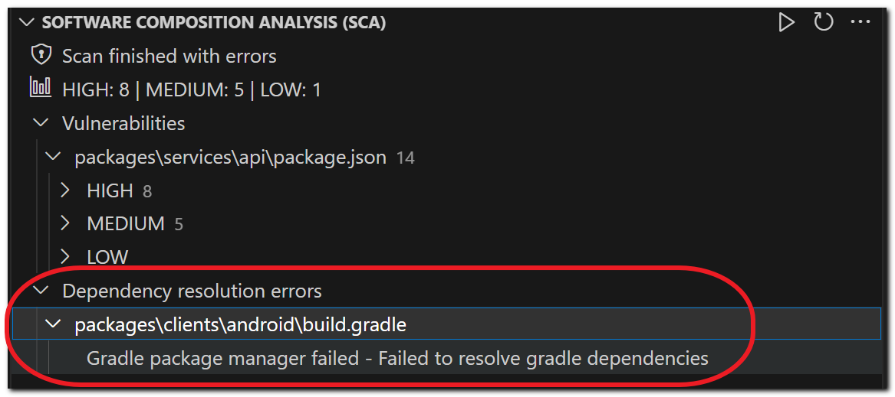
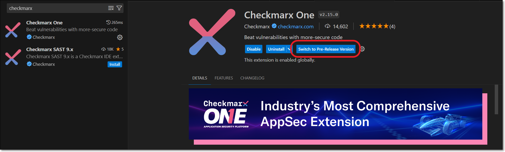

# VS Code Extension - Changelog

The following table lists of improvements and bug fixes have been implemented for the Visual Studio Code plugin with the relevant version release.


See full documentation of this plugin [here](README.md).



As of June 14, 2026, Dev Assist remediation can be triggered via natural language chat in your AI Assistant. For more information, see Remediation Via Chat.


| **Plugin Version** | **Release Date** | **CLI Version** | **Improvements** | **Bug Fixes** |
|---|---|---|---|---|
| [2.73.0](https://github.com/Checkmarx/ast-vscode-extension/releases/tag/v2.73.0) | Sep 30, 2026 | [2.3.66](https://github.com/Checkmarx/ast-cli/releases/tag/2.3.66) | • Added support for Codex AI coding agent. • For the OSS Realtime scanner, added support for uv.lock manifest files used by Python's uv package manager. | |
| [2.72.0](https://github.com/Checkmarx/ast-vscode-extension/releases/tag/v2.72.0) | Aug 27, 2026 | [2.3.60](https://github.com/Checkmarx/ast-cli/releases/tag/2.3.60) | For OSS-Realtime scanner, added support for additional package managers and associated manifest files for: • JS/TS: Yarn (1 & 2) (package.json, yarn.lock) • JS/TS: Bower (bower.json) • PHP/Drupal: Composer (composer.json, composer.lock) • Ruby: RubyGems (Gemfile, Gemfile.lock) For the complete list of supported package managers and manifest files, see Supported Manifest Files. | |
| [2.71.0](https://github.com/Checkmarx/ast-vscode-extension/releases/tag/v2.71.0) | Aug 27, 2026 | [2.3.55](https://github.com/Checkmarx/ast-cli/releases/tag/2.3.55) | • General improvements and bug fixes | |
| [2.69.0](https://github.com/Checkmarx/ast-vscode-extension/releases/tag/v2.69.0) | Jul 15, 2026 | [2.3.55](https://github.com/Checkmarx/ast-cli/releases/tag/2.3.55) | This version includes the following improvements for Developer Assist: • Enabled connection to the Checkmarx MCP server using an OAuth browser-based sign-in flow. This eliminates the need to include an API key in the MCP.json file. API key authentication remains supported for backward compatibility with existing configurations.  When using OAuth authentication (default) the MCP doesn't start running automatically, rather a user action is needed to start it.  • For OSS-Realtime scanner, added support for additional package managers and associated manifest files for: - Java: Gradle (build.gradle, build.gradle.kts) - Java: SBT (build.sbt, any .sbt file ✱) - Python: PIP (requirements.txt, requirements-\*.txt, requirement.txt, requirement-\*.txt) - Python: Setup.py / Setuptools (Setup.py, Setup.cfg) - Python: Poetry (pyproject.toml, poetry.lock) For the complete list of supported package managers and manifest files, see Supported Manifest Files. • The Contributing Developer license section now shows the plugin version alongside the IDE name. | |
| [2.64.0](https://github.com/Checkmarx/ast-vscode-extension/releases/tag/v2.65.0) | Apr 22, 2026 | [2.3.48](https://github.com/Checkmarx/ast-cli/releases/tag/2.3.48) | • General improvements and bug fixes | |
| [2.61.0](https://github.com/Checkmarx/ast-vscode-extension/releases/tag/v2.62.0) | Apr 13, 2026 | [2.3.48](https://github.com/Checkmarx/ast-cli/releases/tag/2.3.48) | • Changed the behavior so that when connection to the Checkmarx MCP is not available, the remediation agent seamlessly offers remediation for all types of risks based on the IDE's LLM. When this occurs, we provide a notification indicating that the recommendations are not based on Checkmarx's specialized models. | |
| [2.60.0](https://github.com/Checkmarx/ast-vscode-extension/releases/tag/v2.61.0) | Apr 2, 2026 | [2.3.48](https://github.com/Checkmarx/ast-cli/releases/tag/2.3.48) | • Added the option to use **Claude** for Developer Assist AI remediation. This is configured in the Checkmarx One Assist settings.  When this extension is used in an IDE that has a native AI Assistant (Windsurf, Cursor or Kiro), there is an option to **Prefer Native AI Asssistant**. This setting overrides the selected AI model.  | |
| [2.59.0](https://github.com/Checkmarx/ast-vscode-extension/releases/tag/v2.60.0) | Mar 25, 2026 | [2.3.46](https://github.com/Checkmarx/ast-cli/releases/tag/2.3.46) | • General improvements and bug fixes | |
| [2.52.0](https://github.com/Checkmarx/ast-vscode-extension/releases/tag/v2.52.0) | Mar 9, 2026 | [2.3.46](https://github.com/Checkmarx/ast-cli/releases/tag/2.3.46) | • General improvements and bug fixes | |
| [2.50.0](https://github.com/Checkmarx/ast-vscode-extension/releases/tag/v2.50.0) | Mar 4, 2026 | [2.3.46](https://github.com/Checkmarx/ast-cli/releases/tag/2.3.46) | • **Updated Login Flow for Checkmarx Developer Assist Authentication** Authentication is no longer managed through the IDE **Settings** page. Instead, a dedicated **Checkmarx One Authentication** side panel has been introduced to handle authentication and credential management. | |
| [2.49.0](https://github.com/Checkmarx/ast-vscode-extension/releases/tag/v2.49.0) | Feb 13, 2026 | [2.3.45](https://github.com/Checkmarx/ast-cli/releases/tag/2.3.45) | • We now support running the ASCA scanner from a custom installation location. By default, when ASCA is run, the binary file is installed at `$HOME/.checkmarx`. Users can now manually install the binary in a custom location and then point to that location for running ASCA scans. The ASCA location can be specified using a new global flag in the **Additional params**: `--optional-flags` with the key `asca-location` and the value specifying the value as the custom path. Example: `--optional-flags="asca-location=/home/custom/path"`. Alternatively, the key/value for the location can be specified using the environment variable `CX_OPTIONAL_FLAGS`. • In order to support running the ASCA scanner from a custom location, we added a new global param: `--optional-flags` and a key `asca-location` for which you can specify the value as the custom path. Example: `--optional-flags="asca-location=./custom/path"` | |
| [2.46.0](https://github.com/Checkmarx/ast-vscode-extension/releases/tag/v2.44.0) | Jan 13, 2026 | [2.3.42](https://github.com/Checkmarx/ast-cli/releases/tag/2.3.42) | • General improvements and bug fixes | |
| [2.45.0](https://github.com/Checkmarx/ast-vscode-extension/releases/tag/v2.44.0) | Jan 12, 2026 | [2.3.42](https://github.com/Checkmarx/ast-cli/releases/tag/2.3.42) | • Changed extension name from **Checkmarx One** to **Checkmarx** | |
| [2.44.0](https://github.com/Checkmarx/ast-vscode-extension/releases/tag/v2.44.0) | Dec 31, 2025 | [2.3.42](https://github.com/Checkmarx/ast-cli/releases/tag/2.3.42) | • You can now triage SCA results — edit the state and add comments directly from the Visual Studio Code console. (Changing severity is not supported for SCA in VS Code.) • The plugin was adapted to make it compatible also with Kiro IDE. Starting with this version the extension can also be used in Kiro. | |
| [2.43.0](https://github.com/Checkmarx/ast-vscode-extension/releases/tag/v2.43.0) | Dec 15, 2025 | [2.3.41](https://github.com/Checkmarx/ast-cli/releases/tag/2.3.41) | • General improvements and bug fixes | |
| [2.42.0](https://github.com/Checkmarx/ast-vscode-extension/releases/tag/v2.42.0) | Nov 6, 2025 | [2.3.38](https://github.com/Checkmarx/ast-cli/releases/tag/2.3.38) | • General improvements and bug fixes | |
| [2.41.0](https://github.com/Checkmarx/ast-vscode-extension/releases/tag/v2.41.0) | Nov 6, 2025 | [2.3.38](https://github.com/Checkmarx/ast-cli/releases/tag/2.3.38) | • General improvements and bug fixes | |
| [2.40.0](https://github.com/Checkmarx/ast-vscode-extension/releases/tag/v2.39.0) | Oct 16, 2025 | [2.3.38](https://github.com/Checkmarx/ast-cli/releases/tag/2.3.38) | • General improvements and bug fixes | |
| [2.39.0](https://github.com/Checkmarx/ast-vscode-extension/releases/tag/v2.39.0) | Sep 29, 2025 | [2.3.36](https://github.com/Checkmarx/ast-cli/releases/tag/2.3.36) | • General improvements and bug fixes | |
| [2.38.0](https://github.com/Checkmarx/ast-vscode-extension/releases/tag/v2.38.0) | Aug 21, 2025 | [2.3.33](https://github.com/Checkmarx/ast-cli/releases/tag/2.3.33) | • General improvements and bug fixes | |
| [2.37.0](https://github.com/Checkmarx/ast-vscode-extension/releases/tag/v2.37.0) | Aug 21, 2025 | [2.3.33](https://github.com/Checkmarx/ast-cli/releases/tag/2.3.33) | • Added support for setting up a proxy server for communicating with Checkmax One. For more info, see [documentation](installing-and-setting-up-the-checkmarx-vs-code-extension.md#setting-up-the-extension) | |
| [2.36.0](https://github.com/Checkmarx/ast-vscode-extension/releases/tag/v2.36.0) | Aug 21, 2025 | [2.3.32](https://github.com/Checkmarx/ast-cli/releases/tag/2.3.32) | • General improvements and bug fixes | |
| [2.35.0](https://github.com/Checkmarx/ast-vscode-extension/releases/tag/v2.35.0) | Aug 14, 2025 | [2.3.31](https://github.com/Checkmarx/ast-cli/releases/tag/2.3.31) | • Enabled specifying a custom AI model (other than those hard-coded in our system) for Checkmarx Security Champion. All AI models that are available for your Open AI API key will be available for selection. • Added a filter to show/hide all vulnerabilities for which a custom state was applied. • Implemented consistant behavior for grouping hierarchy. The hierarchy always follows the order that the grouping options are shown in the menu list. For example, if **Severity** and **Vulnerability type** are both selected, the primary grouping is by severity and the sub-grouping is by vulnerability type. **Developer Assist:** We have added Checkmarx Developer Assist to the VS Code plugin. This new tool empowers developers to identify risks in their code in realtime and harness the power of AI to remediate the risks on the spot. Checkmarx Dev Assist comprises two main elements: • **Realtime Scanning -** Identify vulnerabilities in realtime during IDE development of both human-generated and AI-generated code. Our super-fast scanners run in the background whenever you open or edit a relevant file. Our scanners identify vulnerabilities and unmasked secrets in your code. We also identify vulnerable or malicious container images and open source packages used in your project. Results are marked as Problems which are highlighted in the code and annotated with identifying icons. • **Agentic-AI Remediation** – Initiate an Agentic-AI session to receive remediation suggestions. Checkmarx feeds all relevant info to the AI agent which accesses our MCP server to gather data from our proprietary databases and customized AI models. The AI assistant then uses this data to generate remediated code for your project. You can accept the suggested changes or you can chat with the AI agent to learn more about the vulnerability and fine-tune the remediation suggestion. For more information, see documentation | |
| [2.34.0](https://github.com/Checkmarx/ast-vscode-extension/releases/tag/v2.34.0) | May 19, 2025 | [2.3.20](https://github.com/Checkmarx/ast-cli/releases/tag/2.3.20) | • General improvements and bug fixes | |
| [2.33.0](https://github.com/Checkmarx/ast-vscode-extension/releases/tag/v2.33.0) | May 6, 2025 | [2.3.20](https://github.com/Checkmarx/ast-cli/releases/tag/2.3.14) | • We added the option to connect the VS Code extension to your Checkmarx One account using an OAuth login flow. If you select this option, you will need to submit the base URL of your system and your Tenant Name. You can then log in using your Username and Password or via SSO.  The option to connect via an API Key is still supported. However, if you had previously submitted an API Key, after installing this version of the extension you will need to re-submit your API Key.  See [documentation](installing-and-setting-up-the-checkmarx-vs-code-extension.md) | |
| [2.32.0](https://github.com/Checkmarx/ast-vscode-extension/releases/tag/v2.32.0) | May 6, 2025 | [2.3.20](https://github.com/Checkmarx/ast-cli/releases/tag/2.3.20) | • The Checkmarx One extension now shows a separate tab with ASPM results for the selected project. This enables developers to easily prioritize the most urgent risks while working in their IDE. Learn more about ASPM [here](../../user-guide/application-security-posture-management/application-risk-management/README.md). See [documentation](using-the-checkmarx-vs-code-extension---checkmarx-one-platform.md#aspm-results-in-vs-code-beta) | |
| [2.31.0](https://github.com/Checkmarx/ast-vscode-extension/releases/tag/v2.31.0) | Feb 13, 2025 | [2.3.14](https://github.com/Checkmarx/ast-cli/releases/tag/2.3.14) | • General improvements and bug fixes | |
| [2.30.0](https://github.com/Checkmarx/ast-vscode-extension/releases/tag/v2.30.0) | Jan 28, 2025 | [2.3.12](https://github.com/Checkmarx/ast-cli/releases/tag/2.3.12) | • You can now view results from the **Secret Detection** scanner in VS Code. When you click on a result, the result details are shown in three tabs: **General**, **Description** and **Remediation Examples**. • We now use pagination when loading projects and branches in order to cut the loading time. We now load only 20 items at a time.  This does not affect the search box, which still searches all projects and not only those that are currently loaded.  | • Fixed issue that ASCA scanner had been marking results (with a squiggly underline) from the beginning of the line even when the code was indented. |
| [2.29.0](https://github.com/Checkmarx/ast-vscode-extension/releases/tag/v2.29.0) | Dec 31, 2024 | [2.3.9](https://github.com/Checkmarx/ast-cli/releases/tag/2.3.9) | • We now show a warning when the selected Checkmarx One project doesn't match the local project in your workspace. • Improved ability to load results for projects with a large number of results (above 40k). | |
| [2.28.0](https://github.com/Checkmarx/ast-vscode-extension/releases/tag/v2.28.0) | Dec 17, 2024 | [2.3.7](https://github.com/Checkmarx/ast-cli/releases/tag/2.3.7) | • Added the ability to create a new branch in the Checkmarx project when you run a scan from the IDE. | • Fixed issue that the "run scan" button wasn't reactivated after a scan failed. |
| [2.27.0](https://github.com/Checkmarx/ast-vscode-extension/releases/tag/v2.27.0) | Dec 4, 2024 | [2.3.6](https://github.com/Checkmarx/ast-cli/releases/tag/2.3.6) | • General improvements and bug fixes | |
| [2.26.0](https://github.com/Checkmarx/ast-vscode-extension/releases/tag/v2.26.0) | Nov 18, 2024 | [2.3.5](https://github.com/Checkmarx/ast-cli/releases/tag/2.3.5) | • General improvements and bug fixes | |
| [2.25.0](https://github.com/Checkmarx/ast-vscode-extension/releases/tag/v2.25.0) | Nov 5, 2024 | [2.3.3](https://github.com/Checkmarx/ast-cli/releases/tag/2.3.3) | • General improvements and bug fixes | |
| [2.24.0](https://github.com/Checkmarx/ast-vscode-extension/releases/tag/v2.24.0) | Oct 20, 2024 | [2.3.1](https://github.com/Checkmarx/ast-cli/releases/tag/2.3.1) | • General improvements and bug fixes | |
| [2.23.0](https://github.com/Checkmarx/ast-vscode-extension/releases/tag/v2.23.0) | Oct 11, 2024 | [2.3.0](https://github.com/Checkmarx/ast-cli/releases/tag/2.3.0) | | • Fixed issue that KICS scans were failing due to syntax problems in the additional parameters. |
| [2.22.0](https://github.com/Checkmarx/ast-vscode-extension/releases/tag/v2.22.0) | Oct 8, 2024 | [2.3.0](https://github.com/Checkmarx/ast-cli/releases/tag/2.3.0) | • General improvements and bug fixes | |
| [2.21.0](https://github.com/Checkmarx/ast-vscode-extension/releases/tag/v2.21.0) | Sep 25, 2024 | [2.2.5](https://github.com/Checkmarx/ast-cli/releases/tag/2.2.5) | • The name of the **Vorpal** scanner was changed to **AI Secure Coding Assistant (ASCA)**. | |
| [2.20.0](https://github.com/Checkmarx/ast-vscode-extension/releases/tag/v2.20.0) | Sep 16, 2024 | [2.2.5](https://github.com/Checkmarx/ast-cli/releases/tag/2.2.5) | • Added support for running the Vorpal scanner on Linux and MacOS ARM machines (in addition to existing support for Windows). | |
| [2.19.0](https://github.com/Checkmarx/ast-vscode-extension/releases/tag/v2.18.0) | Aug 26, 2024 | [2.2.0](https://github.com/Checkmarx/ast-cli/releases/tag/2.2.0) | • | • We now correctly label the issues identified by the Vorpal scanner as "best practice" issues and not vulnerabilities. |
| [2.18.0](https://github.com/Checkmarx/ast-vscode-extension/releases/tag/v2.18.0) | Aug 23, 2024 | [2.2.0](https://github.com/Checkmarx/ast-cli/releases/tag/2.2.0) | • Added the **AI Secure Coding Assistant (ASCA)**. The ASCA scanner is a lightweight scan engine that runs in the background as you work in VS Code. Whenever you edit a file in VS Code the ASCA scanner automatically scans that file. • Changed the name of **KICS Auto Scanning** to **KICS Real-time scanning**. | • Fixed issue that the Output tab would open every time the user opens a new window. |
| [2.17.0](https://github.com/Checkmarx/ast-vscode-extension/releases/tag/v2.17.0) | July 29, 2024 | [2.2.0](https://github.com/Checkmarx/ast-cli/releases/tag/2.2.0) | • General improvements and bug fixes | |
| [2.16.0](https://github.com/Checkmarx/ast-vscode-extension/releases/tag/v2.16.0) | July 29, 2024 | [2.2.0](https://github.com/Checkmarx/ast-cli/releases/tag/2.2.0) | | • Fixed issue running IDE scans on projects with special characters (such as ":"). |
| [2.15.0](https://github.com/Checkmarx/ast-vscode-extension/releases/tag/v2.15.0) | July 16, 2024 | [2.2.0](https://github.com/Checkmarx/ast-cli/releases/tag/2.2.0) | • Changed the name of the extension from Checkmarx to **Checkmarx One**. | • Resolved issue that it wasn't possible to run a scan on a Project for which no vulnerabilities were found in the previous scan. • Improved the error message when a user without proper permissions tries to initiate a scan. |
| [2.14.0](https://github.com/Checkmarx/ast-vscode-extension/releases/tag/v2.14.0) | June 20, 2024 | [2.1.6](https://github.com/Checkmarx/ast-cli/releases/tag/2.1.6) | • General improvements and bug fixes. | |
| [2.13.0](https://github.com/Checkmarx/ast-vscode-extension/releases/tag/v2.13.0) | May 20, 2024 | [2.1.2](https://github.com/Checkmarx/ast-cli/releases/tag/2.1.2) | • General improvements and bug fixes. | |
| [2.12.0](https://github.com/Checkmarx/ast-vscode-extension/releases/tag/v2.12.0) | May 20, 2024 | [2.1.2](https://github.com/Checkmarx/ast-cli/releases/tag/2.1.2) | • The CLI that this plugin is based on is now signed with the Checkmarx digital signature, indicating that this is an official Checkmarx product. This enables communication from this plugin to bypass firewalls on Windows computers that previously blocked the unsigned CLI. | |
| [2.11.0](https://github.com/Checkmarx/ast-vscode-extension/releases/tag/v2.11.0) | May 8, 2024 | [2.1.0](https://github.com/Checkmarx/ast-cli/releases/tag/2.1.0) | | • Fixed broken documentation link in marketplace. |
| [2.10.0](https://github.com/Checkmarx/ast-vscode-extension/releases/tag/v2.10.0) | Apr 22, 2024 | [2.0.72](https://github.com/Checkmarx/ast-cli/releases/tag/2.0.72) | | • Fixed issue that vulnerability descriptions weren't being shown for results from container scans. |
| [2.9.0](https://github.com/Checkmarx/ast-vscode-extension/releases/tag/v2.9.0) | Apr 9, 2024 | [2.0.72](https://github.com/Checkmarx/ast-cli/releases/tag/2.0.72) | • Improved display of scan date in the Checkmarx One Results panel. | |
| [2.8.0](https://github.com/Checkmarx/ast-vscode-extension/releases/tag/v2.8.0) | Mar 15, 2024 | [2.0.70](https://github.com/Checkmarx/ast-cli/releases/tag/2.0.70) | | • Fixed a problem that was introduced in the previous release. |
| [2.7.0](https://github.com/Checkmarx/ast-vscode-extension/releases/tag/v2.7.0) | Mar 13, 2024 | [2.0.70](https://github.com/Checkmarx/ast-cli/releases/tag/2.0.70) | • Changed the name of the **AI Guided Remediation** feature to **AI Security Champion**. • Moved the Codebashing links into the **Description** tab. | • Remediated vulnerabilities that we identified in our project. • Uses new CLI version in which vulnerabilities affecting that project have been remediated. • In the AI Security Champion tab, we improved the formatting of the response, and fixed the description of the "Confidence" score to accurately explain that it represents the likelihood of the vulnerability being exploited. |
| [2.6.0](https://github.com/Checkmarx/ast-vscode-extension/releases/tag/v2.6.0) | Feb 2, 2024 | [2.0.64](https://github.com/Checkmarx/ast-cli/releases/tag/2.0.64) | • We added AI Guided Remediation for SAST vulnerabilities (in addition to existing support for IaC Security vulnerabilities). We send the Checkmarx scan results file to OpenAI together with code snippets around each node of the Attack Vector for the specified vulnerability. We also submit a pre-configured series of instructions to OpenAI, which generates a response that includes the following sections: Confidence, Explanation and Proposed Remediation sections. You can follow up with additional questions. For more information see [AI Guided Remediation](using-the-checkmarx-vs-code-extension---checkmarx-one-platform.md#ai-security-champion)  This feature needs to be enabled for your organization's account by a Checkmarx admin user under **Account Settings** > **Settings** > **Plugins** in the Checkmarx One web portal.  | |
| [2.5.0](https://github.com/Checkmarx/ast-vscode-extension/releases/tag/v2.5.0) | Oct 11, 2023 | [2.0.57](https://github.com/Checkmarx/ast-cli/releases/tag/2.0.57) | | • Fixed issue that KICS Auto Scanning had been running even when the feature was disabled. • Fixed issue related to incorrect use of log object. • Updated for CLI version that uses GO version 1.21.1, in order to remediate a vulnerability. |
| [2.4.0](https://github.com/Checkmarx/ast-vscode-extension/releases/tag/v2.4.0) | August 11, 2023 | [2.0.54](https://github.com/Checkmarx/ast-cli/releases/tag/2.0.54) | | • Fixed issue related to showing masked secrets in the AI Guided Remediation tab. |
| [2.3.0](https://github.com/Checkmarx/ast-vscode-extension/releases/tag/v2.3.0) | August 9, 2023 | [2.0.54](https://github.com/Checkmarx/ast-cli/releases/tag/2.0.54) | • Added `Podfile` and `Podfile.lock` to the list of included files (when creating the zip archive for scanning). | • Fixed issue that had been causing KICS Realtime scans to fail. • Fixed issue that HTML output wasn't being shown properly for results that contain HTML content. • Stopped showing the Policy Violation header in the console results for projects that don't have any associated polities. |
| [2.2.0](https://github.com/Checkmarx/ast-vscode-extension/releases/tag/v2.2.0) | July 29, 2023 | [2.0.53](https://github.com/Checkmarx/ast-cli/releases/tag/2.0.53) | • We added ”AI Guided Remediation” feature, which harnesses the power of Open AI's GPT to help you to understand the vulnerabilities in your code, and resolve them quickly and easily. This feature is currently supported only for IaC Security vulnerabilities.  This feature needs to be activated for your tenant account via the web portal **Account Settings** > **Settings** > **Plugins**. This option may not be available yet in some environments.  When you initiate an AI chat, we automatically provide the context to GPT so that you can start a conversation about the precise vulnerability instance that you are assessing.  When sending your IaC files to GPT, we protect your sensitive data by anonymizing all passwords and secrets before the content is sent. The query used for identifying sensitive data can be seen [here](https://github.com/Checkmarx/kics/blob/master/assets/queries/common/passwords_and_secrets/regex_rules.json).  • Added a new **Documentation & Feedback** section to the Checkmarx panel, providing quick links to view our documentation and submit requests for improvements. | • Fixed issue that risk management (triaging results) hadn't been working for IaC Security risks. |
| [2.1.0](https://github.com/Checkmarx/ast-vscode-extension/releases/tag/v2.1.0) | May 29, 2023 | [2.0.47](https://github.com/Checkmarx/ast-cli/releases/tag/2.0.47) | • For SCA Realtime scans that return incomplete results, we now show a **Dependency resolution errors** section which gives info about manifest files that weren't resolved and the reason for the error (e.g., relevant package managers not installed locally).  • We now create nightly pre-release versions of this extension whenever we merge new code. Users have the option to update automatically to the latest pre-release version or to update only when a new release version is published. If you would like to start receiving automatic updates whenever a new pre-release (or release) version is created, go to the Checkmarx extension page and click on **Switch to Pre-Release Version**. Otherwise, you will continue to get updates only when a new release version is created.  • We now show the complete Changelog for this extension in Marketplace as well as on the Checkmarx Extension page that is shown in the IDE. | |
| [2.0.18](https://github.com/Checkmarx/ast-vscode-extension/releases/tag/2.0.18) | Apr 28, 2023 | [2.0.46](https://github.com/Checkmarx/ast-cli/releases/tag/2.0.46) | • Added error handling for SCA Realtime scanner. | |
| [2.0.17](https://github.com/Checkmarx/ast-vscode-extension/releases/tag/2.0.17) | Apr 11, 2023 | [2.0.44](https://github.com/Checkmarx/ast-cli/releases/tag/2.0.44) | | • Fixed problem that was introduced in version 2.0.15 relating to showing SCA Realtime results. |
| [2.0.16](https://github.com/Checkmarx/ast-vscode-extension/releases/tag/2.0.16) | Apr 11, 2023 | [2.0.44](https://github.com/Checkmarx/ast-cli/releases/tag/2.0.44) | | • Fixed problem that was introduced in version 2.0.15 relating to **Create Scan** button. |
| [2.0.15](https://github.com/Checkmarx/ast-vscode-extension/releases/tag/2.0.15) | Apr 6, 2023 | [2.0.44](https://github.com/Checkmarx/ast-cli/releases/tag/2.0.44) | • Improved visibility of the **Create Scan** button by moving it to the header bar of the Checkmarx pane. | • Fixed issue that the **Create Scan** button had been disabled after unexpected shutdown. • Fixed issue that SCA Realtime wasn't yielding results for users that didn't enter account credentials.  This is a free tool that does not require a Checkmarx account.  • Fixed issue that filters hadn't been functioning properly. |
| [2.0.14](https://github.com/Checkmarx/ast-vscode-extension/releases/tag/2.0.14) | Mar 13, 2023 | [2.0.42](https://github.com/Checkmarx/ast-cli/releases/tag/2.0.42) | • Added the SCA Realtime scanner tool, which enables all VS Code users to run an SCA scan on the project in their workspace and view results in the VS Code console.  This is a free tool that doesn't require a Checkmarx One or Checkmarx SCA account. For Checkmarx users, the results are not synced with their account.  | |
| [2.0.13](https://github.com/Checkmarx/ast-vscode-extension/releases/tag/2.0.13) | Dec 7, 2022 | [2.0.37](https://github.com/Checkmarx/ast-cli/releases/tag/2.0.37) | • The KICS scanner is now referred to in Checkmarx One as "IaC Security". All mentions of the scanner and the vulnerabilities identified by it, now refer to IaC Security.  This change does not apply to the KICS Auto Scanning tool (free tool), which will continue to be referred to as KICS.  • Scan results now differentiate between regular SCA vulnerabilities and Supply Chain Security (SCS) risks. • We added a new grouping category. For SCA vulnerabilities you can now differentiate between Direct Dependencies and Transitive Dependencies in the results tree. | |
| [2.0.12](https://github.com/Checkmarx/ast-vscode-extension/releases/tag/2.0.12) | Nov 10, 2022 | [2.0.34](https://github.com/Checkmarx/ast-cli/releases/tag/2.0.34) | • The "Code samples" tab was renamed "Remediation Examples". | |
| [2.0.11](https://github.com/Checkmarx/ast-vscode-extension/releases/tag/2.0.11) | Oct 25, 2022 | [2.0.31](https://github.com/Checkmarx/ast-cli/releases/tag/2.0.31) | • You can now initiate scans directly from your IDE. This empowers developers to identify vulnerabilities and remediate them **as they code**. This feature is currently supported for **VS Code** and **JetBrains**. This feature needs to be enabled for your organization's account by a Checkmarx admin user under **Account Settings**. You can run a new scan on an existing Checkmarx project by simply clicking on the "play" button in the Checkmarx panel. A Checkmarx scan runs on the files in your current workspace. • We have simplified the integration procedure for IDE plugins. It is no longer required to enter the **Base URL** or **Tenant Name** of your Checkmarx One account. Now, you just enter your API Key, and we extract all of the relevant account info from that Key. • In the Checkmarx AST settings, there is now a field for adding additional params. This can be used to manually submit the base url and tenant name (in case there is a problem extracting them from the API Key) or to add global params such as `--debug` or `--proxy`. To learn more about CLI params, see [Checkmarx One CLI Commands](../../cli-tool/checkmarx-one-cli-commands/README.md). | • Fixed results panel for KICS results. The code samples tab is no longer shown. |
| [2.0.10](https://github.com/Checkmarx/ast-vscode-extension/releases/tag/2.0.10) | Sep 19, 2022 | [2.0.27](https://github.com/Checkmarx/ast-cli/releases/tag/2.0.27) | • In the SAST results viewer, we added new tabs with additional info about each vulnerability. - **Learn More** - Gives detailed information about the the nature of the risk and their causes, as well as remediation recommendations. - **Code Samples** - Shows a sample of code that is subject to this vulnerability, followed by a remediated version of that code. • A notification is now shown in the **Output** section when KICS Auto-Scanning identifies an IaC vulnerability for which Checkmarx offers a suggested "quick-fix". | |
| [2.0.9](https://github.com/Checkmarx/ast-vscode-extension/releases/tag/2.0.9) | Sep 2, 2022 | [2.0.27](https://github.com/Checkmarx/ast-cli/releases/tag/2.0.27) | • In the SCA results viewer, we added an automatic remediation button, which enables users to automatically replace a vulnerable package version with a non-vulnerable version of that package.  This feature is currently supported only for NPM and only for direct dependencies.  • It is now possible to add a comment to a vulnerability without changing the state or severity of the vulnerability. • All documentation links now point to the new Checkmarx documentation portal at [https://checkmarx.com/resource/documentation](https://checkmarx.com/resource/documentation). | |
| [2.0.8](https://github.com/Checkmarx/ast-vscode-extension/releases/tag/2.0.8) | Aug 12, 2022 | [2.0.21](https://github.com/Checkmarx/ast-cli/releases/tag/2.0.21) | We added a "Quick Fix" feature, enabling users to automatically apply remediation recommendations for KICS risks. There is an option to fix a specific risk or to fix all risks in a particular file or in the entire project. | |
| [2.0.7](https://github.com/Checkmarx/ast-vscode-extension/releases/tag/2.0.7) | Jul 29, 2022 | [2.0.21](https://github.com/Checkmarx/ast-cli/releases/tag/2.0.21) | | Fixed the issue that the extension wasn’t working if Git wasn’t enabled in VS Code. |
| [2.0.6](https://github.com/Checkmarx/ast-vscode-extension/releases/tag/2.0.6) | Jul 22, 2022 | [2.0.21](https://github.com/Checkmarx/ast-cli/releases/tag/2.0.21) | | Clicking on a node in the Attack Vector now takes you to the relevant code in the editor window (as expected). |
| [2.0.5](https://github.com/Checkmarx/ast-vscode-extension/releases/tag/2.0.5) | Jul 5, 2022 | [2.0.21](https://github.com/Checkmarx/ast-cli/releases/tag/2.0.21) | • General improvements and bug fixes | |
| **[2.0.4](https://github.com/Checkmarx/ast-vscode-extension/releases/tag/2.0.4)** | Jun 22, 2022 | [2.0.20](https://github.com/Checkmarx/ast-cli/releases/tag/2.0.20) | • Added a new tool to the VS Code plugin that initiates KICS scans directly from their VS Code console. This is a **free tool** provided by Checkmarx for all VS Code users, and does not require the user to submit credentials for a Checkmarx One account. For more info, see [Visual Studio Code - KICS Auto Scanning](using-the-checkmarx-vs-code-extension---kics-auto-scanning.md). • Added hover tooltip for codebashing links. • Once a project and branch are selected, the latest scan of that branch is automatically loaded. | |
| **[2.0.3](https://github.com/Checkmarx/ast-vscode-extension/releases/tag/2.0.3)** | Jun 14, 2022 | | • Once the project and branch are selected, the latest scan is automatically loaded. | |
| **[2.0.2](https://github.com/Checkmarx/ast-vscode-extension/releases/tag/2.0.2)** | Apr 12, 2022 | [2.0.16](https://github.com/Checkmarx/ast-cli/releases/tag/2.0.16) | • Added support for users that don’t have git installed. | • Fixed issue loading result with Urgent state. |
| **[2.0.1](https://github.com/Checkmarx/ast-vscode-extension/releases/tag/2.0.1)** | Mar 30, 2022 | | • Added links to the relevant Codebashing lessons. | |
| **[0.0.10](https://github.com/Checkmarx/ast-vscode-extension/releases/tag/0.0.10)** | Feb 25, 2022 | [2.0.13](https://github.com/Checkmarx/ast-cli/releases/tag/2.0.13) | • Enabled selecting multiple groups in order to create nested display | Fixed bugs affecting the UI |
| **[0.0.9](https://github.com/Checkmarx/ast-vscode-extension/releases/tag/0.0.9)** | Jan 26, 2022 | | • Added ability to triage results directly from the IDE console • Added a brief description for SAST vulnerabilities • Updated UI elements to reflect the new Checkmarx branding (e.g., logo) • Added filter results by “state” • General UI improvements | |
| **0.0.8** | Nov 3, 2021 | | • Updated CLI to version 2.0.4 • Shows logs of Checkmarx One results in “Output” tab • Added a “Clear” button to “Projects” tab, enabling clearing the current selection and results. • Added integration tests and UI tests | • Fixed display of line and column in the “Details” section to match the line and column shown in the editor |
| **0.0.1** | | | Initial release of the plugin. Enables you to import results from a Checkmarx One scan directly into your VS Code console. • Import Checkmarx One scan results • Show results from all scan types (SAST, SCA, and KICS) • Group results by file, language, severity, and status • Navigate from results directly to the vulnerable code in the editor • Vulnerable code is highlighted in the editor | |
