# Installing and Setting up the Checkmarx Windsurf Extension

## Installing the Extension

The Windsurf Extension is available on the [Open VSX Registry](https://open-vsx.org/extension/checkmarx/ast-results). You can initiate the installation directly from within Windsurf.


Although there is no dedicated Checkmarx plugin for Windsurf, the plugin for VS Code has been tested and is effective for use in Windsurf.



The **Checkmarx** VS Code extension includes the Checkmarx One Assist feature as part of the Checkmarx One platform experience and should be used by Checkmarx One customers with a Checkmarx One Assist license. The **Checkmarx** and **Checkmarx Developer Assist** VS Code extensions are mutually exclusive. To use the Checkmarx extension, ensure that the Checkmarx Developer Assist extension is uninstalled before installation. If you are not a Checkmarx One customer and are trying to install the **Checkmarx Developer Assist** VS Code extension, see Initial Setup and Configuration.


**To install the extension:**

1. Open Windsurf.
2. In the main menu, click on the **Extensions** icon.
3. Search for the **Checkmarx** extension, then click **Install** for that extension.

   <figure>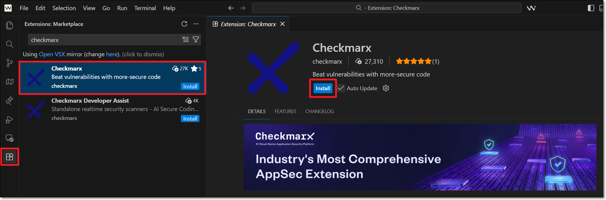<figcaption></figcaption></figure>

   The Checkmarx extension is installed, and the Checkmarx icon appears on the left-side navigation panel.

   <figure>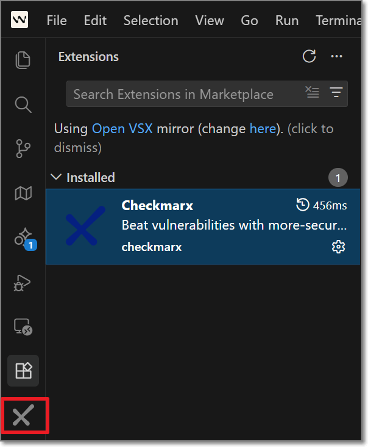<figcaption></figcaption></figure>

## Setting up the Extension

After installing the plugin, in order to use Checkmarx One Platform tool you need to configure access to your Checkmarx One account, as described below.


If you are only using the free KICS Auto Scanning tool and/or the SCA Realtime Scanning tool, then this setup procedure is not relevant. However, for SCA Realtime Scanning tool, if your environment doesn't have access to the internet, then you will need to configure a proxy server in the Settings, under **Checkmarx One: Additional Params**.


1. In the Windsurf console, click on the **Checkmarx** extension icon.

   The **Checkmarx One Authentication** sidebar opens:

   <figure>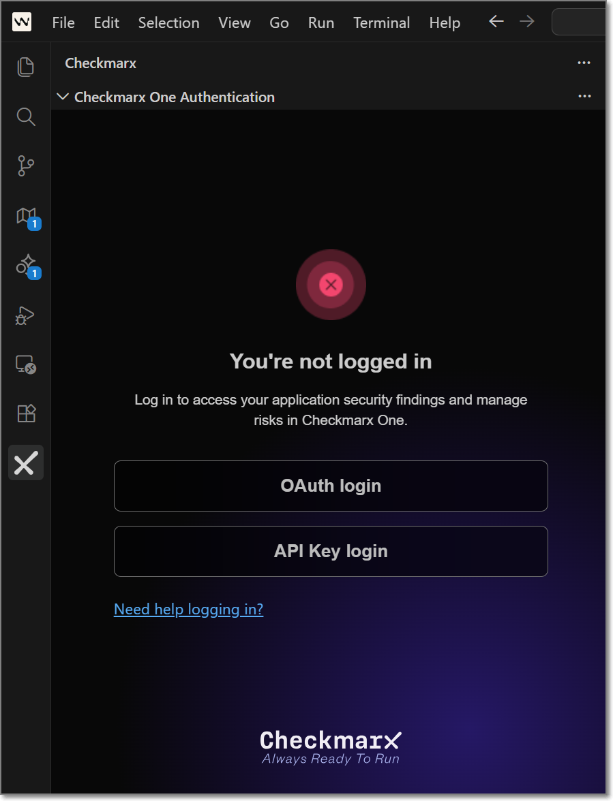<figcaption></figcaption></figure>
2. In the **Checkmarx One Authentication** sidebar, connect to Checkmarx One either using an **API Key** or **login credentials**.

   - Login Credentials

     1. Select the **OAuth login** button.

        The OAuth Log in window opens.

        <figure>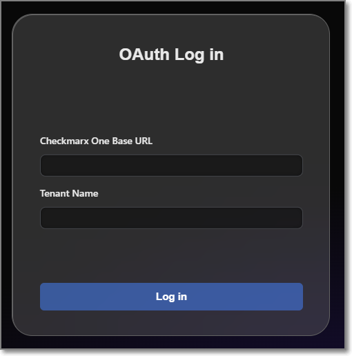<figcaption></figcaption></figure>
     2. Enter the Base URL of your Checkmarx One environment and the name of your tenant account, then click **Log in**.

        
        Once you have submitted a base URL and tenant name, it is saved in cache and can be selected for future use (saves up to 10 accounts).
        

        A confirmation dialog asks for permission to open an external website.
     3. Click on **Open** to proceed.

        
        If you would like to prevent this dialog from opening in the future, click on **Configure Trusted Domains** and then in the Command Pallete click on **Trust...**.
        
     4. If you are logged in to your account, the system connects automatically. If you are not logged in, your account's login page opens in your browser. Enter your Username and Password and then your One-Time Password (2FA) to log in.
   - API Key (see Generating an API Key)

     1. Select the **API Key login** button.

        The API Key Log in window opens.

        <figure>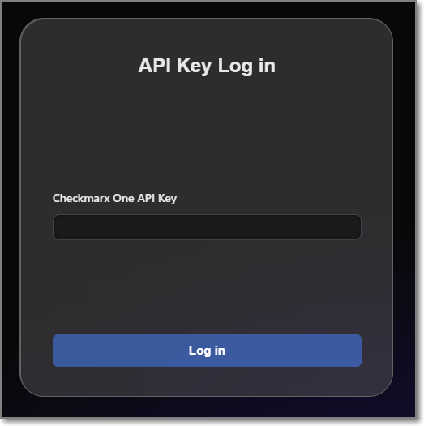<figcaption></figcaption></figure>
     2. Enter your Checkmarx One **API Key** and click **Log in**.
3. The **Checkmarx One Authentication** sidebar will now show that you are logged in.

   <figure>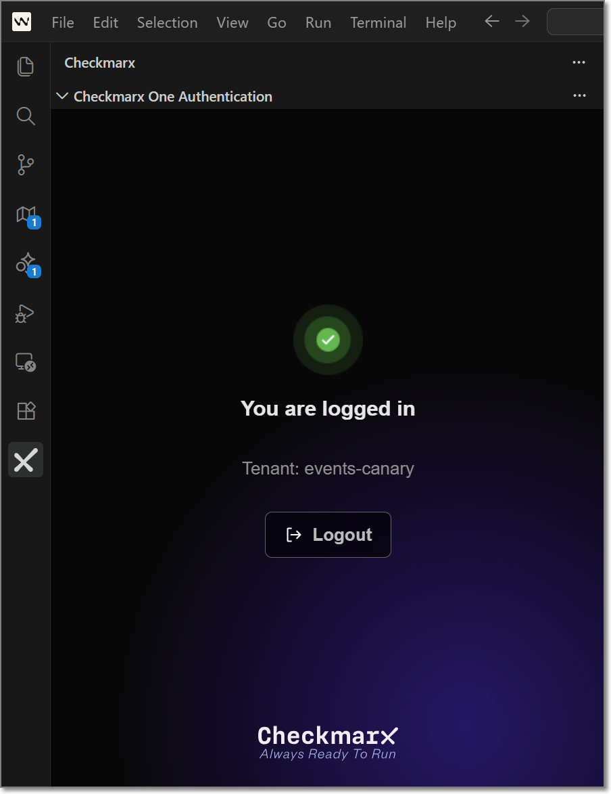<figcaption></figcaption></figure>
4. At the top right of the **Checkmarx One Authentication** sidebar, select the more options icon and click **Settings**.

   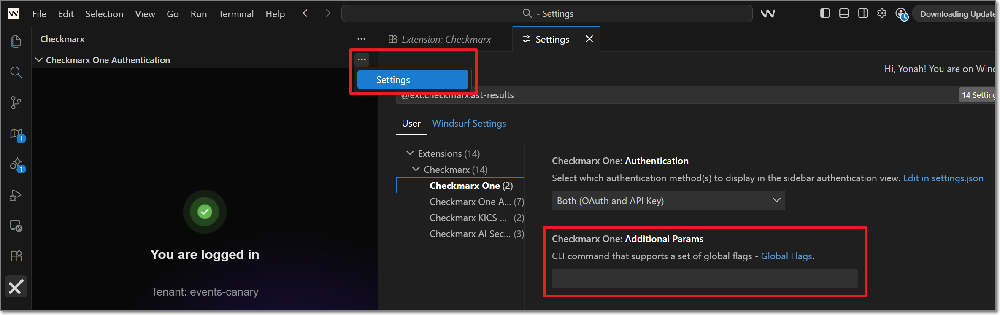
5. Navigate to the **Checkmarx One** settings tab, and in the **Additional Params** field, you can submit additional CLI params. This can be used to manually submit the base url and tenant name if there is a problem extracting them from the API Key. It can also be used to add global params such as `--debug` or `--proxy`. To learn more about CLI globalparams, see [Global Flags](../../cli-tool/checkmarx-one-cli-commands/global-flags.md).

### Configuring the Checkmarx MCP Server for Developer Assist

Depending on your version of Windsurf, you may have access to multiple AI agents, including **Devin Local** and **Cascade**. By default, **Cascade** is disabled.

The Checkmarx MCP server must be configured separately for each agent. Follow the procedure for the agent that you want to use with Checkmarx Developer Assist.

**Devin Local Configuration**

1. Configure the Checkmarx MCP:

   1. Navigate to **Checkmarx One Assist** settings,
   2. Scroll down to the **MCP Authentication** option and change it from **OAuth** to **Token Based**.
   3. Under **Checkmarx MCP** click **Install MCP**.
2. Verify that your MCP server is running:

   1. Go to **Settings** > **Devin Settings**.
   2. Under **Devin Local** > **Configuration**, click **Open Devin MCP Marketplace**.
   3. Verify that the Checkmarx MCP is installed and enabled.

      <figure>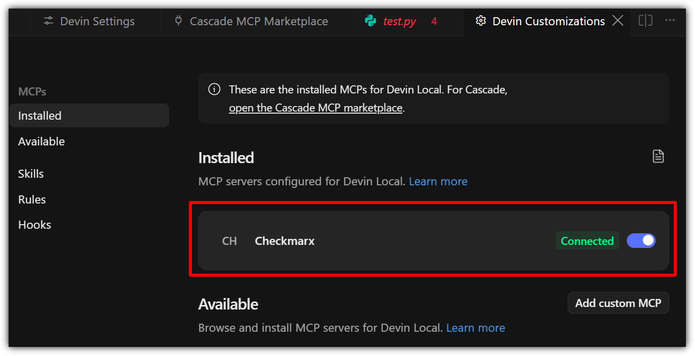<figcaption></figcaption></figure>

**Cascade Configuration**

1. Configure the Checkmarx MCP:

   1. Create an `mcp_config.json` file at the following location: `${homeDir}\AppData\Roaming\devin\mcp_config.json`
   2. Add the "checkmarx" mcp using the following snippet, replacing the placeholders as follows:

      - **Checkmarx_one_base_url** - The base URL of your Checkmarx One environment.
      - **Checkmarx_one_API_key** - An API Key for your Checkmarx One account.

        ```
        {
           "mcpServers":{
              "Checkmarx":{
                 "serverUrl":"<Checkmarx_one_base_url>/api/security-mcp/mcp",
                 "headers":{
                    "cx-origin":"Devin",
                    "Authorization":"<Checkmarx_one_API_key>"
                 }
              }
           }
        }
        ```
2. Verify that your MCP server is running:

   1. Go to **Settings** > **Devin Settings**.
   2. Under **Cascade** > **Configuration**, click **Open MCP Marketplace**, and make sure that the Checkmarx MCP is installed and enabled.

      <figure>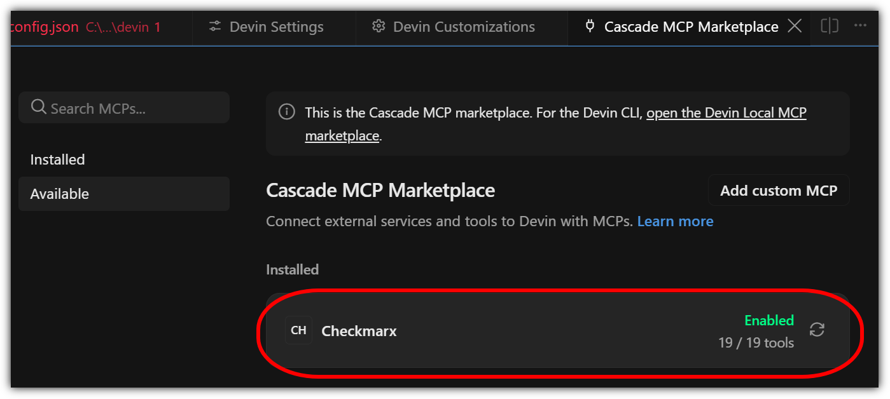<figcaption></figcaption></figure>

#### Configuring Additional Settings for Developer Assist

You can optionally adjust the **Settings** for **Checkmarx One Assist**, as follows:

1. Add **Additional Params** to set up custom configuraitions, such as proxy servers or to run in debug mode.
2. Enable/disable specific realtime scanners. By default, all scanners are enabled.

   <figure>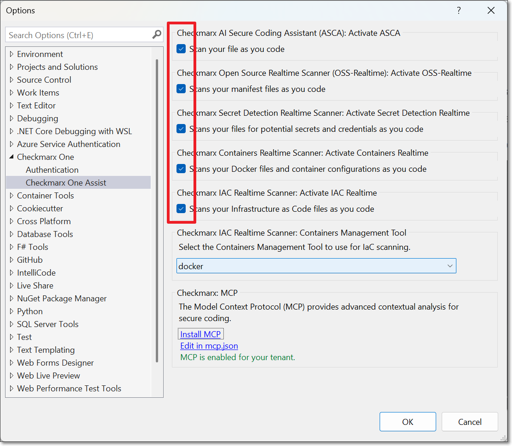<figcaption></figcaption></figure>
3. For IaC realtime scanner you can change the container platform used, Docker (default) or Podman.
4. The IDE’s built-in AI assistant is enabled by default, and the selected **AI Assistant** is ignored. To use a different AI Assistant:

   1. Disable **Prefer Native AI Assistant**.
   2. Select the **AI Assistant** to use for remediation. Options are **Copilot** (default) or **Claude**.
5. **MCP Authentication** – Select the authentication method used by the Checkmarx MCP server.

   
   After changing the authentication method, click **Install MCP** to update the `mcp.json` configuration.
   

   - **OAuth** (default) when the MCP server starts, a browser-based login session is initiated to authenticate with your Checkmarx One account.

     
     OAuth method is not currently supported for **Windsurf IDE**.
     
   - **Token Based** uses the API key associated with your current Checkmarx One login and avoids browser authentication when starting the MCP server.

     
     When this method is used, the API key is stored in the `mcp.json` file.
     

#### Troubleshooting MCP Installation


This section applies only when using Developer Assist with **Devin Local**.


If the Checkmarx MCP server is not installed successfully using the **Install MCP** option, you can configure it manually using the following procedure.

1. If it does not already exist, create an mcp_config.json file at the following location: `${homeDir}\.codeium\windsurf\mcp_config.json`

   
   If you are using windsurf-next, then the file location should be `${homeDir}\.codeium\windsurf-next\mcp_config.json`
   
2. Add the "checkmarx" mcp using the following snippet, replacing the placeholders as follows:

   - **Checkmarx_one_base_url** - The base URL of your Checkmarx One environment.
   - **Checkmarx_one_API_key** - An API Key for your Checkmarx One account.

     ```
     {
        "mcpServers":{
           "Checkmarx":{
              "serverUrl":"<Checkmarx_one_base_url>/api/security-mcp/mcp",
              "headers":{
                 "cx-origin":"Devin",
                 "Authorization":"<Checkmarx_one_API_key>"
              }
           }
        }
     }
     ```
3. Under **Devin Local** > **Configuration**, click **Open Devin MCP Marketplace**, and make sure that the Checkmarx MCP is installed and enabled.

   <figure><figcaption></figcaption></figure>

### Configuring AI Security Champion

AI Security Champion can be used with the Checkmarx One tool as well as with the KICS Realtime Scanning tool. In order to use AI Security Champion you need to integrate the Kiro extension with your OpenAI account.


If the [Global Settings](../../user-guide/configuring-account-settings/global-account-settings/plugins-settings.md) for your account have been configured to use Azure AI instead of OpenAI, then the credentials are submitted on the account level and it is not possible to submit credentials in your IDE for an alternative AI model.


**To set up the integration with your OpenAI account:**

1. Go to the **Checkmarx** extension **Settings** and select **Checkmarx AI Security Champion**.

   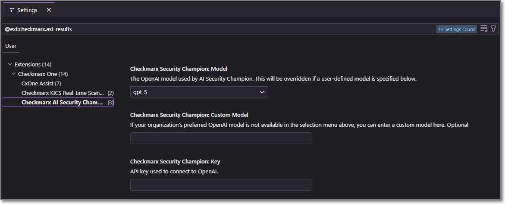
2. In the **Model** field, select from the drop-down list the model of the GPT account that you are using.
3. In the **Key** field, enter the API key for your OpenAI account.

   
   Follow this [link](https://platform.openai.com/account/api-keys) to generate an API key.
   

   The configuration is saved automatically.

### Configuring the KICS Realtime Scanning Tool (Optional)

This tool is activated automatically upon installation and no configuration is required.


It is **not** necessary to configure the Checkmarx One Authentication settings in order to use the KICS Realtime Scanning feature.


If you would like to customize the scan settings, you can use the following procedure:

1. In the VS Code console, go to **Settings** > **Extensions** > **Checkmarx** > **Checkmarx KICS Auto Scanning**.

   <figure>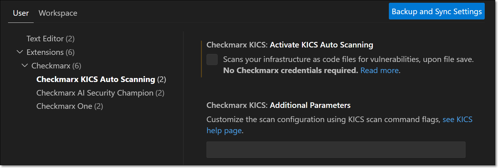<figcaption></figcaption></figure>
2. By default the extension is configured to run a KICS scan whenever an infrastructure file of a [supported type](https://docs.kics.io/latest/platforms/) is opened or saved. If you would like to disable automatic scanning, deselect the **Activate KICS Auto Scanning** checkbox.

   
   In this case, you will still be able to trigger scans manually from the command palette, as described below.
   
3. If you would like to customize the scan parameters, enter the desired flags in the **Additional Parameters** field. For a list of available options, see Scan Command Options.
