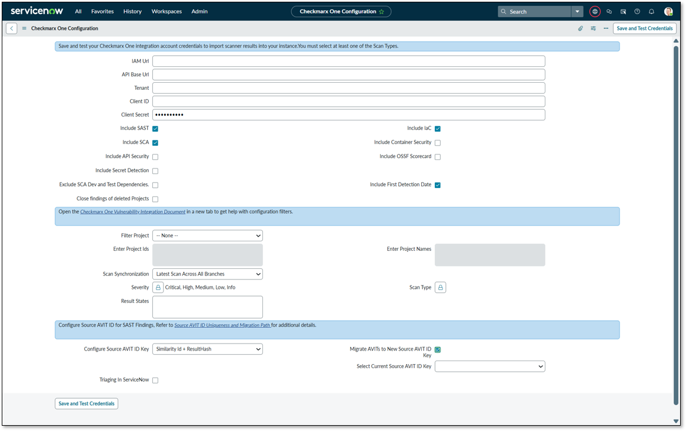
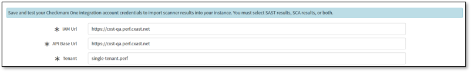

# Configuring the Checkmarx One Vulnerability Integration

Configuration is typically a one-time activity performed after the initial installation. Before proceeding, ensure the OAuth2 Client has been created in Checkmarx One with all the required permissions. For a list of permissions, see the [Preparing for the Checkmarx One Vulnerability Integration](preparing-for-the-checkmarx-one-vulnerability-integration.md) section.


Switching between multiple Checkmarx One tenants within the same ServiceNow integration instance is not supported and may lead to data inconsistencies or incorrect vulnerability data. Each integration instance should be configured for a single Checkmarx One tenant only.


## To Configure the Checkmarx One Vulnerability Integration:

1. Navigate to your instance of Service Now and log in.
2. Search for **Checkmarx One Vulnerability Integration**.
3. Click **Configuration**.

   <figure><figcaption></figcaption></figure>
4. Provide the information required to complete the Checkmarx One configuration.

   
   Fields marked with a red asterisk are compulsory.
   
5. Enter the following in the required fields on the Configuration page:

   - IAM URL: Checkmarx One IAM URL (remove ‘/’ from the end of the URL)
   - API Base URL: Checkmarx One Base URL (remove ‘/’ from the end of the URL)
   - Tenant: Checkmarx One Tenant
   - Client ID: Oauth 2 Client ID
   - Client Secret: Oauth 2 Client Secret
   - Select the checkboxes for the scanner results you wish to import (e.g.,**Include SCA**, **Include SAST**, **Include IaC**, **Include Container Security**, **Include API Security**, **Include 2MS**, **Include OSSF Scorecard**, or all to get the scanner results).

     **Parameter Descriptions**

     | **Parameter** | **Description** |
     |---|---|
     | IAM URL | The base URL of the Identity Access Management (IAM) service for your Checkmarx One environment. Do not include a trailing slash ( `/` ). |
     | API Base URL | The base URL of your Checkmarx One Environment API. Do not include a trailing slash ( `/` ).  **On Single-Tenant Environments:** The `IAM URL` and `API Base URL` will be the exact same URL.  |
     | Tenant | The name of your organization's Checkmarx One tenant. |
     | OAuth Client ID/Secret | The credentials generated from your Checkmarx One account. Refer to the [*Preparing for Checkmarx One Vulnerability Integration*](https://docs.checkmarx.com/en/34965-152365-preparing-for-the-checkmarx-one-vulnerability-integration.html) section for creation steps. |
     | Include SAST / SCA / IaC, Container Security, API Security, OSSF Scorecard, Secret Detection | Select the checkboxes for the scanner types you want to import results from. At least one scanner type must be selected. **Note:** API Security results are linked to existing SAST findings. If you select `Include API Security` , you must also select `Include SAST` . API security does **not** generate separate AVIs instead, it enhances the existing SAST AVIs with API related details. |
     | Exclude SCA Dev and Test Dependencies | When enabled, the integration will process SCA results but exclude any vulnerabilities found in development and test dependencies. (Only applicable for SCA) |
     | Include First Detection Date | When enabled, the "First Found" date from Checkmarx One will be mapped and displayed in the Application Vulnerable Item table (AVIT). |
     | Close findings of Deleted Projects | When enabled, if a project is deleted in Checkmarx One, its corresponding open Application Vulnerable Items (AVIs) in ServiceNow will be automatically updated to a state of `Closed` with a substate of `Skipped` in the subsequent integration run. |
     | Severity | Multi-select the vulnerability severity levels to import. By default all severities are selected i.e. `Critical` , `High` , `Medium` , `Low` , and `Info` . |
     | Filter Project | Select how you want to filter which Checkmarx One projects are included in the integration. Options are `By Id` or `By Name` . |
     | Enter Project IDs | *(Active when "Filter Project" is set to "By Id")* Enter a list of project UUIDs to either include or exclude from the integration run. The filtering mode is determined by the presence of the `exclude` keyword. **Include Mode:** To import **only** the specified projects, enter their UUIDs separated by a semicolon ( `;` ). **Example:** `a1b2c3d4-...;e5f6g7h8-...;i9j0k1l2-...` **Exclude Mode:** To import **all** projects *except* for the specified ones, begin the list with the keyword `exclude=` and then list the UUIDs to exclude. **Example:** `exclude=z9y8x7w6-...;v5u4t3s2-...`  You cannot mix include and exclude modes. The presence of `exclude=` at the start of the list sets the mode for the entire field. The maximum number of IDs is 1000.  |
     | Enter Project Names | *(Active when "Filter Project" is set to "By Name")* Enter a list of project names to either include or exclude. This field supports exact names or substring matching. The filtering mode is determined by the presence of the exclude keyword. **Include Mode:** To import **only** projects whose names match the specified strings or patterns, enter them separated by a semicolon ( `;` ). **Example:** `MyWebApp;Backend-API;PROD` **Exclude Mode:** To import all projects except for those whose names match the specified strings, begin the list with `exclude=` and then list the names to exclude. **Example:** `exclude=OldProject;test-project;DEV`  You cannot mix include and exclude modes. The Project name matching is case-sensitive should not contain ; and =. The maximum number of entries and project names is limited to 1000.  |
     | Result State | Enter the vulnerability states to import from Checkmarx One, separated by semicolons ( **;** ). You may include **default CxOne result states** as well as **custom SAST states**. **Default CxOne Result States**: (These are available out of the box) • To Verify • Confirmed • Urgent • Not Exploitable • Proposed Not Exploitable • Other **To filter by custom states** defined in your Checkmarx One instance, select **Other** . A text field will appear where you can enter a list of your custom state names, separated by a semicolon ( `;` ). **Example (Custom):** `ReadyToFix; ApprovedForRemediation` To import all states, leave this field empty. The maximum number of states input is limited to 1000 states. |
     | Scan Type | Multi-select the scan types to import ( `Fast Scan` , `Full Scan` , `Incremental Scan` ). **Note:** To import results from **all** scan types, it is recommended to **leave this field empty** rather than selecting all options. |
     | Scan Synchronization | Select which scans to import for the filtered projects: **Latest Scan Across All Branches:** Imports only the single most recent scan from any branch of a project. **Latest Scan from Each Branch:** Imports the latest scan for *each individual branch* within a project. **Latest Scan of Primary Branch:** Imports the latest scan from the **primary branch**. If the primary branch is not defined, it imports the latest scan across all branches.  This option replaces the previous **Latest Scan of Primary Branch** option but maintains the same behavior.  **Latest Scan of Primary Branch Only**: Imports **only** the newest scan from the project’s defined **primary branch**. The scan must have been completed after the integration's `Start Time` .  Switching between scan synchronization options is only allowed when the integration instance is clean with no previously synced data.  |
     | Triaging in ServiceNow | Check this box to manage the vulnerability lifecycle within ServiceNow. All imported AVIs are set to an `Open` state when checked, allowing you to use ServiceNow's "Mark as False Positive" and "Request Exception" workflows. If this box is unchecked, AVIs will retain their original state from Checkmarx One (e.g., `Not Exploitable` , `Confirmed` ).  This integration provides a **one-way synchronization** from Checkmarx One to ServiceNow. Any state changes or triage actions performed in ServiceNow (such as marking an AVI as a False Positive or requesting an exception) **will not be reflected in Checkmarx One** .  |
6. **Source AVIT ID Uniqueness and Migration Path**

   **Configurable Source AVIT ID Key**

   A new Configure Source AVIT ID Key option has been introduced, allowing customers to control how Source AVIT ID is generated for SAST findings. This provides flexibility in defining how findings are uniquely identified and managed.

   **Available Key Options**

   The Configure Source AVIT ID Key dropdown includes the following options:

   - **Similarity ID + ResultHash (Default)**

     - Uses a combination of Similarity ID and ResultHash from SAST results.
     - Ensures a 1:1 mapping between CxOne and ServiceNow findings.
     - Highly unique but sensitive to changes (e.g., file path or line number updates may generate a new ID).
   - **Derived Unique Key**

     - Uses a composite identification strategy:

       - Primary: Similarity ID
       - Secondary: Context-based composite hash (e.g., code location)
     - Less sensitive to minor changes, reducing false closures or duplication.
     - Will change if file name or path changes.
     - Does not maintain 1:1 mapping between CxOne and ServiceNow.
     - Multiple findings can share the same key, and aggregation is applied.
   - **Similarity ID**

     - Based solely on Similarity ID.
     - Remains stable across scans, even if file name, location, or line number changes.
     - Does not maintain 1:1 mapping between CxOne and ServiceNow.
     - Multiple findings can share the same ID, and aggregation is applied.

   **Migration Support**

   To support transitioning between key formats, the following options are available:

   - Select Current Source AVIT ID Key. Dropdown to specify the existing key format used in the system.
   - Migrate AVITs to New Source AVIT ID Key. Checkbox to enable migration.

   **When migration is enabled:**

   - Existing AVITs created using the selected current key format are automatically re-keyed to the new format during the next integration run.
   - The system uses the selected current key format to accurately identify and update existing records.

   **Aggregation of Findings**

   When multiple SAST findings share the same Source AVIT ID:

   - Their associated links are aggregated into the Source Vulnerability Summary field of the AVIT table.
   - A maximum of 30 links is appended (existingCounter \<= 30).
   - The Dependency Type field of the AVIT table reflects the total count of aggregated findings.
7. **Configure branch level filtering.**

   Branch level filtering is available on the Configuration page. This feature allows users to define up to 20 branch names, separated by a semicolon.

   
   This feature does not impact the **Checkmarx One Application List Integration**. It applies only to **Checkmarx One Scan Summary Integration** and **Checkmarx One Application Vulnerable Item Integration**.
   
8. Click **Save and Test Credentials**.

   

The URL will be the same for Single Tenant, IAM URL, and API Base.

<figure><figcaption></figcaption></figure>

The system tests the credentials and confirms if the validation is successful.

If the authentication is successful, proceed with the Checkmarx One Vulnerability Integration.
