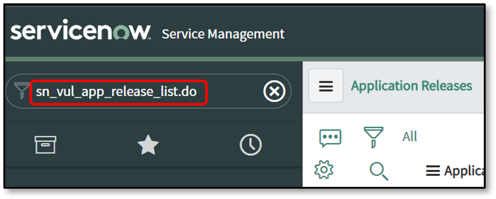
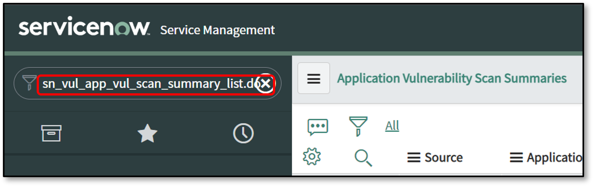

# Data Transformation for the Checkmarx One Integration

Once the data to be imported is identified, it is retrieved from the Checkmarx One API, processed through a set of data sources, and transformed before being loaded into the ServiceNow instance.

### Checkmarx One Data Transforms

The data from the API is first loaded into the Checkmarx One AppVulItem Import table, and the Checkmarx One AppVulItem Transform is used to transform the imported information.

The integration uses ServiceNow Transform Maps to map data from temporary import set tables to the target tables in the Vulnerability Response module. You can view these maps by navigating to **System Import Sets > Transform Maps** .

The primary transform maps are:

- `CheckmarxOne App List Transform`
- `CheckmarxOne Scan Summary Transform`
- `CheckmarxOne AppVul Item Transform`


The integration may not succeed if customizations are made to the target fields on your ServiceNow platform without updating the corresponding transform maps.


The following tables list the transform map fields by integration:

**Table 1. CheckmarxOne App List transforms map fields:**

| **Source Field(s) (from CheckmarxOne)** | **Target Field (in ServiceNow)** | **Description** |
|---|---|---|
| projectName | Application name | Name of the project in CxOne |
| projectId | Source Application ID | Unique project UUID |
| tags | Source APM AppId | A string containing all project tags from CxOne. |
| groups | Source-assigned teams | String containing the names of the groups/teams assigned to the project in CxOne. |
| createdAt | Description | Project creation date from CxOne, prefixed with the static string "created at". |
| applicationId, primaryBranch, applicationName | Source additional info | JSON object containing the CxOne Application UUID, application name, and the name of the project's designated primary branch, if they exist. |
| *(Integration Logic)* Deleted project from CxOne | Active | Boolean field is set to `true` when the project is imported and changes to `false` if the project is deleted in CxOne and `Close findings of Deleted Projects` is enabled during a later integration run. |

**Table 2. CheckmarxOne Scan Summary transforms map fields:**

| **Source Field(s) (from CheckmarxOne)** | **Target Field (in ServiceNow)** | **Description** |
|---|---|---|
| projectName | Discovered Applications | Links the scan summary to the corresponding Application Release record. |
| scanType, scanId | Source scan ID | Unique scan ID from CxOne, prefixed with the scanner type ( `sast` , `sca` , `IaC` , `CS` , `apisec` , `ScoreCard` , or `SecretDetection` ). |
| scanType, scanId, updatedAt | Scan summary name | Display name composed of the Source Scan ID and the scan's completion timestamp. |
| updatedAt | Last scan date | Timestamp of scan completion in CxOne. |
| totalCounter | Detected Flaw Count | Total number of vulnerabilities found by that specific engine in the scan. |
| loc | Static Scan Size | Lines of Code scanned. (This field is populated for SAST scans only). |
| branch, prvScanId, prvBranch | Tags | Branch name, previous scanId and previous branch name. |
| sourceOrigin, sourceType, scan_type | Scan submitted by | A multi-line string containing metadata about the scan origin, source and type. |
| *(Integration Logic)* Deleted project from CxOne | Active | Boolean field is set to `true` when the project is imported and changes to `false` if the project is deleted in CxOne and `Close findings of Deleted Projects` is enabled during a later integration run. |

**Table 3. CheckmarxOne AppVulItem transforms map fields:**

| **Source Field(s) (from CheckmarxOne)** | **Target Field (in ServiceNow)** | **Description** |
|---|---|---|
| similarityId, resultHash, compositeLocationHash, id, packageIdentifier, result_hash (+ Branching Logic) | Source AVIT ID | **Primary deduplication key.** Generated from a combination of vulnerability attributes to uniquely identify a finding. The exact composition depends on the scanner type and Scan Synchronization configuration. See the "Source AVIT ID (Deduplication Key)" section below for the precise logic. |
| projectName | Discovered Applications | Reference to parent Application Release record. |
| scanType, scanId, updatedAt (from scan) | Scan summary | Reference to the parent Scan Summary record. The scanType here is the prefix used in the Scan Summary table (e.g., sast, sca, CS for Container Security) |
| vulnerabilityDetails.cweId (SAST/Containers) vulnerabilityDetails.cveName (SCA) data.queryId (IaC) id (Secrets/Scorecard) | Vulnerability | Reference to the grouped vulnerability entry ( `sn_vul_app_vul_entry` ). The ID is a composite key prefixed with `'Checkmarx One-'` and a unique identifier: **SAST/Containers:** `CWE-` + `vulnerabilityDetails.cweId` **SCA:** `vulnerabilityDetails.cveName` (e.g., `CVE-2022-22965` ) **IaC:** `data.queryId` **Secret Detection/Scorecard:** `id` |
| description | Description / Vulnerability explanation | Detailed vulnerability description from Checkmarx One. |
| data.queryName, vulnerabilityDetails.cweId, data.ruleName | Category name | Vulnerability category name. **SAST/IaC:** `queryName` . **SCA/Containers:** `cweId` . **Secret Detection/Scorecard:** `ruleName` . |
| data.recommendedVersion (SCA) data.remediation (Secrets/Scorecard) data.remediationLink (Secrets/Scorecard) data.remediationAdditional (Secrets/Scorecard) | Recommendation | **SCA:** Populated with the recommended package version for remediation. **Secret Detection/Scorecard:** Populated with a composite string containing remediation text, a link, and additional details. **SAST/IaC/Containers:** This field is not populated. |
| http_method, url | Affected URLs | HTTP method and URL for API Security vulnerabilities. |
| data.nodes\[0\].fileName | Location | File path where the vulnerability was found. |
| data.nodes\[0\].line | Line number | Specific line number of the flaw. Populated for SAST, IaC, Secret Detection and OSSF Scorecard. |
| branch | Project Branch | Source code branch name where finding was discovered. |
| data.nodes (SAST) data.exploitableMethods (SCA) notes (IaC) data.ruleDescription (Secrets/Scorecard) | Source notes | Detailed context that varies by scanner: **SAST:** The full attack vector path, including file names, lines, and columns. **SCA:** The exploitable path methods, if available. **IaC:** Reference details for the finding. **Secret Detection/Scorecard:** The detailed rule description. |
| data.packageData\[\*\].url | References | Reference URLs for SCA vulnerabilities. |
| state | Source finding status | Triage state from Checkmarx One (e.g., `TO_VERIFY` , `NOT_EXPLOITABLE` ). |
| status, state | Source remediation status | Remediation status used for closing vulnerabilities (e.g., `FIXED` , `NEW` ). |
| severity | Source severity | Vulnerability severity from Checkmarx One (e.g., `HIGH` , `MEDIUM` ). |
| firstFoundAt | First found | Date the vulnerability was first detected. Populated only if "Include First Detection Date" is enabled. |
| updatedAt (from scan) | Last found | Timestamp of the scan that found this vulnerability. |
| Link to result in CxOne UI | Source link | Direct URL to the finding in Checkmarx One UI. |
| similarityId | Source request | The `similarityId` from Checkmarx One. This field is populated for SAST findings only. |
| applicationIds, branch | Source additional info | JSON object containing Checkmarx One Application UUID and branch name. |
| type | Scan type | Scanner type. **Note:** • `SAST` **,** `IaC (kics)` **,** `SecretDetection` **,** and `OSSF ScoreCard` map to **static** . • `SCA` **,** and `Container Security` maps to **sca.** |
| data.packageIdentifier | Package | Unique name and version of vulnerable package (SCA and Container Security). |
| (Aggregation Logic) Links from grouped findings | Source Vulnerability Summary | When SAST findings from the same scan share the same Source AVIT ID Key, they are grouped together. Up to 30 links from the aggregated findings can be added to this field in the AVIT table. |
| (Aggregation Logic) Count of grouped findings | Dependency Type | Displays the count of aggregated SAST findings that share the same Source AVIT ID Key within the same scan. |

**Table 4: CheckmarxOne AppVulEntry Mappings**

| **Source Field(s) (from CheckmarxOne)** | **Target Field (in ServiceNow)** | **Description** |
|---|---|---|
| Composite: 'Checkmarx One' + '-' + id or 'Checkmarx One CWE-' + cweId | Source Entry ID | Primary identifier for vulnerability entries. **SAST:** "Checkmarx One CWE-" + cweId **SCA:** "Checkmarx One-" + id **IaC:** "Checkmarx One-" + queryId **Containers:** "Checkmarx One-" + cweId **Secret Detection and Scorecard:** "Checkmarx One-" + id |
| category_name (query attribute) | Category name | Vulnerability category name from CheckmarxOne. **SAST and IaC scans:** Uses the query name **SCA and Container scans:** Uses the CWE ID **Secret Detection and Scorecard:** Uses the rule name |
| scan_type (normalized) | Scan type | Scanner type normalized for ServiceNow. **SAST, IaC, Secret Detection, Scorecard:** Map to "static" **SCA and Container Security:** Map to "sca" |
| source_severity (calculated) | Source Severity | Numeric severity value converted from CheckmarxOne severity strings. **CRITICAL:** 0 **HIGH:** 1 **MEDIUM:** 2 **LOW:** 3 **INFO:** 4 **OTHER:** 5 |
| cvssScore | CVSS Base Score | CVSS base score from Checkmarx One vulnerability details. |
| cvssVector | CVSS Vector | CVSS vector string from Checkmarx One vulnerability details. |
| last_scan_date | Last detection date | Date of the last scan that detected this vulnerability. |
| OWASPTop10 | OWASP | JSON object containing OWASP Top 10 classification (SAST only). |
| SANSTop25 | Short description | SANS Top 25 classification (SAST only). |
| first_found_date | First detection date | Date vulnerability was first detected (only populated if "Include First Detection Date" is enabled). |
| cweId + category_name | CWE List | Array of CWE objects containing cwe_id and name (SAST only). |
| Attack Vector | Attack Vector | SCA findings Attack Vector |

**Table 5: CheckmarxOne NVD Entry Mappings:**

| **Source Field(s) (from CheckmarxOne)** | **Target Field (in ServiceNow)** | **Description** |
|---|---|---|
| cveName (CVE ID) | ID | CVE identifier (e.g., CVE-2021-44228) |
| source_references | Summary | Reference URLs for the vulnerability |
| cvssScore | Vulnerability score (v3) | CVSS v3 base score |
| cvssVector | Attack vector (v3) | CVSS v3 attack vector string |

### Source AVIT ID (Deduplication Key)

The `source_avit_id` is the most critical field for uniquely identifying a vulnerability and preventing duplicates. Its value is a composite key automatically generated by the integration. The composition of this key changes based on the scanner that found the vulnerability.

| **Scanner Type** | **Base Key Composition** |
|---|---|
| SAST | `similarityId` + `_` + `resultHash` or `similarityId` + `_` + `compositeLocationHash` or `similarityId` |
| SCA | `id` + `packageIdentifier` |
| IaC (Kics) | `similarityId` |
| Container Security | `similarityId` + `_` + `result_hash` |
| Secret Detection | `similarityId` + `_` + `id` |
| OSSF Scorecard | `similarityId` + `_` |

#### Branching Logic Impact on Deduplication

Your `Scan Synchronization` setting on the Configuration page directly impacts the final deduplication key:

- If `Scan Synchronization` is set to **"Latest Scan from Each Branch"** , the `branch` name is appended to the Base Key (e.g., `[Base Key]main` ). This ensures that a vulnerability found in multiple branches is treated as a unique item in each branch.
- For all other `Scan Synchronization` settings ("Latest Scan Across All Branches" or "Latest Scan of Primary Branch"), only the Base Key is used. A vulnerability with the same Base Key will be treated as the same item, regardless of which branch it was found on.


**OSSF Scorecard and Secret Detection:** Findings from these scanners will always be imported as **New** and will not show a recurring status in the same way as other scanners due to the nature of their results.


### Checkmarx One Transform Map Script Timing and Purpose

The following transform scripts are run during the transformation process.

| **When the script is run** | **Purpose** |
|---|---|
| onComplete (when an import set has completed transformation) | Script that is used to process the data source and update the count of AVITs created, updated or unchanged, and the ones imported as part of this integration from Checkmarx One. This script is for internal use and should not be modified or deleted. |

### Viewing Checkmarx One Vulnerability Integration Import

You can view the data imported by the integration by navigating to the corresponding tables. For quick access, you can type the following commands directly into the **Filter Navigator** .

| **To View** | **Table Name** | **Filter Navigator Command** | **Populated by Integration** |
|---|---|---|---|
| Imported Projects | Discovered Applications / Application Releases | `sn_vul_app_release_list.do` | Checkmarx One Application List Integration |
| Imported Scan Summaries | Application Vulnerability Scan Summaries | `sn_vul_app_vul_scan_summary_list.do` | Checkmarx One Scan Summary Integration |
| Imported Vulnerabilities | Application Vulnerable Items | `sn_vul_app_vulnerable_item_list.do` | Checkmarx One Application Vulnerable Item Integration |
| Grouped Vulnerability Entries | Application Vulnerability Entries | `sn_vul_app_vul_entry_list.do` | Checkmarx One Application Vulnerable Item Integration |
| NVD Entries (for SCA) | NVD Entries | `sn_vul_nvd_entry_list.do` | CheckmarxOneAppVulItemIntegration |

To view the Discovered Applications / Application Releases table in **Filter Navigator** enter **sn_vul_app_release_list.do**

<figure><figcaption></figcaption></figure>

To view the Application Vulnerability Scan Summaries tables in **Filter Navigator** enter **sn_vul_app_vul_scan_summary_list.do**

<figure><figcaption></figcaption></figure>

To view the Application Vulnerable Item tables in **Filter Navigator** enter **sn_vul_app_vulnerable_item_list.do**

<figure><figcaption></figcaption></figure>

To view the Application Vulnerability Entry tables in **Filter Navigator** enter **sn_vul_app_vul_entry_list.do**

<figure><figcaption></figcaption></figure>

### Verifying the Property to Produce Closed Vulnerabilities

The behavior for creating records for vulnerabilities that are already closed in Checkmarx One is controlled by a ServiceNow system property.

1. Navigate to `sys_properties.list` in the Filter Navigator.
2. Search for the property with the name `sn_vul.create_closed` .
3. Review its value:

   - **If** `true` **:** The integration will create new AVI records in ServiceNow even if the finding is already in a "Closed" state in Checkmarx One.
   - **If** `false` **:** The integration will **not** create new records for findings that are already closed. It will only update existing, open AVIs to a "Closed" state.
