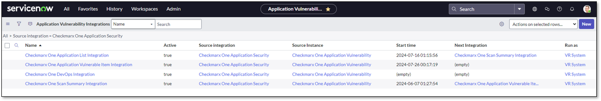
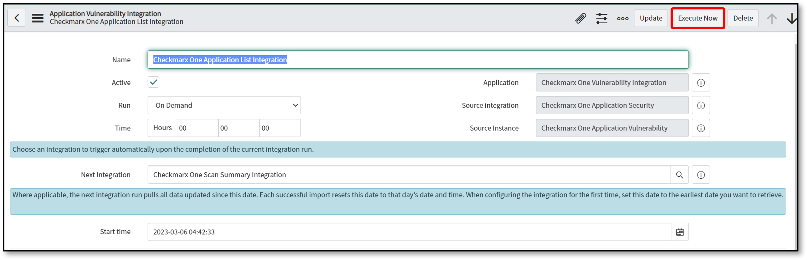
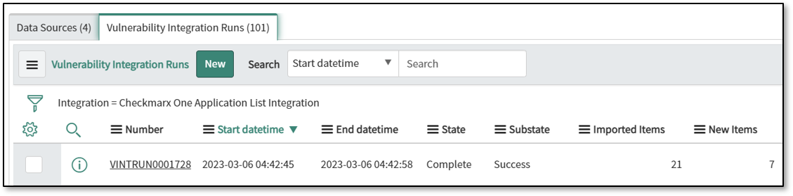
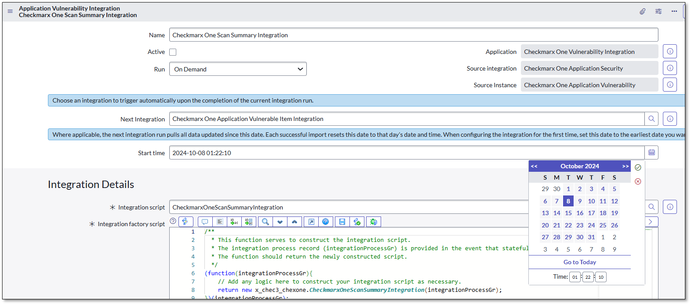
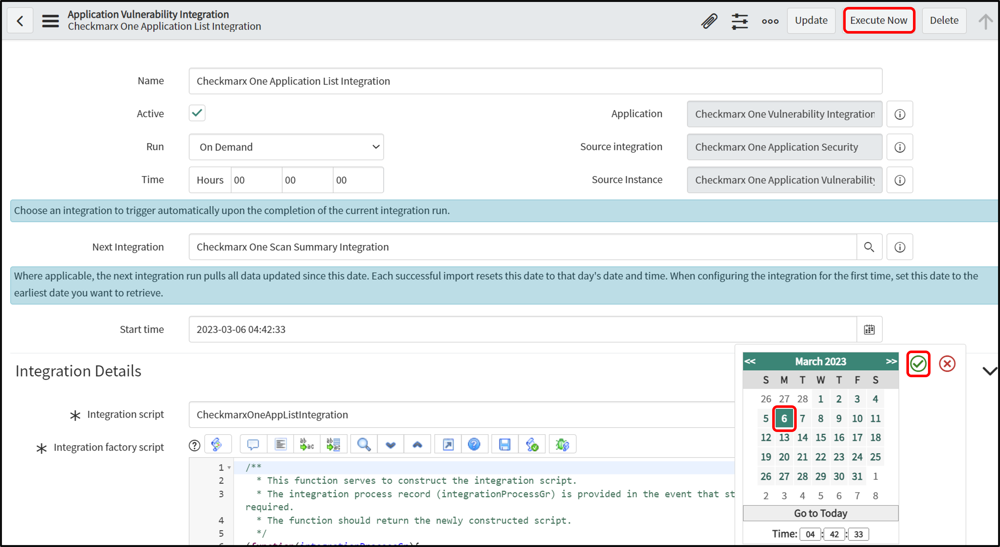
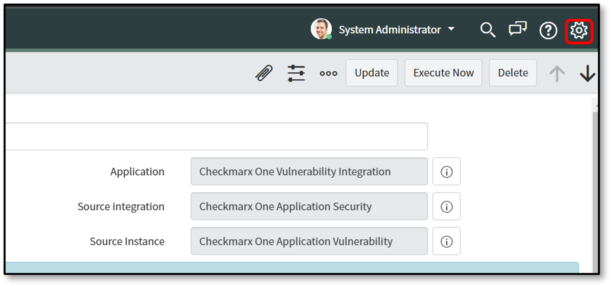

# Integrating the Checkmarx One Vulnerability Integration

Once configured, the integrations run automatically daily in a chained sequence: **Application List → Scan Summary → Application Vulnerable Item → AVIT Closure**. You can also execute them manually for on-demand updates. Running them in this specific order is essential to prevent data inconsistencies.

## Integration Execution Steps

The following sections describe how to execute each integration in the correct sequence. All integrations follow similar steps with minor variations.

**General Steps for All Integrations**:

1. Navigate to **Checkmarx One Vulnerability Integration > Integrations**.
2. Click on the specific integration you want to run.
3. Click on the calendar icon to select a date and time (Start Date and Time).
4. Click **Execute Now** if the run is not scheduled and is On Demand or if the integration needs to be performed manually.

The Vulnerability Integration Runs tab will display the execution status. When the integration shows the State and Substate of Complete and Success, respectively, the integration has completed successfully.


**Integration Activation Required**: All integrations except **Checkmarx One DevOps Integration** are set to **Active = false** by default. Before scheduling an integration, you must manually set the **Active** field to **true** on the integration record. The integration will not run unless it is activated.


## Checkmarx One Application List Integration

1. Click **Integrations**.

   <figure><figcaption></figcaption></figure>
2. Click **Checkmarx One Application List Integration**.

   <figure><figcaption></figcaption></figure>
3. Click on the calendar icon to select a date and time. The integration will import project details created in the CxOne portal after the specified Start Date and Time.

   
4. Click **Execute Now**, if the run is not scheduled and is On Demand or Integration needs to be performed manually.

   

   The Application Vulnerability Integrations screen is displayed.

   <figure><figcaption></figcaption></figure>

   When the plugin shows the State and Substate of Complete and Successful, respectively, the plugin is connected to the Checkmarx One instance and pulled into the project list. The first time all the project lists are imported, the plugin will ascertain how many scans there are and pull in the latest scans.


If a script has been customized and the latest version hasn't been applied, you must revert it to its store version. Follow these steps to revert the script:

1. In the **Application Navigator**, search for **Script Includes** under **All**.
2. Under **System Definition**, select **Script Includes**.
3. Search for the modified script (e.g., CheckmarxOneAppVulItemIntegration, CheckmarxOneScanSummaryIntegration, CheckmarxOneUtilBase).
4. Scroll down to the **Version** field.
5. Click on the link for the **Store** version.
6. Click **Revert** to this version.

This is a one-time manual step after the initial update. Future updates will automatically apply without requiring manual reversion. Any project/scan deleted on the Checkmarx One side will not be deleted on the ServiceNow side.


## Checkmarx One Scan Summary Integration

The steps for integrating the Checkmarx One Scan Summary Integration are similar to the steps above, with one exception: a date can be included.

1. Click **Checkmarx One Scan Summary Integration**, as per point 2 above.
2. Click on the calendar icon to select a date and time. The integration will import the scan summary of those scans created in the CxOne portal after the specified start date and time if **Run** was not scheduled and is **On Demand** or if the integration must be performed manually.

   
3. Click **Execute Now.**

   <figure><figcaption></figcaption></figure>
4. Navigate to the **Settings icon** to edit the time zone of **Start Time**.

   <figure><figcaption></figcaption></figure>
5. Select the dropdown list to select the **Time zone**.

   <figure><figcaption></figcaption></figure>


The selected time from the integration's **Start Time** will be converted to Coordinated Universal Time (UTC), irrespective of the chosen time zone, and Checkmarx One will use the converted UTC.


## Checkmarx One Application Vulnerable Item Integration

This integration imports the vulnerability findings from the scans identified in the previous step.

The steps for integrating the Checkmarx One Application Vulnerable Item Integration are the same as those for integrating the Checkmarx One Scan Summary Integration. During the integration Run, they will import Projects, Scans, and Results of scans created in Checkmarx One after a specified start time (configured on the integration page).

This process creates new Application Vulnerable Items (AVIs) for newly discovered findings. The separate AVIT Closure Integration handles the closure of AVIs that are no longer reported in the latest scans.

## Checkmarx One AVIT Closure Integration

The Checkmarx One AVIT Closure Integration is the final step in the integration chain and runs automatically after the Application Vulnerable Item Integration is complete. This integration runs On Demand and is automatically triggered by the completion of the previous integration.

This process automatically closes Application Vulnerable Items (AVIs) that are no longer present in the latest scans from Checkmarx One. The integration identifies the latest scans based on your Scan Synchronization configuration, compares existing open AVIs with findings in those latest scans, and automatically closes AVIs not found by setting their state to "Closed" and source remediation status to "FIXED".

## How Vulnerabilities (AVIs) are Closed

The Checkmarx One AVIT Closure Integration automatically closes Application Vulnerable Items (AVIs) in ServiceNow when they are no longer present in the latest scans. This integration runs as the final step in the integration chain and handles the "reconciliation" logic based on your configuration:

- If Scan Synchronization is **Latest Scan Across All Branches**: The integration closes all findings for a project not present in that project's single most recent scan.
- If Scan Synchronization is **Latest Scan Each Branch**: The integration closes findings on a per-branch basis. A finding is closed only if it's not present in the latest scan for that specific branch.
- If Scan Synchronization is **Latest Scan of the Primary Branch or Any Branch**: The integration closes all findings for a project that are not present in the latest scan of the designated primary branch. If a primary branch is not defined, closure is based on the latest scan from any branch.
- If Scan Synchronization is **Latest Scan of Primary Branch** only: The integration closes all findings for a project that are not present in the latest scan of the defined primary branch.
- If a **Project is Deleted in Checkmarx One**: If the **Close findings of Deleted Projects** option is enabled on the Configuration page, all open AVIs for a project that has been deleted in Checkmarx One will be automatically updated to a state of Closed with a substate of Skipped.
