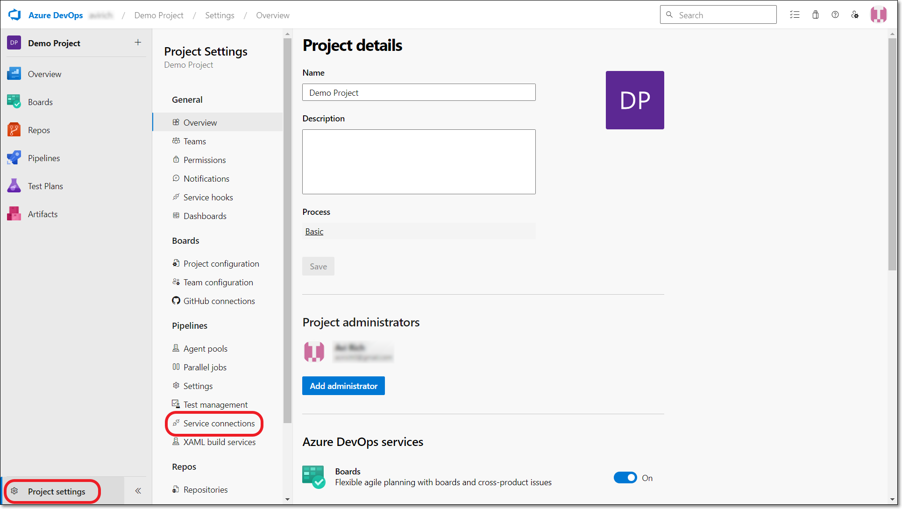
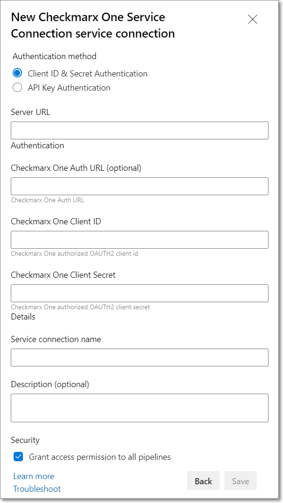
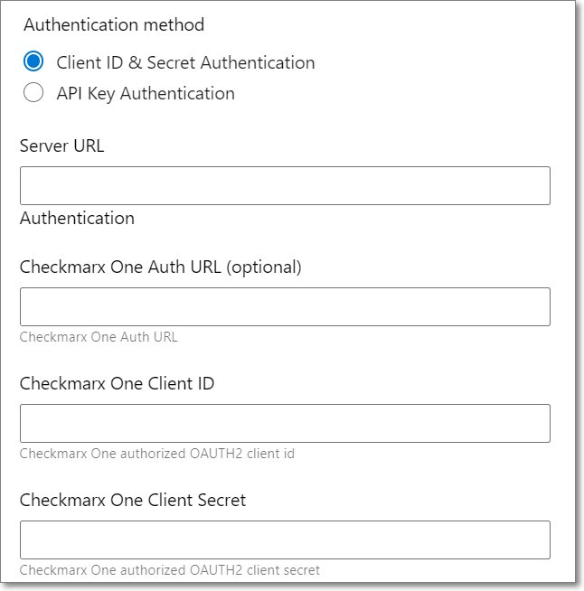
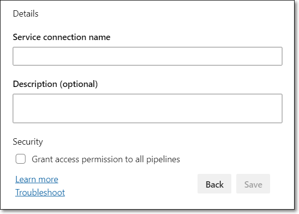

# Checkmarx One Azure DevOps Plugin Initial Setup

Before running Checkmarx One scans from an Azure pipeline, you need to set up a service connection for accessing your Checkmarx One environment.

In order to create the service connection you need to authenticate with your Checkmarx One account. This can be done using either an Oauth Client or an API Key.

- **Oauth Client** - Submit the **Client ID** and **Client Secret**, as well as the **Base URL** of your Checkmarx One environment. To create an OAuth Client, see [Creating an OAuth Client for Checkmarx One Integrations](../../authentication-for-checkmarx-one-cli-and-plugins/creating-an-oauth-client-for-checkmarx-one-integrations.md).
- **API Key** - Submit an **API Key** for your Checkmarx One account, as well as the **Base URL** of your Checkmarx One environment. To generate an API Key, see Generating an API Key.

**To create a service connection:**

1. In the Azure console, click on **Project settings** > **Service Connections**.

   <figure><figcaption></figcaption></figure>
2. Click **New service connection** at the top right of the screen.
3. In the **New service connection** pane, select the radio button next to **Checkmarx One Service Connection** and then click **Next**.

   The service connection setup form is displayed.

   <figure><figcaption></figcaption></figure>
4. Under **Authentication method**, select the radio button for the authentication method you would like to use. Options are: **Client ID & Secret** or **API Key**.

   Depending on your selection, the relevant authentication fields are displayed.
5. For **OAuth Client** authentication, fill in the following info:

   <figure><figcaption></figcaption></figure>

   1. Fill in the **Server URL** with the appropriate URL for your environment.

      **Checkmarx One Server Base URLs**

      - US Environment - https://ast.checkmarx.net
      - US2 Environment - https://us.ast.checkmarx.net
      - EU Environment - https://eu.ast.checkmarx.net
      - EU2 Environment - https://eu-2.ast.checkmarx.net
      - DEU Environment - https://deu.ast.checkmarx.net
      - Australia & New Zealand – https://anz.ast.checkmarx.net
      - India - https://ind.ast.checkmarx.net
      - India 2 - https://ind-2.ast.checkmarx.net/
      - Singapore - https://sng.ast.checkmarx.net
      - UAE - https://mea.ast.checkmarx.net
      - Israel - https://gov-il.ast.checkmarx.net
   2. If the authentication URL is different than the server URL, then enter the appropriate **Checkmarx One Authentication URL**.

      
      For Checkmarx One cloud platform, this is required.
      

      **Checkmarx One Authentication URLs**

      - US Environment - https://iam.checkmarx.net
      - US2 Environment - https://us.iam.checkmarx.net
      - EU Environment - https://eu.iam.checkmarx.net
      - EU2 Environment - https://eu-2.iam.checkmarx.net
      - DEU Environment - https://deu.iam.checkmarx.net
      - Australia & New Zealand – https://anz.iam.checkmarx.net
      - India - https://ind.iam.checkmarx.net
      - Singapore - https://sng.iam.checkmarx.net
      - UAE - https://mea.iam.checkmarx.net
      - Israel - https://gov-il.iam.checkmarx.net
   3. Enter the OAuth **Client ID** and **Secret** that you created in Checkmarx One. To create an OAuth Client, see [Creating an OAuth Client for Checkmarx One Integrations](../../authentication-for-checkmarx-one-cli-and-plugins/creating-an-oauth-client-for-checkmarx-one-integrations.md).
6. For **API Key** authentication, fill in the following info:

   <figure><figcaption></figcaption></figure>

   1. Fill in the **Server URL** with the appropriate URL for your environment.

      **Checkmarx One Server Base URLs**

      - US Environment - https://ast.checkmarx.net
      - US2 Environment - https://us.ast.checkmarx.net
      - EU Environment - https://eu.ast.checkmarx.net
      - EU2 Environment - https://eu-2.ast.checkmarx.net
      - DEU Environment - https://deu.ast.checkmarx.net
      - Australia & New Zealand – https://anz.ast.checkmarx.net
      - India - https://ind.ast.checkmarx.net
      - India 2 - https://ind-2.ast.checkmarx.net/
      - Singapore - https://sng.ast.checkmarx.net
      - UAE - https://mea.ast.checkmarx.net
      - Israel - https://gov-il.ast.checkmarx.net
   2. Enter your **API Key**. To generate an API Key, see Generating an API Key.
7. In the **Details** section, in the **Service connection name** field, enter a descriptive name for the connection (e.g., Checkmarx One Connection).

   <figure><figcaption></figcaption></figure>
8. You can optionally enter a brief **Description** of the connection.
9. In the **Security** section, if you want to grant access for all pipelines, select the **Grant access permission to all pipelines** checkbox. If the checkbox is deselected (default), then you will need to manually grant permission for each pipeline for which you would like to use this connection.
10. Click **Save**.

    The Service connection is created and is listed on the **Service connections** screen.
