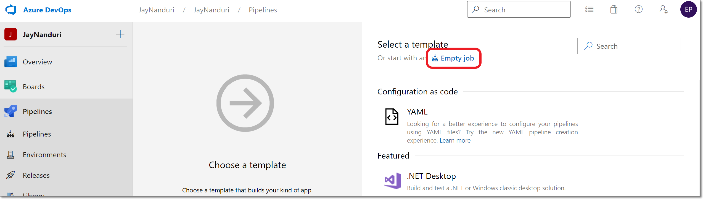
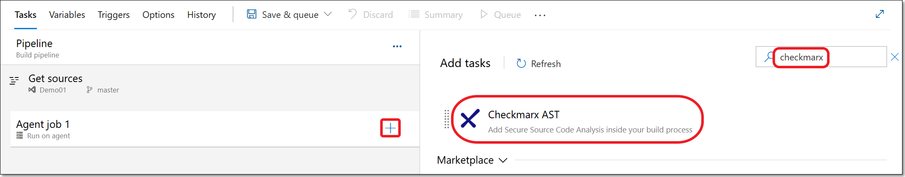
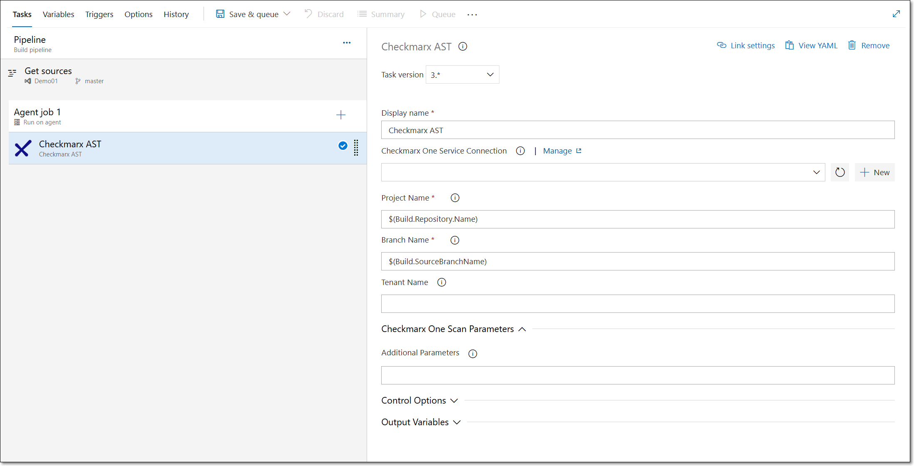
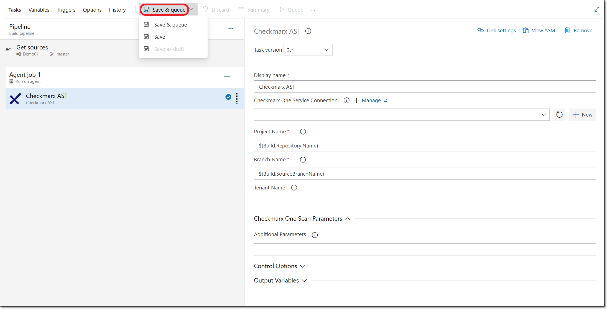
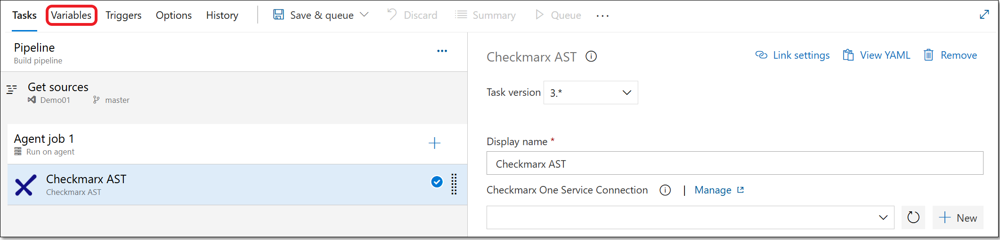
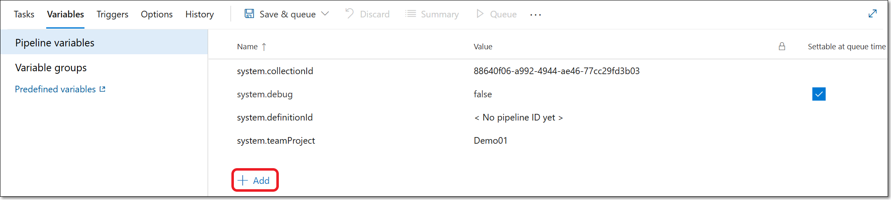
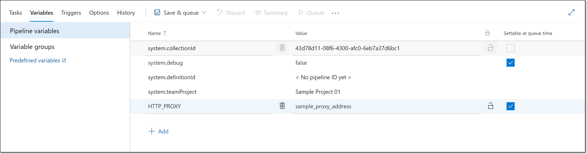

# Creating a Checkmarx One Pipeline Using a Pre-configured Task

## Creating a Pipeline without using a YAML

**To create a Checkmarx One scan pipeline without using a YAML:**

1. In your Azure DevOps console, in the main navigation, select **Pipelines** .
2. On the Pipelines screen, click **Create Pipeline**.

   A new pipeline form opens.
3. Click on **Other Git**.

   This will take you to the classic editor, which enables you to create a pipeline without using a YAML.

   
   If you don't see this option, go to **Project Settings** > **Settings** and turn off the toggles for **Disable creation of classic build pipelines** and **Disable creation of classic release pipelines**. Alternatively, you can create the pipeline using the procedure described in [Creating a Checkmarx One Pipeline Using a YAML](creating-a-checkmarx-one-pipeline-using-a-yaml.md).
   
4. Select the platform where the source code is located.

   <figure><figcaption></figcaption></figure>
5. If you haven’t created a connection for that platform, you will be prompted to do so.
6. Once you have created the connection, you will be prompted to fill in the relevant fields specifying the project, repo and branch of the source code that you would like to scan.
7. In the **Select a template** section, click on **Empty job**.

   <figure><figcaption></figcaption></figure>
8. Click on the “**+**” button for “Agent job 1” and search for the **Checkmarx AST** plugin.

   <figure><figcaption></figcaption></figure>
9. Hover over the Checkmarx AST plugin and click **Add**.

   The **Checkmarx AST** task is shown under “Agent job 1”.
10. Click on the **Checkmarx AST** task to open the configuration form in the right-side panel.

    <figure><figcaption></figcaption></figure>

    
    If you have already installed the plugin, it will appear in the top section. If you haven't installed it yet, then you need to hover over the plugin in the **Marketplace** section, click **Get it free** and follow the prompts to install it.
    
11. Under **Checkmarx One Service Connection**, select from the dropdown list the connection that you configured for Checkmarx One earlier. For more information, see [Checkmarx One Azure DevOps Plugin Initial Setup](../checkmarx-one-azure-devops-plugin-initial-setup.md).
12. For **Project Name**, specify the name of the Project to be used in Checkmarx One. (Default: $(Build.Repository.Name).
13. For **Branch** **Name**, specify the name of the branch to be used in Checkmarx One. (Default: $(Build.SourceBranchName).
14. Under **Tenant Name**, enter the name of your Checkmarx One tenant account.
15. Under **Checkmarx One Scan Parameters**, under **Additional Parameters**, you can specify any CLI arguments that you would like to apply to scans of this project. See documentation here.

    
    By default all scanners that you are authorized to run (licensed or open source) will run. To limit scans to one or more specific scanners, add the argument `--scan-types {scanner}` ,where `{scanner}` is one or more of the following scanners `sast`, `sca`, `iac-security`, `api-security`, `container-security`, or `scs`.
    
16. You can optionally adjust the **Control Options** and **Output Variables**.
17. You can add additional tasks to the Agent job both before and after the Checkmarx One scan. You can also add additional Agent jobs to the pipeline.
18. Click on the **Triggers** tab and specify how this pipeline will be triggered. You can create schedules to run periodic scans or you can specify the build completion events that will trigger scans.
19. You can optionally set up a proxy pipeline variable. See [below](#setting-up-a-proxy-pipeline-variable-optional).
20. When you are finished configuring the pipeline, click **Save & queue**.

    <figure><figcaption></figcaption></figure>
21. Select one of the following options from the dropdown menu:

    - **Save** - save the pipeline without running an initial scan.
    - **Save & queue** - save the pipeline and run it, executing an initial scan. You will be prompted to add a save comment and specify the run configuration before confirming the run command.

## Setting up a Proxy Pipeline Variable (Optional)

**To set up a pipeline variable:**

1. On the pipeline configuration screen, click on the **Variables** tab.

   <figure><figcaption></figcaption></figure>
2. Click **+ Add.**

   <figure><figcaption></figcaption></figure>
3. Enter the following configuration information:

   - In the **Name** field, enter **HTTP_PROXY**.
   - In the **Value** field, enter the value of your proxy address.
   - Ensure that the lock symbol  is open, indicating that this is not a "secured secret". This integration does not support using "secured secrets" for proxy variables.
   - Select the **Settable at queue time** check box.

     <figure><figcaption></figcaption></figure>
4. When you are finished configuring the pipeline, click **Save & queue.**

   <figure><figcaption></figcaption></figure>
5. Under **Checkmarx One Scan Parameters**, under **Additional Parameters**, set the following parameters:

   - For **basic**: `--proxy $(HTTP_Proxy)`
   - For **NTLM**: `--proxy $(HTTP_Proxy)`, `--proxy-auth-type ntlm` and `--proxy-ntlm-domain xxxx`
6. Select one of the following options from the dropdown menu:

   - **Save** - save the pipeline without running an initial scan.
   - **Save & queue** - save the pipeline and run it, executing an initial scan. You will be prompted to add a save comment and specify the run configuration before confirming the run command.
