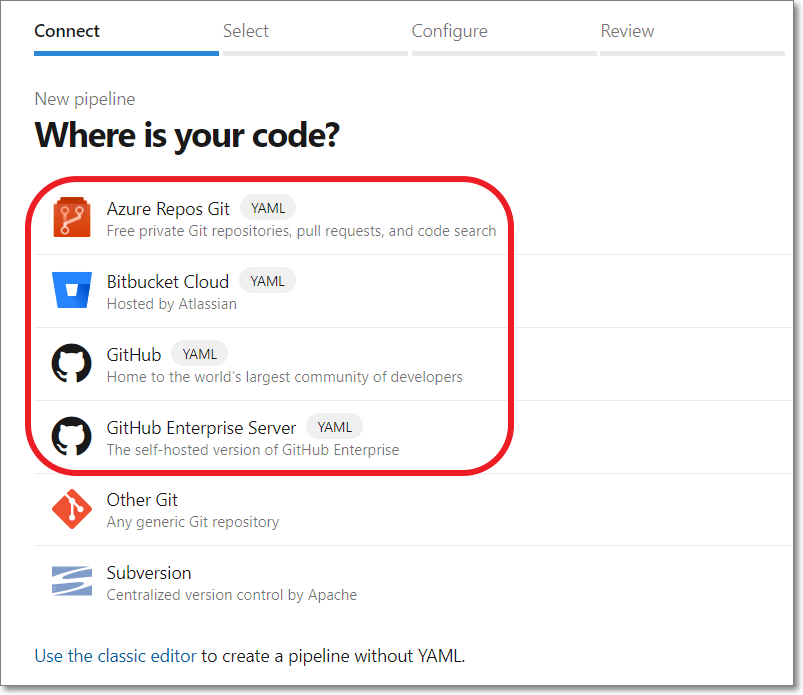
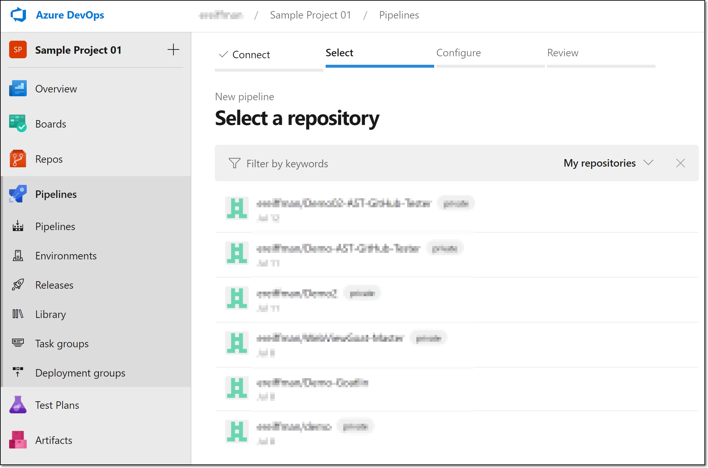
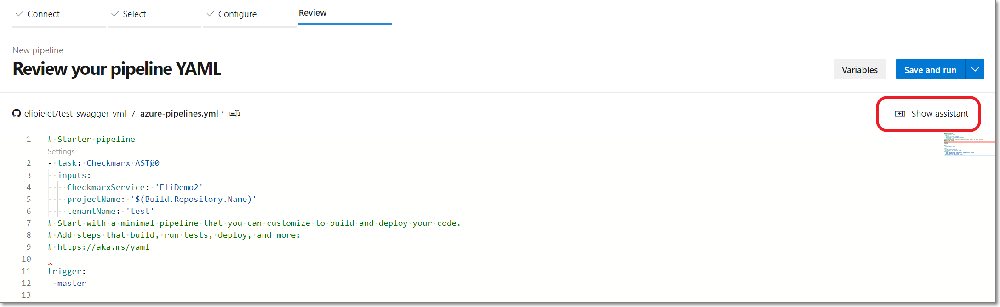
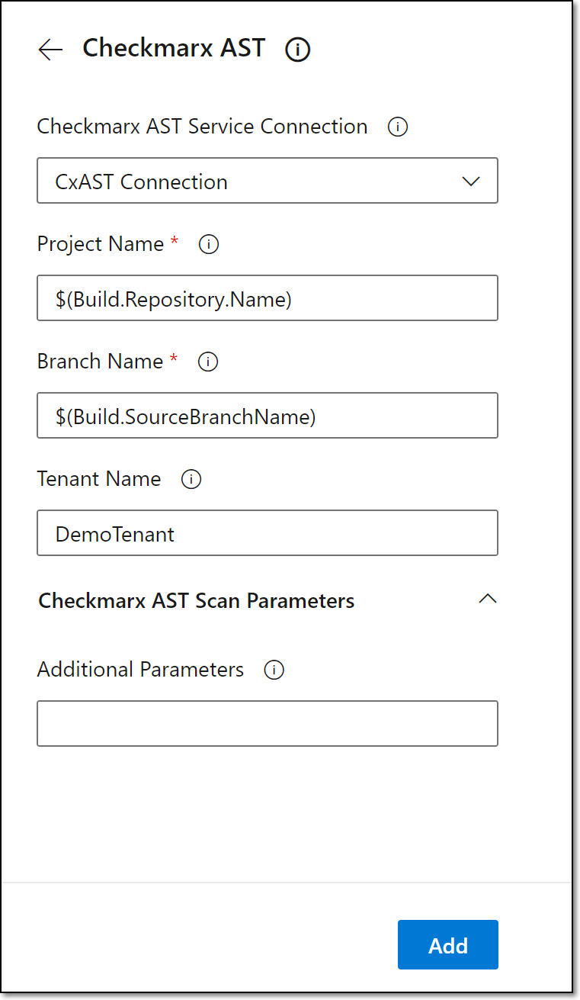

# Creating a Checkmarx One Pipeline Using a YAML

**To create a Checkmarx One pipeline using a YAML file:**

1. In your Azure DevOps console, in the main navigation, select **Pipelines** .
2. On the Pipelines screen, click **New pipeline**.

   A new pipeline form opens.
3. Select the repo platform where the source code is located. Select one of the options that shows `YAML` in the title.

   <figure><figcaption></figcaption></figure>
4. If you haven’t authorized access to this repo through Azure, then you will be redirected to do so.
5. Once you have authorized the connection, the **Select a repository** screen is shown.

   <figure><figcaption></figcaption></figure>
6. Select the desired repository. If necessary, follow the prompts to approve access to the repo.

   The **Configure your pipeline** screen is shown in your Azure DevOps console.

   <figure><figcaption></figcaption></figure>
7. Select the type of pipeline to which you would like to add the Checkmarx One scan. To create a basic pipeline, click on **Starter pipeline**. Alternatively, you can add the Checkmarx One task to an existing pipeline by clicking on **Existing Azure Pipelines YAML file**.

   The **Review your pipeline YAML** screen is shown.

   <figure><figcaption></figcaption></figure>
8. Place your cursor at the end of your YAML code.
9. Click **Show assistant** at the top right of the screen.

   <figure><figcaption></figcaption></figure>
10. Search for **Checkmarx AST** and select it.

    The Checkmarx AST configuration form is shown in the right-side panel.
11. Under **Checkmarx One Service Connection**, select from the dropdown list the connection that you configured for Checkmarx One earlier. For more information, see [Checkmarx One Azure DevOps Plugin Initial Setup](../checkmarx-one-azure-devops-plugin-initial-setup.md).
12. For **Project Name**, specify the name of the Project to be used in Checkmarx One. (Default: $(Build.Repository.Name).
13. For **Branch** **Name**, specify the name of the branch to be used in Checkmarx One. (Default: $(Build.SourceBranchName).
14. Under **Tenant Name**, enter the name of your Checkmarx One tenant account.

    <figure><figcaption></figcaption></figure>
15. Under **Checkmarx One Scan Parameters**, under **Additional Parameters**, you can specify any CLI arguments that you would like to apply to scans of this project. See documentation here.

    
    By default all scanners that you are authorized to run (licensed or open source) will run. To limit scans to one or more specific scanners, add the argument `--scan-types {scanner}` ,where `{scanner}` is one or more of the following scanners `sast`, `sca`, `iac-security`, `api-security`, `container-security`, or `scs`.
    
16. Click **Add**.

    The Checkmarx code is added to your build process.
17. Add additional code for any other tasks that you would like to add to the pipeline either before or after the Checkmarx One scan.
18. To save the pipeline and run an initial scan, click **Save and run** at the top right of the screen. Alternatively, you can save without running by clicking on the down arrow and selecting **Save**.

    The **Save and run** panel opens.

    <figure><figcaption></figcaption></figure>
19. In the **Save and run** panel enter a **Commit message** and an **Optional extended description**.
20. Select the radio button for your desired commit branch.
21. Click **Save and run**.
