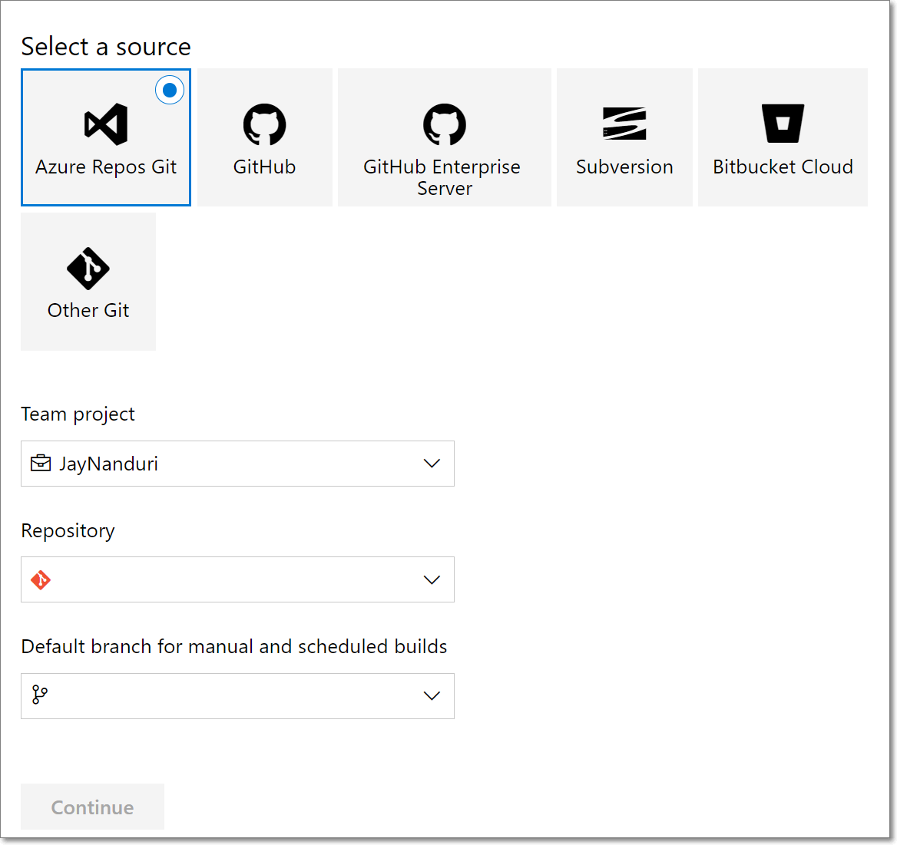
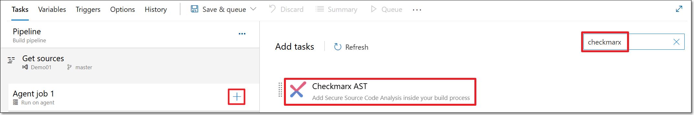

# Quick Start Guide - Checkmarx One Azure DevOps Plugin

## Overview

The Checkmarx One Azure DevOps plugin enables you to trigger SAST, SCA, IaC Security, API Security, Container Security and Software Supply Chain Security directly from an Azure DevOps pipeline. It provides a wrapper around the Checkmarx One CLI Tool which creates a zip archive from your source code repository and uploads it to Checkmarx One for scanning. This plugin provides easy integration with Azure while enabling scan customization using the full functionality and flexibility of the CLI tool.

## Prerequisites

- The source code for your project is hosted on a Git repo (public or private)
- You have a Checkmarx One account and have credentials to log in to your account

## Getting Started Using the Azure DevOps Plugin

This tutorial will guide you through the initial setup and basic workflow for using the Checkmarx One Azure DevOps plugin. We will use an API Key to authenticate with Checkmarx One and we will create a pipeline to scan a project that is hosted on your Azure Git repo.

### Step 1 – Generating an API Key in Checkmarx One

First, you need to generate an API Key in Checkmarx One to be used for authentication in Azure DevOps. To create an API Key, see Generating an API Key.


The minimum required roles for running an end-to-end flow of scanning a project and viewing results via the CLI or plugins are Checkmarx One `plugin-scanner` role and IAM `default-roles<tenant>` role.

The permissions included in `plugin-scanner` are shown here. If you would like to create a custom role with more granular permissions, you should refer to this list of permissions in order to determine which permissions you will need to assign.


### Step 2 – Installing and Setting up the Checkmarx One Plugin

The Checkmarx One plugin for Azure DevOps is available free on Azure DevOps Marketplace. Install the plugin and then create a Service connection to access your Checkmarx One environment.

1. Open your project in the Azure DevOps console.
2. Click on the Marketplace icon  in the header bar and then select **Browse marketplace** from the dropdown menu.
3. Search for the **Checkmarx AST** plugin and click on it, then click **Get it free**.
4. Follow the prompts to run the installation.
5. In the Azure console, click on **Project settings** > **Service Connections**.
6. Click **New service connection** at the top right of the screen.
7. In the **New service connection** pane, select the radio button next to **Checkmarx One Service Connection** and then click **Next**.

   The service connection setup form is displayed.
8. For **API Key** authentication, select the API KEY Authentication radio button, and fill in the following info:

   <figure><figcaption></figcaption></figure>

   1. Fill in the **Server URL** with the appropriate URL for your environment.

      **Checkmarx One Server Base URLs**

      - US Environment - https://ast.checkmarx.net
      - US2 Environment - https://us.ast.checkmarx.net
      - EU Environment - https://eu.ast.checkmarx.net
      - EU2 Environment - https://eu-2.ast.checkmarx.net
      - DEU Environment - https://deu.ast.checkmarx.net
      - Australia & New Zealand – https://anz.ast.checkmarx.net
      - India - https://ind.ast.checkmarx.net
      - India 2 - https://ind-2.ast.checkmarx.net/
      - Singapore - https://sng.ast.checkmarx.net
      - UAE - https://mea.ast.checkmarx.net
      - Israel - https://gov-il.ast.checkmarx.net
   2. Enter your **API Key**. To generate an API Key, see Generating an API Key.
9. In the **Details** section, it is recommended to give the connection a descriptive name (e.g., Checkmarx One Connection) and add a brief description. (optional)
10. Click **Save**.

### Step 3 - Create an Azure Pipeline

For this tutorial we will create a simple pipeline that gets the source code from your Azure repo and runs a Checkmarx One scan on the source code.

1. In your Azure DevOps console, in the main navigation, select **Pipelines** .
2. On the Pipelines screen, click **New pipeline**.

   A new pipeline form opens.
3. Specify the repo where the source code is located. We will specify an Azure repo using the following procedure:

   1. Click on **Other Git** and then select **Azure Repos Git**.

      
      If you don't see this option, go to **Project Settings** > **Settings** and turn off the toggles for **Disable creation of classic build pipelines** and **Disable creation of classic release pipelines**. Alternatively, you can create the pipeline using the procedure described in [Creating a Checkmarx One Pipeline Using a YAML](creating-checkmarx-one-pipelines-in-azure/creating-a-checkmarx-one-pipeline-using-a-yaml.md).
      

      <figure><figcaption></figcaption></figure>
   2. Select the desired *Team project*, *Repository* and *Default branch* from the dropdown lists and then click **Continue**.
4. In the **Select Template** section, click on **Empty job**.

   <figure><figcaption></figcaption></figure>
5. Click on the “**+**” button for “Agent job 1” and search for the **Checkmarx One** plugin.

   <figure><figcaption></figcaption></figure>
6. Hover over the Checkmarx One plugin and click **Add**.

   The Checkmarx One task configuration form is shown in the right-side panel.
7. Under **Checkmarx One Service Connection**, select from the dropdown list the connection that you configured for Checkmarx One in Step 2 above.
8. By default, the **Project Name** is designated as $(Build.Repository.Name). You can enter an alternative name if you prefer.
9. By default, the **Branch Name** is designated as $(Build.SourceBranchName). You can enter an alternative name if you prefer.
10. Under **Tenant Name**, enter the name of your Checkmarx One tenant account.
11. Under **Additional Parameters**, you can specify any CLI arguments that you would like to apply to scans of this project. See documentation here.

    
    By default all scanners that you are authorized to run (licensed or open source) will run. To limit scans to one or more specific scanners, add the argument `--scan-types {scanner}` ,where `{scanner}` is one or more of the following scanners `sast`, `sca`, `iac-security`, `api-security`, `container-security`, or `scs`.
    
12. When you are finished configuring the task, to save the pipeline and run an initial scan, click **Save & queue** and then in the dialog that opens click **Save and Run**.

    <figure><figcaption></figcaption></figure>
