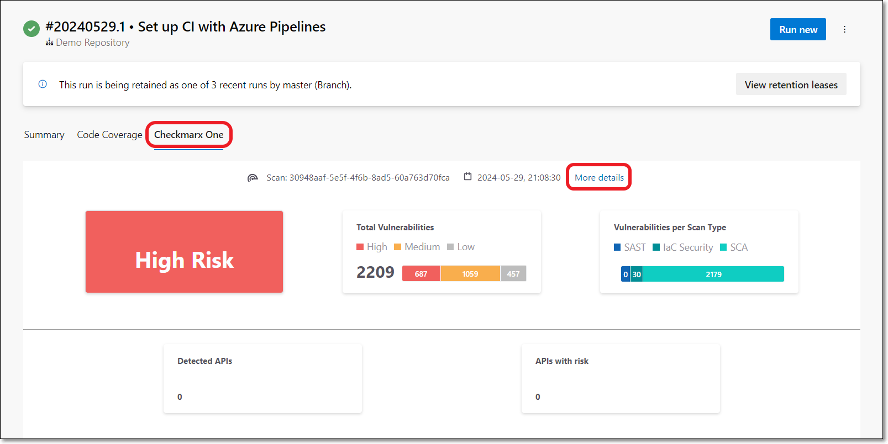
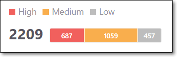
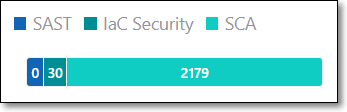
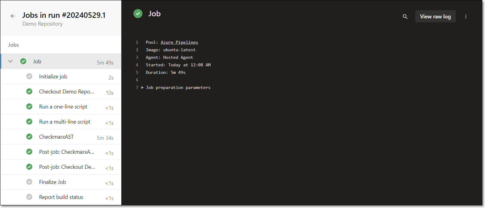

# Viewing Checkmarx One Results in Azure

The Checkmarx One Azure plugin generates a results summary and a log of the scan execution. Both are available on the Build page for each build (scan) of a project. In addition Azure provides a link to view comprehensive scan results in Checkmarx One.


If the no wait option `--nowait, -w` was added to the additional arguments, no results will be provided in Azure.


## Viewing the Scan Results Summary

You can view the results summary directly in the Azure console or by downloading an HTML file. The items in the summary are described in the table below.

**To view the scan results summary via the Azure console:**

1. On the main **Pipelines** screen, click on a Pipeline and select a specific run.
2. On the Run page, select the **Checkmarx One** tab.

   The scan summary is shown. The scan summary is described in the table below.

   <figure><figcaption></figcaption></figure>
3. You can view comprehensive results in Checkmarx One by clicking on the **More details** link at the top of the screen. For an explanation of the scan results, see Viewing the Project Page in the Checkmarx One User Guide.

### Understanding the Scan Results Summary

| **Item** | **Description** | **Possible Values** |
|---|---|---|
| **Risk Level** | The highest risk level of any vulnerability identified in the Project. | *Critical*, *High*, *Medium*, or *Low* |
| **Total Vulnerabilities** | The combined total number of vulnerabilities in your Project followed by a color coded bar graph indicating the number of vulnerabilities of each severity level (*Critical*, *High*, *Medium*, and *Low*). | e.g.,  |
| **Vulnerabilities per Scan Type** | A color coded bar graph indicating the number of vulnerabilities identified by each of the scanners (*SAST*, *IaC Security*, *SCA*, *API Security*, *Container Security* and *Software Supply Chain Security*. | e.g.,  |

## Viewing a log of the scan execution

To view a log of the scan executions:

1. On the Run page, select the **Summary** tab.
2. Click on the job that contains the Checkmarx One scan.
3. Click on an execution step to view logs in the right side pane.

   <figure><figcaption></figcaption></figure>
