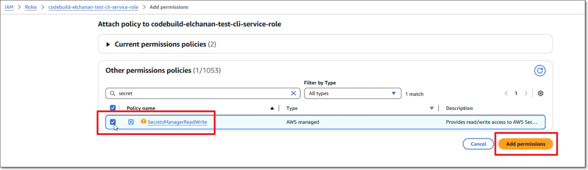

# Checkmarx One AWS CodeBuild Integration

You can integrate Checkmarx One with AWS CodeBuild using our CLI Tool. This enables you to run Checkmarx One scans as well as performing other Checkmarx One CLI commands in CodeBuild.

## Prerequisites

- You have a Checkmarx One account and you have an **OAuth Client** or **API Key** for Checkmarx One authentication. To generate the required authentication, see [Authentication for Checkmarx One CLI and Plugins](../../authentication-for-checkmarx-one-cli-and-plugins/README.md).

  
  OAuth Clients let you specify only the permissions the integration needs. API Keys, by contrast, automatically inherit all permissions of the user who generated them, which may be broader than intended.
  
- You have an AWS account and access to CodeCommit.
- You have created a repo in CodeCommit.

## Setting up Checkmarx One CLI Integration

Before running Checkmarx One CLI commands in your CodeBuild project, you need to create and configure a buildspec.yaml file. This involves configuring project variables to manage your secrets, replacing placeholders in the buildspec.yaml with info about your Checkmarx One account and then adding it to your repo.

Once your project is set up, you can use CLI commands to run scans, retrieve scan results and perform CRUD actions on your Checkmarx One Projects and Applications. For an explanation of the CLI commands, see Checkmarx One CLI Commands.

### Create a CodeBuild Project

1. Go to developer tools inside your AWS account.
2. Go to **CodeBuild > Build Projects > Create build project**.
3. Fill in the fields as desired.

   
   The Operating System must be **Ubuntu** and, **Buildspec > "Use buildspec file"** should be enabled.
   
4. Add permission for the secrets manager, as follows:

   1. Go to **Service role permission** and copy the path to the role for this project.
   2. Open the AWS **IAM** > **Roles** and open the role for this project.
   3. In the **Permissions policies** section click on **Add permissions** > **Attach policies**.
   4. Select the policy **SecretsManagerReadWrite** and click **Add permissions**.

      

### Storing Secrets as Project Variables

Create variables for the parameters needed for authentication with Checkmarx One and store their values.


The environment variables need to be set separately for each CodeBuild in AWS.


1. In your AWS account, go to **Developer Tools > CodeBuild > Build projects > {project_name} > Edit > Environment**.
2. Create environment variables for the OAuth Client ID and Client Secret (or alternatively for the API Key), giving the variables the names **CX_CLIENT_ID** and **CX_CLIENT_SECRET** (or alternatively CX_API_KEY).
3. Set the **Type** as **Secrets Manager,** and set the **Value** for each as a name that describes the secret.

   
4. If you will be installing the CLI using wget (Option 2 below) then you need to create an additional variable, **CX_VERSION** with **Type** "Plaintext" and enter the **Value** as the version of the CLI to install.
5. Click on **Update Environment**.
6. Store the secret for each variable, as follows:

   1. Go to **AWS Secret Manager** > **Secrets** and click on **Store a new secret.**
   2. Under **Secret type**, select **Other type of secret**.
   3. Under **Key/value pairs**, click on **Plaintext**.
   4. Clear the placeholder text and enter the secret values for the OAuth Client (or API Key) that you obtained from your Checkmarx One account (as explained in [Authentication for Checkmarx One CLI and Plugins](../../authentication-for-checkmarx-one-cli-and-plugins/README.md)).
   5. Click **Next**.
   6. In the **Secret name** field, enter the name that you specified as the **Value** for the variable in step 3 above.
   7. Click **Next** and complete the secret creation process.

### Configuring the Project to Run Checkmarx CLI Commands

1. Add the buildspec.yaml or buildspec.yml file from one of the integration examples provided below to your project repository.
2. Create the CodeBuild as described above.
3. Edit the Checkmarx One CLI `scan create` command in the spec file, specifying the relevant scan parameters as described below in Configuring Scan Settings. Alternatively, you can run other CLI commands, see Checkmarx One CLI Commands.
4. You can add triggers to run the CodeBuild, or you can run the CodeBuild manually by clicking **Developer Tools > CodeBuild > Build projects > {project_name}** > **Start build**.

#### Sample CodeBuild Spec Files

We provide samples that use various methods for installing the Checkmarx One CLI. You need to replace the placeholder texts with actual values as described below.

**Option 1 - Install the CLI using Homebrew**


This option can be installed on any environment. This method includes installing Homebrew on your image.


```
version: 0.2

phases:
  install:
    commands:
      - /bin/bash -c "$(curl -fsSL https://raw.githubusercontent.com/Homebrew/install/HEAD/install.sh)"
      - eval "$(/home/linuxbrew/.linuxbrew/bin/brew shellenv)"
      - brew install checkmarx/ast-cli/ast-cli
  build:
    commands:
      - cx scan create --project-name "<CX_PROJECT_NAME>" --file-source "." --branch "main" --scan-info-format 'json' --agent 'CodeCommit' --base-uri "<BASE_URI>" --tenant "<CX_TENANT>" --client-id "$CX_CLIENT_ID" --client-secret "$CX_CLIENT_SECRET"
```

**Option 2 - Install the CLI using wget and Checkmarx One CLI release**


For this option you need to add to the environment a **CX_VERSION** variable, with the desired cli version to use.


```
version: 0.2

phases:
  install:
    commands:
      - wget -O ./cxcli.tar.gz "https://github.com/Checkmarx/ast-cli/releases/download/${CX_VERSION}/ast-cli_${CX_VERSION}_linux_x64.tar.gz"
      - tar xzvf ./cxcli.tar.gz
  build:
    commands:
      - ./cx scan create --project-name "<CX_PROJECT_NAME>" --file-source "." --branch "main" --report-format 'summaryHTML' --agent 'CodeCommit' --base-uri "<CX_BASE_URI>" --tenant "<CX_TENANT>" --client-id "$CX_CLIENT_ID" --client-secret "$CX_CLIENT_SECRET"
```


Check for updates to the code samples in [GitHub](https://github.com/CheckmarxDev/ast-cicd-templates/tree/master/Bamboo/bamboo-specs).


### Configuring Scan Settings

The following snippet shows how you can run a Checkmarx One scan in CodeBuild using the `cx scan create` command with the minimum required parameters:

```
- cx scan create -s "<FILE_PATH>" --project-name "<CX_PROJECT_NAME>" --base-uri "<CX_BASE_URI>" --tenant "<CX_TENANT>" --client-id "$CX_CLIENT_ID" --client-secret "$CX_CLIENT_ID_SECRET" --branch "main"
```

Replace the placeholders with the info described below.

- `--file-source` - location of the source code.
- `--project-name` - name of the Checkmarx One Project.
- `--branch` - name of the branch of the Checkmarx One Project.
- `--base-uri` - the base URI of your Checkmarx One environment.

  **Checkmarx One Server Base URLs**

  - US Environment - https://ast.checkmarx.net
  - US2 Environment - https://us.ast.checkmarx.net
  - EU Environment - https://eu.ast.checkmarx.net
  - EU2 Environment - https://eu-2.ast.checkmarx.net
  - DEU Environment - https://deu.ast.checkmarx.net
  - Australia & New Zealand – https://anz.ast.checkmarx.net
  - India - https://ind.ast.checkmarx.net
  - India 2 - https://ind-2.ast.checkmarx.net/
  - Singapore - https://sng.ast.checkmarx.net
  - UAE - https://mea.ast.checkmarx.net
  - Israel - https://gov-il.ast.checkmarx.net
- `--tenant` - The name of your tenant account.

### Viewing Scan Results in CodeBuild


As with all Checkmarx One scans, you can view the scan results in the Checkmarx One web application or via API.


You can also check the CodeBuild logs to view the result of the command execution.

<figure><figcaption></figcaption></figure>
