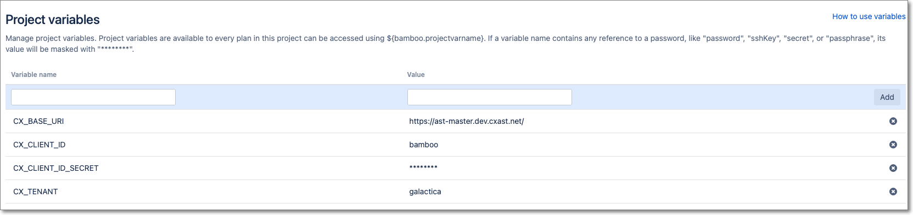
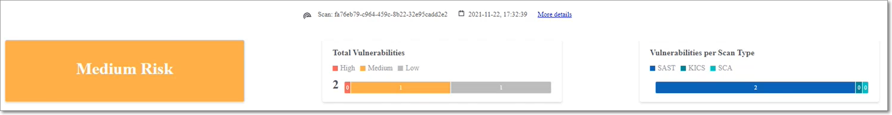

# Checkmarx One Bamboo Integration

You can integrate Checkmarx One into your Bamboo projects using our CLI Tool. You can run Checkmarx One scans as well as perform other Checkmarx One commands using the CLI Tool.

## Prerequisites

- You have a Checkmarx One account and you have an **OAuth Client** or **API Key** for Checkmarx One authentication. To generate the required authentication, see [Authentication for Checkmarx One CLI and Plugins](../../authentication-for-checkmarx-one-cli-and-plugins/README.md).

  
  The minimum required roles for running an end-to-end flow of scanning a project and viewing results via the CLI or plugins are Checkmarx One `plugin-scanner` role and IAM `default-roles<tenant>` role.

  The permissions included in `plugin-scanner` are shown here. If you would like to create a custom role with more granular permissions, you should refer to this list of permissions in order to determine which permissions you will need to assign.
  

  
  OAuth Clients let you specify only the permissions the integration needs. API Keys, by contrast, automatically inherit all permissions of the user who generated them, which may be broader than intended.
  
- You have a Bamboo installation.
- You have created project and plan in Bamboo, and made a note of the **Project Key** and **Plan Key**.

## Setting up Checkmarx One CLI Integration

Before running Checkmarx One CLI commands in your Bamboo project, you need to configure a project and plan for running the CLI commands. This involves first configuring project variables for accessing Checkmarx One and then adding our Bamboo Specs .yaml file to your repo and configuring it for your project.

Once your project is set up, you can use CLI commands to run scans, retrieve scan results and perform CRUD actions on your Checkmarx One Projects and Applications. For an explanation of the CLI commands, see Checkmarx One CLI Commands.

### Configuring Project Variables

Create variables for the parameters needed to connect to you Checkmarx One account.


The environment variables need to be set separately for each project in Bamboo.


1. In your Bamboo console, go to **Project** > {**project_name}** > **Project settings** > **Variables**.
2. Create project variables by entering a **Variable** **name** and **Value** for each of the variables described in the table below, and then clicking **Add**.

<figure><figcaption></figcaption></figure>

### Project Variables

| **Key** | **Value** |
|---|---|
| BASE_URI | <details><br><br><summary>Checkmarx One Server Base URLs</summary><br><br>- US Environment - https://ast.checkmarx.net<br>- US2 Environment - https://us.ast.checkmarx.net<br>- EU Environment - https://eu.ast.checkmarx.net<br>- EU2 Environment - https://eu-2.ast.checkmarx.net<br>- DEU Environment - https://deu.ast.checkmarx.net<br>- Australia & New Zealand – https://anz.ast.checkmarx.net<br>- India - https://ind.ast.checkmarx.net<br>- India 2 - https://ind-2.ast.checkmarx.net/<br>- Singapore - https://sng.ast.checkmarx.net<br>- UAE - https://mea.ast.checkmarx.net<br>- Israel - https://gov-il.ast.checkmarx.net<br><br></details> |
| BASE_AUTH_URI | <details><br><br><summary>Checkmarx One Authentication URLs</summary><br><br>- US Environment - https://iam.checkmarx.net<br>- US2 Environment - https://us.iam.checkmarx.net<br>- EU Environment - https://eu.iam.checkmarx.net<br>- EU2 Environment - https://eu-2.iam.checkmarx.net<br>- DEU Environment - https://deu.iam.checkmarx.net<br>- Australia & New Zealand – https://anz.iam.checkmarx.net<br>- India - https://ind.iam.checkmarx.net<br>- Singapore - https://sng.iam.checkmarx.net<br>- UAE - https://mea.iam.checkmarx.net<br>- Israel - https://gov-il.iam.checkmarx.net<br><br></details> |
| TENANT | The name of your tenant account. |
| Use one of the following authentication methods. | |
| OAuth CLIENT_ID and SECRET<br>(Recommended method) | These values are obtained from the Checkmarx One web application, see [Creating an OAuth Client for Checkmarx One Integrations](../../authentication-for-checkmarx-one-cli-and-plugins/creating-an-oauth-client-for-checkmarx-one-integrations.md). |
| API_KEY | This is obtained from the Checkmarx One web application, see Generating an API Key. |

### Configuring a Project to Run Checkmarx One CLI Commands

1. Add the Bamboo Specs .yaml file from one of the integration examples provided below to your project repository.
2. Edit the Bamboo Specs .yaml file in your repository, replacing the `project-key` and `key` values with the **Project key** and **Plan key** values for this plan.
3. Edit the Checkmarx One CLI command in the Bamboo Spec file, specifying the relevant scan parameters as described [below](#configuring-scan-settings). Alternatively, you can run other CLI commands, see Checkmarx One CLI Commands.
4. Access the project that you created in Bamboo by clicking **Project** > {**project_name}** > **Repositories** > **Add repository** and specifying the repo URL.
5. Edit the repository to enable **Bamboo Specs** by clicking **Edit repository** > **Bamboo Specs** and then enabling **Scan for Bamboo Specs.**
6. Scan the repository to add the Checkmarx One CLI as a plan to the project, by clicking **Edit repository** > **Spec status** and click **Scan**.
7. You can add triggers to run the plan, or you can run the plan manually by clicking**Project**>**{project_name}**>**Plans**>**{plan_name}**>**Run plan**.

#### Sample Bamboo Spec Files

We provide samples that use various methods for installing the Checkmarx One CLI.

**Option 1 - Install the CLI using Homebrew**


This option can be installed on any environment. This method includes installing Homebrew on your image.


```
version: 2

plan:
  project-key: TES
  key: RC
  name: Checkmarx ast-cli

stages:
  - Stage 1:
      jobs:
        - Job cli

Job cli:
  docker:
    image: ubuntu:latest
  tasks:
    - script:
        - /bin/bash -c "$(curl -fsSL https://raw.githubusercontent.com/Homebrew/install/HEAD/install.sh)"
        - /home/linuxbrew/.linuxbrew/bin/brew install checkmarx/ast-cli/ast-cli
        - /home/linuxbrew/.linuxbrew/Cellar/ast-cli/*/bin/cx \
        - brew install checkmarx/ast-cli/ast-cli
        - cx scan create -s ${bamboo.build.working.directory} --project-name ${bamboo.planRepository.1.name} --base-uri ${bamboo.CX_BASE_URI} --tenant ${bamboo.CX_TENANT} --client-id ${bamboo.CX_CLIENT_ID} --client-secret ${bamboo.CX_CLIENT_ID_SECRET} --branch ${bamboo.planRepository.1.branchName}
```

**Option 2 - Install the CLI using an Ubuntu image with Homebrew installed**

```
version: 2

plan:
  project-key: TES
  key: RC
  name: Checkmarx ast-cli

stages:
  - Stage 1:
      jobs:
        - Job cli

Job cli:
  docker:
    image: homebrew/ubuntu18.04
  tasks:
    - script:
        - brew install checkmarx/ast-cli/ast-cli
        - cx scan create -s ${bamboo.build.working.directory} --project-name ${bamboo.planRepository.1.name} --base-uri ${bamboo.CX_BASE_URI} --tenant ${bamboo.CX_TENANT} --client-id ${bamboo.CX_CLIENT_ID} --client-secret ${bamboo.CX_CLIENT_ID_SECRET} --branch ${bamboo.planRepository.1.branchName}
```

**Option 3 - Install the CLI using the Checkmarx One CLI Docker Image**


This option can be used on any environment. It uses a Bamboo supported plugin which offers additional configuration options.


```
version: 2
plan:
  project-key: Myproject
  key: MPCX
  name: Checkmarx Scan
stages:
- Default Stage:
    jobs:
    - Scan
Scan:
  key: SCAN
  tasks:
  - checkout:
      force-clean-build: 'false'
      description: Checkout Default Repository
  - any-task:
      plugin-key: com.atlassian.bamboo.plugins.bamboo-docker-plugin:task.docker.cli
      configuration:
        commandOption: run
        image: checkmarx/ast-cli
        detach: 'false'
        serviceWait: 'false'
        command: /app/bin/cx scan create -s . --project-name mybamboo --base-uri ${bamboo.CX_BASE_URI} --tenant ${bamboo.CX_TENANT} --client-id ${bamboo.CX_CLIENT_ID} --client-secret ${bamboo.CX_CLIENT_ID_SECRET} --branch ${bamboo.planRepository.1.branchName}
        workDir: /data
        additionalArgs: --entrypoint=""
        hostDirectory_0: ${bamboo.working.directory}
        containerDataVolume_0: /data
      description: Ast Scan
```


Check for updates to the code samples in [GitHub](https://github.com/CheckmarxDev/ast-cicd-templates/tree/master/Bamboo/bamboo-specs).


### Configuring Scan Settings

The following snippet shows how you can run a Checkmarx One scan in Bamboo using the `cx scan create` command with the minimum required parameters `-s` (location of the source code), `--project-name` (name of the Checkmarx One Project), and `--branch` (name of the branch of the Checkmarx One Project) as well as the Project variables that you configured for connecting to Checkmarx One. For additional scan arguments see, scan create.

```
- cx scan create -s ${bamboo.build.working.directory} --project-name ${bamboo.planRepository.1.name} --base-uri ${bamboo.CX_BASE_URI} --tenant ${bamboo.CX_TENANT} --client-id ${bamboo.CX_CLIENT_ID} --client-secret ${bamboo.CX_CLIENT_ID_SECRET} --branch ${bamboo.planRepository.1.branchName}
```

### Viewing Scan Results in Bamboo


As with all Checkmarx One scans, you can view the scan results in the Checkmarx One web application or via API.


If you would like to view the scan results directly in Bamboo.

1. Add scan results arguments to the scan command. For `report-format` enter **summaryHTML,** and specify the desired `output-path` and `output-name`.
2. Add an `artifacts` section with the name **checkmarx**, the `location` specifying the **{output-path}** that you designated and the `pattern` specifying **{output-name}.html**.

   ```
   - any-task:
         plugin-key: com.atlassian.bamboo.plugins.bamboo-docker-plugin:task.docker.cli
         configuration:
           commandOption: run
           image: checkmarx/ast-cli
           detach: 'false'
           serviceWait: 'false'
           command: /app/bin/cx scan create -s . --project-name mybamboo --base-uri ${bamboo.CX_BASE_URI} --tenant ${bamboo.CX_TENANT} --client-id ${bamboo.CX_CLIENT_ID} --client-secret ${bamboo.CX_CLIENT_ID_SECRET} --branch ${bamboo.planRepository.1.branchName} --report-format summaryHTML --output-path ./cx_results/ --output-name cx_results
           workDir: /data
           additionalArgs: --entrypoint=""
           hostDirectory_0: ${bamboo.working.directory}
           containerDataVolume_0: /data
         description: Ast Scan
     artifacts:
     - name: checkmarx
       location: cx_results
       pattern: cx_results.html
       shared: false
       required: false
     artifact-subscriptions: []
   ```
3. After running a scan, you can go to the **Build** page > **Artifacts** tab and click on the **Checkmarx** artifact to view the scan results summary as well as a link to the full results in the Checkmarx One web application.

   <figure><figcaption></figcaption></figure>
