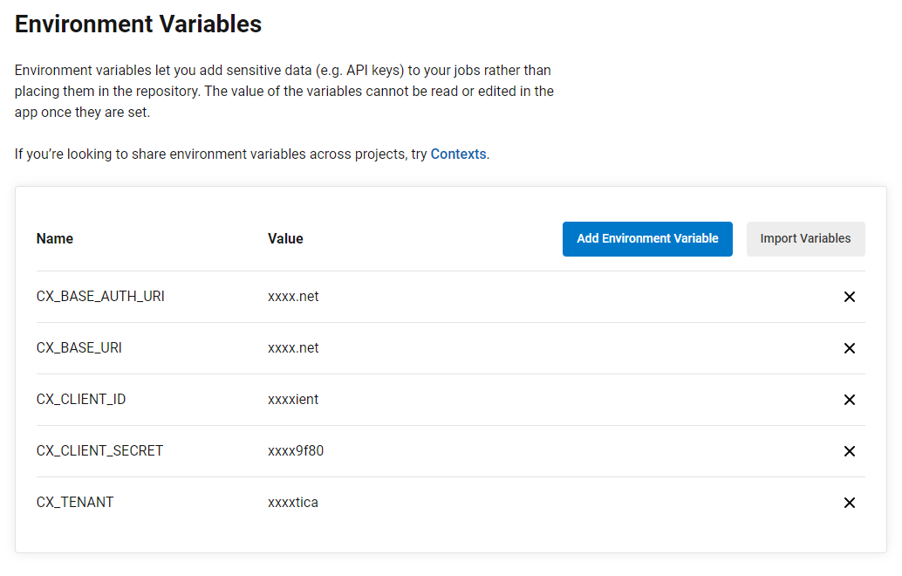

# Checkmarx One CircleCI Integration

You can integrate Checkmarx One into your CircleCI pipelines using our CLI Tool. You can run Checkmarx One scans as well as perform other Checkmarx One commands using the CLI Tool.

## Prerequisites

- You have a Checkmarx One account and you have an **OAuth Client** or **API Key** for Checkmarx One authentication. To generate the required authentication, see [Authentication for Checkmarx One CLI and Plugins](../../authentication-for-checkmarx-one-cli-and-plugins/README.md).

  
  The minimum required roles for running an end-to-end flow of scanning a project and viewing results via the CLI or plugins are Checkmarx One `plugin-scanner` role and IAM `default-roles<tenant>` role.

  The permissions included in `plugin-scanner` are shown here. If you would like to create a custom role with more granular permissions, you should refer to this list of permissions in order to determine which permissions you will need to assign.
  

  
  OAuth Clients let you specify only the permissions the integration needs. API Keys, by contrast, automatically inherit all permissions of the user who generated them, which may be broader than intended.
  

## Initial Setup

Before running Checkmarx One CLI commands in your CircleCI pipelines, you need to configure access to Checkmarx One. This is done by specifying the server URLs, tenant account, and authentication credentials for accessing your Checkmarx One environment.

1. In your CircleCI console, in the main navigation click on **Project settings** > **Environment Variables**, then click **Add Environment Variable**.
2. Create variables by clicking **Add Environment Variable** and entering a **Name** and **Value** for each of the variables described in the table below.

<figure><figcaption></figcaption></figure>

### Repository Variables

| **Key** | **Value** |
|---|---|
| BASE_URI | <details><br><br><summary>Checkmarx One Server Base URLs</summary><br><br>- US Environment - https://ast.checkmarx.net<br>- US2 Environment - https://us.ast.checkmarx.net<br>- EU Environment - https://eu.ast.checkmarx.net<br>- EU2 Environment - https://eu-2.ast.checkmarx.net<br>- DEU Environment - https://deu.ast.checkmarx.net<br>- Australia & New Zealand – https://anz.ast.checkmarx.net<br>- India - https://ind.ast.checkmarx.net<br>- India 2 - https://ind-2.ast.checkmarx.net/<br>- Singapore - https://sng.ast.checkmarx.net<br>- UAE - https://mea.ast.checkmarx.net<br>- Israel - https://gov-il.ast.checkmarx.net<br><br></details> |
| BASE_AUTH_URI | <details><br><br><summary>Checkmarx One Authentication URLs</summary><br><br>- US Environment - https://iam.checkmarx.net<br>- US2 Environment - https://us.iam.checkmarx.net<br>- EU Environment - https://eu.iam.checkmarx.net<br>- EU2 Environment - https://eu-2.iam.checkmarx.net<br>- DEU Environment - https://deu.iam.checkmarx.net<br>- Australia & New Zealand – https://anz.iam.checkmarx.net<br>- India - https://ind.iam.checkmarx.net<br>- Singapore - https://sng.iam.checkmarx.net<br>- UAE - https://mea.iam.checkmarx.net<br>- Israel - https://gov-il.iam.checkmarx.net<br><br></details> |
| TENANT | The name of your tenant account. |
| Use one of the following authentication methods. | |
| OAuth CLIENT_ID and SECRET<br>(Recommended method) | These values are obtained from the Checkmarx One web application, see [Creating an OAuth Client for Checkmarx One Integrations](../../authentication-for-checkmarx-one-cli-and-plugins/creating-an-oauth-client-for-checkmarx-one-integrations.md). (recommended method) |
| API_KEY | This is obtained from the Checkmarx One web application, see Generating an API Key. |

## Running CLI Commands in CircleCI

You can use CLI commands to run scans, retrieve scan results and perform CRUD actions on your Checkmarx One Projects and Applications. For an explanation of the CLI commands, see Checkmarx One CLI Commands.

### Usage Example - Running a Checkmarx One Scan in CircleCI

The following snippet shows how you can run a Checkmarx One scan in CircleCI using our CLI Tool.

The snippet uses the `scan create` command with the minimum required parameters `-s` (location of the source code), `--project-name` (name of the Checkmarx One Project), and `--branch` (name of the branch of the Checkmarx One Project) as well as the repository variables that you configured for connecting to Checkmarx One. We also recommend using the `--agent` flag with the value `CircleCI`. For additional scan arguments see, scan create.

Option 1 (recommended): Use the Checkmarx One CLI docker image to trigger the scan:

```
version: 2
jobs:
  build:
    docker:
      - image: checkmarx/ast-cli
    steps:
      - checkout
      - run:
          name: "Run Scan"
          command: |
            /app/bin/cx \
            scan create \
            -s . \
            --agent CircleCI \
            --project-name $PROJECT \
            --branch $CX_BRANCH \
            --base-uri $CX_BASE_URI \
            --base-auth-uri $CX_BASE_AUTH_URI \
            --tenant $CX_TENANT \
            --client-id $CX_CLIENT_ID \
            --client-secret $CX_CLIENT_SECRET \
```

Option 2: Use the CircleCI base image and brew to install the Checkmarx One CLI and trigger the scan:

```
version: 2
jobs:
  build:
    docker:
      - image: cimg/base:2021.04
    steps:
      - run:
          name: "Run Scan"
          command: |
            /bin/bash -c "$(curl -fsSL https://raw.githubusercontent.com/Homebrew/install/HEAD/install.sh)"
            /home/linuxbrew/.linuxbrew/bin/brew install checkmarx/ast-cli/ast-cli
            /home/linuxbrew/.linuxbrew/Cellar/ast-cli/*/bin/cx \
            scan create \
            -s . \
            --agent CircleCI \
            --project-name $PROJECT \
            --branch $CX_BRANCH \
            --base-uri $CX_BASE_URI \
            --base-auth-uri $CX_BASE_AUTH_URI \
            --tenant $CX_TENANT \
            --client-id $CX_CLIENT_ID \
            --client-secret $CX_CLIENT_SECRET
```


Check for updates to the code samples in [GitHub](https://github.com/Checkmarx/ci-cd-integrations/tree/main/CircleCI).

