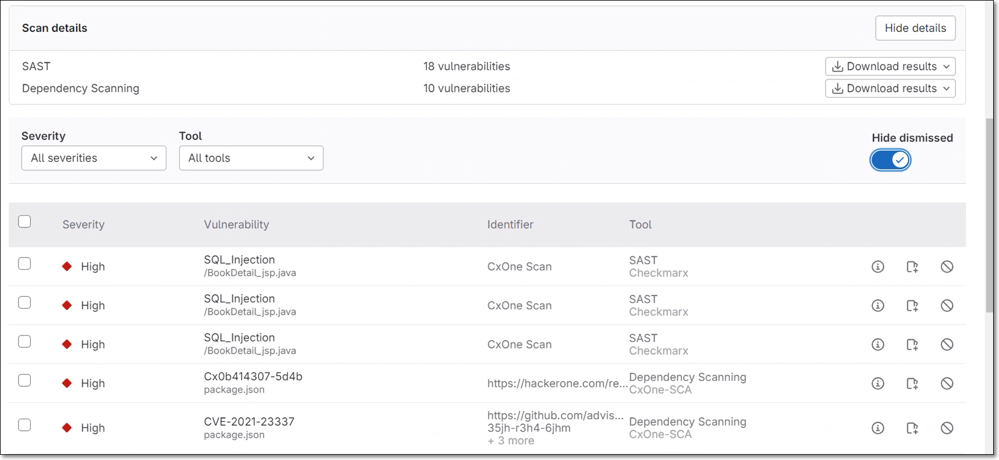
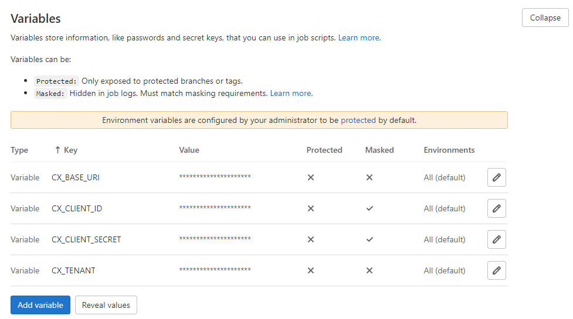

# Checkmarx One GitLab Integration

You can integrate Checkmarx One into your GitLab CI/CD pipelines using our CLI Tool. You can run Checkmarx One scans as well as perform other Checkmarx One commands using the CLI Tool.

There are two versions of the template used for this integration, template v1 and template v2. Template v2 provides the following extra functionality:

- Generates a merge request decoration (requires a GitLab Personal Access Token with "API" scope)

  <figure><figcaption></figcaption></figure>
- Output scan results in gl-sast and gl-sca format for display in the GitLab [Security Dashboard](https://docs.gitlab.com/ee/user/application_security/security_dashboard/) (requires a GitLab license that includes the Security Dashboard)

  <figure><figcaption></figcaption></figure>

## Prerequisites

- You have a Checkmarx One account and you have an **OAuth Client** for Checkmarx One authentication. To generate the required authentication, see [Creating an OAuth Client for Checkmarx One Integrations](../../authentication-for-checkmarx-one-cli-and-plugins/creating-an-oauth-client-for-checkmarx-one-integrations.md).

## Initial Setup

Before running Checkmarx One CLI commands in your GitLab pipelines, you need to configure access to Checkmarx One. This is done by specifying the server URLs, tenant account, and authentication credentials for accessing your Checkmarx One environment. Once this is configured, you can create a job to run a Checkmarx One scan or to run other CLI commands.

1. In your GitLab console, in the main navigation click on **Settings > CI/CD**, then scroll down to the Variables section and click Expand.
2. Create variables for each of the items shown in the table below, using the following procedure.

   1. Click **Add variable**.

      The Add variable window opens.

      <figure><figcaption></figcaption></figure>
   2. For **Key**, enter a name for the variable.
   3. For **Value**, enter the value for that variable.
   4. For **Type**, verify that **Variable** is selected(default).
   5. For **Flags**, select **Masked** for your authentication credentials so that the values are not shown in the open.
   6. Click **Add variable**.

   | **Key** | **Value** |
   |---|---|
   | CX_BASE_URI | **Checkmarx One Server Base URLs**<br>- US Environment - https://ast.checkmarx.net<br>- US2 Environment - https://us.ast.checkmarx.net<br>- EU Environment - https://eu.ast.checkmarx.net<br>- EU2 Environment - https://eu-2.ast.checkmarx.net<br>- DEU Environment - https://deu.ast.checkmarx.net<br>- Australia & New Zealand – https://anz.ast.checkmarx.net<br>- India - https://ind.ast.checkmarx.net<br>- India 2 - https://ind-2.ast.checkmarx.net/<br>- Singapore - https://sng.ast.checkmarx.net<br>- UAE - https://mea.ast.checkmarx.net<br>- Israel - https://gov-il.ast.checkmarx.net |
   | CX_BASE_AUTH_URI | **Checkmarx One Authentication URLs**<br>- US Environment - https://iam.checkmarx.net<br>- US2 Environment - https://us.iam.checkmarx.net<br>- EU Environment - https://eu.iam.checkmarx.net<br>- EU2 Environment - https://eu-2.iam.checkmarx.net<br>- DEU Environment - https://deu.iam.checkmarx.net<br>- Australia & New Zealand – https://anz.iam.checkmarx.net<br>- India - https://ind.iam.checkmarx.net<br>- Singapore - https://sng.iam.checkmarx.net<br>- UAE - https://mea.iam.checkmarx.net<br>- Israel - https://gov-il.iam.checkmarx.net |
   | CX_TENANT | The name of your tenant account. |
   | CX_CLIENT_ID and CX_CLIENT_SECRET | These values are obtained from the Checkmarx One web application, see [Creating an OAuth Client for Checkmarx One Integrations](../../authentication-for-checkmarx-one-cli-and-plugins/creating-an-oauth-client-for-checkmarx-one-integrations.md). |
   | GITLAB_TOKEN<br>(for v2) | Generate a GitLab Personal Access Token with the scope \`API\`, and submit the value in this variable. This will enable Checkmarx One to decorate the merge request with the scan results summary. |
   | CX_LINK_SERVER_HOST<br>(for v2, optional) | Generate a CxLink, as described here, and submit the value in this variable. This will enable Checkmarx One to decorate the merge request with the scan results summary for private repos that aren't accessible externally. |

   <figure><figcaption></figcaption></figure>

## Running a Checkmarx One Scan in a Pipeline

1. For a standard integration, include template v1 in your pipeline using the following code:

   ```
   include: 'https://raw.githubusercontent.com/Checkmarx/ci-cd-integrations/main/GitlabCICD/v1/CheckmarxCLI.gitlab-ci.yml'
   ```
2. Alternatively, if you would like to generate merge request decorations and output SAST and SCA results to GitLab Security Dashboard, include template v2 in your pipeline, as follows.

   1. Use the following code to include the v2 template.

      ```
      include: 'https://raw.githubusercontent.com/Checkmarx/ci-cd-integrations/main/GitlabCICD/v2/CheckmarxCLI.gitlab-ci.yml'
      ```
   2. Set the following variable configuration.

      ```
      variables:
        SECURITY_DASHBOARD: "true"
        SECURITY_DASHBOARD_ON_MR: "true"
      ```

      
      SECURITY_DASHBOARD "true" sends results for branch scans triggered in your pipeline to the Security Dashboard. SECURITY_DASHBOARD_ON_MR "true" sends results from scans triggered by merge requests to the Security Dashboard. You can choose to enable one or the other according to your needs.
      
   3. Go to **Security** > **Settings** on the account level and add the relevant project to the list of **Monitored projects**.
3. For both templates, you can optionally customize the scan by adding additional parameters. For a complete list of additional parameters, see scan create. For example, you can run the scan in debug mode and apply the SAST preset "High and Medium, as follows:

   ```
   variables: CX_ADDITIONAL_PARAMS: "--debug --sast-preset-name 'High and Medium'"
   ```


By default, a pipeline is triggered in GitLab whenever an event occurs in the repo, such as a push, pull request etc. Alternatively, you can [schedule](https://docs.gitlab.com/ee/ci/pipelines/schedules.html) pipeline runs, or create external [triggers](https://docs.gitlab.com/ee/ci/triggers/). You can also customize the rules for triggering jobs within a pipeline, using the procedures described in [Choose when to run jobs](https://docs.gitlab.com/ee/ci/jobs/job_control.html).



See a sample template for running a Checkmarx One scan [here](https://github.com/Checkmarx/ci-cd-integrations/tree/main/GitlabCICD/).

