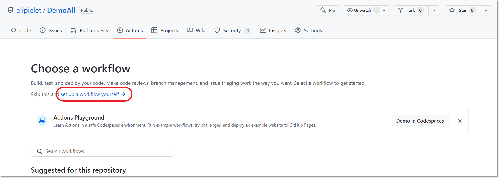
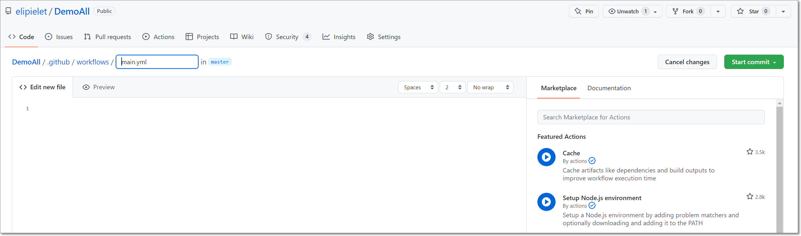
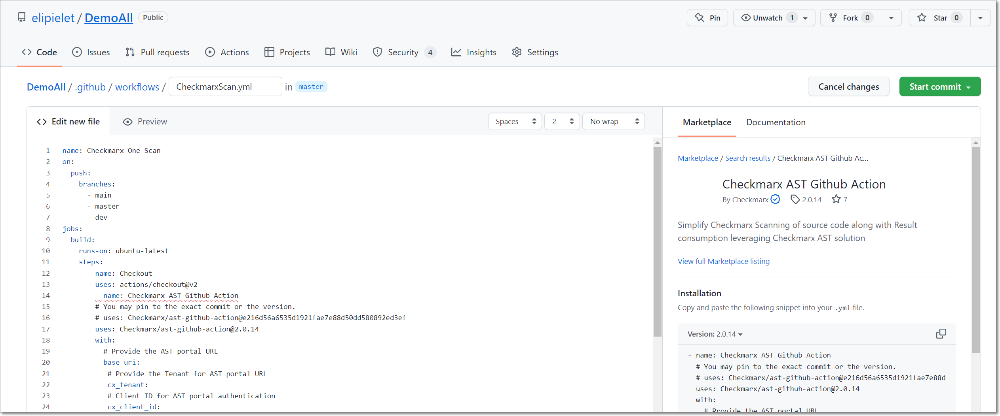

# Configuring a GitHub Action with a Checkmarx One Workflow

You can add a Checkmarx One scan to an existing workflow or you can create a new workflow for the scan. There is an option to generate a report which imports the results into the GitHub Security alerts.

The following section describes how to create a new workflow with a Checkmarx One scan.

1. Navigate to your GitHub repository **Actions** tab and click **New Workflow** and then click on **set up a workflow yourself**.

   

   The code editor is shown.

   
2. By default, the workflow is named **main.yml**, you can edit the name to describe the workflow, e.g., CheckmarxScan.
3. In the **Edit new file** section, customize the code to meet your needs regarding triggers, branches, etc.
4. In the **Marketplace** tab of the right-side panel, search for **Checkmarx AST Github Action**, and click on that item.

   

   The .yml installation snippet is shown.
5. In the **Marketplace** section, copy the snippet, paste it into the “steps” section of the new project workflow below “runs-on”, and adjust the alignment as needed.

   

   
   If you are running SCA Resolver as part of the scan then you need to modify the script accordingly. A sample script using Resolver is available [here](../../using-sca-resolver-in-checkmarx-one-cicd-integrations.md#github-action).
   
6. Customize the code as follows:

   - For **base_uri**, enter the base URL of your Checkmarx One Environment.

     **Checkmarx One Server Base URLs**

     - US Environment - https://ast.checkmarx.net
     - US2 Environment - https://us.ast.checkmarx.net
     - EU Environment - https://eu.ast.checkmarx.net
     - EU2 Environment - https://eu-2.ast.checkmarx.net
     - DEU Environment - https://deu.ast.checkmarx.net
     - Australia & New Zealand – https://anz.ast.checkmarx.net
     - India - https://ind.ast.checkmarx.net
     - India 2 - https://ind-2.ast.checkmarx.net/
     - Singapore - https://sng.ast.checkmarx.net
     - UAE - https://mea.ast.checkmarx.net
     - Israel - https://gov-il.ast.checkmarx.net
   - For **cx_tenant**, enter the name of your Checkmarx One tenant account.
   - For **cx_client_id**, enter `${{ secrets.CX_CLIENT_ID }}`, where `CX_CLIENT_ID` is the “Name” you used to store your Checkmarx OAuth Client ID in your GitHub repository.
   - For **cx_client_secret**, enter `${{ secrets.CX_CLIENT_SECRET }}`, where `CX_CLIENT_SECRET` is the “Name” you used to store your Checkmarx OAuth Secret in your GitHub repository.
   - For **project_name**, enter the name of an existing Project in Checkmarx One or enter a new name to create a new Project.

     
     The **project_name** parameter must not be left blank. You can omit the **project_name** parameter completely, in which case it will default to `${{ github.repository }}`.
     
   - For **branch**, enter the name of an existing branch of your Project or enter a new name to create a new branch.

     
     The **branch** parameter must not be left blank. You can omit the **branch** parameter completely, in which case it will default to `${{ github.ref }}`.
     
   - For **additional_params**, you can customize the Action by adding additional arguments, see [Checkmarx One GitHub Action Configuration Variables](checkmarx-one-github-action-configuration-variables.md).
7. If you want to import scan results into GitHub, do the following:

   1. In the **additional_params** line add `--report-format sarif --output-path .`.
   2. Add the following code to your .yml file:

      ```
          - name: Upload SARIF file
            uses: github/codeql-action/upload-sarif@v2
            with:
              # Path to SARIF file relative to the root of the repository
              sarif_file: cx_result.sarif
      ```
8. Click **Start Commit**.
9. In the dialog that opens, edit the name, add a description (optional), specify a branch, and then click **Commit new file**.

   The Checkmarx One Action is added to the repo and an initial scan is run on the source code. Subsequent scans will be triggered each time a push commit is done.

## Scanning Private Container Registries

GitHub Actions supports running Container Security scans on images that are stored in private container registries.


If you have set up a Checkmarx One integration with your private registry, as described [here](../../../../scanners/container-security/private-registry-integration-for-container-security-scanner/README.md), then you can run the standard GitHub Action, which runs the container scan in the cloud.


### Procedure for Scanning Private Registries

To run Container Security scans locally and scan images in private registries, use the dedicated workflow provided [here](https://github.com/Checkmarx/ci-cd-integrations/blob/main/Github/ast-private-registry-scan.yml).

Note: This workflow includes the following required additional_params configuation:

```
additional_params: --scan-types container-security --containers-local-resolution
```

#### Authentication for Private Registries

Authentication for private registries is done by submitting your username and password/token for each private registry via a dedicated environment variable.

1. Submit the REGISTRIES environment variable with the name of each of your private registries, separated by a space, e.g., "docker.io ghcr.io mycompany.jfrog.io"
2. Submit the value of the username for each registry as an environment variable based on the registry name, using the following syntax: USERNAME_\<registry name in all caps, with _ replacing .>.

   Example:

   ```
   USERNAME_DOCKER_IO: ${{ secrets.DOCKER_USERNAME }}
   ```
3. Submit the value of the password/token for each registry as an environment variable based on the registry name, using the following syntax: PASSWORD_\<registry name in all caps, with _ replacing .>.

   Example:

   ```
   PASSWORD_DOCKER_IO: ${{ secrets.DOCKER_PASSWORD }}
   ```

Example:

```
env
  REGISTRIES: "docker.io ghcr.io mycompany.jfrog.io"
  USERNAME_DOCKER_IO: ${{ secrets.DOCKER_USERNAME }}
  PASSWORD_DOCKER_IO: ${{ secrets.DOCKER_PASSWORD }}
  USERNAME_GHCR_IO: ${{ secrets.GHCR_USERNAME }}
  PASSWORD_GHCR_IO: ${{ secrets.GHCR_TOKEN }}
  USERNAME_MYCOMPANY_JFROG_IO: ${{ secrets.JFROG_USERNAME }}
  PASSWORD_MYCOMPANY_JFROG_IO: ${{ secrets.JFROG_ACCESS_TOKEN }}
```

## In this section

- [Checkmarx One GitHub Action Configuration Variables](checkmarx-one-github-action-configuration-variables.md)
