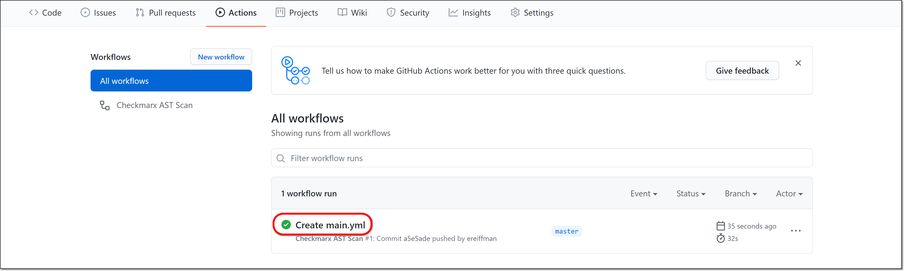
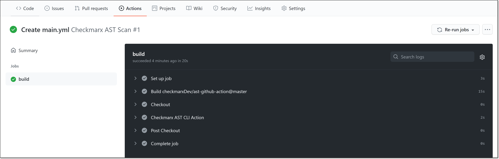
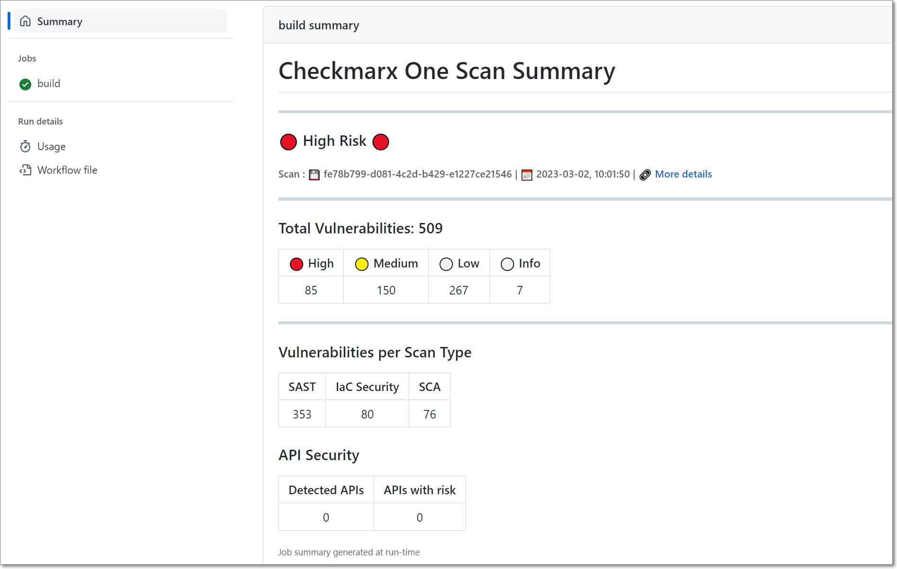

# Quick Start Guide - Checkmarx One GitHub Actions

## Overview

The **Checkmarx One** **GitHub Actions** enables you to trigger SAST, SCA, IaC Security and API Security scans directly from the GitHub workflow. It provides a wrapper around the Checkmarx One CLI Tool which creates a zip archive from your source code repository and uploads it to Checkmarx One for scanning. The Github Action provides easy integration with GitHub while enabling scan customization using the full functionality and flexibility of the CLI tool.

The GitHub Action can be customized to trigger scans when particular actions (e.g., push, or pull request) occur on specific branches of your repo. You can also add pre and post scan steps to your workflow. For example, you can add a step to screen commits to verify if the changes made warrant running a new scan.


There is an alternative method for integrating GitHub with Checkmarx One which is done directly from Checkmarx One, see GitHub Cloud. That method is easier to implement but doesn’t enable full customization of the process.


## Prerequisites

- The source code for your project is hosted on a GitHub repo (public or private)
- You have a Checkmarx One account and have credentials to log in to your account

## Getting Started Using the GitHub Action

This tutorial will guide you through the initial setup and basic workflow for using the Checkmarx One GitHub Action. We will use an OAuth Client to authenticate with Checkmarx One and we will configure an Action to trigger a scan whenever a push commit is done on your GitHub repo.

### Step 1 – Create an OAuth Client in Checkmarx One

For this tutorial we will create an OAuth Client in Checkmarx One to be used for authentication in the GitHub Action. To create an OAuth client, see [Creating an OAuth Client for Checkmarx One Integrations](../../authentication-for-checkmarx-one-cli-and-plugins/creating-an-oauth-client-for-checkmarx-one-integrations.md).


An alternative method is to generate an API Key and use that for authentication.


### Step 2 – Configure Secrets in Your GitHub Repository

In order to avoid passing authentication data in the open, we will create GitHub Secrets for the *Client ID* and *Secret*.

1. In the GitHub console, open the repository for which you are setting up the Checkmarx One integration and click on the **Settings** tab.
2. In the left side navigation panel, click **Secrets and variables** > **Actions** and then click on **New repository secret**.

   
3. Enter a **Name** for the Client_ID in GitHub (e.g., CX_CLIENT_ID) and then in the **Secret** field enter the name that you designated for the OAuth Client ID in Checkmarx One (e.g., Client_ID). Then, click **Add secret**.
4. Repeat the above step to create a GitHub Secret for the OAuth Client Secret (e.g. CX_CLIENT_SECRET), using the **Secret** that you copied from Checkmarx One.

   The two Secrets are shown under **Repository secrets** tab.

   

### Step 3 – Set Up a GitHub Action

For this tutorial we will create a simple GitHub Action that triggers a scan using SAST, SCA, IaC Security and API Security scanners whenever a push commit is done on any one of the three specified branches.

1. Navigate to your GitHub repository **Actions** tab and click **New Workflow** and then click on **set up a workflow yourself**.

   <figure><figcaption></figcaption></figure>
2. In the **Edit new file** section, enter the following code, which defines a standard action for triggering a scan when a push is made on the *main*, *master* or *dev* branch.

   ```
   name: Checkmarx One Scan
   on:
     push:
       branches:
         - main
         - master
         - dev
   jobs:
     build:
       runs-on: ubuntu-latest
       steps:
         - name: Checkout
           uses: actions/checkout@v2
         - name: Checkmarx One CLI Action
           uses: checkmarx/ast-github-action@main #Github Action version
           with:
             project_name: <Name of Checkmarx One Project>
             cx_tenant: <Checkmarx One Tenant Account>
             base_uri: <Checkmarx One Base uri>
             cx_client_id: ${{ secrets.CX_CLIENT_ID }}
             cx_client_secret: ${{ secrets.CX_CLIENT_SECRET }}
   ```
3. For **project_name**, enter the name of an existing Project in Checkmarx One or enter a new name to create a new Project.

   
   The **project_name** parameter must not be left blank. You can omit the **project_name** parameter completely, in which case it will default to `${{ github.repository }}`.
   
4. For **cx_tenant**, enter the name of your Tenant Account.
5. For **base_uri**, enter the base URL of your Checkmarx One Environment.

   **Checkmarx One Server Base URLs**

   - US Environment - https://ast.checkmarx.net
   - US2 Environment - https://us.ast.checkmarx.net
   - EU Environment - https://eu.ast.checkmarx.net
   - EU2 Environment - https://eu-2.ast.checkmarx.net
   - DEU Environment - https://deu.ast.checkmarx.net
   - Australia & New Zealand – https://anz.ast.checkmarx.net
   - India - https://ind.ast.checkmarx.net
   - India 2 - https://ind-2.ast.checkmarx.net/
   - Singapore - https://sng.ast.checkmarx.net
   - UAE - https://mea.ast.checkmarx.net
   - Israel - https://gov-il.ast.checkmarx.net
6. For **branch**, enter the name of an existing branch of your Project or enter a new name to create a new branch.

   
   The **branch** parameter must not be left blank. You can omit the **branch** parameter completely, in which case it will default to `${{ github.ref }}`.
   
7. You can customize the Action by adding additional arguments, see [Checkmarx One GitHub Action Configuration Variables](configuring-a-github-action-with-a-checkmarx-one-workflow/checkmarx-one-github-action-configuration-variables.md).
8. Click **Start Commit**.
9. In the dialog that opens, click **Commit new file**.

   The Checkmarx One Action is added to the repo and an initial scan is run on the source code. Subsequent scans will be triggered each time a push commit is done.

### Step 4 – Monitoring the Build and Viewing Results

1. Navigate back to your GitHub repository **Actions** tab and click on your workflow run to see the build.

   <figure><figcaption></figcaption></figure>
2. Click on **build** to see details of the run.

   <figure><figcaption></figcaption></figure>

   The build details are shown.

   <figure><figcaption></figcaption></figure>
3. Once the scan is complete, go back to the workflow summary page and scroll down to view the **build summary** pane, showing aggregated data about the vulnerabilities identified in the scan.

   
4. You can click on the **More details** link to open the complete scan results in the Checkmarx One web platform. See Viewing the Project Page
