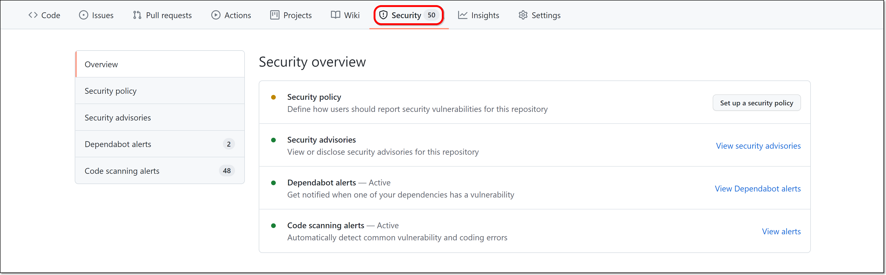
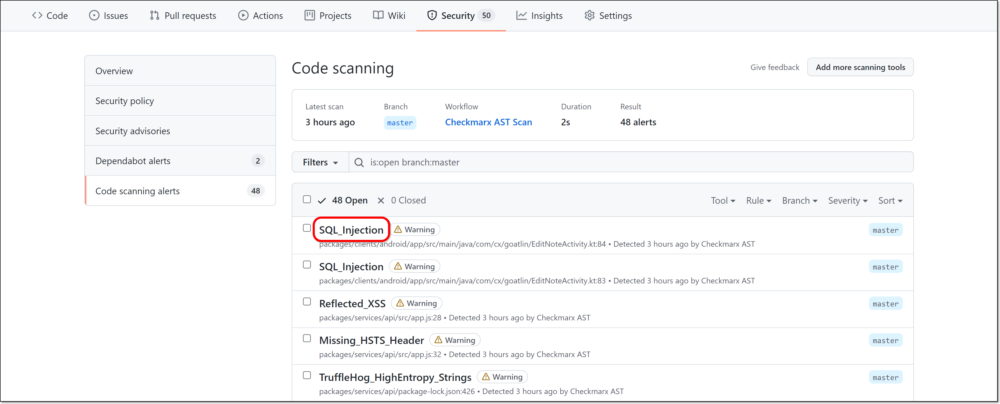
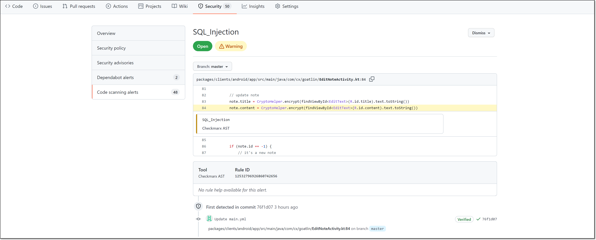
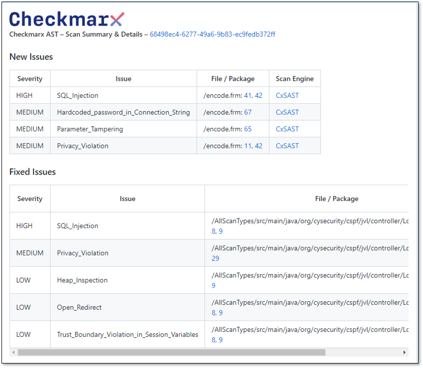

# Viewing GitHub Action Checkmarx One Scan Results

There are several ways to view GitHub Action scan results.

## Viewing the Scan Results Summary in GitHub

You can view a summary of your scan results in GitHub.

1. Navigate back to your GitHub repository **Actions** tab and click on your workflow run to see the build.

   
2. Scroll down to the **build summary** section to view aggregated data about the vulenrabilities identified by the scan.

   
3. You can click on the **More details** link to open the complete scan results in the Checkmarx One web platform.

## Viewing Alerts in GitHub

If in your workflow you included the code to import your Checkmarx scan results into GitHub, you can view the results in the Security tab, under **Code scanning alerts**.

1. Navigate to your GitHub repository **Security** tab.

   <figure><figcaption></figcaption></figure>
2. Click on **Code scanning alerts** to view the vulnerabilities identified by Checkmarx One.

   <figure><figcaption></figcaption></figure>
3. Click on the name of an alert (vulnerability) to see more detailed information.

   <figure><figcaption></figcaption></figure>

   The vulnerability details are shown.

   <figure><figcaption></figcaption></figure>

## Viewing Pull Request Decoration

For scans that were triggered by a pull request in GitHub, the pull request is decorated with a comment showing:

- A list of new vulnerabilities that were introduced by the code change
- A list of vulnerabilities that were fixed by the code change
- A list of Policy violations triggered by this scan

<figure><figcaption></figcaption></figure>

For more information about Checkmarx One pull request decorations, see [Code Repository Integration Usage & Results](../../code-repository-integrations/code-repository-integration-usage-results/README.md).

The "new vulnerabilities" shown in the pull request decoration and the vulnerability status shown in the Checkmarx One UI (e.g., **Recurrent**) are based on different comparisons, so the same vulnerability can correctly appear under both labels:

- The pull request decoration compares the scan against the latest scan of the target branch. A vulnerability is listed as new if it does not exist in the target branch - this flags vulnerabilities that would be newly introduced if the pull request is merged.
- The Checkmarx One UI compares the scan against the previous scan of the same source branch. A vulnerability is marked Recurrent if it was already identified in an earlier scan of that branch - meaning it isn't new to the branch's history.

As a result, a vulnerability introduced earlier in a feature branch's history can be marked **Recurrent** in the Checkmarx One UI while still being listed as new in the pull request decoration, since it is not yet present in the target branch.

## Viewing your results in the Checkmarx One UI

You can view detailed information about your scan results in the Checkmarx UI. For more information about viewing scan results, see Viewing the Project Page.
