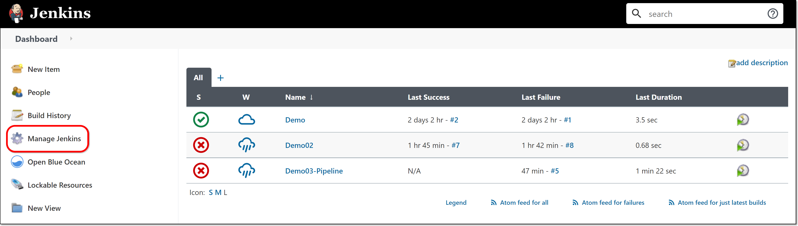
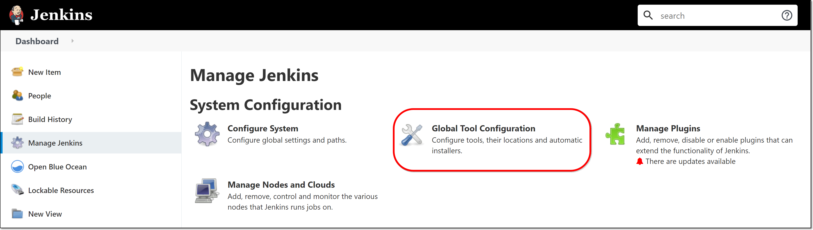
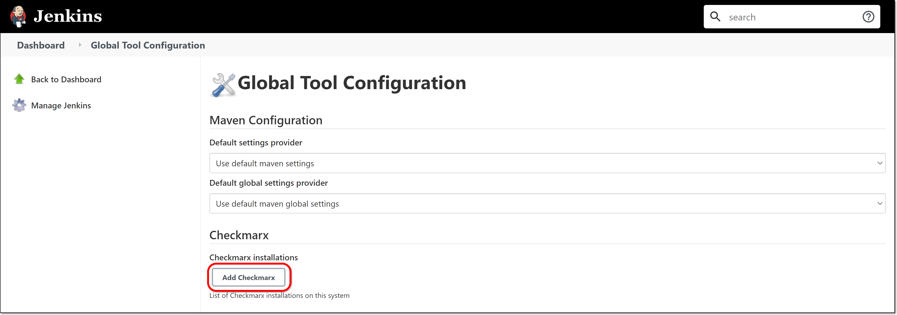
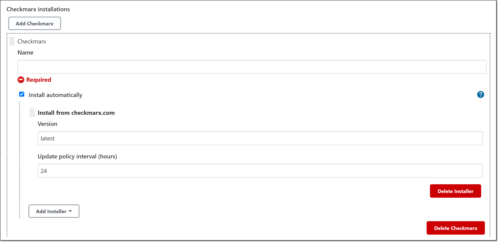
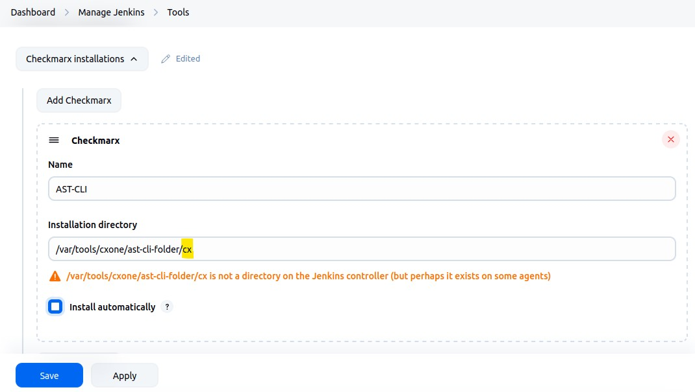
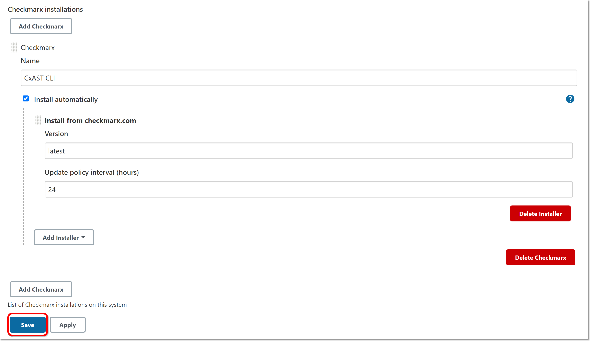

# Installing the CLI Tool (Required)

Because the Jenkins plugin acts as a wrapper around the Checkmarx One CLI tool, you need to install the CLI tool itself in Jenkins.

This can be done automatically, or you can manually configure the installation.

**To install the CLI tool:**

1. In the main navigation, click **Manage Jenkins**.

   <figure><figcaption></figcaption></figure>
2. Click on **Global Tool Configuration**.

   <figure><figcaption></figcaption></figure>
3. Scroll down to the **Checkmarx** section and click on the **Add Checkmarx** button.

   <figure><figcaption></figcaption></figure>

   The Checkmarx installation fields are displayed.

   <figure><figcaption></figcaption></figure>
4. In the **Name** field, enter a name for the installation (required).
5. By default, **Install automatically** is selected, the **Installer** method is “[Checkmarx.com](http://Checkmarx.com)”, the **Version** is specified as “latest”, and the **Update policy interval (hours)** is specified as “24”. This will ensure that every day you will have the latest version of the CLI tool installed in Jenkins.

   
   When using the default settings for automatic update, you must ensure that the following URLs are accessable from your environemnt:

   - https://api.github.com
   - https://github.com
   

   The following alternative configuration options are also available:

   - You can change the automatic installation settings from the default configuration, but this is generally not recommended.
   - You can add additional Installers for the Checkmarx CLI tool by clicking on **Add Installer** and then selecting the type of installer and filling in the required fields.
   - If you would like to install Checkmarx manually from a specific directory, deselect the **Install automatically** checkbox, and enter the location of the **Installation directory** AND the **name of the executable tool** (normally "**cx**" for Linux or "**cx.exe**" for Windows.)

     Example: **/var/tools/cxone/ast-cli-folder/cx**

     
6. Click **Save** at the bottom of the screen.

   <figure><figcaption></figcaption></figure>

   The CLI is configured, and you are returned to the **System Configuration** screen.
