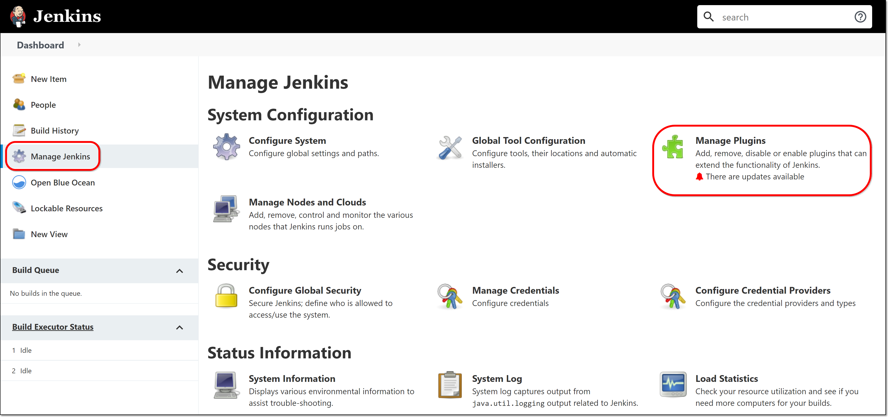
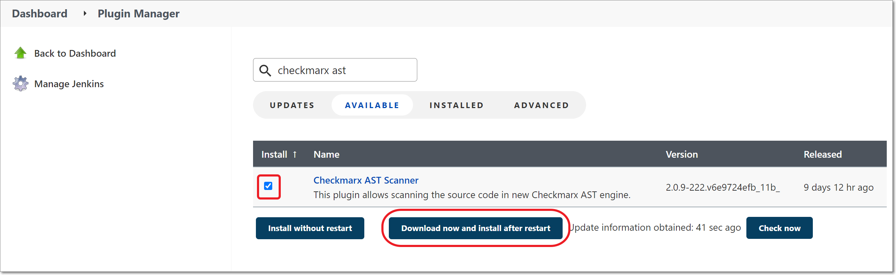
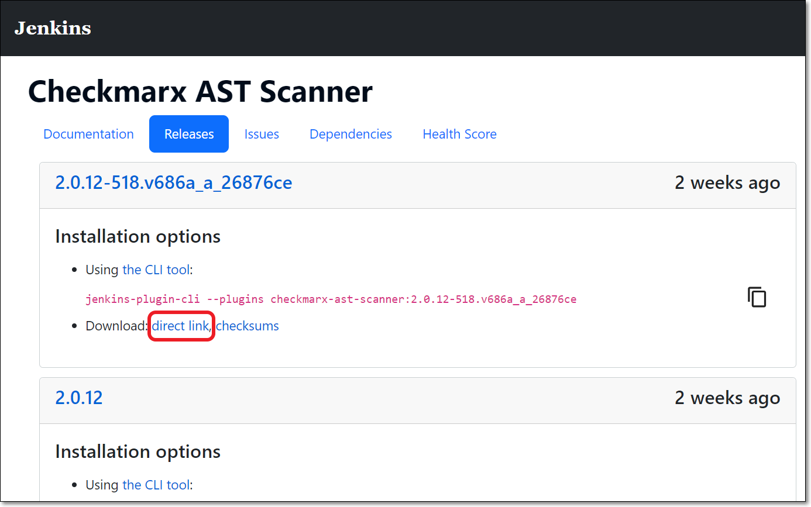
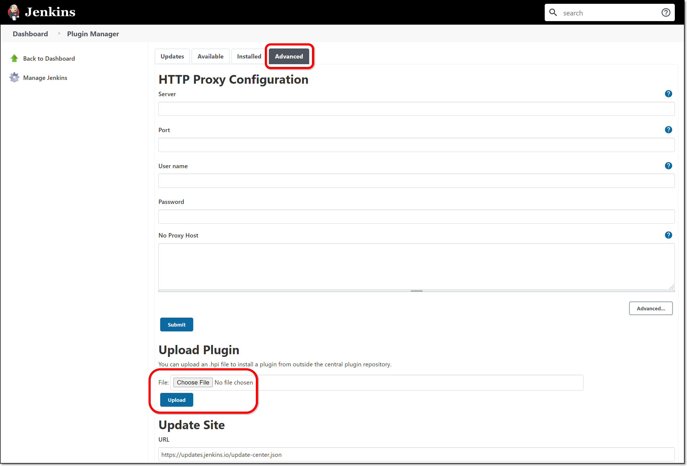
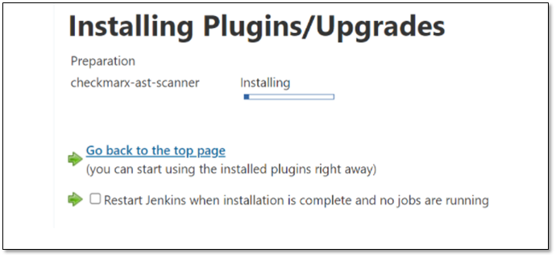

# Installing the Jenkins Checkmarx One Plugin

The Checkmarx One Jenkins plugin can be installed using any one of the following methods.

## Installing Checkmarx One Jenkins Plugin from the Marketplace

1. Go to your Jenkins Dashboard and select **Manage Jenkins > Manage Plugins**.

   <figure><figcaption></figcaption></figure>
2. Click on the **Available** tab and enter “checkmarx ast” in the search box.
3. Select the checkbox next to **Checkmarx One scanner** and click on **Download now and install after restart**.

   <figure><figcaption></figcaption></figure>

   The plugin is installed.

## Install Checkmarx One Jenkins plugin using the HPI file

A Jenkins administrator can install the plugin by uploading the HPI file via the Jenkins UI.

1. Go to the Checkmarx One Jenkins Plugin [download page](https://plugins.jenkins.io/checkmarx-ast-scanner/releases/).
2. Scroll down to the desired version (recommended to install the latest version), and click on the **direct link** to download the file.

   <figure><figcaption></figcaption></figure>
3. Go to your Jenkins Dashboard and select **Manage Jenkins > Manage Plugins**.

   <figure><figcaption></figcaption></figure>
4. Click on the **Advanced** tab.

   <figure><figcaption></figcaption></figure>
5. In the **Upload Plugin** section, click on **Choose File** and navigate to the “*checkmarx-ast-scanner.hpi”* file that you downloaded. Then, click on the **Upload** button.

   The installation window is displayed. When the installation is finished, you will be prompted to restart the Jenkins server.

   <figure><figcaption></figcaption></figure>

## Install Checkmarx One Jenkins plugin using command line

Jenkins provides a CLI tool that allows administrators to install plugins from the command line.

To install the latest version of the Checkmarx One Jenkins plugin, run the following command in the Jenkins CLI.


The following is a description of the elements of this command and the available arguments.

`java -jar jenkins-cli.jar -s http://{JenkinsURL}/ install-plugin SOURCE ... [-deploy] [-name VAL] [-restart]`

This command installs a plugin either from a file, a URL, or from update center.

`SOURCE` : If this points to a local file, that file will be installed. If this is a URL, Jenkins downloads the URL and installs the plugin. Otherwise the name is assumed to be the short name of the plugin in the existing update center (like "findbugs"), and the plugin will be installed from the update center.

`-deploy` : Deploy plugins right away without postponing them until the reboot.

`-name VAL` : If specified, the plugin will be installed as this short name (by default the name is inferred from the source name automatically).

`-restart` : Restart Jenkins upon successful installation.

