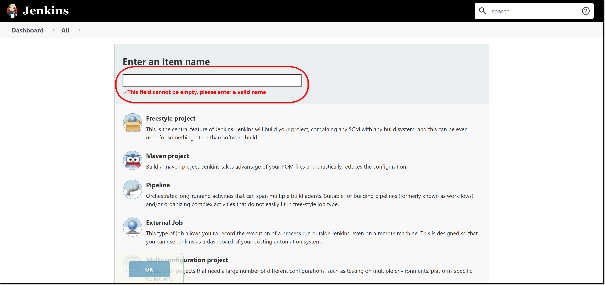
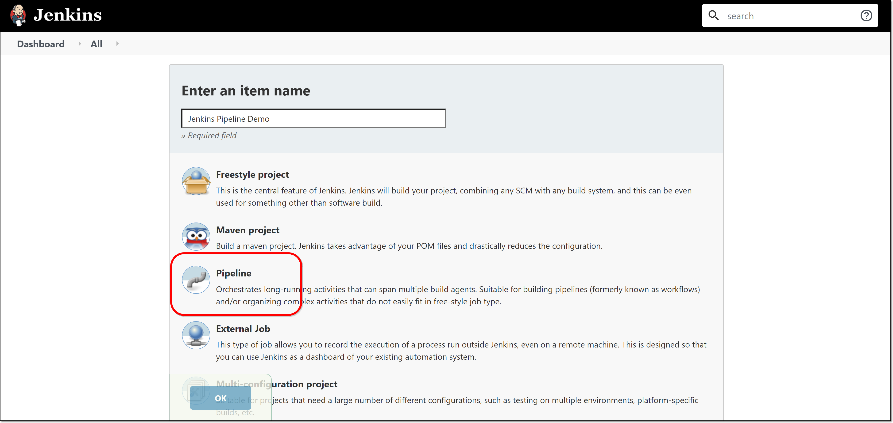
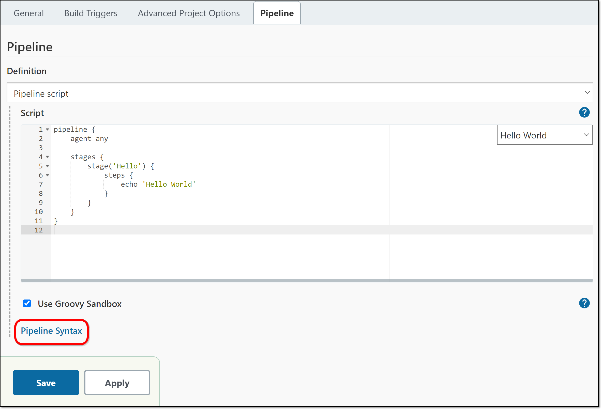
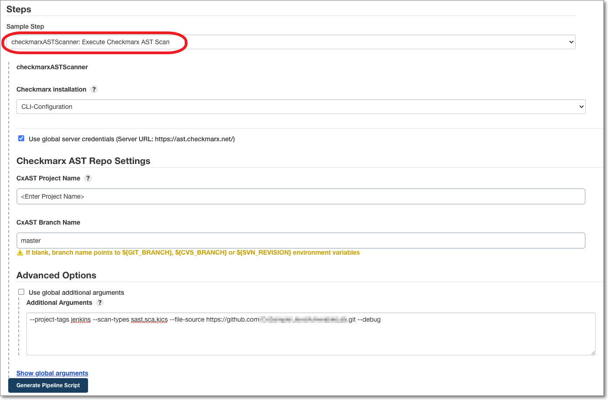
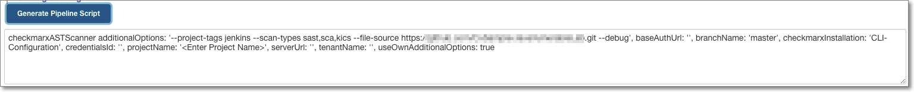
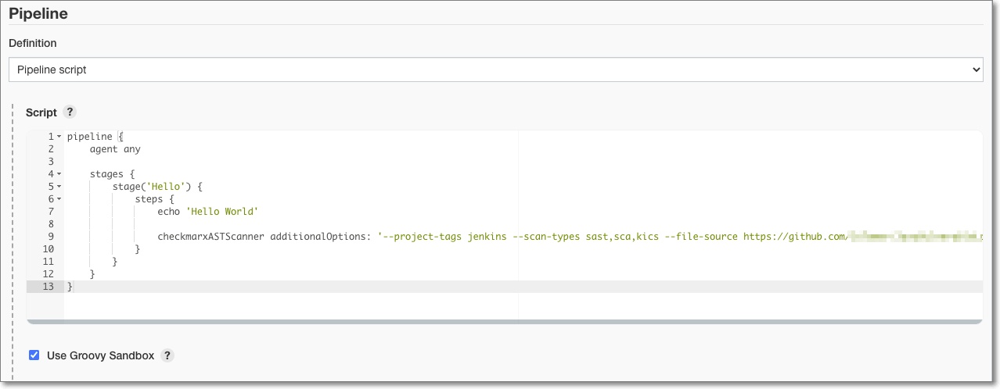

# Configuring a Checkmarx One Pipeline Build Step

**To create a Checkmarx One build step in a Jenkins pipeline:**

1. In the main navigation, click **New Item**.

   <figure><figcaption></figcaption></figure>

   The **New Item** menu opens.
2. In the **Enter an item name** field, enter a descriptive name for the new Jenkins pipeline.

   <figure><figcaption></figcaption></figure>
3. Click **Pipeline**, then click **OK** on the bottom of the screen.

   <figure><figcaption></figcaption></figure>

   The Pipeline configuration form opens.
4. Enter the general Jenkins configuration options in the *General*, *Build Triggers* and *Advanced Project Options* sections as desired.
5. In the **Pipeline** section, in the top field verify that **Pipeline script** is selected.

   <figure><figcaption></figcaption></figure>
6. In the **Script** section, enter your pipeline script.
7. If you would like to use the *Snippet Generator* to help you to prepare the pipeline script, use the following procedure.

   1. Click the **Pipeline Syntax** link.

      <figure><figcaption></figcaption></figure>

      The **Snippet Generator** opens in a new tab.
   2. In the **Steps** section, click on the **Sample Step** dropdown menu and select **checkmarxASTScanner: Execute Checkmarx One Scan**.

      The **checkmarxASTScanner** configuration settings are shown.

      <figure><figcaption></figcaption></figure>
   3. By default the **Use global server credentials…** is selected, so that the server configuration created in Global Settings is applied to this project. If you would like to specify different credentials for this project, then you can deselect the checkbox and enter the server configuration that you would like to use for this project.
   4. For **Checkmarx One Project Name**, specify a name for this Project in Checkmarx One.

      
      If you enter the name of an existing Project, then this build step will trigger a scan of that Project. If you enter a new Project name, then, when a scan is triggered it will create a new Project in Checkmarx One with the specified name.
      
   5. For **Branch** **name**, specify the name of the branch name to be used in Checkmarx One. If the field is left blank, then by default the branch name points to GIT_BRANCH, CVS_BRANCH or SVN_REVISION.

      
      If you enter the name of an existing branch, then this build step will trigger a scan of that branch. If you enter a new branch name, then, when a scan is triggered it will create a new branch in Checkmarx One with the specified name.
      
   6. Under **Advanced Options**, to apply the additional arguments defined in your Global Settings, leave the **Use global additional arguments** checkbox selected (default). You can view the global arguments, click **Show global arguments**. If you would like to apply project specific arguments, then deselect the checkbox and enter the arguments needed for this project. See the available `scan create` arguments here.

      
      Make sure that all argument values are inside double quotes (not single quotes).
      
   7. Click **Generate Pipeline Script**.

      The pipeline script is generated.

      <figure><figcaption></figcaption></figure>
   8. Copy the script to your clipboard.
   9. On the previous tab in the **Script** section, paste the copied script in the proper position relative to any other steps that you are running.

      <figure><figcaption></figcaption></figure>
8. If you want to run this Groovy script in a sandbox with limited abilities, verify that the **Use Groovy Sandbox** checkbox is checked (default)s. If unchecked, and you are not a Jenkins administrator, you will need to wait for an administrator to approve the script.
9. Click **Save**.

   The pipeline is created and its status page is shown.

   <figure><figcaption></figcaption></figure>
