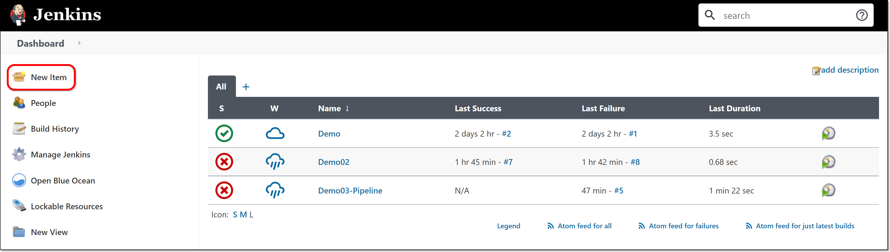
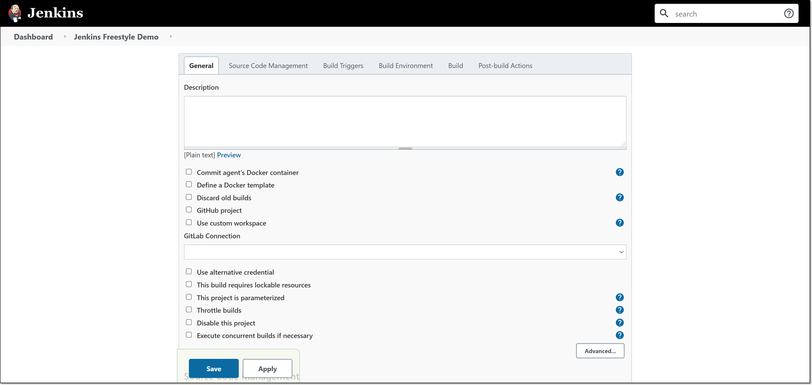
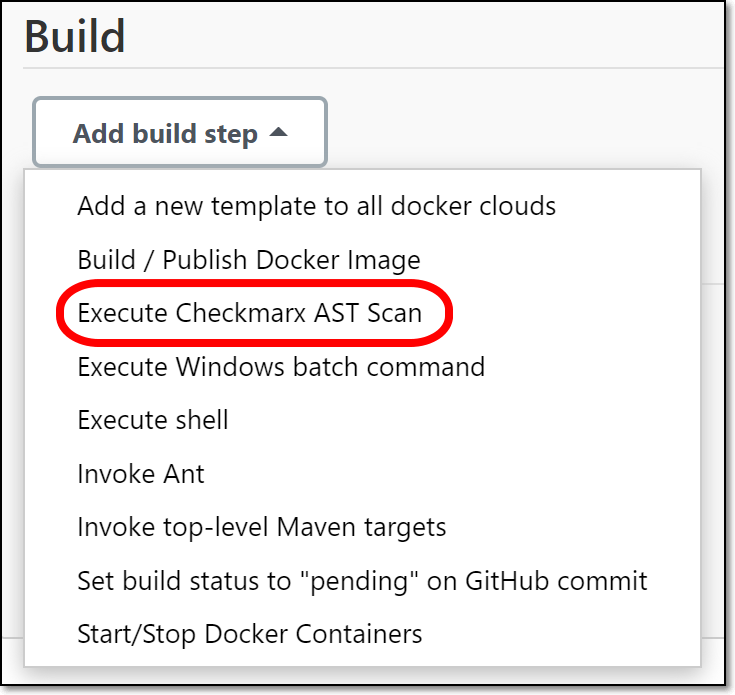
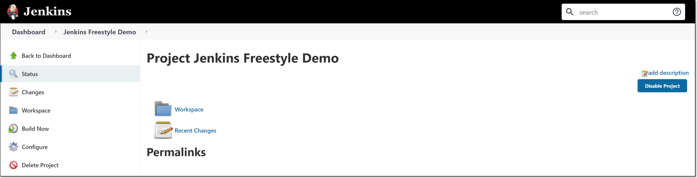

# Configuring a Freestyle Checkmarx One Build Step

**To create a Checkmarx One build step in a Freestyle project:**

1. In the main navigation, click **New Item**.

   <figure><figcaption></figcaption></figure>

   The **New Item** menu opens.
2. In the **Enter an item name** field, enter a descriptive name for the new Jenkins project.

   <figure><figcaption></figcaption></figure>
3. Click **Freestyle project**, then click **OK** at the bottom of the screen.

   <figure><figcaption></figcaption></figure>

   The Freestyle Project configuration form opens.

   <figure><figcaption></figcaption></figure>
4. Configure the **General** settings as desired.
5. In the **Source Code Management** section, select the desired SCM method and configure the settings for accessing the SCM.
6. In the **Build Triggers** section, select the desired types of triggers (e.g., other project builds, periodical etc.) and configure the settings.
7. In the **Build** section, click on **Add build step** and select **Execute Checkmarx One Scan** from the dropdown list.

   <figure><figcaption></figcaption></figure>

   The Checkmarx One configuration options are shown.

   <figure><figcaption></figcaption></figure>
8. Under **Checkmarx Installation**, verify that the Checkmarx One CLI installation that you configured (as described in [Installing the CLI Tool (Required)](../checkmarx-one-jenkins-plugin---installation-and-initial-setup/installing-the-cli-tool-required.md)) is selected.
9. By default, the **Use global server credentials…** is selected, so that the server configuration created in Global Settings is applied to this project. If you would like to specify different credentials for this project, then you can deselect the checkbox and enter the server configuration that you would like to use for this project.
10. For **Checkmarx One Project Name**, specify a name for this Project in Checkmarx One.

    
    If you enter the name of an existing Project, then this build step will trigger a scan of that Project. If you enter a new Project name, then, when a scan is triggered it will create a new Project in Checkmarx One with the specified name.
    
11. For **Branch** **name**, specify the name of the branch name to be used in Checkmarx One. If the field is left blank, then by default the branch name points to GIT_BRANCH, CVS_BRANCH or SVN_REVISION.

    
    If you enter the name of an existing branch, then this build step will trigger a scan of that branch. If you enter a new branch name, then, when a scan is triggered it will create a new branch in Checkmarx One with the specified name.
    
12. Under **Advanced Options**, to apply the additional arguments defined in your Global Settings, leave the **Use global additional arguments** checkbox selected (default). You can view the global arguments, click **Show global arguments**. If you would like to apply project specific arguments, then deselect the checkbox and enter the arguments needed for this project. See documentation here.
13. If you wish to add an additional build step, click **Add build step**.
14. If you would like to add a post-build action, click on the **Add post-build action** button and specify the action.
15. Click **Save**.

    <figure><figcaption></figcaption></figure>

    The project is created and its status page is shown.

    <figure><figcaption></figcaption></figure>
