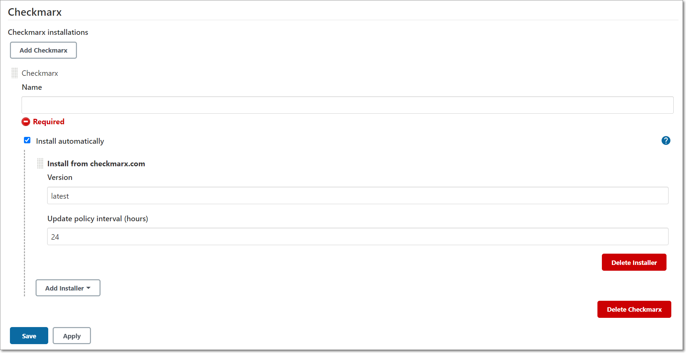
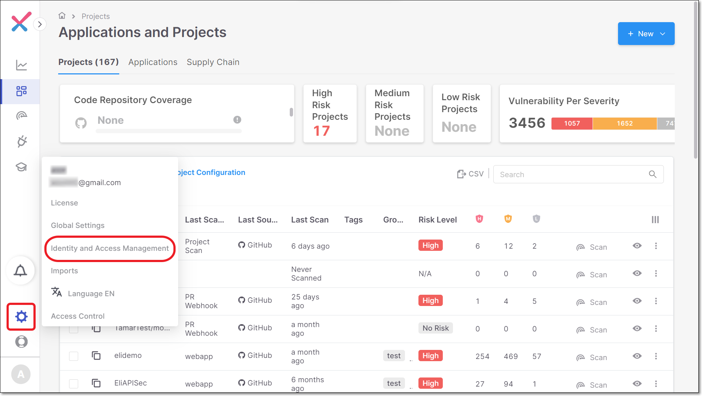
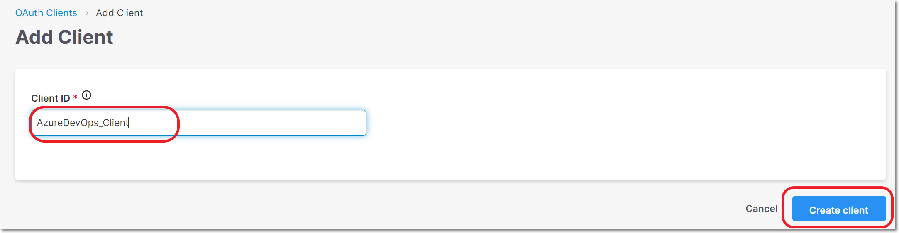
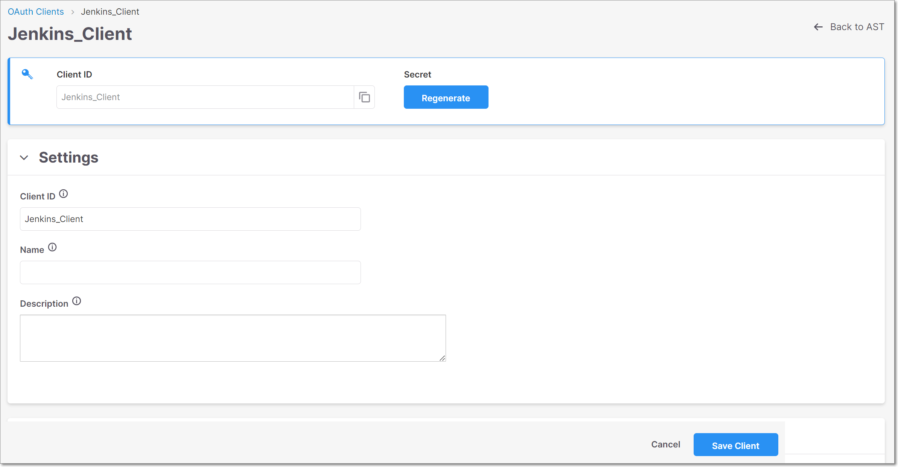
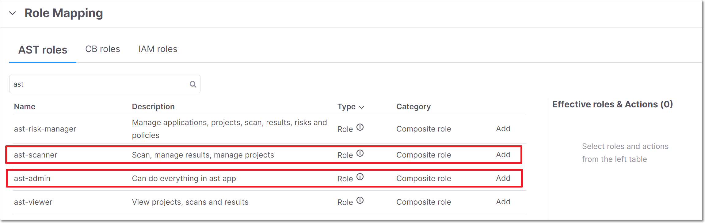
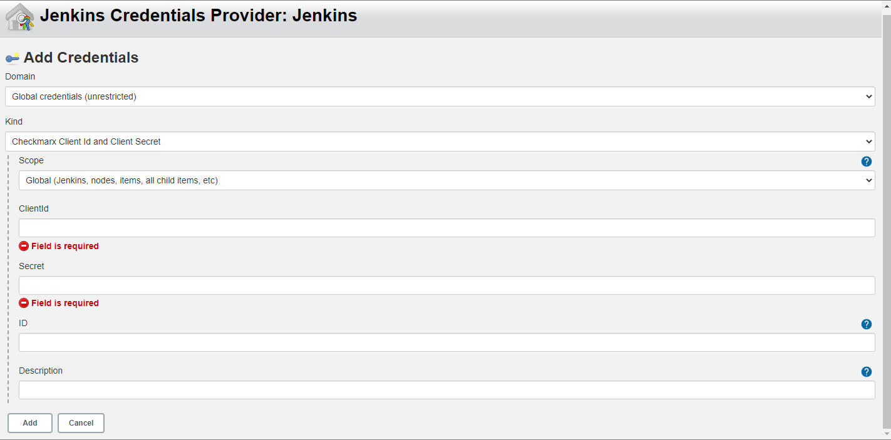
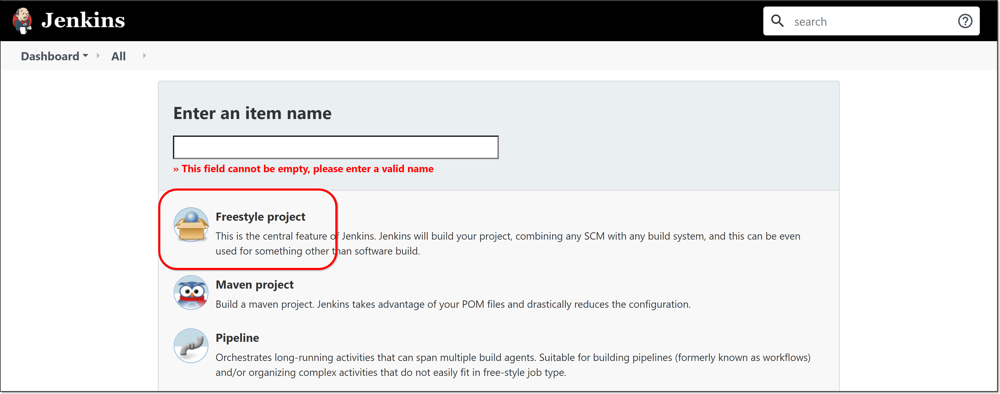
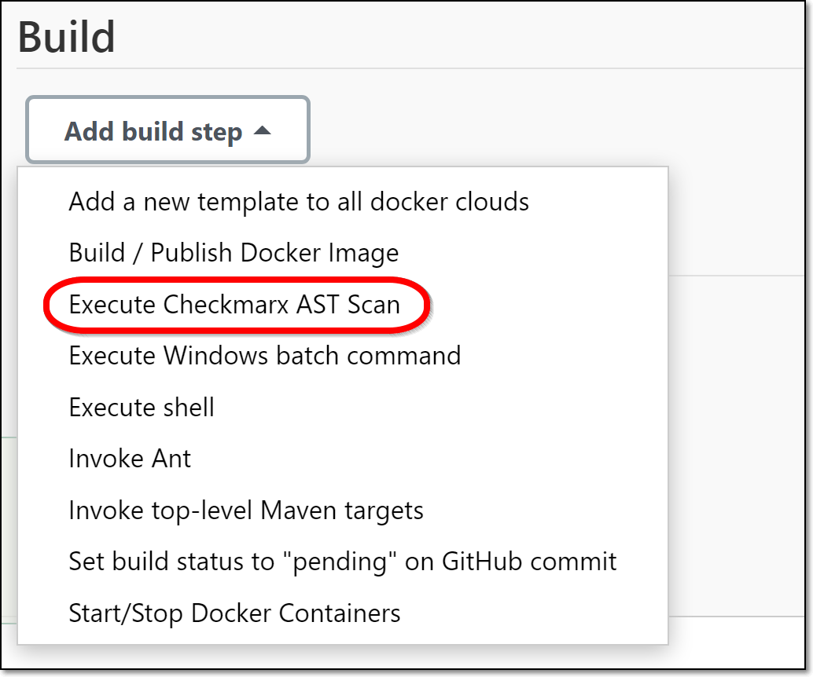
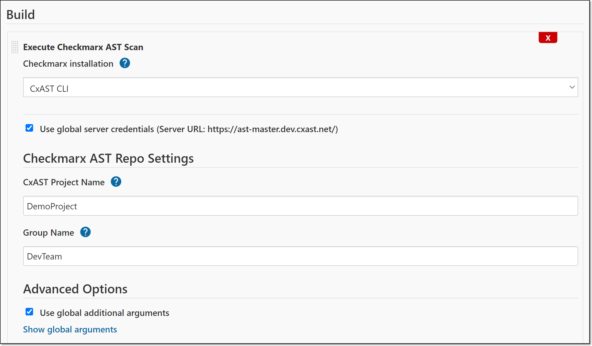
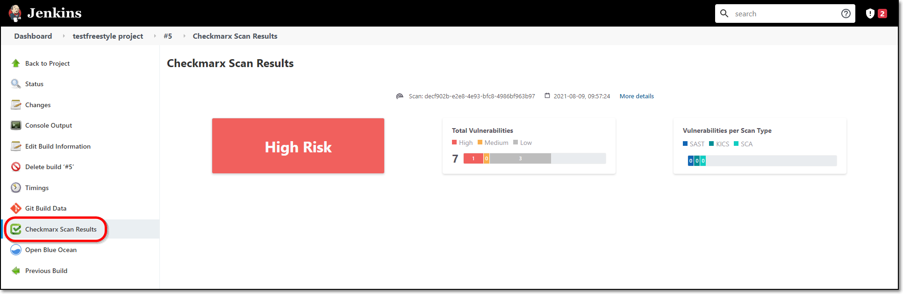

# Quick Start Guide - Checkmarx One Jenkins Plugin

## Overview

The Checkmarx One **Jenkins Plugin** allows the user to trigger Checkmarx SAST, Checkmarx SCA, IaC Security, API Security, Container Security and Software Supply Chain Security scans directly from a Jenkins workflow. It provides a wrapper around the *Checkmarx One CLI Tool* which creates a zip archive from your source code repository and uploads it to Checkmarx One for scanning. The plugin provides easy integration into Jenkins while enabling scan customization using the full functionality and flexibility of the CLI tool.


The plugin code can be found [here](https://github.com/jenkinsci/checkmarx-ast-scanner-plugin/).


## Prerequisites

- A Jenkins installation v2.263.1 or above
- Access to a Checkmarx One account, and an OAuth Client ID and Client Secret for that account.

## Getting Started Using the Plugin

This tutorial will guide you through the initial setup and basic workflow for using the Checkmarx One Jenkins plugin.


Complete documentation of the plugin is available [here](README.md).


### Step 1 - Install the Checkmarx One Plugin


The following procedure explains how to install the plugin from marketplace. If you would like to install the plugin from a file or a CLI command, see [Installing the Jenkins Checkmarx One Plugin](checkmarx-one-jenkins-plugin---installation-and-initial-setup/installing-the-jenkins-checkmarx-one-plugin.md).


1. Go to your Jenkins Dashboard and select **Manage Jenkins > Manage Plugins**.

   <figure><figcaption></figcaption></figure>
2. Click on the **Available** tab and enter “checkmarx ast” in the search box.
3. Select the checkbox next to **Checkmarx One scanner** and click on **Download now and install after restart**.

   <figure><figcaption></figcaption></figure>

   The plugin is installed.

### Step 2 - Configure the Checkmarx (CLI Tool) Installation

1. In the main navigation, click **Manage Jenkins**. Then click on **Global Tool Configuration.**
2. Scroll down to the **Checkmarx** section and click on the **Add Checkmarx** button.

   The Checkmarx installation fields are displayed.

   <figure><figcaption></figcaption></figure>
3. Enter a **Name** for the installation (required). By default, **Install automatically** is selected and the **Version** is specified as “latest”. This will ensure that you always have the latest version of the CLI tool installed in Jenkins. Alternatively, you could specify a specific version number so that the installation will remain static.
4. Click **Save** at the bottom of the screen.

### Step 3 - Creating an OAuth Client in Checkmarx One

You need to create an OAuth Client to be used for authentication in Jenkins.

**To create an OAuth Client:**

1. Log in to Checkmarx One and click on **Settings > Identity and Access Management** in the Menu panel.

   <figure><figcaption></figcaption></figure>
2. In the **Identity and Access Management** console, click **Oauth Clients** and then click **Create Client**.

   <figure><figcaption></figcaption></figure>
3. In the **Client ID** field, enter a descriptive name for Client (e.g. Jenkins_Client for the Jenkins plugin), and then click **Create client**.

   <figure><figcaption></figcaption></figure>

   The Client Settings screen is shown.

   <figure><figcaption></figcaption></figure>
4. Copy the **Client ID** for use in the plugin configuration.
5. Click on the **Regenerate** button for the Secret,
6. In the dialog that opens, copy the **Secret** for use in the plugin configuration, and then click **Ok** to close the dialog

   <figure><figcaption></figcaption></figure>
7. Under **Role Mapping** select the required roles.

   
   The minimum required roles for running an end-to-end flow of scanning a project and viewing results via the CLI or plugins are Checkmarx One `plugin-scanner` role and IAM `default-roles<tenant>` role.

   The permissions included in `plugin-scanner` are shown here. If you would like to create a custom role with more granular permissions, you should refer to this list of permissions in order to determine which permissions you will need to assign.
   

   
8. Click **Save Client**.

### Step 4 - Configure Checkmarx Global Settings


The global settings are used as the default configuration for your Checkmarx projects. They can be overridden by specifying different settings for individual projects.


**To configure Global Settings:**

1. In the main navigation, click **Manage Jenkins**. Then click **Configure System.**
2. Scroll Down to the **Checkmarx** section.
3. Fill in the **Checkmarx server URL** with the appropriate URL for your environment.

   **Checkmarx One Server Base URLs**

   - US Environment - https://ast.checkmarx.net
   - US2 Environment - https://us.ast.checkmarx.net
   - EU Environment - https://eu.ast.checkmarx.net
   - EU2 Environment - https://eu-2.ast.checkmarx.net
   - DEU Environment - https://deu.ast.checkmarx.net
   - Australia & New Zealand – https://anz.ast.checkmarx.net
   - India - https://ind.ast.checkmarx.net
   - India 2 - https://ind-2.ast.checkmarx.net/
   - Singapore - https://sng.ast.checkmarx.net
   - UAE - https://mea.ast.checkmarx.net
   - Israel - https://gov-il.ast.checkmarx.net
4. If the authentication URL is different that the server URL, then leave the**Use Authentication URL**selected (default), and enter the appropriate authentication URL.

   
   For Checkmarx One cloud platform, leave the checkbox selected and enter the URL for your environment.

   US Environment - https://iam.checkmarx.net

   EU Environment - https://eu.iam.checkmarx.net
   
5. For **Tenant Name**, enter the name of your Checkmarx One Tenant account.
6. For **Credentials**, click **Add** and select **Jenkins.**

   <figure><figcaption></figcaption></figure>

   The **Add Credentials** window opens.
7. For **Domain**, select **Global credentials** (default).
8. For **Kind**, select **Checkmarx Client Id and Client Secret**.

   The **Add Credentials** window options are updated.

   <figure><figcaption></figcaption></figure>
9. For **Scope** select **Global** (default).
10. In the **Client Id** and **Secret** fields, enter the Checkmarx One OAuth **Client ID** and **Secret** that you created in Step 3.
11. In the **ID** field, it is recommended to give a descriptive name to these credentials (e.g., AST_ApiKey) in order to make it easy to identify in the future.
12. Click **Add**.
13. Back in the main screen, under **Credentials**, select from the dropdown list the ID of the credentials that you just configured.
14. Under **Checkmarx Installation**, verify that the Checkmarx One CLI installation that you configured in Step 2 above is selected.
15. In the **Additional Arguments** section you can specify any CLI arguments that you would like to apply to scans of this project. See documentation here.

    
    By default all scanners that you are authorized to run (licensed or open source) will run. To limit scans to one or more specific scanners, add the argument `--scan-types {scanner}` ,where `{scanner}` is one or more of the following scanners `sast`, `sca`, `iac-security`, `api-security`, `container-security`, or `scs`.
    
16. Click **Save** at the bottom of the screen.

### Step 5 - Create a Checkmarx One Scan Build Step in Jenkins

This tutorial explains how to create a new Freestyle project with a Checkmarx One build step. Alternatively, you can add a Checkmarx One scan to an existing Jenkins project or to a [Jenkins Pipeline](configuring-checkmarx-one-build-steps-in-jenkins/configuring-a-checkmarx-one-pipeline-build-step.md).

1. In the main navigation, click **New Item**.

   The New Item menu opens.

   <figure><figcaption></figcaption></figure>
2. At the top of the screen, enter a descriptive name for the new Jenkins project, then click on **Freestyle project** and click **OK** at the bottom of the screen.

   The Freestyle Project configuration form opens.

   <figure><figcaption></figcaption></figure>
3. In the **Source Code Management** section, select the method used for managing the source code and fill in the relevant authentication fields to enable Jenkins to access the files.
4. In the **Build Triggers** section, select the method for triggering Checkmarx One scans and fill in the relevant settings.
5. In the **Build** section, select **Execute Checkmarx One Scan** from the dropdown list.

   <figure><figcaption></figcaption></figure>
6. The Checkmarx One configuration options are shown.
7. Under **Checkmarx Installation**, verify that the Checkmarx One CLI installation that you configured in Step 2 above is selected.
8. Verify that **Use global server…** is selected (default).
9. For **Checkmarx One Project Name**, specify a name for this Project in Checkmarx One.

   
   If you enter the name of an existing Project, then this build step will trigger a scan of that Project. If you enter a new Project name, then, when a scan is triggered it will create a new Project in Checkmarx One with the specified name.
   
10. For **Branch** **name**, specify the name of the branch name to be used in Checkmarx One. If the field is left blank, then by default the branch name points to GIT_BRANCH, CVS_BRANCH or SVN_REVISION.

    
    If you enter the name of an existing branch, then this build step will trigger a scan of that branch. If you enter a new branch name, then, when a scan is triggered it will create a new branch in Checkmarx One with the specified name.
    
11. For **Group Name**, enter the name of a Checkmarx One user Group to assign this Project to that Group. (If left blank, the Project will only be accessible to the user who created the Project and to root users.)
12. Under **Advanced Options**, to apply the global additional arguments that you configured in Step 3 above, leave the checkbox selected (default). (To view the global arguments, click **Show global arguments**.)

    <figure><figcaption></figcaption></figure>
13. Configure the Jenkins project settings as desired, including adding additional build steps and/or Post-build actions.
14. Click **Save** at the bottom of the screen.

### Step 6 - Running Scans and Viewing Results

Scans will be triggered automatically according to the settings that you configured for the project (e.g., scheduled builds, triggered by project builds etc.). In addition, you can trigger a scan at any time by clicking **Build Now** on the project page in Jenkins.

1. Once a build has run on your project, click on the build to open the build page, and click on **Console Output** to view a log of the scan execution.
2. You can view a summary of the scan results in Jenkins by clicking on **Checkmarx Scan Results** in the main navigation on the build page.

   <figure><figcaption></figcaption></figure>
3. You can view comprehensive results in Checkmarx One by clicking on the **More details** link at the top of the screen.
