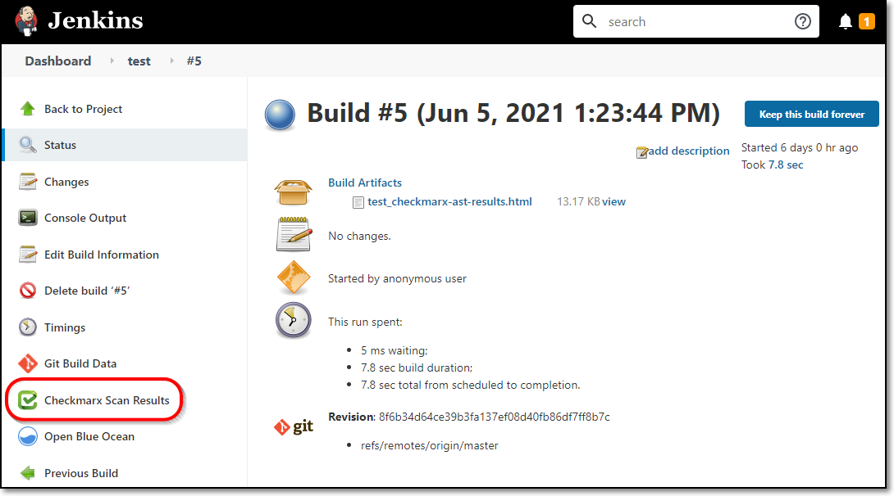
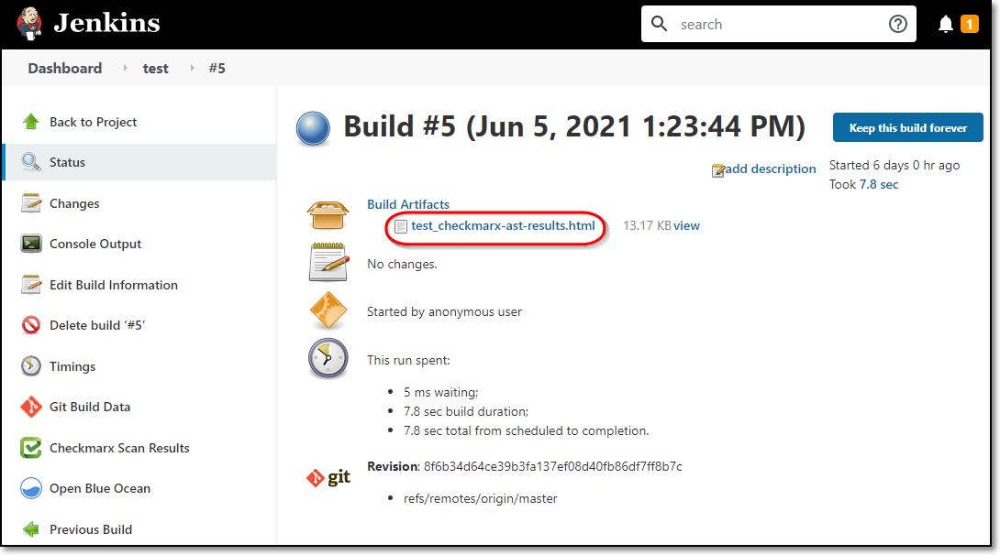
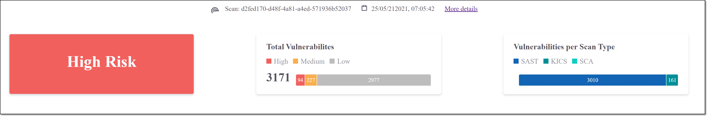
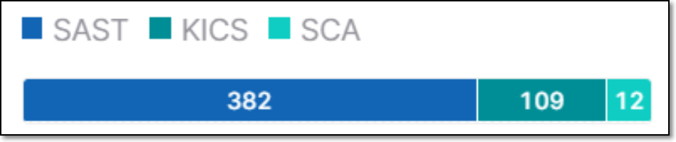
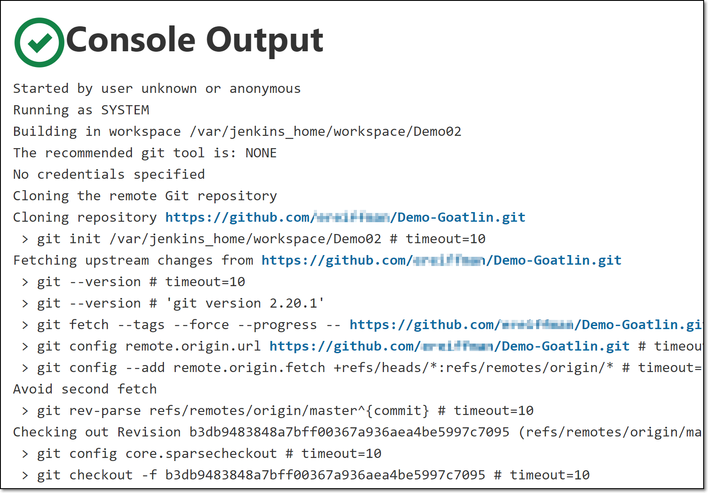

# Viewing Checkmarx One Results in Jenkins

The Checkmarx One Jenkins plugin generates a results summary and a log of the scan execution. Both are available on the Build page for each build (scan) of a project. In addition, Jenkins provides a link to view comprehensive scan results in Checkmarx One.


If the no wait option `--nowait, -w` was added to the additional arguments, no results will be provided in Jenkins.


## Viewing the Scan Results Summary

You can view the results summary directly in the Jenkins console or by downloading an HTML file. The items in the summary are described in the table below.

**To view the scan results summary via the Jenkins console:**

1. On the main navigation of a build page, click **Checkmarx Scan Results**.

   <figure><figcaption></figcaption></figure>

   The scan results summary is shown.

   <figure><figcaption></figcaption></figure>
2. You can view comprehensive results in Checkmarx One by clicking on the **More details** link at the top of the screen. For an explanation of the scan results, see Viewing the Project Page in the Checkmarx One User Guide.

**To view the scan results summary via the HTML file:**

1. On a build page, in the **Build Artifacts section**, download the results file.

   <figure><figcaption></figcaption></figure>
2. Open the file in a web browser to view the results summary.

   <figure><figcaption></figcaption></figure>
3. You can view comprehensive results in Checkmarx One by clicking on the **More details** link at the top of the screen. For an explanation of the scan results, see Viewing the Project Page in the Checkmarx One User Guide.

### Understanding the Scan Results Summary

| **Item** | **Description** | **Possible Values** |
|---|---|---|
| **Risk Level** | The highest risk level of any vulnerability identified in the Project. | *High*, *Medium*, or *Low* |
| **Total Vulnerabilities** | The combined total number of vulnerabilities in your Project followed by a color coded bar graph indicating the number of vulnerabilities of each severity level (*High*, *Medium*, and *Low*). | e.g.,  |
| **Vulnerabilities per Scan Type** | A color coded bar graph indicating the number of vulnerabilities identified by each of the scanners (*SAST*, *IaC Security* and *SCA*. | e.g.,  |

## Viewing a log of the scan execution

To view a log of the scan executions, on the main navigation of a build page, click **Console Output**.

1. <figure><figcaption></figcaption></figure>

   A log of the scan execution is shown.

   <figure><figcaption></figcaption></figure>
