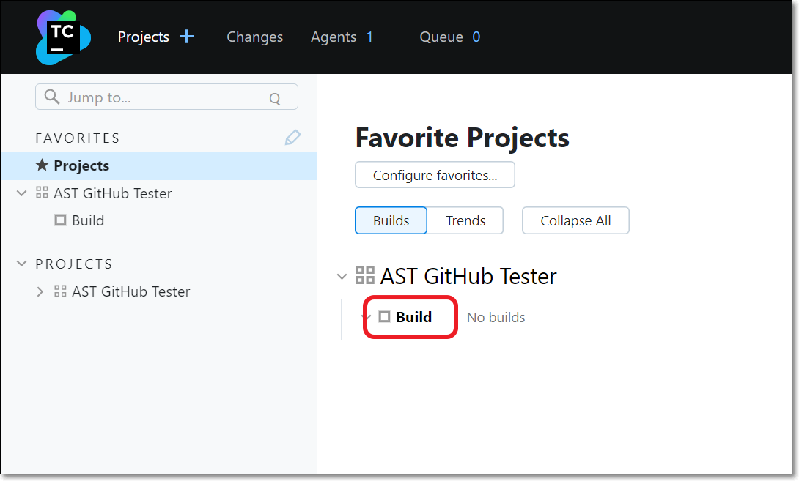
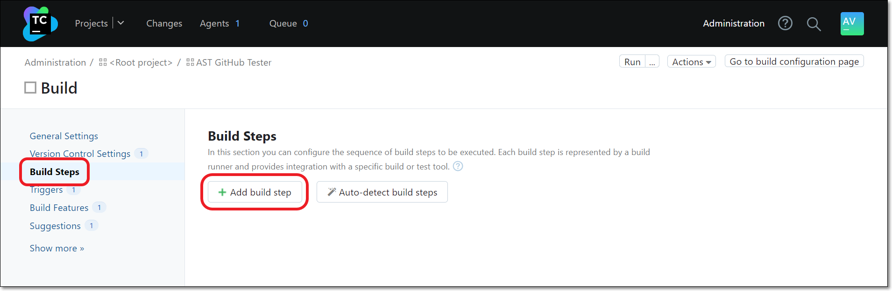
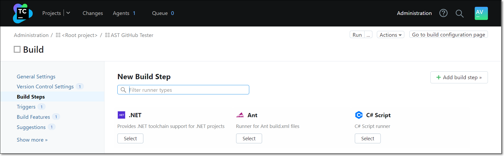
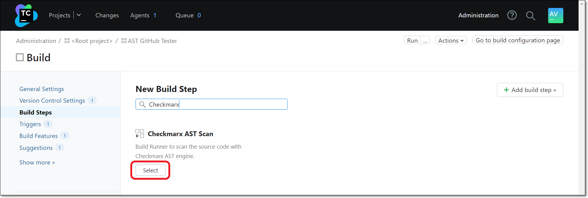
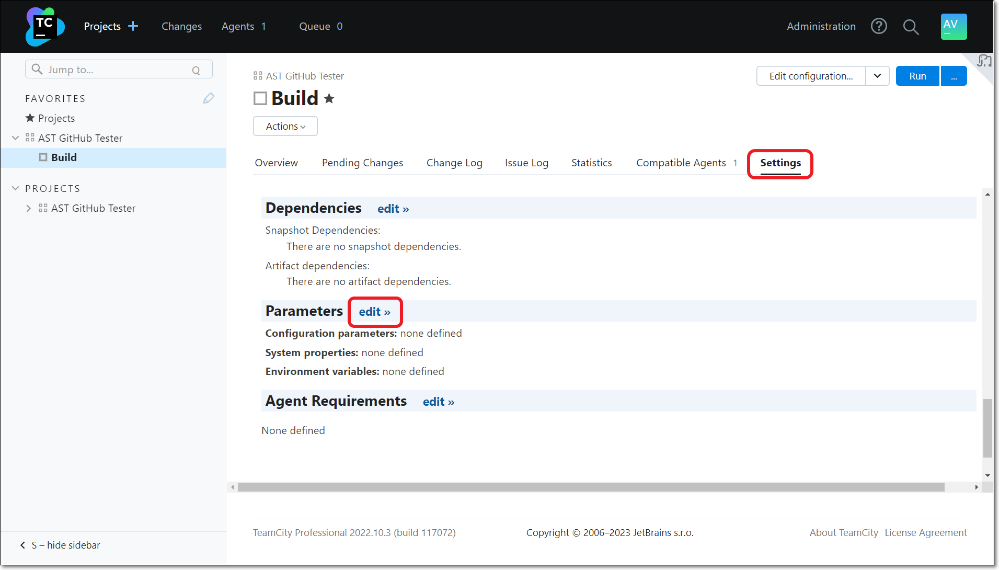
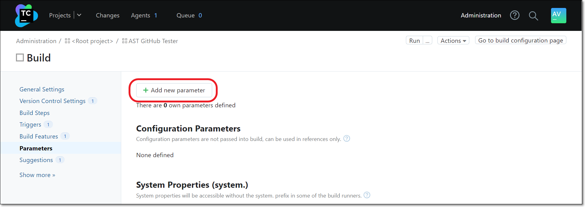
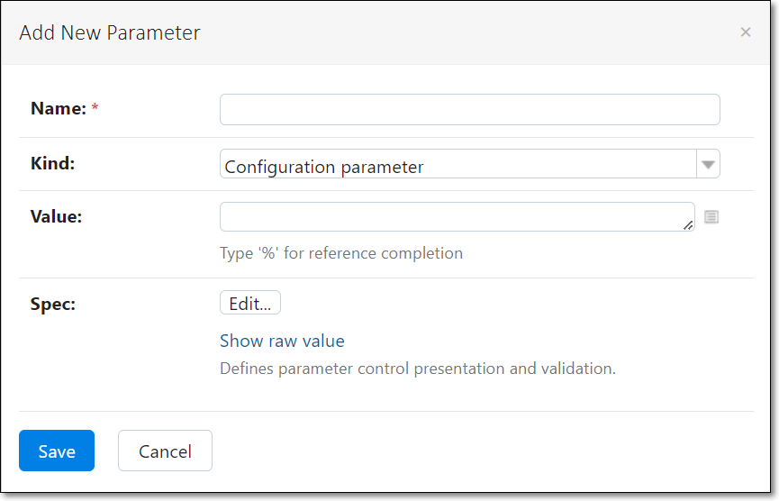

# Adding a Checkmarx One Build Step in TeamCity

The Checkmarx One plugin enables you to add a Checkmarx One scan as a build step in TeamCity.

Prerequisites for creating a build step:

- You need to have an agent configured in TeamCity, see [here](https://www.jetbrains.com/help/teamcity/setting-up-and-running-additional-build-agents.html#Installing+via+Windows+installer).
- You need to create a project in TeamCity to which you will add the build step. For more info about creating projects in TeamCity, see [Creating and Editing Projects](https://www.jetbrains.com/help/teamcity/creating-and-editing-projects.html) and [Integrating TeamCity with VCS Hosting Services](https://www.jetbrains.com/help/teamcity/integrating-teamcity-with-vcs-hosting-services.html).

If you would like to use a proxy server, you can set an environment variable in your Checkmarx One TeamCity project, see [below](#setting-up-a-proxy-environment-variable-optional).

## Configuring a Checkmarx One Build Step

**To configure a build step:**

1. In the TeamCity **Projects** tab, under the project that you created for your Checkmarx One scan, click **Build**.

   <figure><figcaption></figcaption></figure>

   The **Build** page for that project is shown.
2. On the **Build** page, click **Edit Configuration...**.

   <figure><figcaption></figcaption></figure>
3. In the Settings menu, click **Build Steps** > **+ Add build step**.

   <figure><figcaption></figcaption></figure>

   The **New Build Step** configuration settings are shown.

   
4. Search for **Checkmarx AST Scan** and then click **Select**.

   <figure><figcaption></figcaption></figure>

   The Checkmarx One configuration settings are shown.

   <figure><figcaption></figcaption></figure>
5. Optionally enter a **Step name**.
6. Under **Checkmarx Scan Settings**, to apply the settings defined in your Global Settings, select the **Use Global Settings for Checkmarx One Server** checkbox. If you would like to apply project specific settings, then leave the checkbox deselected (default) and enter the settings needed for this project. For more information, see [Configuring Global Integration Settings for Checkmarx One TeamCity Plugin](configuring-global-integration-settings-for-checkmarx-one-teamcity-plugin.md).
7. For **Project name**, specify a name for this Project in Checkmarx One.

   
   If you enter the name of an existing Project, then this build step will trigger a scan of that Project. If you enter a new Project name, then, when a scan is triggered it will create a new Project in Checkmarx One with the specified name.
   
8. For **Branch** **name**, specify the name of the branch name to be used in Checkmarx One. (Default: %teamcity.build.branch%)

   
   If you enter the name of an existing branch, then this build step will trigger a scan of that branch. If you enter a new branch name, then, when a scan is triggered it will create a new branch in Checkmarx One with the specified name.
   
9. To apply the additional parameters defined in your Global Settings, select the **Use global additional parameters** checkbox. You can view the global parameters by clicking **Show global parameters**. If you would like to apply project specific parameters, then leave the checkbox deselected (default) and enter the parameters needed for this project. See documentation here.
10. Click **Save**.

    The build step is created and the build steps page is shown.

    <figure><figcaption></figcaption></figure>
11. By default, scans will be triggered when a VCS check-in is detected. If you would like to customize the triggers, select the **Triggers** tab and specify the triggers for running Checkmarx One scans. Options include scheduled runs, build step completion and repo commits.
12. You can optionally adjust *General Settings*, *Version Control Settings*, and other options.

## Setting up a Proxy Environment Variable (Optional)

**To set up an environment variable:**

1. In the TeamCity **Projects** tab, under the project for which you wish to create a proxy, click **Build**.

   <figure><figcaption></figcaption></figure>

   The **Build** page for the project is shown.
2. On the **Build** page, click the **Settings** tab. Then, scroll down to the **Parameters** section and click **edit**.

   <figure><figcaption></figcaption></figure>
3. Click the **+ Add new parameter** button.

   <figure><figcaption></figcaption></figure>

   The **Add New Parameter** window is shown.

   <figure><figcaption></figcaption></figure>
4. Enter the following configuration information:

   - In the **Name** field, enter **env.HTTP_PROXY**.

     
     Alternatively, you can use **env.CX_HTTP_PROXY** to designate a specialized proxy for use with Checkmarx One that doesn't affect the proxy used for other applications.
     
   - In the **Kind** field, select **Environment variable (env.)**.
   - In the **Value** field, enter the value of your proxy address.
   - Optionally edit the **Spec** field.
5. Click **Save**.

   The proxy parameter is created and shown in the Environment Variables table.
