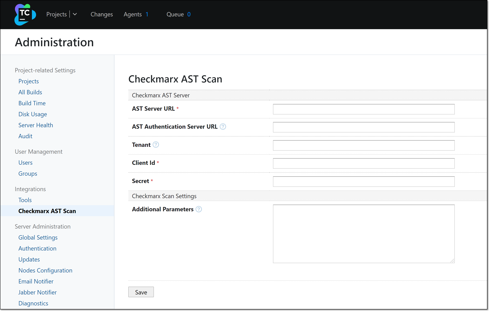

# Configuring Global Integration Settings for Checkmarx One TeamCity Plugin

The global settings are used as the default configuration for your Checkmarx projects. They can be overridden by specifying different settings for individual projects.

In order to configure the global settings you need to have the **Client ID** and **Client Secret** for an OAuth Client in Checkmarx One, see [Creating an OAuth Client for Checkmarx One Integrations](../../authentication-for-checkmarx-one-cli-and-plugins/creating-an-oauth-client-for-checkmarx-one-integrations.md).


Configuring global settings is recommended best practice, although it isn’t required. Alternatively, it is possible to configure all of the settings within the build step for each project.


**To configure the global settings for Checkmarx One:**

1. In the main navigation, go to the **TeamCity** header bar and select **Administration**. Then in the **Administration** menu, under **Integrations** select **Checkmarx AST Scan**.

   The Checkmarx One Scan configuration settings are shown.

   <figure><figcaption></figcaption></figure>
2. Fill in the **Checkmarx One Server URL** with the appropriate URL for your environment.

   **Checkmarx One Server Base URLs**

   - US Environment - https://ast.checkmarx.net
   - US2 Environment - https://us.ast.checkmarx.net
   - EU Environment - https://eu.ast.checkmarx.net
   - EU2 Environment - https://eu-2.ast.checkmarx.net
   - DEU Environment - https://deu.ast.checkmarx.net
   - Australia & New Zealand – https://anz.ast.checkmarx.net
   - India - https://ind.ast.checkmarx.net
   - India 2 - https://ind-2.ast.checkmarx.net/
   - Singapore - https://sng.ast.checkmarx.net
   - UAE - https://mea.ast.checkmarx.net
   - Israel - https://gov-il.ast.checkmarx.net
3. If the authentication URL is different from the server URL, then in the **Checkmarx One Authentication Server URL** enter the appropriate authentication URL.

   
   For Checkmarx One cloud platform, enter the URL for your environment.
   

   **Checkmarx One Authentication URLs**

   - US Environment - https://iam.checkmarx.net
   - US2 Environment - https://us.iam.checkmarx.net
   - EU Environment - https://eu.iam.checkmarx.net
   - EU2 Environment - https://eu-2.iam.checkmarx.net
   - DEU Environment - https://deu.iam.checkmarx.net
   - Australia & New Zealand – https://anz.iam.checkmarx.net
   - India - https://ind.iam.checkmarx.net
   - Singapore - https://sng.iam.checkmarx.net
   - UAE - https://mea.iam.checkmarx.net
   - Israel - https://gov-il.iam.checkmarx.net
4. For **Tenant**, enter the name of your Checkmarx One tenant account.
5. In the OAuth **Client Id** and **Secret fields**, enter your Checkmarx One OAuth **Client Id** and **Secret**.

   
   If you need to create an OAuth client, see [Creating an OAuth Client for Checkmarx One Integrations](../../authentication-for-checkmarx-one-cli-and-plugins/creating-an-oauth-client-for-checkmarx-one-integrations.md).
   
6. In the **Additional Parameters** section, you can specify any CLI arguments that you would like to apply to scans of this project. See documentation here.

   
   By default all scanners that you are authorized to run (licensed or open source) will run. To limit scans to one or more specific scanners, add the argument `--scan-types {scanner}` ,where `{scanner}` is one or more of the following scanners `sast`, `sca`, `iac-security`, `api-security`, `container-security`, or `scs`.
   
7. Click **Save** at the bottom of the screen.
