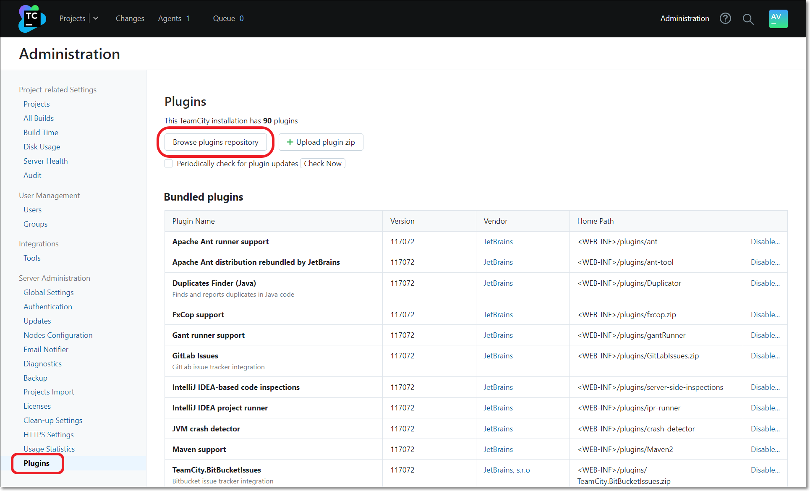
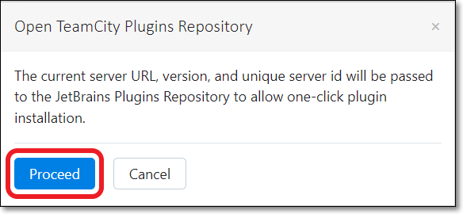
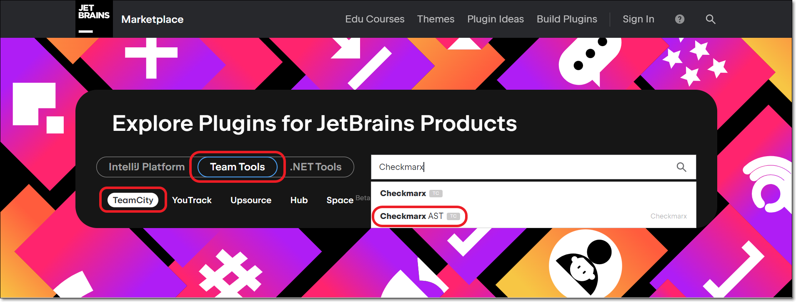
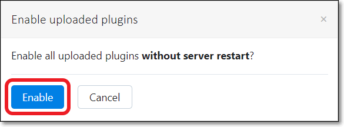

# Installing the TeamCity Checkmarx One Plugin

The following procedure explains how to install the Checkmarx One plugin directly from the marketplace. Alternatively, you can download the zip file and then upload the zip file to TeamCity.

**To install the TeamCity Checkmarx One plugin from marketplace.**

1. In the **TeamCity** console, in the header bar click on **Administration.**
2. In the **Administration** menu, select **Plugins**. Then, click **Browse plugins repository**.

   
3. In the dialog that opens, click **Proceed**.

   <figure><figcaption></figcaption></figure>
4. In the Marketplace, verify that **Team Tools** and **TeamCity** are selected. Then, search for **Checkmarx AST**.

   <figure><figcaption></figcaption></figure>
5. On the Checkmarx AST plugin page, click **Get**. Then, select **Install to localhost**.

   <figure><figcaption></figcaption></figure>
6. In the dialog that opens, click **Install**.

   <figure><figcaption></figcaption></figure>
7. In the TeamCity console, click **Enable uploaded plugins**.

   <figure><figcaption></figcaption></figure>
8. In the dialog that opens, click **Enable**.

   <figure><figcaption></figcaption></figure>
