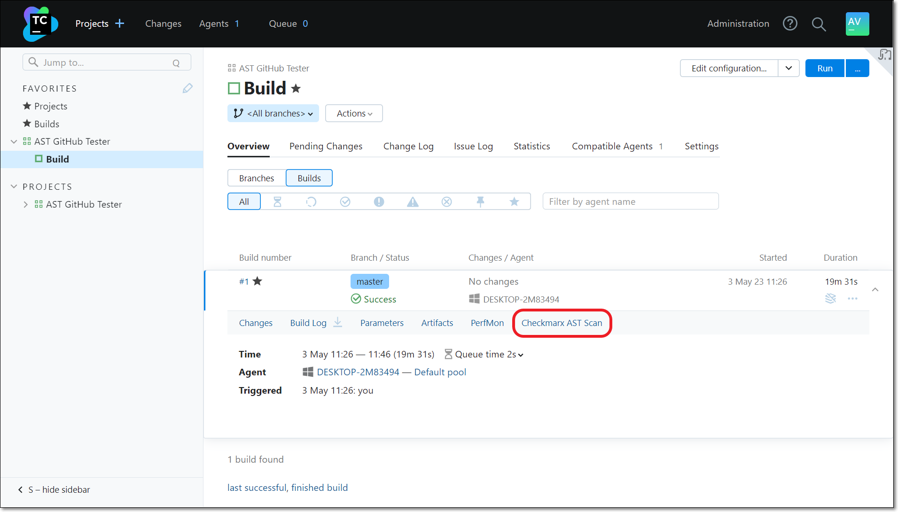
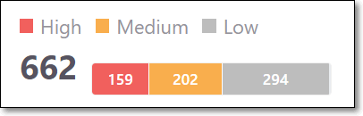
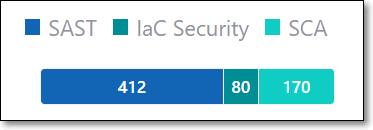
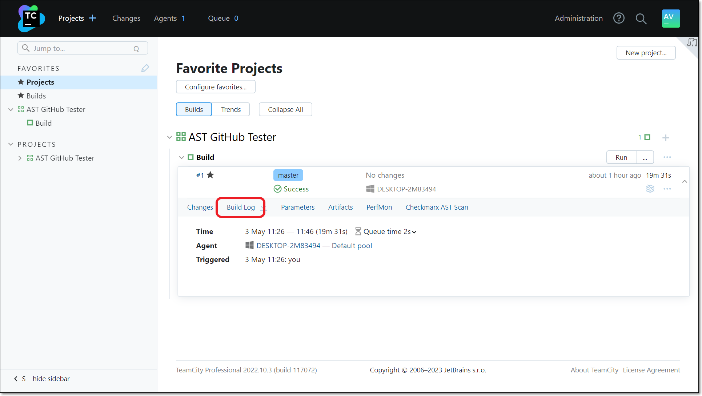
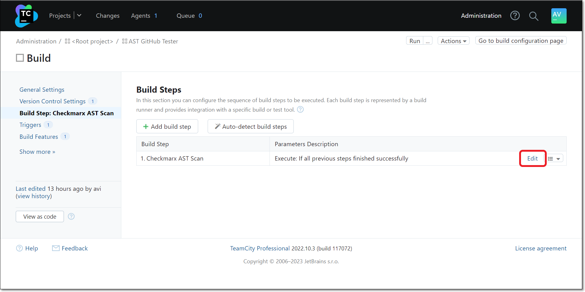
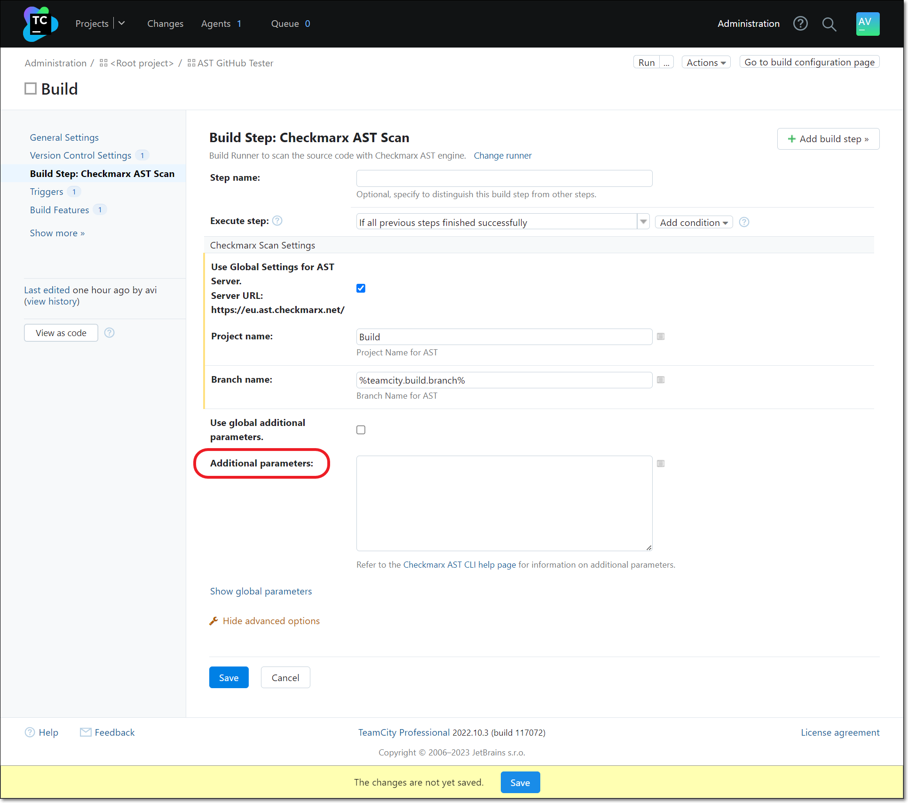
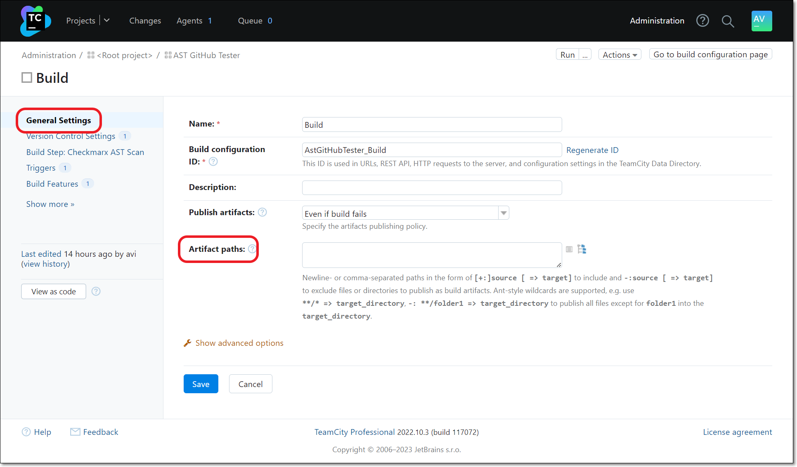
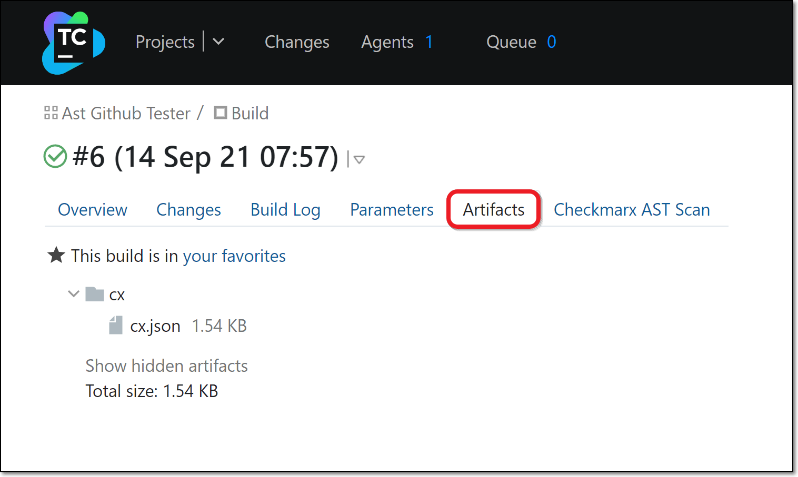

# Viewing Checkmarx One Results in TeamCity

The Checkmarx One TeamCity plugin generates a results summary and a log of the scan execution. Both are available on the Build page for each build (scan) of a project. In addition TeamCity provides a link to view comprehensive scan results in Checkmarx One.

You can also generate a results summary report in JSON or SARIF format.


If the no wait option `--nowait, -w` was added to the additional arguments, no results summary will be provided in TeamCity.


## Viewing the Scan Results Summary

You can view the results summary directly in the TeamCity console. The items in the summary are described in the table below.

**To view the scan results summary via the TeamCity console:**

1. On the main **Projects** screen, click on a specific build/run.
2. On the Build page, select the **Checkmarx AST Scan** tab.

   <figure><figcaption></figcaption></figure>

   The scan summary is shown. The scan summary is described in the table below.

   <figure><figcaption></figcaption></figure>
3. You can view comprehensive results in Checkmarx One by clicking on the **More details** link at the top of the screen. For an explanation of the scan results, see Viewing the Project Page in the Checkmarx One User Guide.

### Understanding the Scan Results Summary

| **Item** | **Description** | **Possible Values** |
|---|---|---|
| **Risk Level** | The highest risk level of any vulnerability identified in the Project. | *High*, *Medium*, or *Low* |
| **Total Vulnerabilities** | The combined total number of vulnerabilities in your Project followed by a color coded bar graph indicating the number of vulnerabilities of each severity level (*High*, *Medium*, and *Low*). | e.g.,  |
| **Vulnerabilities per Scan Type** | A color coded bar graph indicating the number of vulnerabilities identified by each of the scanners (*SAST*, *IaC Security*, *SCA*, *API Security*, *Container Security* and *Software Supply Chain Security*. | e.g.,  |
| **Detected APIs** | The number of APIs detected in the build. | e.g., 0 |
| **APIs with risk** | The number of vulnerable APIs in the build. | e.g., 0 |

## Viewing a log of the scan execution

1. On the main **Projects** screen, click on a specific build/run.
2. On the Build page, select the **Build Log** tab.

   <figure><figcaption></figcaption></figure>

   The scan log is shown.

   <figure><figcaption></figcaption></figure>

## Generating a result report in JSON or SARIF format

TeamCity can generate a JSON or SARIF result report as an artifact when you run a build. In order to do this, you need to add additional parameters to create the report, and specify the artifact path.

**To generate a result report in JSON or SARIF format:**

1. On the **Build** page of your project, click **Build Step: Checkmarx AST Scan**.
2. On the desired build step click **Edit**.

   <figure><figcaption></figcaption></figure>

   The build step configuration settings are shown.

   <figure><figcaption></figcaption></figure>
3. Under Additional parameters enter the command to generate a a report in your chosen format, followed by the output name for the report (e.g., `--report-format json --output-name cx`).
4. Click **Save**.
5. On the **Build** page of your project, click **General Settings**.

   The general configuration settings are shown.

   <figure><figcaption></figcaption></figure>
6. Under **Artifact paths**, enter the name of your results summary report (from Step 2) and the path where you want your report to be saved (e.g., `cx.json => cx`).

   
   If you are entering more than one path, place them on separate lines, or place a comma between them.
   
7. Click **Save**.
8. To access the report file after running a build, on the main **Projects** screen click on the specific build, then on the Build page select the **Artifacts** tab.

   The file name is shown.

   <figure><figcaption></figcaption></figure>
9. Click on the name of the file to download it.
