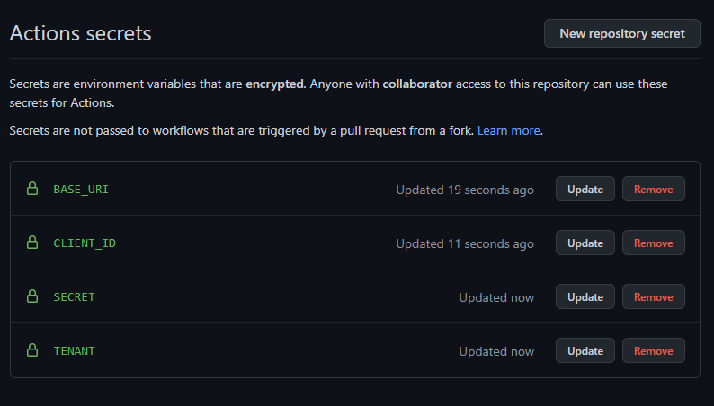
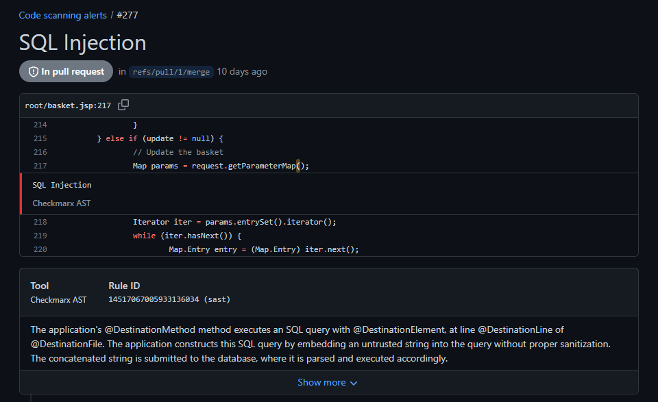

# SARIF Output for Checkmarx One (Example for GitHub Action)

## Introduction

You can export Checkmarx One scan results in SARIF output format.

This is done by adding the report flag `--report-format sarif` in the additional params of the CLI scan command. This generates a JSON in SARIF format.


SARIF, the Static Analysis Results Interchange Format, is a standard, JSON-based format for the output of static analysis tools. It has been approved as an OASIS standard. By providing a common tool output format, SARIF reduces the burden on users, and makes it possible to create common tooling for all tools: viewers, bug filers, metrics calculators, etc..


This capability is available for all CI/CD plugins and CLI integrations. The examples below show the integration for GitHub Action, but they can be generalized for other platforms.

## Prerequisites

- You have a Checkmarx One account and you have set up the appropriate Checkmarx One plugin or CLI integration in your CI/CD platform.

## Exporting Results as SARIF Output

1. Use the Checkmarx One plugin or CLI tool to create a Checkmarx One scan in your pipeline.
2. Add the report flag `--report-format sarif` to the scan create command. For plugins, this argument is added in the **Additional params** section.

   
   By default the report is sent to the current directory, which is the recommended location. You can optionally specify a different location using the `--output-path` argument.
   
3. Upload the results to the desired platform.

## Usage Example - GitHub Action

The following example shows how you can create a GitHub Action to run a Checkmarx One scan and export the results as a SARIF output.

### Prerequisites

The following example assumes that:

- You have created the required secrets for use with the Checkmarx One GitHub Action, see [Checkmarx One GitHub Actions Initial Setup](checkmarx-one-github-actions/checkmarx-one-github-actions-initial-setup.md).

  <figure><figcaption></figcaption></figure>
- You have installed and configured the Checkmarx One Github Action, see [Configuring a GitHub Action with a Checkmarx One Workflow](checkmarx-one-github-actions/configuring-a-github-action-with-a-checkmarx-one-workflow/README.md).

### GitHub Action Example

The following is an example of a GitHub Action for running a Checkmarx One scan and uploading the results in SARIF format.

```
name: Checkmarx Sarif Integration

# Controls when the workflow will run
on:
  pull_request:
    types: [opened, reopened, synchronize]
    branches:
      - master
      - main

# A workflow run is made up of one or more jobs that can run sequentially or in parallel
jobs:
  # This workflow contains a single job called "build"
  build:
    # The type of runner that the job will run on
    runs-on: ubuntu-latest

    # Steps represent a sequence of tasks that will be executed as part of the job
    steps:
      # This step checks out a copy of your repository.
      - name: Checkout repository
        uses: actions/checkout@v2
      - name: Checkmarx scan
        uses: checkmarx/ast-github-action@main
        with:
          base_uri: https://ast.checkmarx.net
          cx_client_id: ${{ secrets.CX_CLIENT_ID }}
          cx_client_secret: ${{ secrets.CX_CLIENT_SECRET }}
          cx_tenant: ${{ secrets.CX_TENANT }} # This should be replaced by users' tenant name
          additional_params: --report-format sarif --output-path .
      - name: Upload SARIF file
        uses: github/codeql-action/upload-sarif@v1
        with:
          # Path to SARIF file relative to the root of the repository
          sarif_file: cx_result.sarif
```


Check for updates to the code sample in [GitHub](https://github.com/Checkmarx/ci-cd-integrations/blob/main/Github/sarif-output.yml).


### Viewing Code Scanning Alerts

When SARIF scan results are uploaded to GitHub, the vulnerabilities identified by the Checkmarx One scan are shown in the Code scanning alerts tab.

**To view SARIF results:**

1. Go to **Security** > **Code scanning alerts**. The vulnerabilities identified by the Checkmarx One scan are shown.

   
2. Click on an item to show details about that vulnerability, including the vulnerable code and a description of the vulnerability.

   <figure><figcaption></figcaption></figure>
